# Source Coding
> [!overview]
> 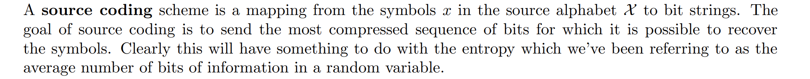

## Source Coding Theorem
> [!thm]
> 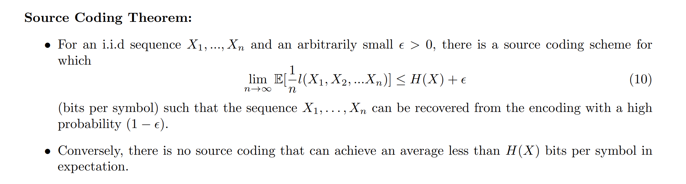

## Typical Set
> [!def]
> 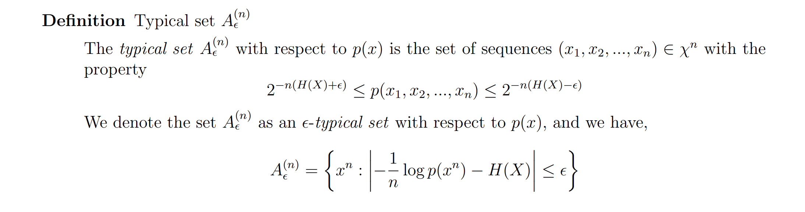

> [!property]
> 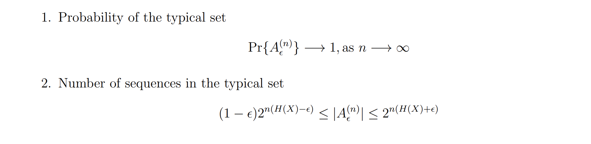

> [!example] Flipping Coins
> 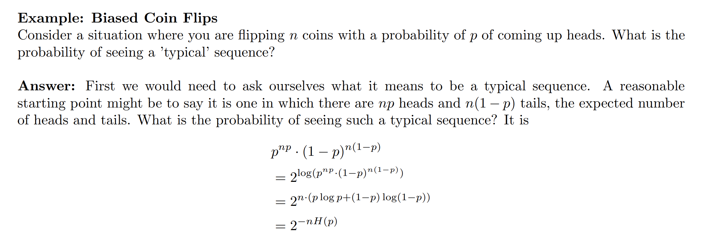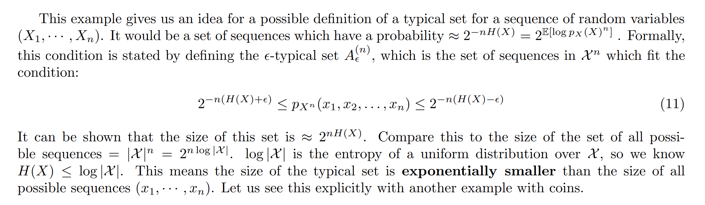

> [!example] Coin Flipped Again
> 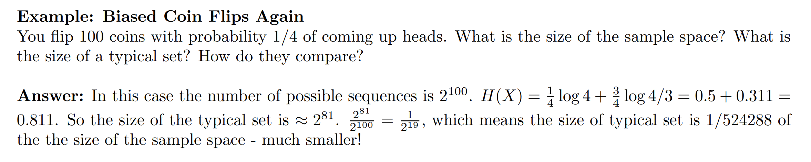

## Asymptotic Equiparition Property(AEP)
> [!thm]
> 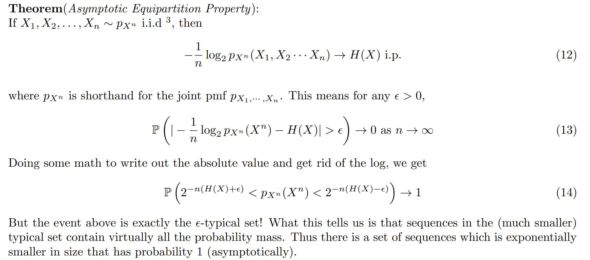
> **Implications:**
> 
> 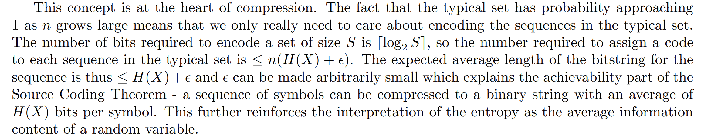

> [!proof]
> 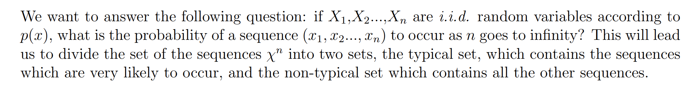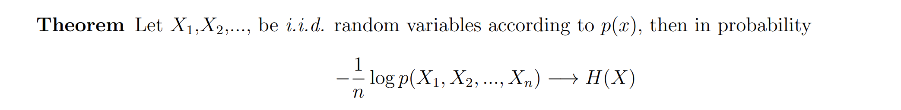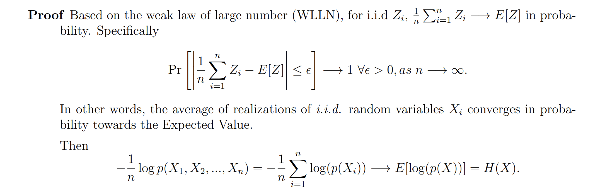

## Huffman Coding Algorithm

# Channel Coding
> [!overview]
> The two simplest models studied are the binary symmetric channel (BSC) and binary erasure channel (BEC).

## Binary Symmetric Channel(BSC)

## Binary Erasure Channel(BEC)
> [!def]
> We will focus on the BEC, which erases the input to the channel with probability $p ∈ (0, 1)$.
> 
> We are interested in the maximum number of bits that the transmitter can send over the channel per transmission without error.
> 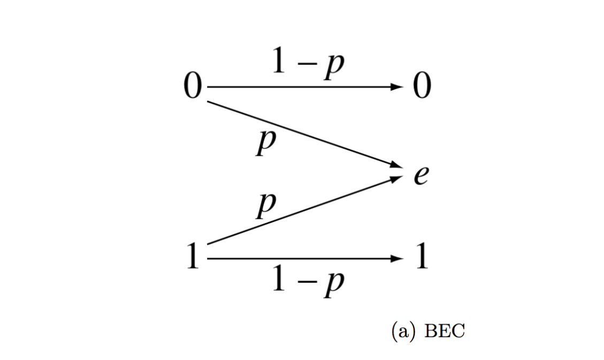

### Rate of the Code(R)
> [!def]
> 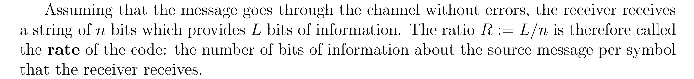

### Input and Output Alphabet
> [!def]
> 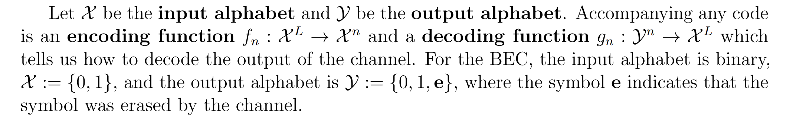

### Maximum Probability of Error
> [!def]
> 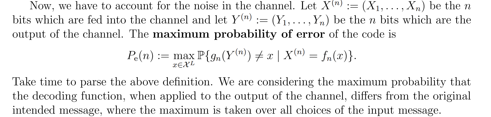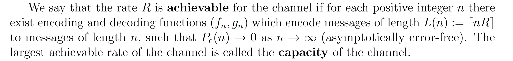

### Capacity of BEC
> [!thm]
> 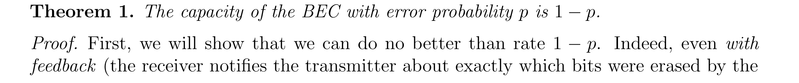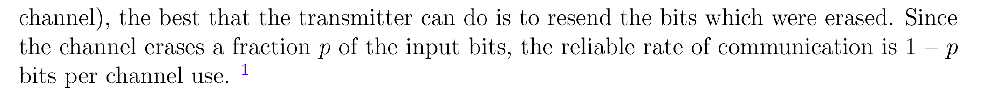

### Channel Coding Theorem
> [!thm]
> 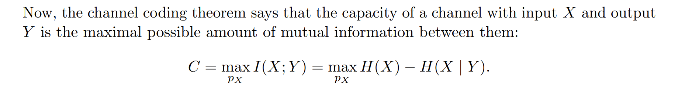

> [!example] Rolling Dice
> 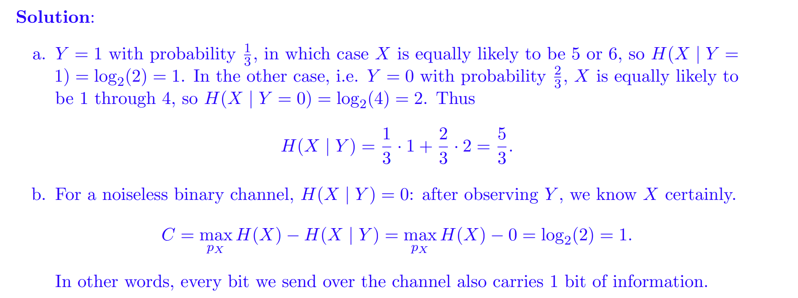
> A bit derivation on how we figure out $\max_{p_X}H(X)$:
> 
> Note that $X\sim Bernoulli(p)$, thus $H(X)=plog(\frac{1}{p})+(1-p)log(\frac{1}{1-p})=-plogp-(1-p)log(1-p)$, which is concave in $p$ if we take the second derivative, so we set the derivative $log(\frac{1-p}{p})=0$ where $1-p=p$ and $p=\frac{1}{2}$. 
> 
> Thus we fit $p=\frac{1}{2}$ into the $H(X)$ and get $C=1$.

