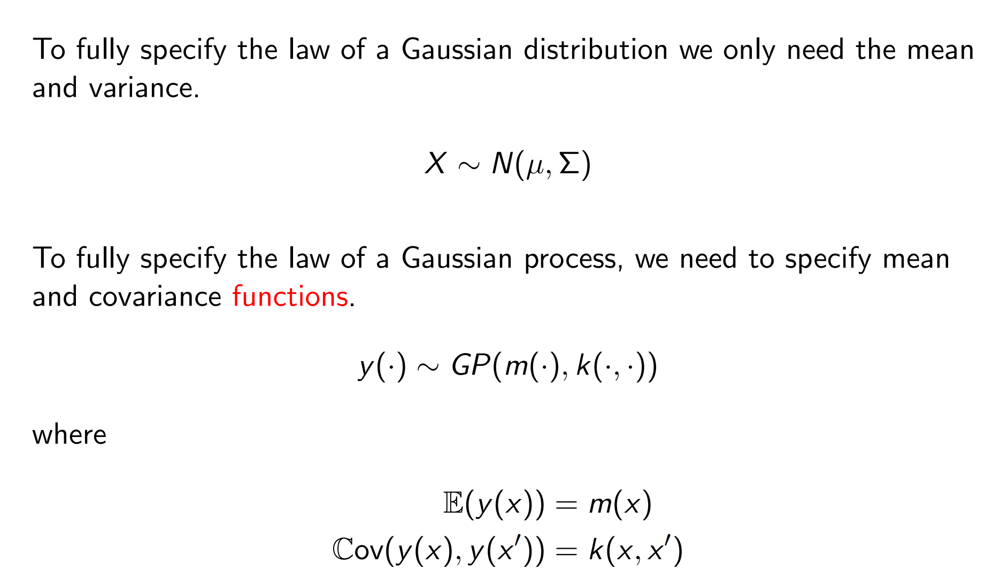
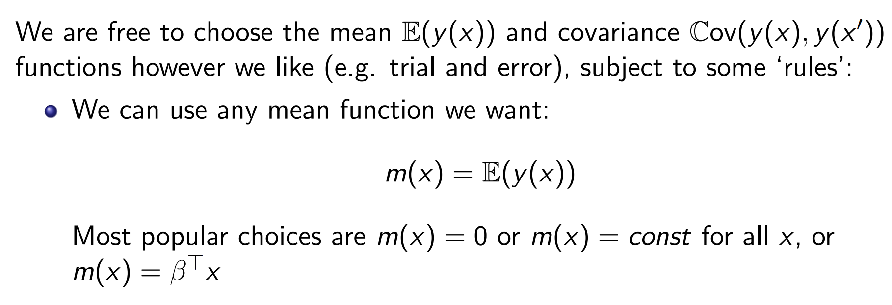
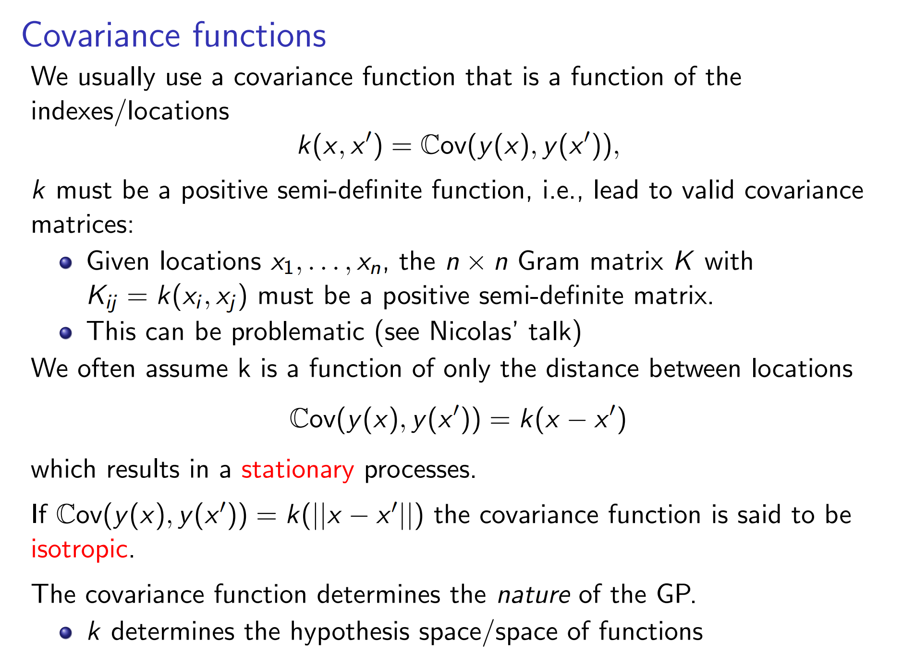
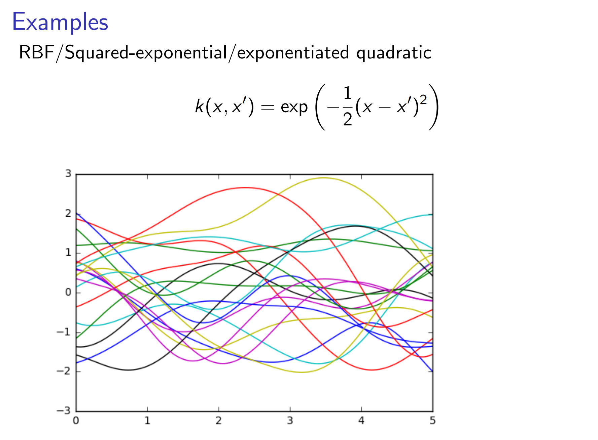
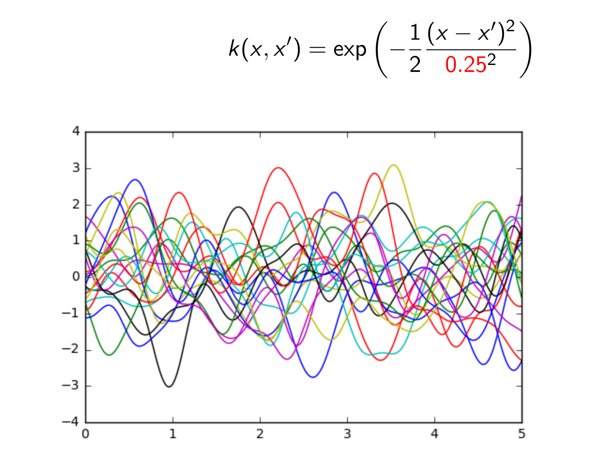
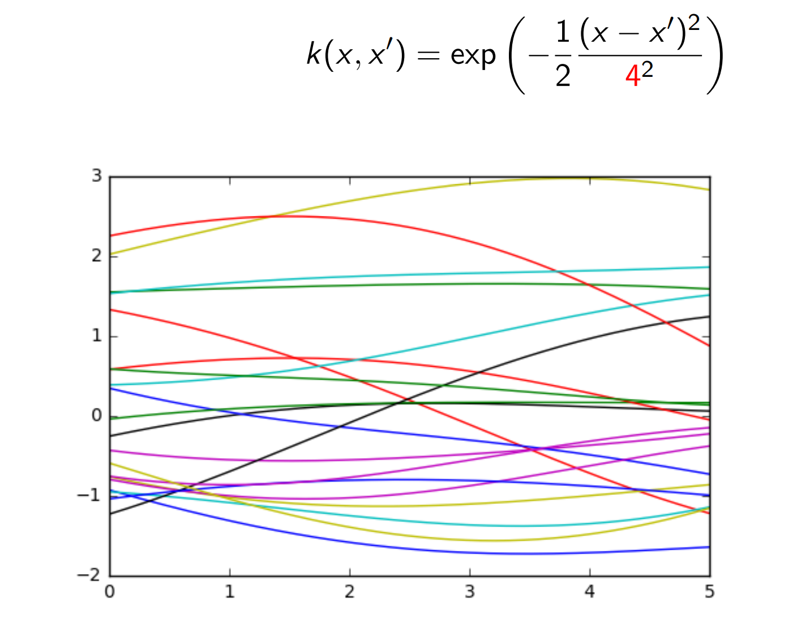
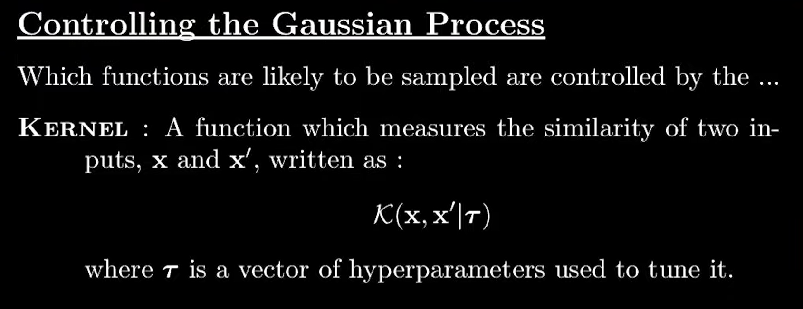
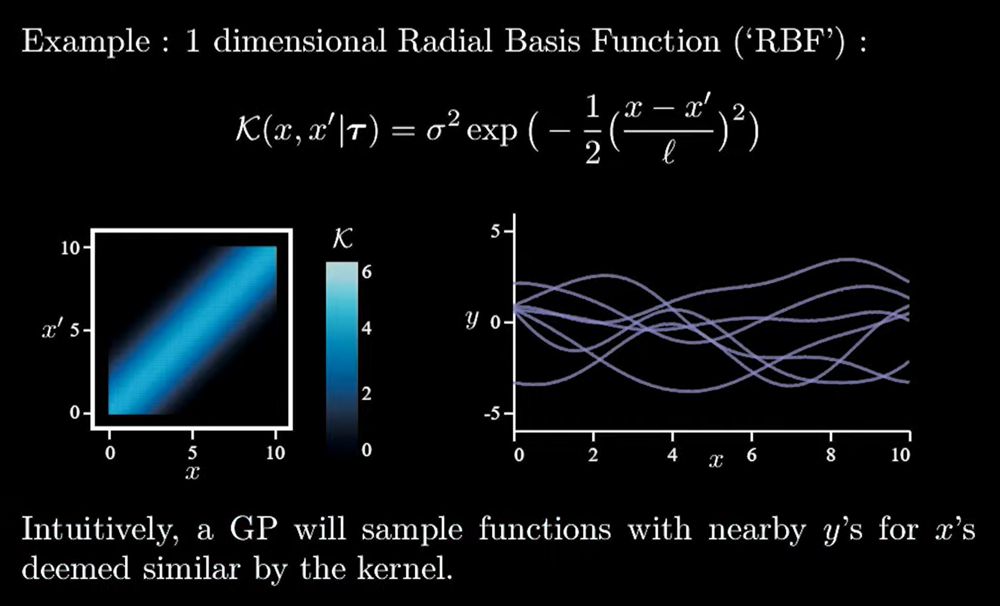
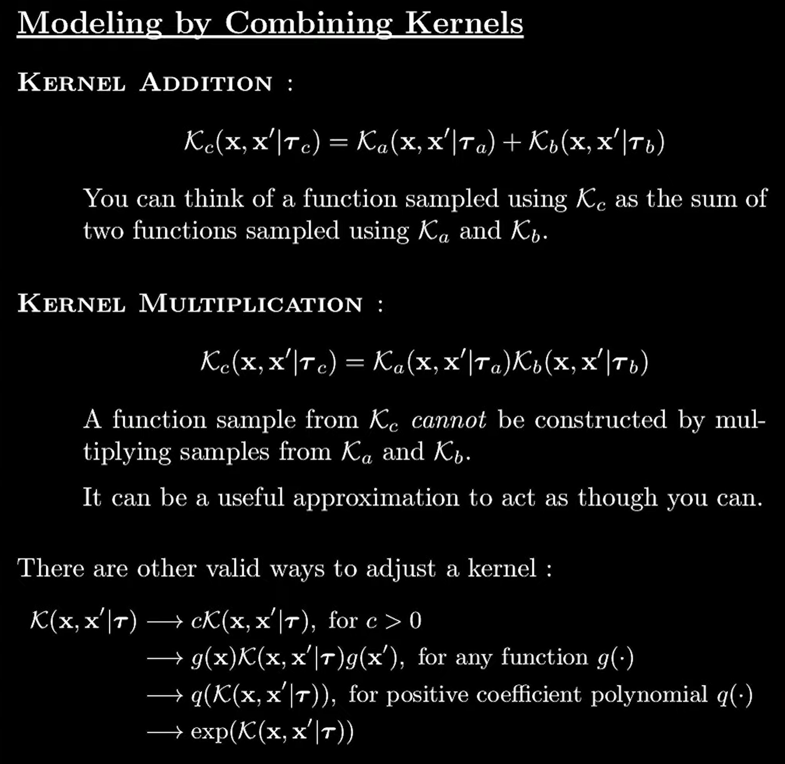

# Basic Definition
## Stochastic Process
> [!def]
> 


## Mean and Covariance Function
> [!def]
> 


### Mean Function
> [!def]
> 


### Covariance Function
> [!def]
> 


### Kernel Choice for Covariance
> [!def]
> 


### Code Implementations
> [!code]
```python
from __future__ import division
import numpy as np
import matplotlib.pyplot as pl

def kernel(a, b):
    """ GP squared exponential kernel """
    sqdist = np.sum(a**2, 1).reshape(-1, 1) + np.sum(b**2, 1) - 2 * np.dot(a, b.T)
    return np.exp(-.5 * sqdist)

n = 50
Xtest = np.linspace(-5, 5, n).reshape(-1, 1)
K_ = kernel(Xtest, Xtest)

# draw samples from the prior at our test points.
# Here, we can think of L as our function mapping from x to f(x) as a vector.
L = np.linalg.cholesky(K_ + 1e-6*np.eye(n))
f_prior = np.dot(L, np.random.normal(size=(n, 10)))

pl.plot(Xtest, f_prior)
```


# Covariance Function Tuning


# Control the Gaussian Process
> [!def]
> 

> [!example]
> 


# Combining Kernels
> [!def]
> 


