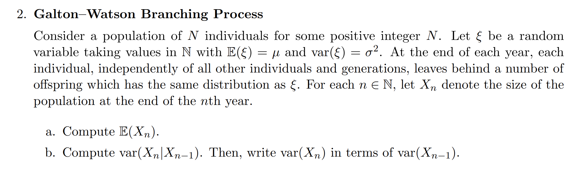

# Galton-Watson Branching Process
> [!def]
> The **Galton-Watson branching process** is a mathematical model used to describe the **dynamics of populations**, particularly in contexts where members of the **population reproduce independently** of each other.
> We use:
> - $\{X_n\}_{n\geq 0}$ to represent this random process where $X_n$ means the total population at $n$-th generation. 
> - $\epsilon^{n,k}$ is a random variable that denotes the number of people the $k$-th individual of $n$-th generate gave birth to. 
> - $\epsilon^{n,k}$ are assumed to have the same distribution as $\epsilon$
> 
> Then this process can be modeled as follows(if we start with 1 individual):
> 1. At the 0-th generation, we have $X_0=1$, we start with 1 person.
> 2. At the 1st generation, we have $X_1=\epsilon^{0,1}$, since we want to know how many people are born by the 0-th generation guys.
> 3. At the 2nd generation, we have $X_2=\sum\limits_{i=1}^{X_1}\epsilon^{1,i}$
> 4. Generally, for any $n$, we have the following recurrence: $$X_{n+1}=\sum\limits_{j=1}^{X_n}\epsilon^{n,j}$$
>

> [!example] Fa23 Disc03 P2
> 
> The calculation combines lots of details, it is worth mentioning:
> 
> For conditional variance $\mathbb{Var}[X_n|X_{n-1}]$, we can compute it as $\mathbb{E}[X_n^2|X_{n-1}]-\mathbb{E}[X_n|X_{n-1}]^2$
> 
> Calculation Details for conditional variance:
> $$\begin{aligned}\operatorname{Var}\left[X_n \mid X_{n-1}\right] & =E\left[\left(X_n-E\left[X_n \mid X_{n-1}\right]\right)^2 \mid X_{n-1}\right] \\& =E\left(X_n^2-2 X_n E\left(X_n \mid X_{n-1}\right]+E\left[X_n \mid X_{n-1}\right]^2 \mid X_{n-1}\right] \\& =E\left[X_n^2 \mid X_{n-1}\right]-2 E\left[X_n \mid X_{n-1}\right]^2+E\left[X_n \mid X_{n-1}\right]^2 \\& =E\left[X_n^2 \mid X_{n-1}\right]-E\left[X_n \mid X_{n-1}\right]^2 \\& =E\left[\left(\sum_{j=1}^{X_{n-1}} \varepsilon^j\right)^2 \mid X_{n-1}\right]-\left(\mu X_{n-1}\right)^2 \\& =E\left[\sum_{j=1}^{X_{n-1}}\left(\varepsilon^j\right)^2+\sum_{i \neq j} \varepsilon^i \cdot \varepsilon^j \mid X_{n-1}\right]-\mu^2 X_{n-1}^2 \\& =\sum_{j=1} E\left(\left(\varepsilon^j\right)^2\right]+\sum_{i \neq j} E\left(\varepsilon^i \cdot \varepsilon^j\right]-\mu^2 X_{n-1}^2 \\& =X_{n-1} E\left[\varepsilon^2\right]+\sum_{i \neq j}\{\underbrace{\operatorname{cov}\left(\varepsilon^i, \varepsilon^j\right)}_0+E\left(\varepsilon^i\right] E\left[\varepsilon^j\right]\}-\mu^2 X_{n-1}^2 \\& =X_{n-1}\left(\sigma^2+\mu^2\right)+X_{n-1}\left(X_{n-1}-1\right) \cdot E[\varepsilon]^2-\mu^2 X_{n-1}^2 \\& =\sigma^2 X_{n-1}+\mu^2 X_{n-1}+\mu^2 X_{n-1}^2-\mu^2 X_{n-1}-\mu^2 X_{n-1}^2 \\& =\sigma^2 X_{n-1}\end{aligned}$$
> 
> For variance, we can calculate it on top of the conditional variance and use variance decomposition formula $Var[X_n]=Var[E[X_n|X_{n-1}]]+E[Var[X_n|X_{n-1}]]$
> 
 

