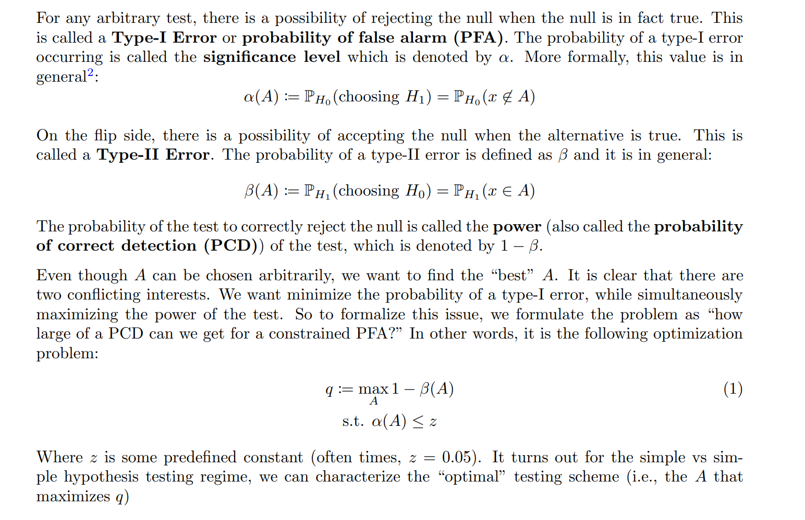
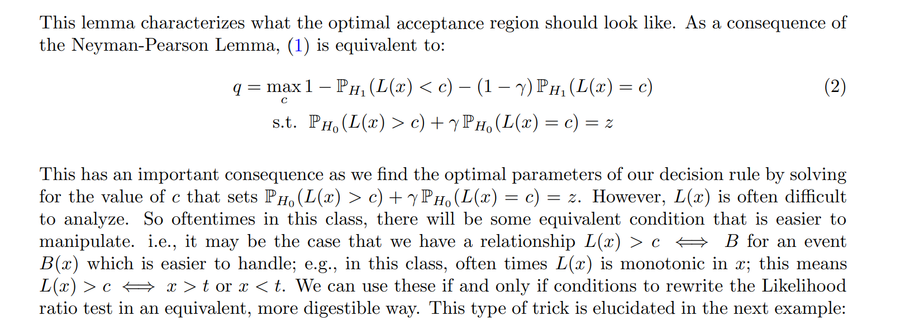
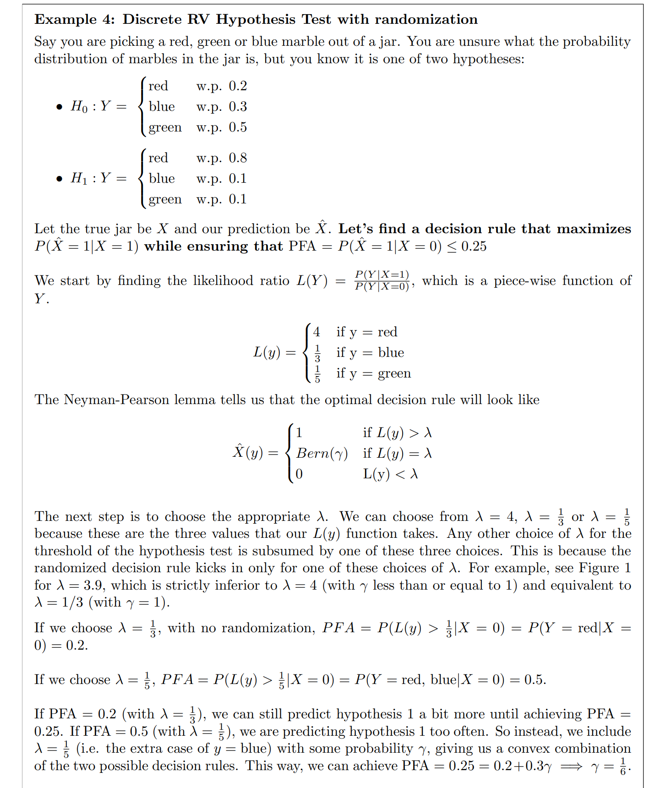
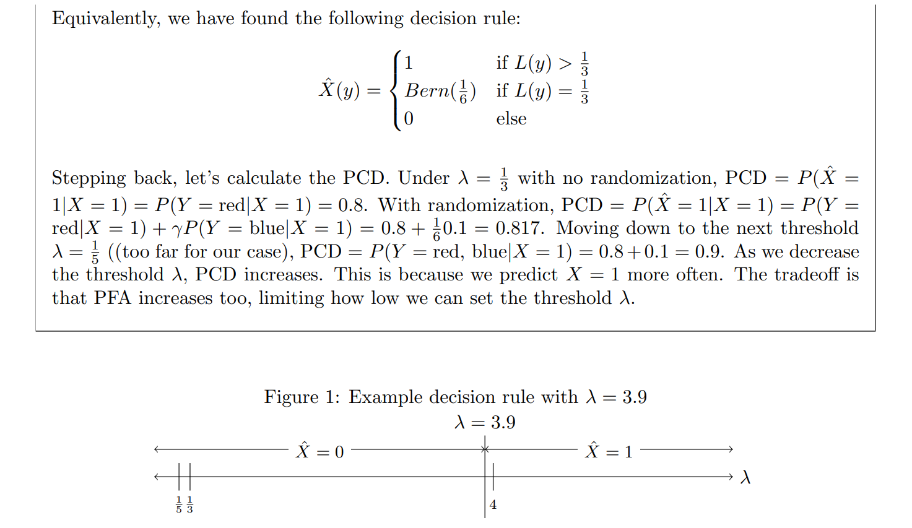
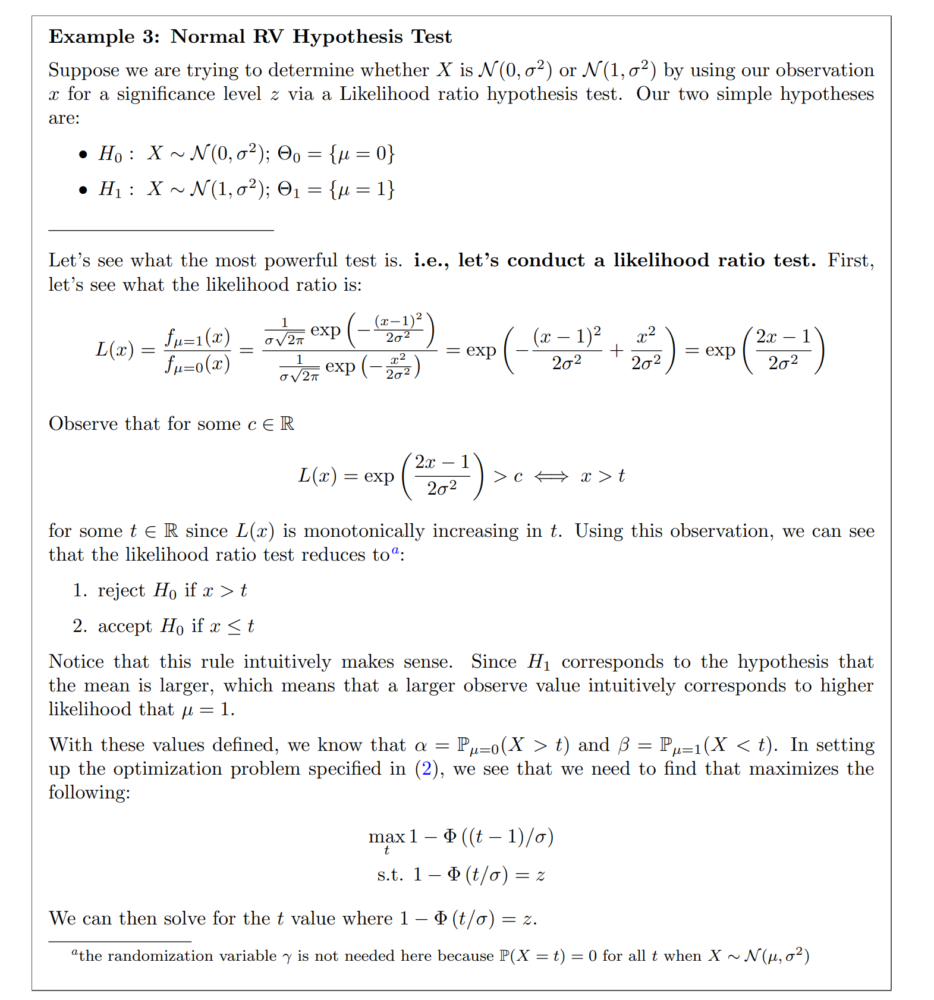
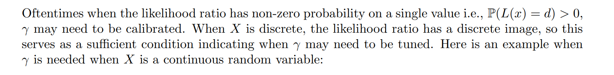
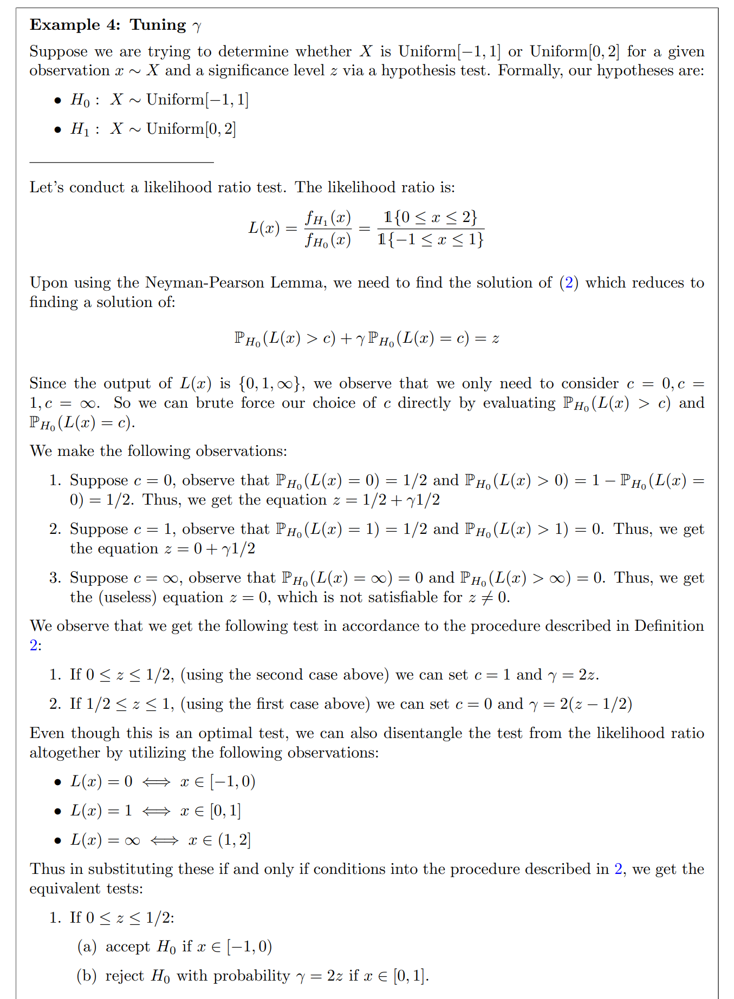
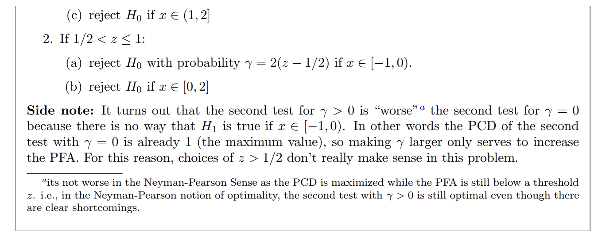

More See [5 Likelihood-Ratio Test](../../../../Mathematics/Probablity_Statistics/Statistics_Model_Perspective/假设检验/Parametric_Hypothesis_Testing.md#5%20Likelihood-Ratio%20Test)
# Optimal Likelihood_Ratio_Test
## Motivation
> [!motiv]
> 

## Definition&Theorem
> [!def]
> 
> Notes:
> - $\alpha_0$ is Type I error rate.
> - $\beta_0$ is Type II error rate.
> 
> 

## Discreate RV Hypothesis Test
> [!example]
> 

## Normal RV Hypothesis Test
> [!important]
> 

## Tuning Gamma
> [!def]
> 

