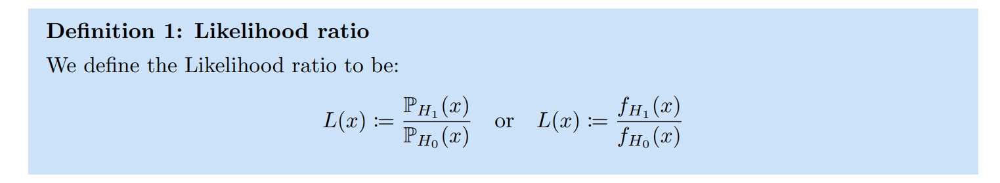
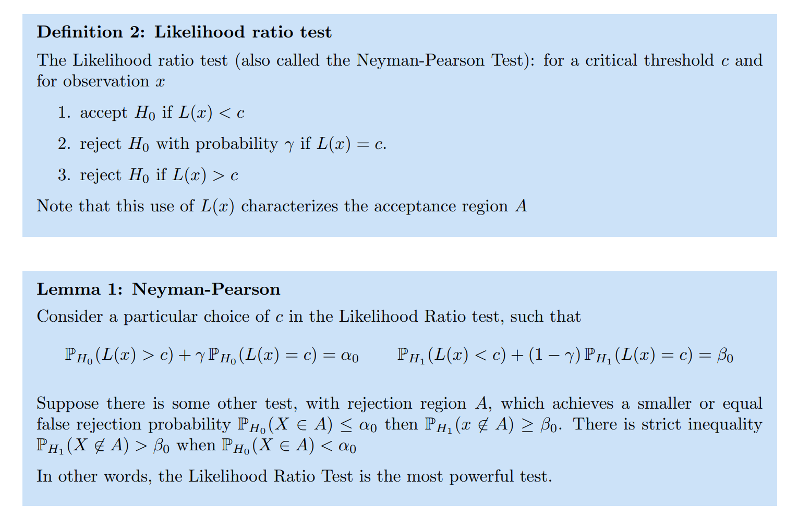

More See [5 Likelihood-Ratio Test](../../../../Mathematics/Probablity_Statistics/Statistics_Model_Perspective/假设检验/Parametric_Hypothesis_Testing.md#5%20Likelihood-Ratio%20Test)
# Optimal Likelihood_Ratio_Test
> [!def]
> 
> Notes:
> - $\alpha_0$ is Type I error rate.
> - $\beta_0$ is Type II error rate.

