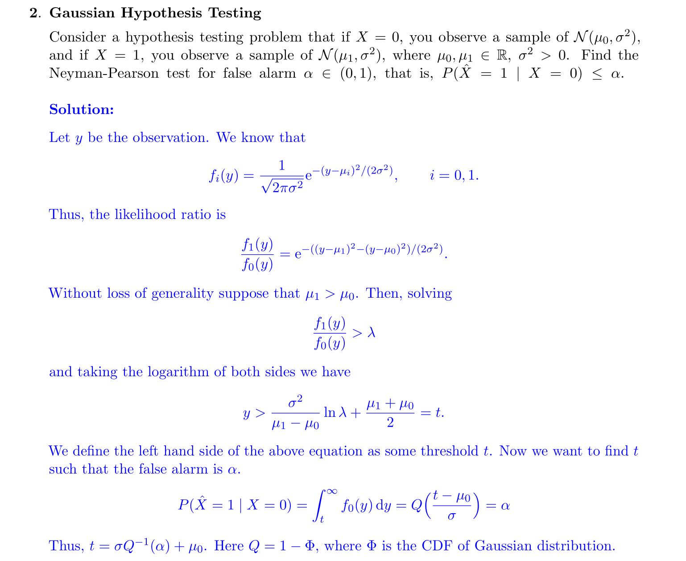
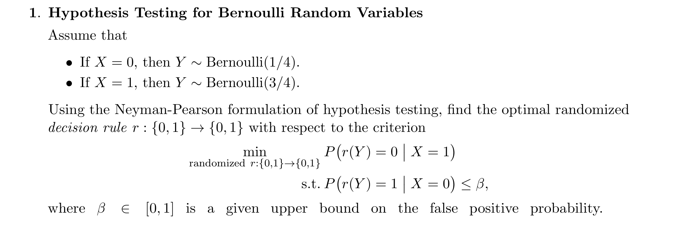
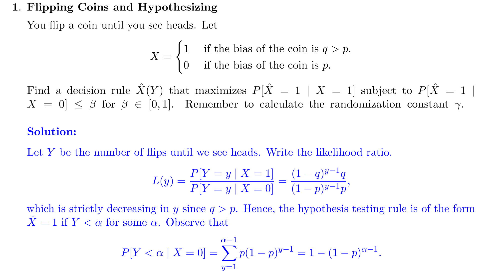
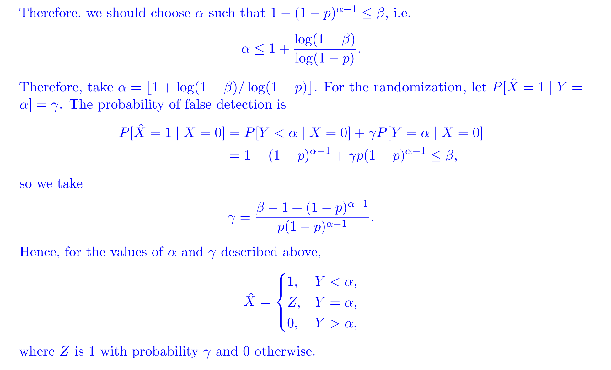

More See [5 Likelihood-Ratio Test](../../../../Mathematics/Probablity_Statistics/Statistics_Model_Perspective/假设检验/Parametric_Hypothesis_Testing.md#5%20Likelihood-Ratio%20Test)
# Optimal Likelihood_Ratio_Test
## Motivation
> [!motiv]
> 

## Definition&Theorem
> [!def]
> 
> Notes:
> - $\alpha_0$ is Type I error rate.
> - $\beta_0$ is Type II error rate.
> 
> 
> The optimization above means we want to maximize the power(1 - type II error) while fixing type I error.

## Continuous LR Test
### Normal RV Hypothesis Test
> [!important]
> 
> 

### Gaussian RV Test
> [!example] EECS126 Fa21 HW12 P2
> 

## Discreate LR Test
### Discrete Distribution
> [!example]
> 

### Uniform RV Test
> [!def]
> 

### Bernoulli RV Test
> [!example] EECS126 Fa21 Disc12 P1
> 
> We first write $\lambda(y)$$$\begin{aligned}& \lambda(y)=\frac{P(Y \mid X=1)}{P(Y \mid X=0)}=\frac{\left(\frac{3}{4}\right)^y\left(1-\frac{3}{4}\right)^{1-y}}{\left(\frac{1}{4}\right)^y\left(1-\frac{1}{4}\right)^{1-y}} \\& =\left(\frac{3}{4}\right)^{2 y-1}\left(\frac{1}{4}\right)^{1-2 y} \\& \therefore \lambda(y)=\left\{\begin{array}{cc}3 & \text { if } y=1 \\\frac{1}{3} & \text { if } y=0\end{array}\right. \\&\end{aligned}$$
> 
> Then we choose the optimal decision rule by choosing proper rejection threshold $c .\{\lambda(y)>c\}$ :
> 
> $1^{\circ}$ : If $c=3$, then $P F A=P(\lambda(y)>3 \mid X=0)=0$ since $\lambda(y) \in\left\{\frac{1}{3}, 3\right\}$ 
> 
> With randomization:
> 
> $\begin{aligned}PFA&=P(\lambda(y)>3|X=0)+\gamma P(\lambda(y)=3|X=0)\\&=0+\gamma P(Y=1|X=0)\\&=\gamma\frac{1}{4}=\beta\end{aligned}$, so $\gamma=\frac{\beta}{\frac{1}{4}} =$ to reach the target PFA level.
> 
> Without randomization: 
> 
> $PFA=0$. unless $\beta=0$, we cannot reach the PFA goal.
> 
> $2^{\circ}$ : If $c=\frac{1}{3}$, then:$$
> \begin{aligned}& \text { with no randomization, PFA=P( } \left.\left.\lambda (y)>\frac{1}{3}\right) X=0\right)=P(Y=1 \mid X=0)=\frac{1}{4} \\& \text { with randomization, } P F A=P\left(\left.\lambda(y)>\frac{1}{3} \right\rvert\, x=0\right)+\gamma P\left(\left.\lambda(y)=\frac{1}{3} \right\rvert\, x=0\right) \\& =P(Y=1 \mid x=0)+r P(Y=0 \mid x=0) \\& =\frac{1}{4}+\gamma \cdot \frac{3}{4}=\beta \\& \gamma=\frac{4}{3} \beta-\frac{1}{3} \\&\end{aligned}$$
> 
> $3^{\circ}$ : If $c=0$, then $P F A=P(\lambda(y)>0 \mid x=0)=1$, which is too large.
> 
> Now given the choice above, we evaluate the PCD:
> $1^{\circ}$: With randomization: $$\begin{aligned}PCD&=P(\lambda(y)>3|X=1)+\gamma P(\lambda(y)=3|X=1)\\&=0+3\beta\end{aligned}$$
> Without randomization: $$\begin{aligned}PCD&=P(\lambda(y)>3|X=1)\\&=0\end{aligned}$$
> 
> $2^{\circ}$ : With randomization:$$\begin{aligned}& \\& P C D=P\left(\left.\lambda(y)>\frac{1}{3} \right\rvert\, x=1\right)+\gamma P\left(\left.\lambda(y)=\frac{1}{3} \right\rvert\, x=1\right) \\&=P(Y=1 \mid x=1)+\gamma P(Y=0 \mid x=1) \\&=\frac{3}{4}+\left(\frac{4}{3} \beta-\frac{1}{3}\right) \cdot \frac{1}{4} \\&=\frac{3}{4}+\frac{1}{3}\left(\beta-\frac{1}{4}\right)\end{aligned}$$
> Without randomization:$$\begin{aligned}P C D & =P\left(\left.\lambda(y)>\frac{1}{3} \right\rvert\, X=1\right) \\& =P(Y=1 \mid X=1) \\& =\frac{3}{4}\end{aligned}$$
> 
> $3^0$ : Not considered since. PFA is too large.
> 
> **Based on the above analysis, we have out optimal decision rule:**
> If $\beta<\frac{1}{4}$, we prefer $c=3$ with randomization and the optimal decision rule is to have $r(0)=0$ and $r(1)=1$ with probability $\gamma=\frac{\beta}{\frac{1}{4}}$.
> If $\beta \geqslant \frac{1}{4}$, we prefer $c=\frac{1}{3}$ with randomization and the optimal decision rule is to have $r(1)=1$ and $r(0)=1$ with probability $\gamma=\frac{4}{3}\beta-\frac{1}{3}$.

### Geometric RV Test
> [!example] EECS126 Fa21 HW12 P1
> 
> For each threshold $\alpha$, we have a decision rule associated with it, then we just need to find the decision rule that maximize the PCD by varying the threshold to obtain an ROC curve for our binary hypothesis testing model and find the threshold that fulfills the PFA constraint while maximizing the PCD.(y-axis on the ROC curve).

