# Matrix Sketching
## Definition
> [!def]
> 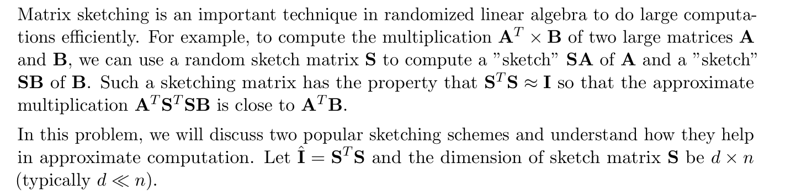


## Gaussian Sketch
> [!important]
> 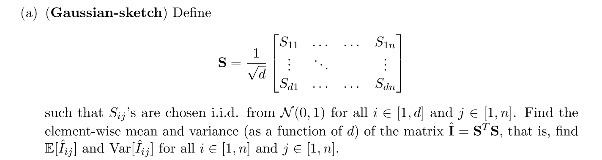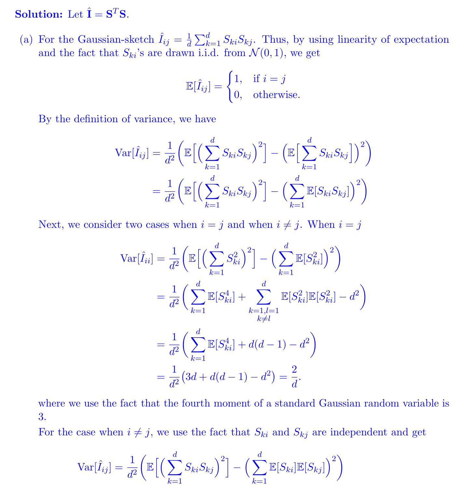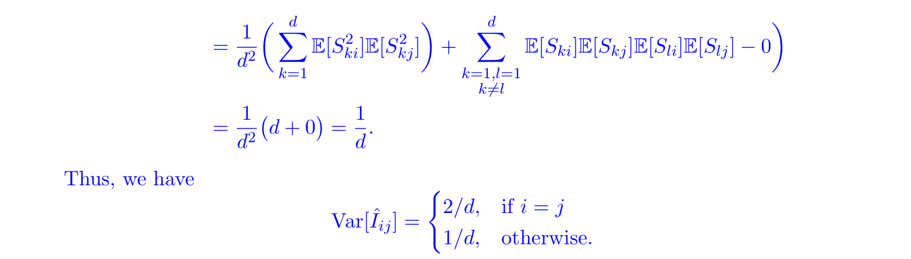


> [!code] Implementation
> 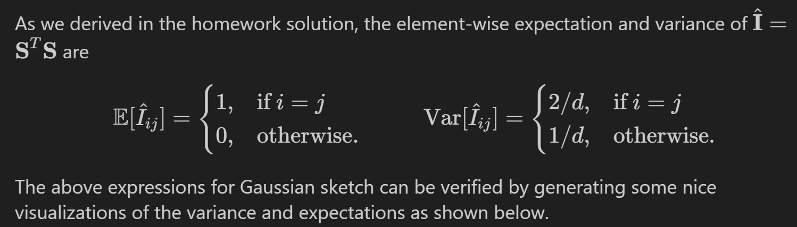
```python
def gaussian_sketch(d, n):
    ## YOUR CODE HERE ##
    return 1/np.sqrt(d) * np.random.randn(d, n)

def visualize(fn, n=50, d=30, n_samples=50):

    # Sample generation
    sketch_matrices = [fn(d, n) for _ in range(n_samples)]

    sketch_matrices = np.stack(list(mtx.T.dot(mtx) for mtx in sketch_matrices), axis=2)

    expect_data = np.mean(sketch_matrices, axis=2)

    var_data = np.var(sketch_matrices, axis=2)

    # Visualization
    fig, (ax1, ax2) = plt.subplots(1,2, figsize=(15, 4))
    fig.tight_layout()
    im1 = ax1.imshow(expect_data, cmap='YlGn')
    cbar1 = ax1.figure.colorbar(im1, ax=ax1)
    cbar1.ax.set_ylabel("Expectation", rotation=-90, va="bottom")
    im2 = ax2.imshow(var_data, cmap='YlGn')
    cbar2 = ax2.figure.colorbar(im2, ax=ax2)
    cbar2.ax.set_ylabel("Variance", rotation=-90, va="bottom")
    return
    
visualize(count_sketch)
```
> [!code] Output
> 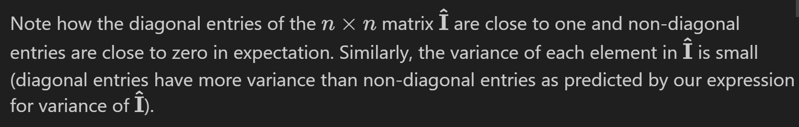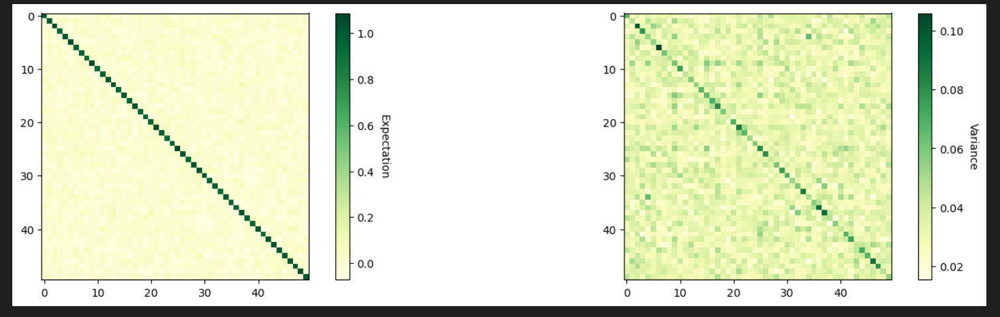


## Count Sketch
> [!important]
> 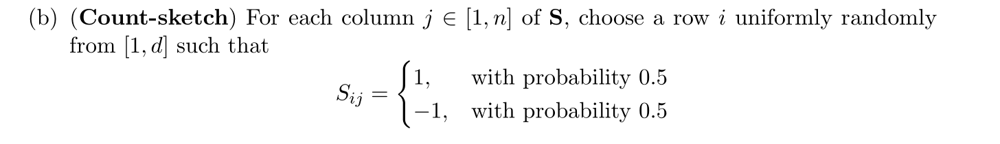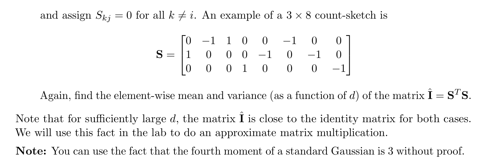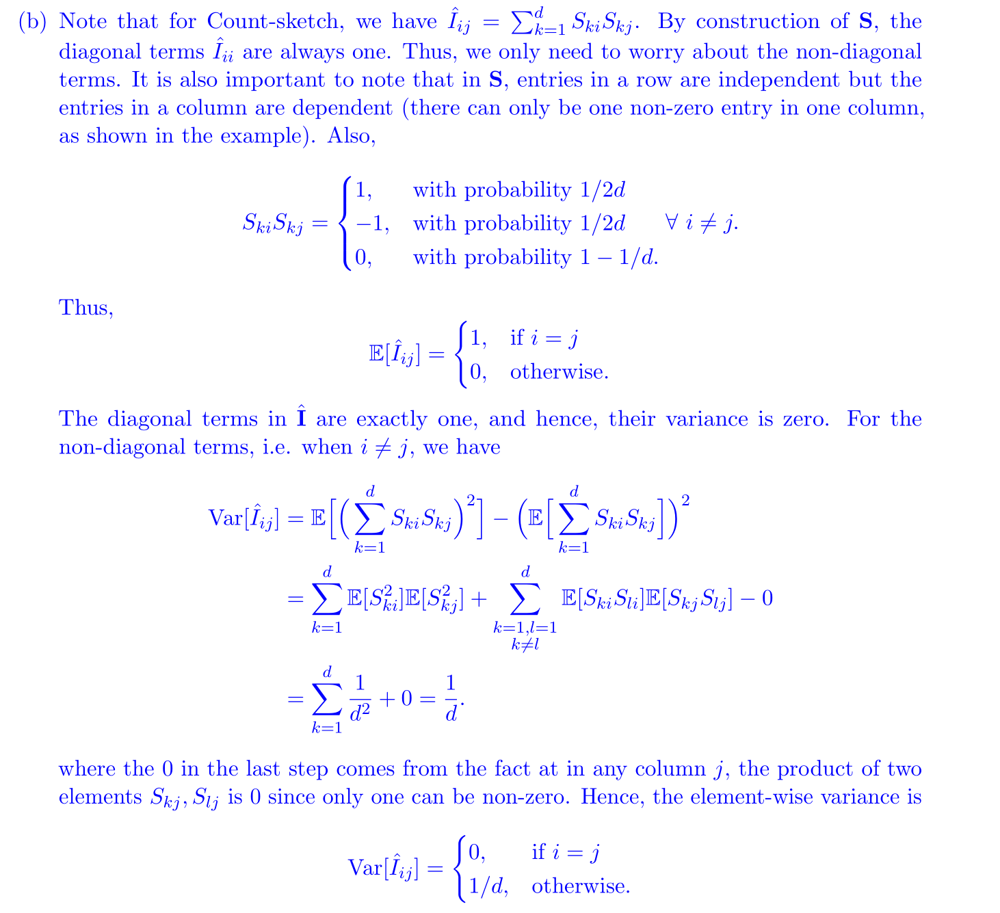
> We can also understand it as:
> 
> Conditioned on the chosen row, the value in different columns are independent and compute $\mathbb{E}[S_{ki}]$ with iterative expectation formula, which is $$\mathbb{E}[S_{ki}|k~is~chosen]P(k~is~ chosen)+\mathbb{E}[S_{ki}|k~isn't~chosen]P(k~isn't~chosen)$$

> [!code] Implementation
> 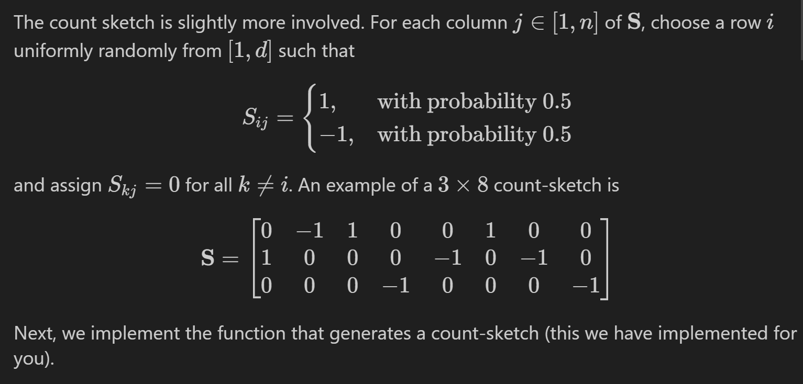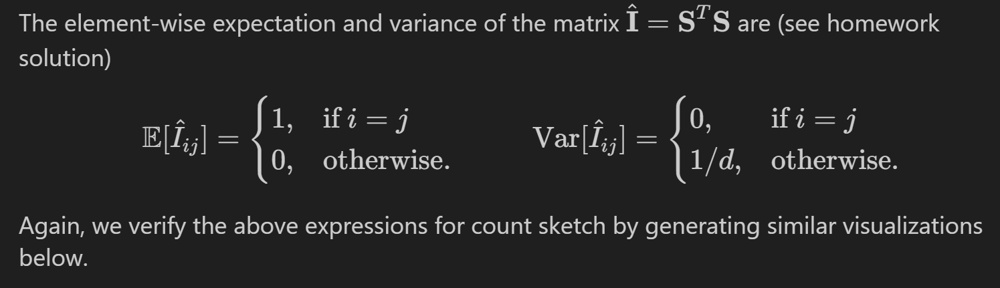
```python
def count_sketch(d, n):
    sketch = np.zeros((d, n))
    """
    mappings: n-dimesional vector (j-th entry denotes which row-element is non-zero for the j-th column) 
    flips: denotes whether the non-zero element is 1 or -1
    """
    mappings = np.random.randint(0, d, size=(1, n))
    flips = np.random.choice([-1,1], size=(1, n))
    sketch[mappings, np.arange(n)] = flips
    return sketch
    
visualize(count_sketch)
```
> [!code] Output
> 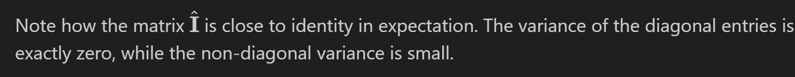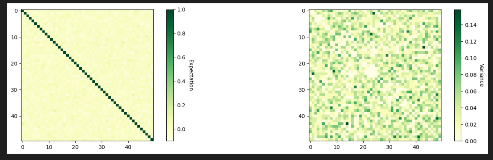


# MM with Sketching
> [!important]
> Next, we will discuss approximate matrix multiplication using sketching. We will compute the matrix product $\mathbf{A}^T \mathbf{A}$, where $\mathbf{A} \in \mathcal{R}^{n \times m}$, using Gaussian and count sketches and compare it with the exact product.
> 
> As can be noted from the expression of variance of $\hat{\mathbf{I}}=\mathbf{S}^T \mathbf{S}$, the accuracy of the sketchingbased computation increases as the sketch dimension $d$ increases, that is, $\hat{\mathbf{I}}$ closely approximates $\mathbf{I}$. To see how well sketching approximates the matrix product $\mathbf{A}^T \mathbf{A}$, we will use the Frobenius norm error $\left\|(\mathbf{S A})^T \mathbf{S} \mathbf{A}-\mathbf{A}^T \mathbf{A}\right\|_F$ as a metric for distance from the actual product. More specifically, we define percentage error in sketched matrix multiplication as
> $$\operatorname{Error}(\%)=100 \times \frac{\left\|(\mathbf{S A})^T \mathbf{S} \mathbf{A}-\mathbf{A}^T \mathbf{A}\right\|_F}{\left\|\mathbf{A}^T \mathbf{A}\right\|_F}$$
> 
> Our definition of error is one way to capture the element-wise similarity between the two matrices.(Note: The frobenius norm of a matrix $\mathbf{M}$ is $\|\mathbf{M}\|_F=\sqrt{\sum_{i, j} M_{i j}^2}$ ).Next, we will calculate the compute times for sketched matrix multiplication and compare it with the time required for exact multiplication.
```python
# Generate a random matrix A of size n x m
n = 15000
m = 1000
A = np.random.normal(50, 100, size = (n, m))
```


## Calculating with Gaussian Sketch
> [!code]
> Note that Gaussian sketch can be used to find a smaller matrix that can be used as a proxy for A, but it does not help in reducing computation time for matrix multiplication. Gaussian sketching $\mathbf{A}$ requires $O(m n d)$ time.
```python
def calc_gauss_sketch(d, A):
    """
    Calculates Gaussian-sketch of A, that is S*A, with sketch-dimension d
    """
    ##### Write your CODE here (use the function gaussian_sketch). Should take one or two lines at most.
    n = A.shape[0]
    S = gaussian_sketch(d, n)
    return S @ A
```


## Calculating with Count Sketch
> [!code]
> However, count sketch has a special sparse structure, and we can utilize it to calculate the sketch $\mathbf{C}=\mathbf{S} \mathbf{A}$ in $O(m n)$ time. This is done by directly producing the sketched matrix from $A$ rather than producing $S$ explicitly. In the function "calc_count_sketch" defined below, use the following algorithm to calculate $\mathbf{C}=\mathbf{S A}$ directly from $\mathbf{A}$.
> 1. Set $\mathbf{C}$ to be an all zeros matrix in $\mathcal{R}^{d \times m}$.
> 2. For each row of $A$, flip the sign with probability 0.5 , and then add it to a randomly picked row of $C$.
```python
def calc_count_sketch(d, A):
    """
    Calculates count-sketch of A, that is S*A, with sketch-dimension d using the algorithm above
    """
    ##### Write your CODE here 
    C = np.zeros((d, m))
    for i in range(A.shape[0]):
        rand = np.random.random()
        row_id = np.random.choice(d, 1)
        if rand < 0.5:    
            C[row_id, :] += -1 *  A[i, :]
        else:
            C[row_id, :] +=  A[i, :]
        
    return C.copy()
```


## Runtime Comparisons
> [!code]
> As the following code example shows: we have improved the compute time for large matrix multiplication using count-sketch by taking advantage of the sketch characteristics. 
> 
> For $\mathbf{A} \in \mathcal{R}^{n \times m}, \mathbf{S} \in \mathcal{R}^{d \times n}$ and $n \gg d>$ $m$, determine the time complexity for sketching-based multiplication for both gaussian and count sketches and compare it with the complexity for the exact multiplication $O\left(m^2 n\right)$. 
> 
> 
```python
def calc_error(exact_product, sketched_product):
    """
    Calculate percentage error in Frobenius norm as defined above
    """
    return 100*np.linalg.norm(exact_product - sketched_product, ord='fro')/np.linalg.norm(exact_product, ord='fro')
	
	
	
def generate_plots(A, num_samples = 5):
    """
    This function generates time and error plots for sketched matrix multiplication
    """
    n,m = A.shape
    sketch_dims = [int(m*x/4) for x in range(5,12,1)]
    print("Sketch dimensions considered")
    print(list(sketch_dims))
    
    a = len(sketch_dims)
    g_time = np.zeros(a)
    g_error = np.zeros(a)
    c_time = np.zeros(a)
    c_error = np.zeros(a)
    iter = 0
       
    ## Calculating exact product
    t1 = time.time()
    exact_product = (A.T).dot(A)
    t_exact = time.time() - t1
    
    for d in sketch_dims:
        for _ in range(num_samples):
            ## Gaussian sketch
            t2 = time.time()
            g_sketch = calc_gauss_sketch(d, A)
            g_product = g_sketch.T.dot(g_sketch)
            g_time[iter] += time.time() - t2
            g_error[iter] += calc_error(exact_product, g_product)

            ## Count sketch
            t3 = time.time()
            c_sketch = calc_count_sketch(d, A)
            c_product = c_sketch.T.dot(c_sketch)
            c_time[iter] += time.time() - t3
            c_error[iter] += calc_error(exact_product, c_product)
        iter += 1 
    
    ## Averaging error over all sample points
    g_time = g_time/num_samples
    g_error = g_error/num_samples
    c_time = c_time/num_samples
    c_error = c_error/num_samples
    
    fig, ax = plt.subplots(1,1,figsize=(12, 4))
    ax.plot(sketch_dims, g_error, label="Gaussian Sketch")
    ax.plot(sketch_dims, c_error, label="Count Sketch")
    ax.legend(loc="best")
    ax.set_xlabel("Sketch dimension (d)")
    ax.set_ylabel("Percentage Error")
    ax.set_ylim(bottom=0)
    ax.grid(True)
    ax.set_title("Error for Count and Gaussian sketches")
    
    fig, (ax1, ax2) = plt.subplots(1,2,figsize=(12, 4))
    ax1.plot(sketch_dims, g_time, label="Gaussian Sketch")
    ax1.plot(sketch_dims, t_exact*np.ones(len(sketch_dims)), label="Exact multiplication")
    ax1.legend(loc="best")
    ax1.set_xlabel("Sketch dimension (d)")
    ax1.set_ylabel("Time to compute product (seconds)")
    ax1.set_ylim(bottom=0)
    ax1.grid(True)   
    ax1.set_title("Compute time for Gaussian-sketched Multiply")
    
    ax2.plot(sketch_dims, c_time, label="Count Sketch")
    ax2.plot(sketch_dims, t_exact*np.ones(len(sketch_dims)), label="Exact multiplication")
    ax2.legend(loc="best")
    ax2.set_xlabel("Sketch dimension (d)")
    ax2.set_ylabel("Time to compute product (seconds)")
    ax2.set_ylim(bottom=0, top=ax2.get_ylim()[1]*1.15)
    ax2.grid(True)   
    ax2.set_title("Compute time for Count-sketched Multiply")
    
    plt.show()
	
	
### This might take a few minutes to run, reduce n_samples to reduce running time (especially while debugging)
generate_plots(A)

```
> [!code] Output
> 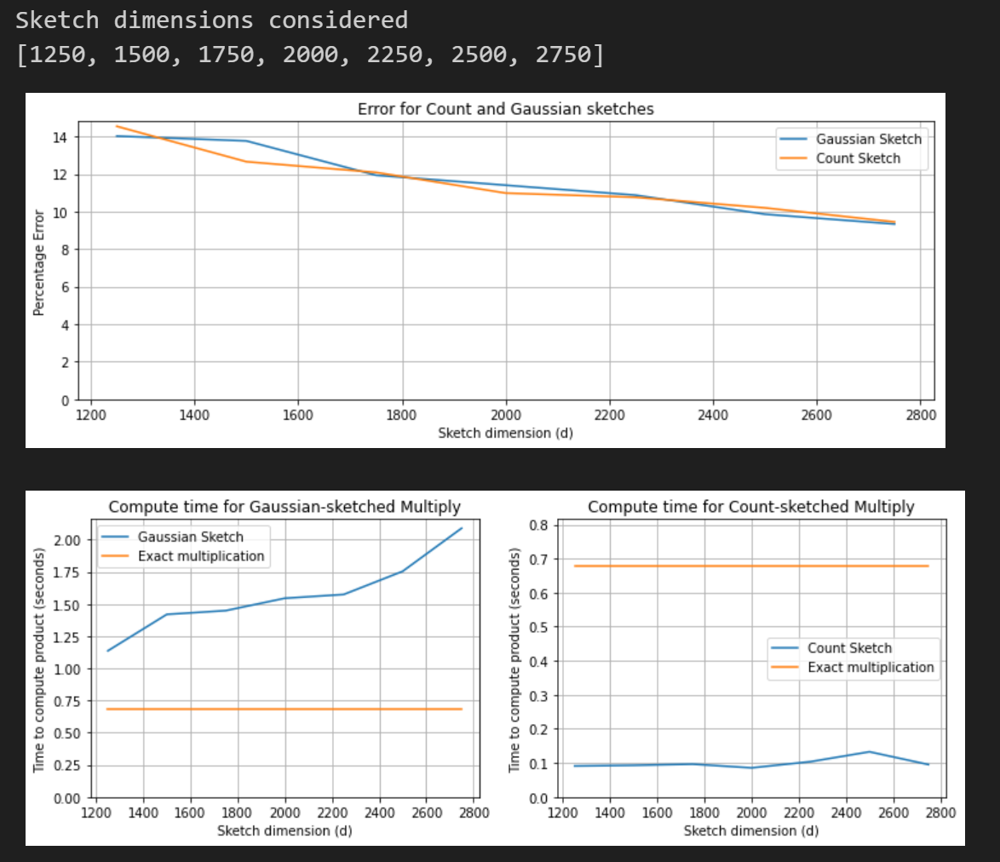

