# Correlations
## Correlation between Standardized
> [!def]
> Suppose we have two random variables $X,Y$ where $\mathbb{E}[X]=\mathbb{E}[Y]=0$ and $\mathbb{V}[X]=\mathbb{V}[Y]=1$, we call them standardized random variable.
> 
> The correlation between the two random variables are defined to be "to what extent can we approximate $Y$ by scaling $X$". The metric for this extent is MSE, and we want to minimize the following:
> $$\rho_{X,Y}=argmin_{\beta}\mathbb{E}[(Y-\beta X)^2]$$
> 

> [!proof]
> 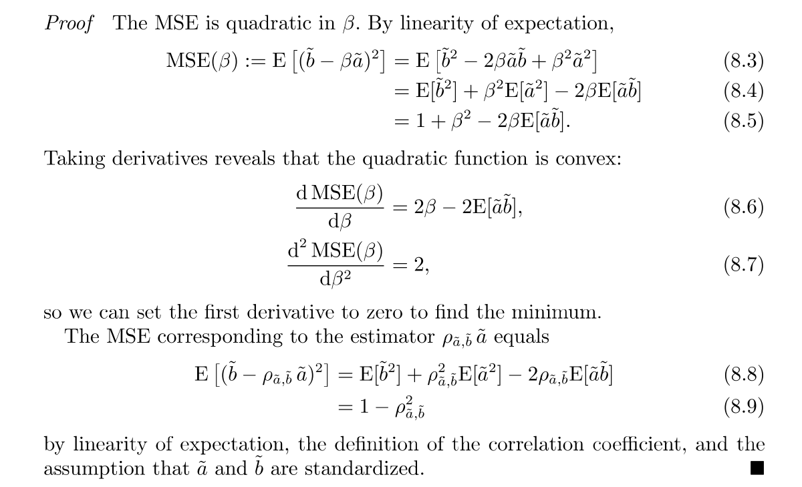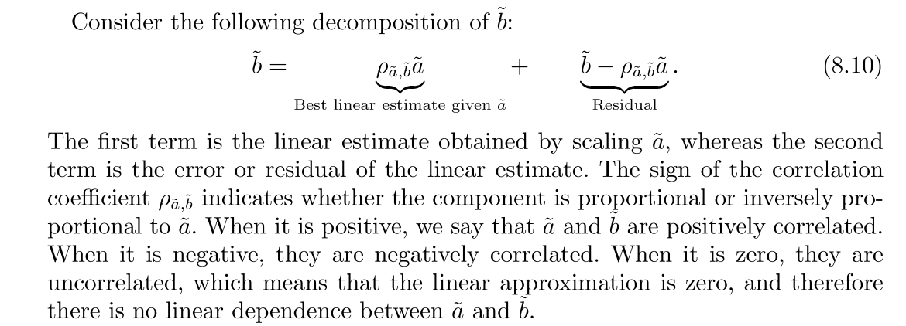

## Standardized R.V.s
> [!property] Linear Invariance
> For random variable $X$ and $Y$, the standardized version of them is defined to be: $$Z(X)=\frac{X-\mathbb{E}[X]}{\sqrt{\sigma_X^2}}$$ and $$Z(Y)=\frac{Y-\mathbb{E}[Y]}{\sqrt{\sigma_Y^2}}$$
> The correlation coefficient between standardized version and original version are the same:
> $$\rho_{Z(X),Z(Y)}=\rho_{X,Y}$$

> [!proof]
> 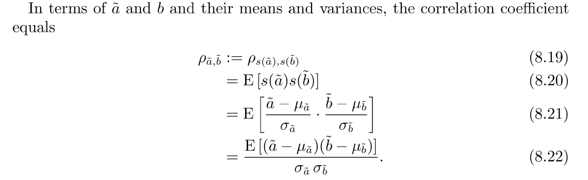


## Properties
> [!property] Between $\pm1$
> 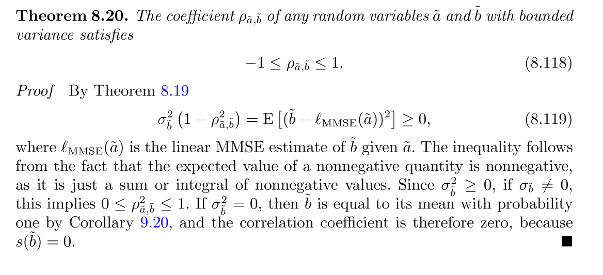
> When $\rho_{X,Y}=1$, the MSE for LMMSE is zero, thus we have:
> 
> 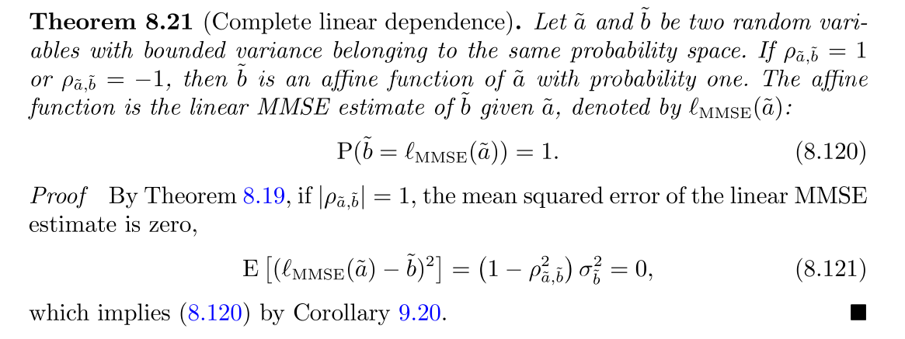


> [!property] Covariance = Correlation
> 1. $\mu_{Z(X)}=\mu_{Z(Y)}=0$ and $\sigma_{Z(X)}=\sigma_{Z(Y)}=1$
> 2. $Cov(Z(X),Z(Y))=\mathbb{E}[Z(X)Z(Y)]$
> 3. $Cov(Z(X),Z(Y))=\rho_{X,Y}$


# Sample Correlations
## Sample Statistics
> [!def]
> Given $\mathcal{D}=\{(x_1,y_1),(x_2,y_2),\cdots, (x_n,y_n)\}$, let $X=\{x_1,x_2,\cdots,x_n\}$ and $Y=\{y_1,y_{2},\cdots,y_n\}$, we define:
> 1. **Standardized Data:** $$z(x_i)=\frac{x_i-\bar{x}}{s_X}$$ and $$z(y_i)=\frac{y_i-\bar{y}}{s_Y}$$ where $\bar{x}$ and $\bar{y}$ are sample means while $s_X^2$ and $s_Y^2$ are sample variance.
> 2. **Sample Covariance:** $$s_{XY}=\frac{1}{n-1}\sum\limits_{i=1}^n(x_i-\bar{x})(y_i-\bar{y})$$ where $\bar{x}$ and $\bar{y}$ are sample mean of $X$ and $Y$.
> 3. **Sample Variance:** $$s_X^2=\frac{1}{n-1}\sum\limits_{i=1}^n(x_i-\bar{x})^2$$ and $$s_Y^2=\frac{1}{n-1}\sum\limits_{i=1}^n(y_i-\bar{y})^2$$
> 4. **Sample Correlation:** $$r_{XY}=\frac{s_{XY}}{\sqrt{s_X^2s_Y^2}}$$


## Standardized Dataset
> [!def]
> We define the standardized dataset to be $S_X=\{z(x_1),z(x_2),\cdots, z(x_n)\}$ and $S_Y=\{z(y_i),z(y_2),\cdots, z(y_n)\}$

> [!property] Properties of Standardized Dataset
> 1. **Sample mean** of standard dataset is **zero**.
> 2. **Sample variance** of standard dataset is **one**.
> 3. Sample Covariance = Sample Correlation Coefficient

> [!proof]
> 


## Estimate Correlation
> [!def]
> Given a paired dataset, we could estimate the sample correlation by first standardize the dataset and then compute the following:
> $$r_{X, Y}=\arg \min _\beta \sum_{i=1}^n\left(z\left(y_i\right)-\beta z\left(x_i\right)\right)^2 .$$

> [!proof]
> 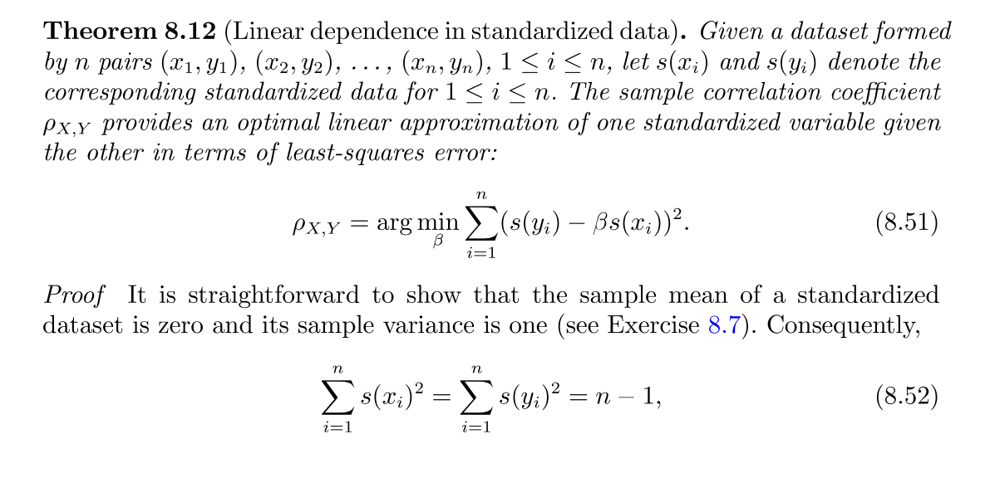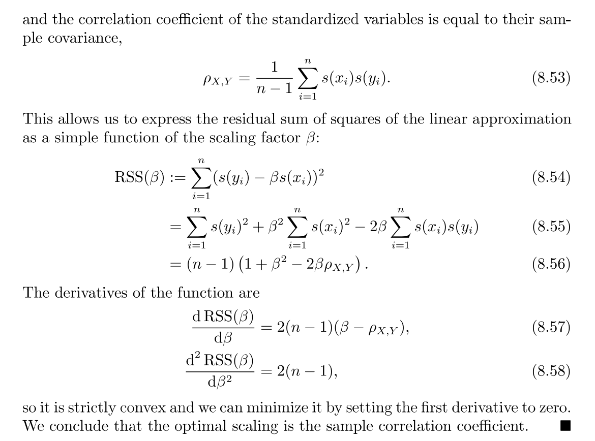


## Properties
> [!property] Between $\pm1$
> Using the property from [Residual and sample Correlation](Ch3_Linear_Regression.md#Simple%20Linear%20Regression#OLS%20Estimator#Properties), we can conclude.

> [!property] Complete Dependence
> When $r_{X,Y}=\pm1$, then $y_i=ax_{i}+b,1\leq i\leq n$ for some constant $a$ and $b$.
> 
> This follows from the above property.


# Simple Linear Regression
## MSE Estimator
> 


## Linear MMSE Estimator
### Definition
> [!def]
> Suppose we have two random variables $X$ and $Y$, with mean$\mu_x$ and $\mu_Y$, and variance $\sigma_X^2,\sigma_Y^2$.
> 
> The LMMSE of $Y$ given $X$ is by minimizing the following: $$argmin_{a,b}\mathbb{E}[(Y-aX-b)^2]$$
> $$\begin{aligned}\mathcal{l}_{MMSE}(X)&=aX+b\\&=\mu_Y+\rho_{X,Y}\frac{X-\mu_X}{\sigma_X}\sigma_Y\\&=\frac{\sigma_Y}{\sigma_X}\rho_{X,Y}\cdot X+\mu_Y-\frac{\rho_{X,Y}\sigma_Y\mu_X}{\sigma_X}\end{aligned}$$ where $\rho_{X,Y}\frac{X-\mu_X}{\sigma_X}=\rho_{X,Y}Z(X)$ is our estimate for $Z(Y)$.
> 
> **Note that we have several important things to remember:**
> 1. Slope of regression line: $a = \frac{\sigma_Y}{\sigma_X}\rho_{X,Y}=\frac{Cov(X,Y)}{\sigma_X^2}$
> 2. Intercept of regression line: $b=\mu_Y-\text{slope}\times \mu_X$.
> 3. If we regression standardized version $Z(Y)$ on $Z(X)$, then $\sigma_{Z(X)}=\sigma_{Z(Y)}=1$ and the slope of the regression line is just $\rho_{X,Y}$. Meanwhile, since $\mu_{Z(X)}=\mu_{Z(Y)}=0$, the intercept of the regression line is $0$.

> [!proof]
> 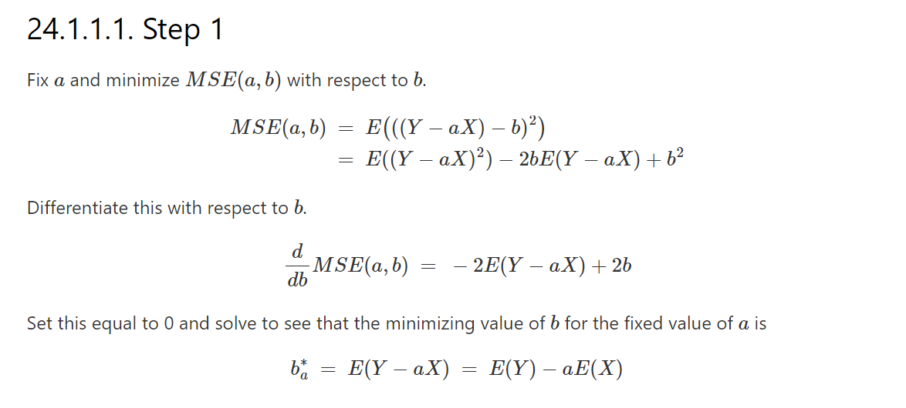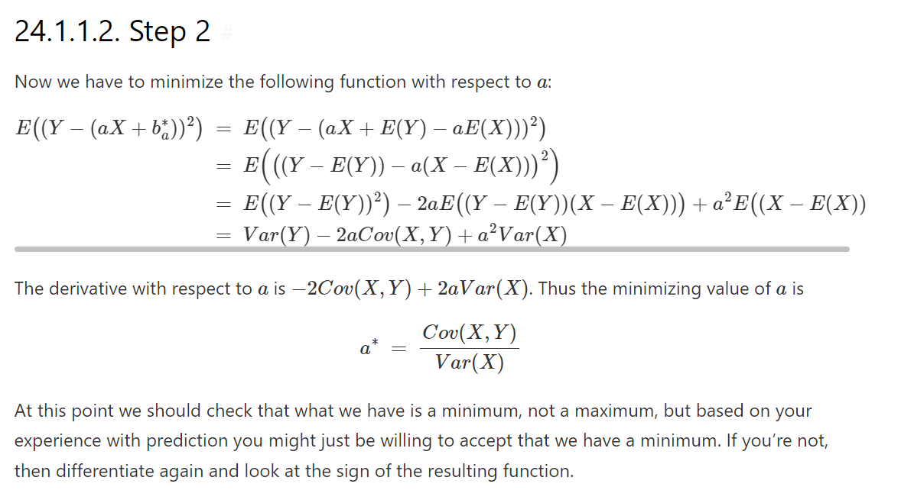


### MSE of LMMSE
> [!property] MSE of LMMSE
> Given two random variable $X$ and $Y$, the MSE of the LMMSE is:
> $$\mathbb{E}[(Y-\mathcal{l}_{MMSE}(X))^2]=(1-\rho_{X,Y}^2)\sigma_Y^2$$

> [!proof]
> 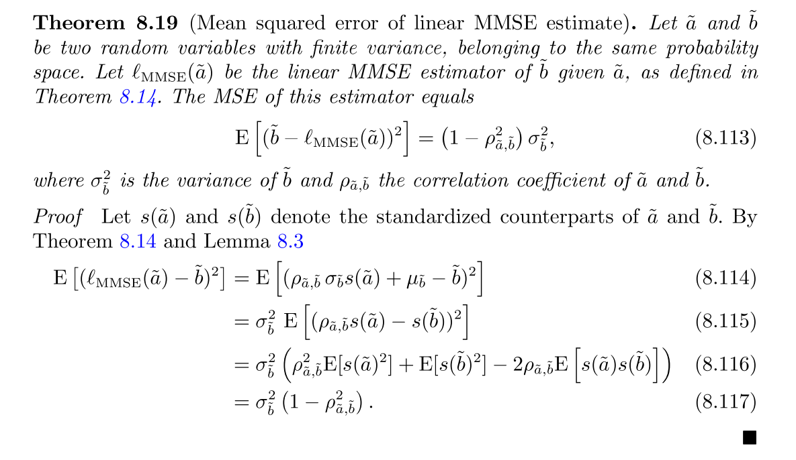


### Uncorrelated Residuals
> [!property] LMMSE and Residual are uncorrelated
> For two R.V. $X$ and $Y$, we have the following decomposition:
> $$Y=\mathcal{l}_{MMSE}(X)+Y-\mathcal{l}_{MMSE}(X)$$
> We have the following property:
> $$Cov(X,Y-\mathcal{l}_{MMSE}(X))=0$$
> and
> $$Cov(\mathcal{l}_{MMSE}(X),Y-\mathcal{l}_{MMSE}(X))=0$$
> where the second follows from the first due to the linearity of the covariance.
> 
> We also denote a very important concept, which is that the mean of the $Y-\mathcal{l}_{MMSE}(X)$ is zero.

> [!proof]
> 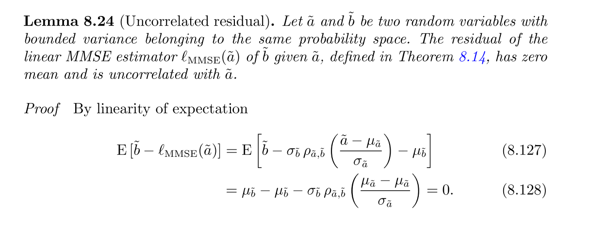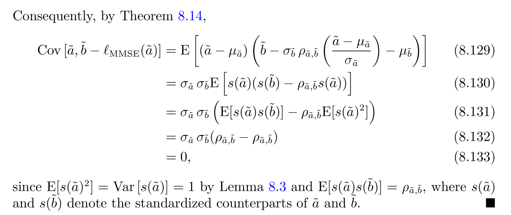


### Variance Decomposition
> [!property]
> Let $X$ and $Y$ be two random variables with bounded variance belonging to the same probability space. 
> 
> The variance of $Y$ can be decomposed into the sum of the variance of the linear MMSE estimator $\ell_{\mathrm{MMSE}}(X)$ of $Y$ given $X$ and the corresponding residual,
> $$\operatorname{Var}[Y]=\operatorname{Var}\left[\ell_{\mathrm{MMSE}}(X)\right]+\operatorname{Var}\left[Y-\ell_{\mathrm{MMSE}}(X)\right].$$
> The fraction of variance corresponding to the linear estimator is equal to the squared correlation coefficient $\rho_{X, Y}$ of $\tilde{a}$ and $Y$ :$$\begin{aligned}\operatorname{Var}\left[\ell_{\mathrm{MMSE}}(X)\right] & =\rho_{X, Y}^2 \operatorname{Var}[Y] \\\operatorname{Var}\left[Y-\ell_{\operatorname{MMSE}}(X)\right] & =\left(1-\rho_{X, Y}^2\right) \operatorname{Var}[Y]\end{aligned}$$

> [!proof]
> 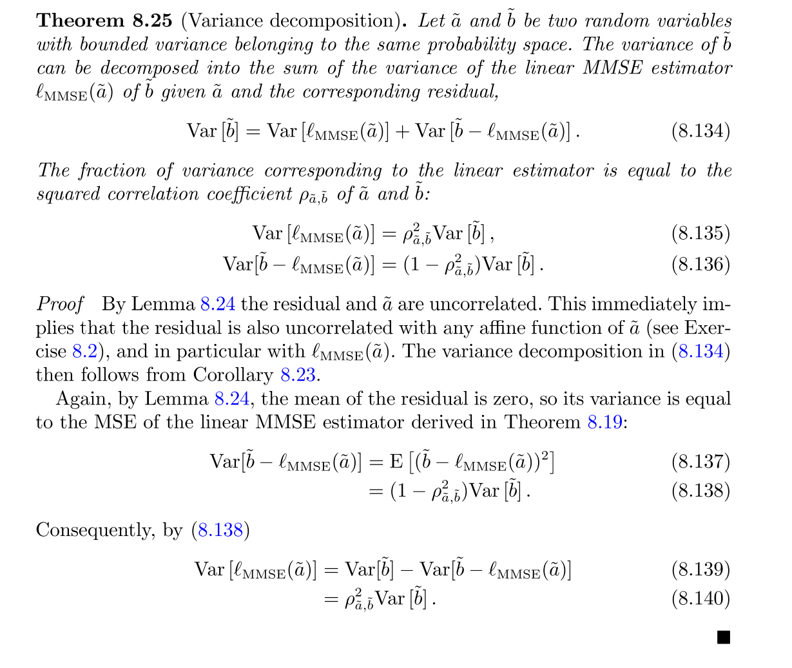


### R^2 Coefficient of Determination
> [!def]
> The explained variance ratio, also called coefficient of determination is defined as:
> $$R^2:=\frac{\operatorname{Var}\left[\ell_{\mathrm{MMSE}}(X)\right]}{\operatorname{Var}[Y]}$$

> [!property]
> We have:
> $$\begin{aligned} R^2 & =\rho_{X, Y}^2 \\& =1-\frac{\operatorname{MSE}}{\operatorname{Var}[Y]}, \quad \operatorname{MSE}:=\mathrm{E}\left[\left(Y-\ell_{\operatorname{MMSE}}(X)\right)^2\right]\end{aligned}$$

> [!proof]
> 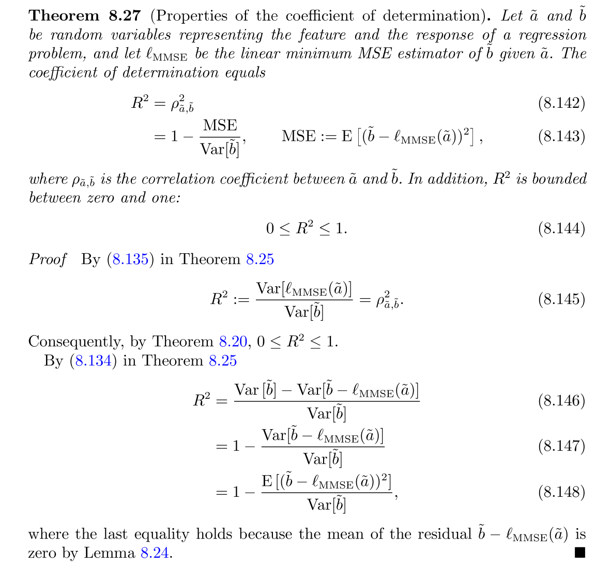


## LMMSE is optimal for Bivariate Gaussian
> [!def]
> 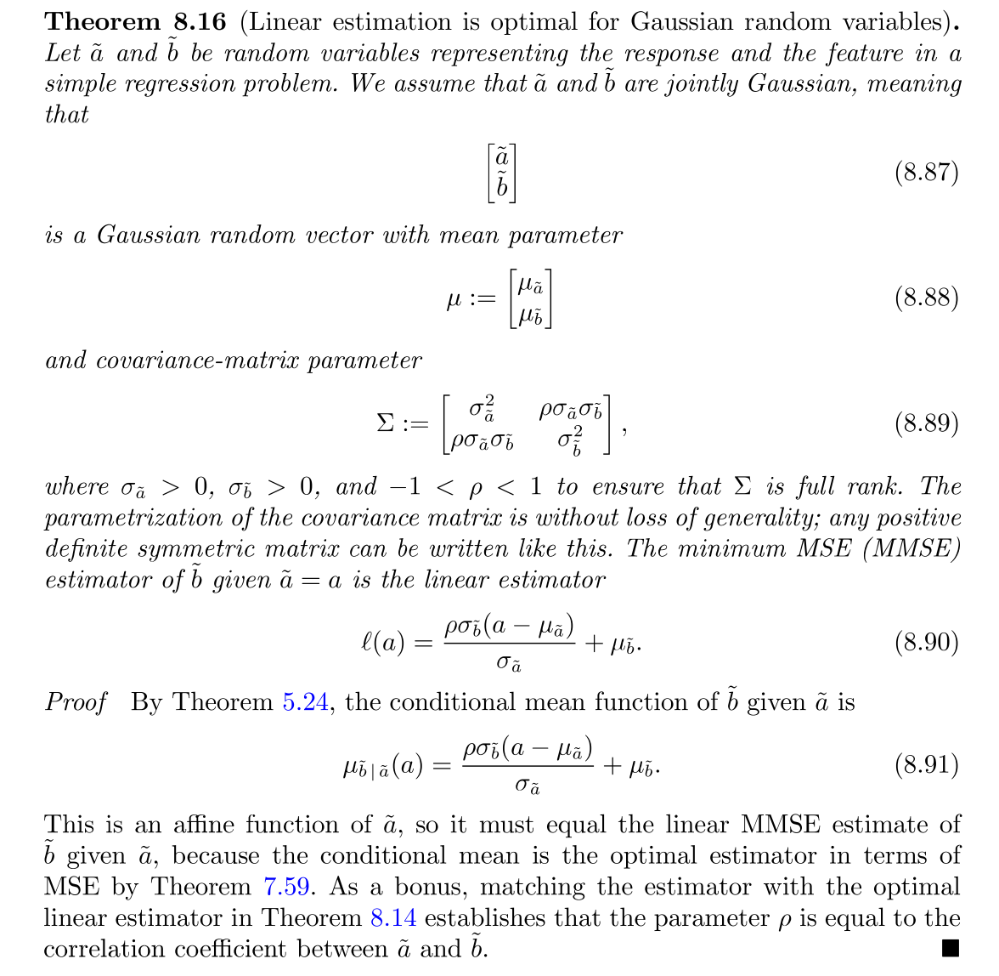


## OLS Estimator
### Definition
> [!def]
> Based on the derivations of LMMSE estimator, the OLS estimator comes in handy by just replacing all the population statistics with sample statistics, thus we have:
> Given $\mathcal{D}=\{(x_1,y_1),(x_2,y_2),\cdots, (x_n,y_n)\}$, the OLS estimator that minimizes the following: $$argmin_{a,b}\sum\limits_{i=1}^n(y_i-ax_i-b)^2$$ is given by:
> $$\mathcal{l}_{OLS}(x_i)=r_{X,Y}\frac{s_Y}{s_{X}}\cdot x_i+\bar{y}-r_{X,Y}\frac{s_Y}{s_{X}}\bar{x}$$ where $r_i=y_i-ax_i-b$


### Properties
> [!property] Residual Property
> $\frac{1}{n-1} \sum_{i=1}^n r_i^2=\left(1-r_{X,Y}^2\right) s_Y^2$
> 
> 

> [!proof]
> $$\begin{aligned}& \frac{1}{n-1} \sum_{i=1}^n r_i^2=\frac{1}{n-1} \sum_{i=1}^n\left[y_i-r_{x, y} \frac{s_Y}{s_X} \cdot x_i-\bar{y}+r_{X, Y} \frac{s_Y}{s_X} \bar{x}\right]^2 \\& =\frac{1}{n-1} s_Y^2 \sum_{i=1}^n\left[\frac{y_i-\bar{y}}{x_Y}-r_{X,Y} \frac{x_i-\bar{x}}{s_X}\right]^2 \\& =s_Y^2 \times \frac{1}{n-1}\left\{\sum_{i=1}^n\left(\frac{y_i-\bar{y}}{s_Y}\right)^2-2 \sum_{i=1}^n\left(y_i-\bar{y}\right)\left(x_i-\bar{x}\right) \cdot r_{X, Y}+r_{X, Y}^2 \sum_{i=1}^n\left(\frac{x_i-\bar{x}}{s_X}\right)^2\right\} \\& =s_Y^2 \times\left\{s_{z(Y)}^2-2 r_{X, Y} \cdot r_{X, Y}+r_{X, Y}^2 s_{z(X)}^2\right\} \\& =s_y^2 \times\left\{1-2 r_{X, Y}^2+r_{X, Y}^2\right\} \\& =\left(1-r_{X, Y}^2\right) s_Y^2 \\&\end{aligned}$$
> 


### Residual Properties
> [!property]
> $s_{Y}^2=s_{\ell_{LMMSE}(X)}^2+s_{Y-\ell_{LMMSE}(X)}^2$, which means that the sample variance of the response is equal to the sum of the sample variance of LMMSE predictor and residuals.


### Sample R^2
> [!property]
> $R^{2}= r_{X,Y}^2$


### Examples
> [!example]
> 
```python
import numpy as np
import matplotlib.pyplot as plt
%matplotlib inline
import pandas as pd
data = pd.read_csv("./ANSUR II MALE Public.csv",encoding="gbk")
X = data["Heightin"]
Y = data["Weightlbs"]

# Compute model coefficients
covXY = np.cov(X,Y)[0][1]
sY = np.std(Y)
sX = np.std(X)

beta1 = covXY / sX ** 2
beta0 = np.mean(Y) - beta1 * np.mean(X)
residuals = Y - beta0 - beta1 * X
np.cov(X, residuals)

plt.scatter(X,Y)
plt.plot(X, beta0 + beta1 * X, c="red")
plt.xlabel("height")
plt.ylabel("weight")

predictor = beta0 + beta1 * X
np.var(Y) # 896.2959093603183
np.var(predictor) + np.var(residuals) # 896.3860346141703

```

# Multiple Linear Regression


# F Statistics
> At least one predictor is useful.


# Choosing Features
> [!overview]
> When modeling an outcome using predictors $X_1,X_{2},\cdots, X_p$, we have $Y=\beta_0+\beta_1X_1+\cdots+\beta_pX_p$, but how to choose the subset of features. Naive approach is that we iterate over all the subsets of the feature and see which one gives the best model. But when $\frac{p}{40}$, we would have to try $2^{40}$ different subsets. So we want to use some automated feature selection method to speed up the process.


## Forward Selection
> [!important]
> 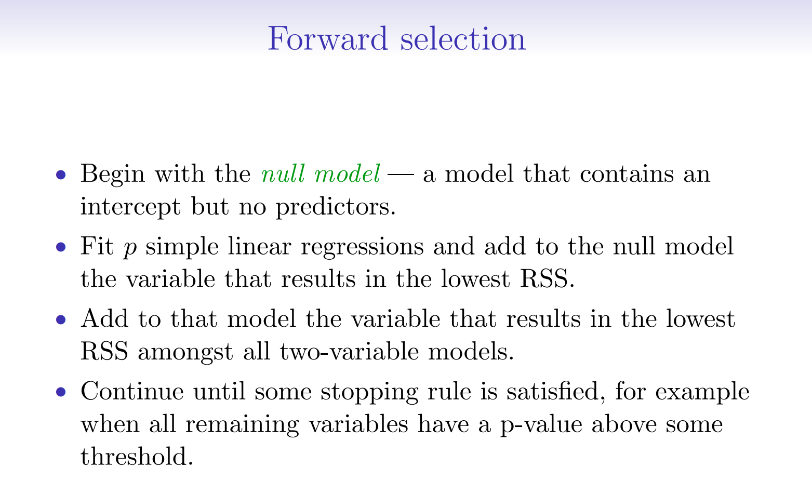


## Backward Selection
> [!important]
> 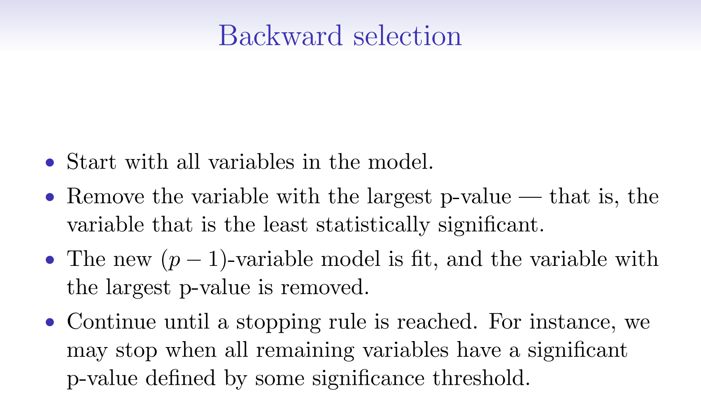


