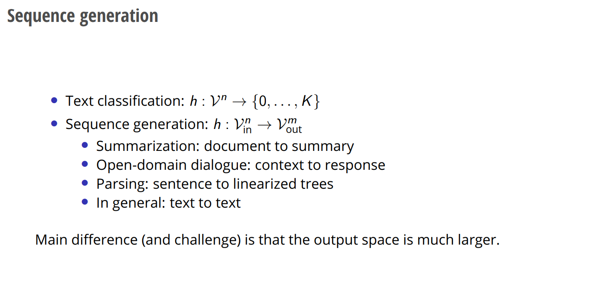
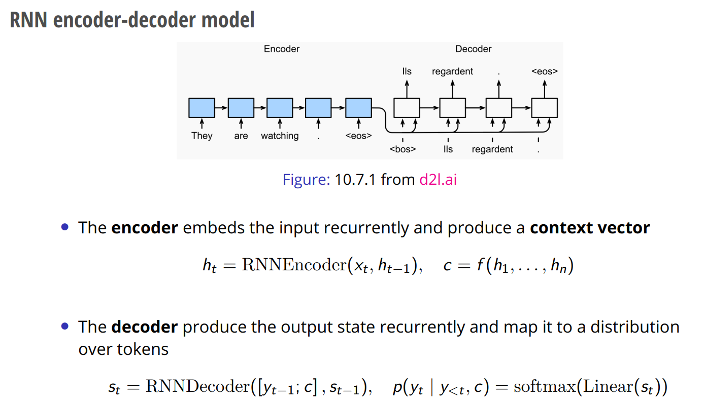
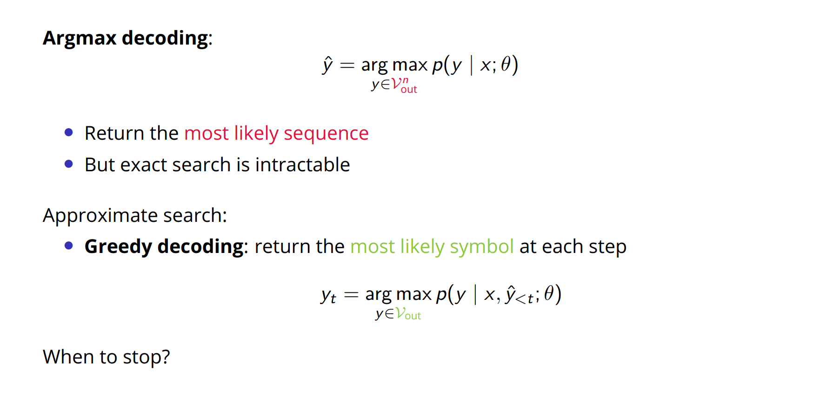

# Motivation
> [!motiv]
> 

# Sequence Generation
## Definition
> [!def]
> 

## Encoder-Decoder Structure
> [!important]
> 

## Encoder-Decoder Attention
> [!important]

# Beam Search Decoding
## Greedy(Argmax) Decoding
> [!important]
> 
> When we hit the end of the sequence we stop.

## Beam Search Sampling
> [!important]
> 
> 假设第一步我们从`Vocab`这么多的`hypothese`中选出了`top-k`, 则在第二个时间步的时候我们对于每一个`top-k`的`hypothesis`都可以产生`Vocab`这么多的`hypotheses`, 所以在某一个时刻最多会有`K * Vocab`这么多的`hypotheses`，然后我们按照以下步骤:
> - 在`Vocab`中选出`K`个, 得到`K*K`个假设
> - 在`K*K`中选出`topK`个作为下一次`expand`的出发点。
> 
> 
> **Here we see a few things:**
> - For word "he", we have $score(he)=logP(he|<START>) = -0.7$
> - For word "hit", we have $$\begin{align}-1.7 &= log P(<START>, he, hit)\\&=logP(hit|<START>, he)+logP(he|<START>)\\&=logP(hit|<START>, he) - 0.7\\&=score(<START>, he, hit)\end{align}$$
> 
> **Remarks:**
> - If, after generating new hypotheses, **all expanded hypotheses** in the beam **contain EOS tokens**, then no further expansion is possible. This would mean the beam search terminates because there are no active hypotheses left to expand.
> - The **time complexity** for hard limit beam search: $O(K\cdot |V|^2\cdot N)$ where $K$ is the number of partial hypothese at each time step, $|V|$ is the number of vocab, then sorting takes $|V|$(radix sort) and finally we need to do it for each timestep so another factor $N$, so finally we have $O(K\cdot |V|^2\cdot N)$
> 	- For **greedy search**, the time complexity is just $O(N\cdot |V|^2)$ since it consumes $O(|V|^2)$ at each timestep given that we sort the vocab using radix sort.
> 	- For **exact search**, the state space size is $|V|^N$ so the complexity is $O(|V|^N)$
> - To enable backtracing, we need to **keep a backpointer at each word** that we pick so as to construct the generated sequence from the beginning.

# Sampling-based Decoding
## Motivations
> [!motiv]
> 

## Definitions
> [!def]
> 

## Tempered Sampling
> [!def]
> 
> Think of $T$ here as the variance(width) of Laplacian distribution, so that the smaller the $T$, the more concentrated, more peaky the output vocab distribution would be.
> - $T$ here is called **temperature** that is frequently appearing in model finetuning hyperparameter.

## Truncated Sampling
> [!important]
> 

# Practical Decoding
> [!important]
> 
> **Remarks:**
> - **Sampling-based decoding** is more suitable for open-ended text generation. e.g. Story generation and dialogue.
> - **Argmax-based decoding** like beam search decoding is more suitable for correct, stable answer.

# Exposure Bias
> [!def]
> 

