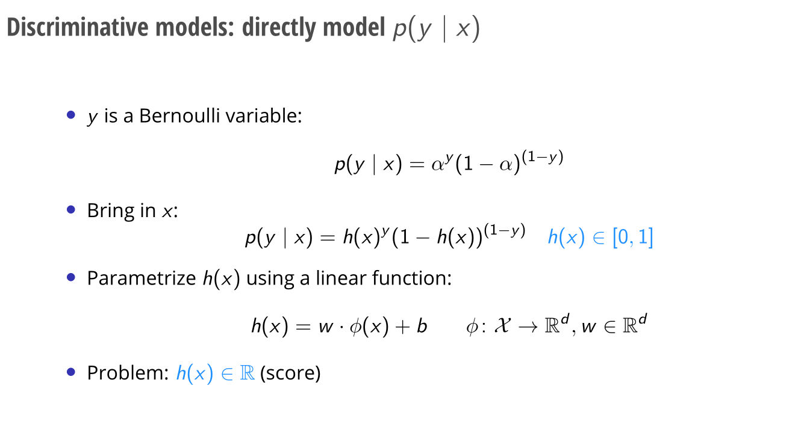
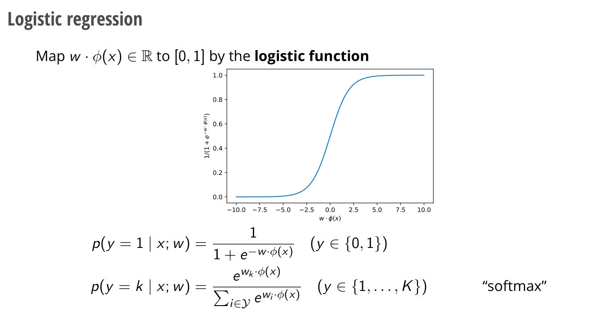
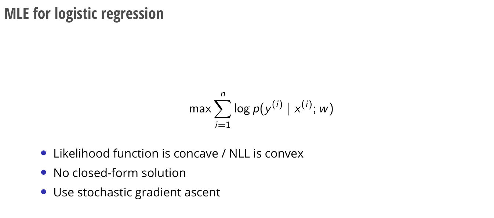
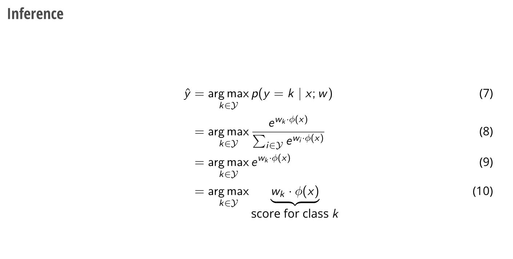
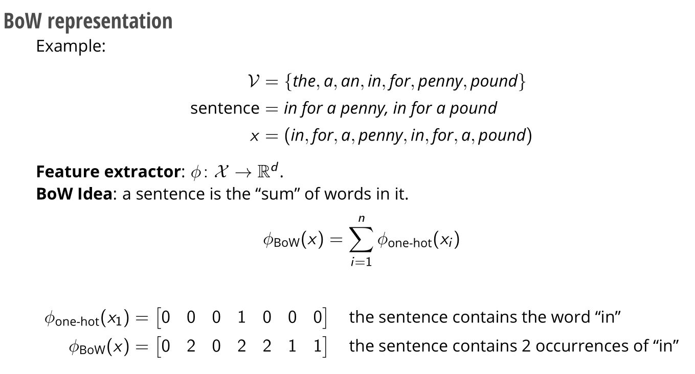
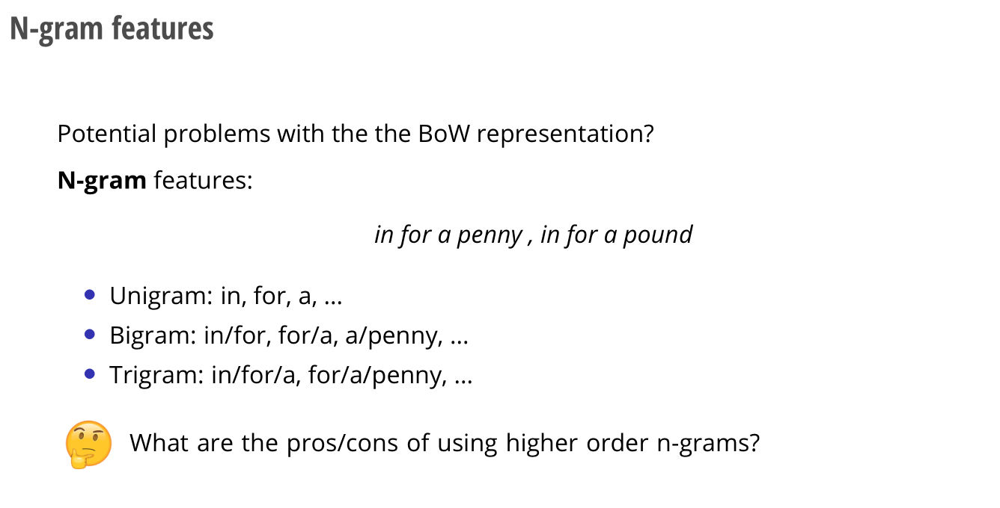
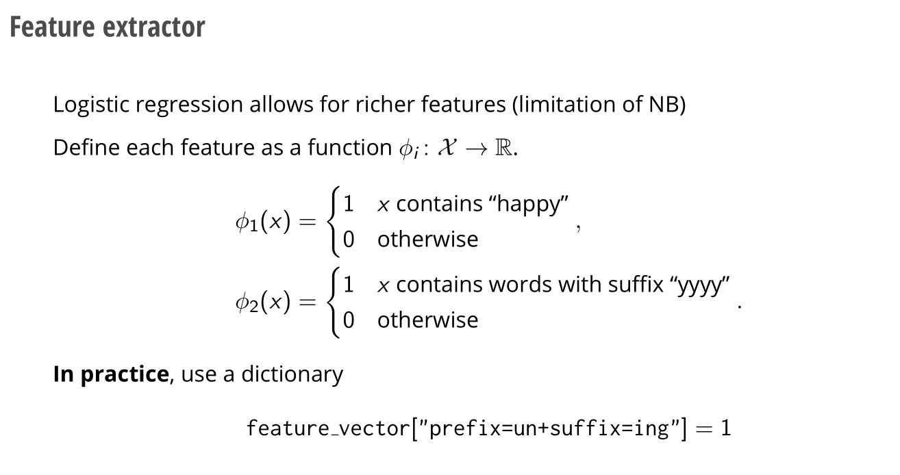
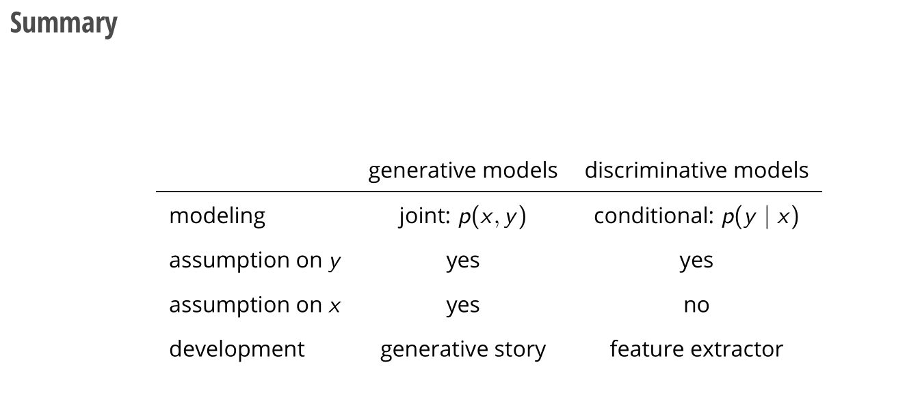

# Logistic Regression
## Modeling
> [!def]
> 


## Learning: MLE
> [!important]
> 


## Inference
> [!important]
> 


## Features
### Bag of Words
> [!def]
> 


### N-gram
> [!def]
> 


# TF-IDF Implementations
> [!code]
```python
# TF-IDF as features
from sklearn.feature_extraction.text import TfidfVectorizer
tfidf_vectorizer = TfidfVectorizer()
tfidf_vectorizer.fit(train_sentence_list)
train_feature_list = tfidf_vectorizer.transform(train_sentence_list)
# LogisticRegression
from sklearn.linear_model import LogisticRegression
lr_classifier = LogisticRegression()
lr_classifier.fit(train_feature_list, train_label_list)
test_feature_list = tfidf_vectorizer.transform(test_sentence_list)
lr_classifier.predict(test_feature_list)
```


# Comparisons
> [!important]
> 

