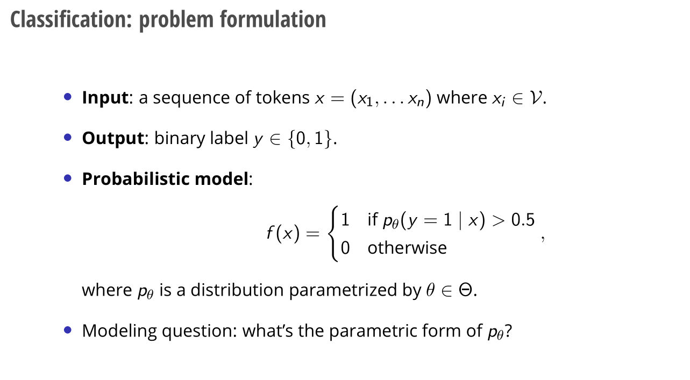

# Problem Formulation
> [!def]
> 


# Naive_Bayes
## Modeling
> [!def]
> 


## Assumptions
> [!important]
> 


## Learning: MLE
> [!important]
> 

> [!quiz] Remark
> 


## Inference 
> [!def]
> 


## Tokenization
> [!important]
> 
```python
import nltk
nltk.download('punkt')

from nltk.tokenize import word_tokenize
word_tokenize("Hello World!")


# import these modules
from nltk.stem import PorterStemmer
from nltk.tokenize import word_tokenize
 
ps = PorterStemmer()
 
# choose some words to be stemmed
words = ["program", "programs", "programmer", "programming", "programmers"]
 
for w in words:
    print(w, " : ", ps.stem(w))


# Stemming with NLTK
# import these modules
from nltk.stem import PorterStemmer
from nltk.tokenize import word_tokenize
 
ps = PorterStemmer()

# choose some words to be stemmed
words = ["sad", "sadly"]
 
for w in words:
    print(w, " : ", ps.stem(w))
	
	
# remove punctuation
import string
string.punctuation '!"#$%&\'()*+,-./:;<=>?@[\\]^_`{|}~'
```


## Laplacian Smoothing
> [!important]
> 
```python
def get_conditional_word_likelihood_with_smoothing(word, label):
    if label == 0:
        return (negative_words.count(word) + 1) / (len(negative_words) + len(word_list))
    else:
        return (postive_words.count(word) + 1) / (len(postive_words) + len(word_list))
```


# Naive Implementations
> [!important]
> The key idea is to compute $p(c|s)$ with bayes rules as $$p(c|s) = \frac{p(s|c)p(c)}{p(s)}$$
> and compare $p(c=1|s)$ and $p(c=0|s)$, where the class with bigger conditional probability should be the prediction.
> 
> So we just need to compare $p(s, c=0)$ and $p(s, c=1)$ which boils down to computing $p(s|c=0)p(c=0)$ and $p(s|c=1)p(c=1)$.
> 
> Here we can estimate all four quantities from data.


## Dataset
> [!code]
```python
train_sentence_list = [
    "I liked the movie",
    "It's a good movie. Nice story",
    "Nice songs. But sadly boring ending.",
    "Hero's acting is bad but heroine looks good. Overall nice movie",
    "Sad, boring movie",
]
train_label_list = [1, 1, 0, 1, 0, 0]

test_sentence_list = [
    "I loved the acting in the movie",
    "The movie was bad",
    "Sad"
]
test_label_list = [1, 0, 0]

# This will be our vocab
word_list = " ".join(train_sentence_list).split()
```


## Pre-processing
> [!code]
> 
> Note that `PorterStemmer` outputs `sadli` as the stem word for `sadly`, which is not accurate. This is because `PorterStemmer` is a rule-based converter which gives stem word maybe more suitable for NLP task than dictionary-level stem word since often times we care more about groups of words instead of the word itself.
```python
import string
import nltk
# word stemmer
from nltk.stem.porter import PorterStemmer
from nltk.corpus import stopwords

nltk.download('stopwords')


def preprocess(sentence):
    # Remove punctuations
    # str.maketrans(character_to_replace, how_to_replace, what_to_remove)
    sentence = sentence.translate(str.maketrans('', '', string.punctuation))
    # Convert words to lower case and split them
    sentence = sentence.lower().split()
    # Remove stop words
    stop_words = set(stopwords.words("english"))
    sentence = [word for word in sentence if word not in stop_words]
    # stem words
    porter = PorterStemmer()
    sentence = [porter.stem(word) for word in sentence]
    return sentence

postive_words = []
negative_words = []
for sentence, label in zip(train_sentence_list, train_label_list):
    sentence = preprocess(sentence)
    if label == 0:
        negative_words += sentence
    else:
        postive_words += sentence
postive_words = list(postive_words)
negative_words = list(negative_words) 
print(len(postive_words), len(negative_words)) # 15 8
```


## Compute Prior
> [!code]
> Here we compute $p(c=0)$ and $p(c=1)$
```python
positive_prior = len([label for label in train_label_list if label == 1]) / len(train_label_list) # 0.6
negative_prior = len([label for label in train_label_list if label == 0]) / len(train_label_list) # 0.4
```


## Compute Conditional
> [!code]
> Here we compute $p(w_i|c=0)$ and $p(w_i|c=1)$ for $w_i$ in each sentence $s$ and use these to compute $p(s|c=0)$ and $p(s|c=1)$.
```python
# Without laplacian smoothing
def get_conditional_word_likelihood(word, label):
    if label == 0:
        return negative_words.count(word) / len(negative_words)
    else:
        return postive_words.count(word) / len(postive_words)
		
# With laplacian smoothing
def get_conditional_word_likelihood_with_smoothing(word, label):
    if label == 0:
        return (negative_words.count(word) + 1) / (len(negative_words) + len(word_list))
    else:
        return (postive_words.count(word) + 1) / (len(postive_words) + len(word_list))


# Compute p(s|c)
def get_sentence_likelihood(sentence, label):
    sentence = preprocess(sentence)
    likelihood = 1
    # May overflow here 
    for word in sentence:
        likelihood *= get_conditional_word_likelihood_with_smoothing(word, label)
    return likelihood

```


## Do Inference
> [!code]
> Here we compute $p(c=0|s)$ and $p(c=1|s)$
```python
# do inference
for test_sentence in test_sentence_list:
    pos_prob = positive_prior * get_sentence_likelihood(test_sentence, 1)
    neg_prob = negative_prior * get_sentence_likelihood(test_sentence, 0)
    print(pos_prob, neg_prob)
    if pos_prob > neg_prob:
        print("Positive")
    elif pos_prob < neg_prob:
        print("Negative")
    else:
        print("Neutral!")

"""
5.2674897119341567e-05 1.4579384749963548e-05
Positive
0.0023703703703703703 0.0005540166204986149
Positive
0.013333333333333334 0.021052631578947368
Negative
"""
```


# Pipelined Implementations
> [!code]
> We can use `word counting` as features
> 
```python
from collections import defaultdict
from nltk import word_tokenize

# NaiveBayesClassifier 
train_feature_list = []
for sentence, label in zip(train_sentence_list, train_label_list):
    sentence = preprocess(sentence)
    # Create word counting feature for each sentence
    feature_dict = defaultdict(int)
    for word in sentence:
        feature_dict[word] += 1
    train_feature_list.append((feature_dict, label))

nb_classifier = nltk.NaiveBayesClassifier.train(train_feature_list)
for test_sentence in test_sentence_list:
    test_sentence = preprocess(test_sentence)
    feature_dict = defaultdict(int)
    for word in test_sentence:
        feature_dict[word] += 1
    print(nb_classifier.classify(feature_dict))
```
