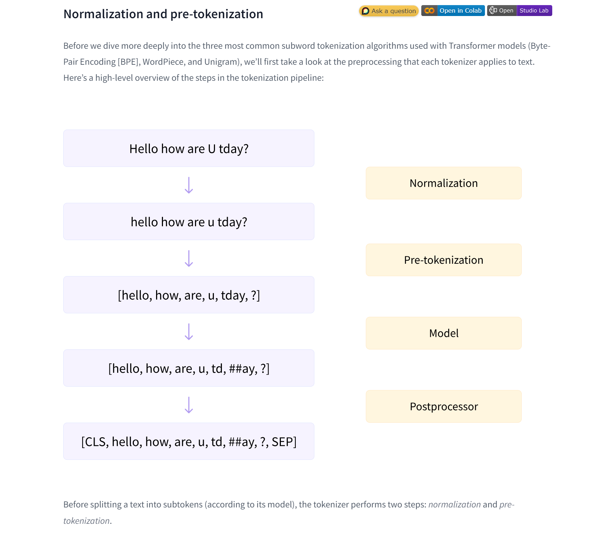
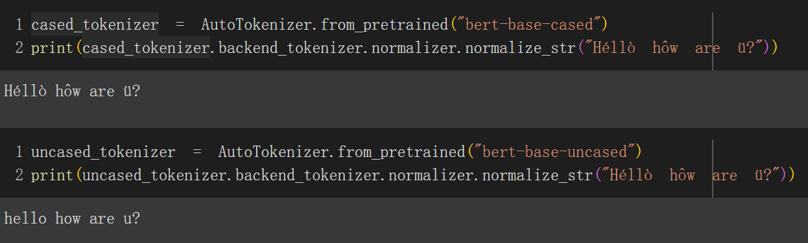
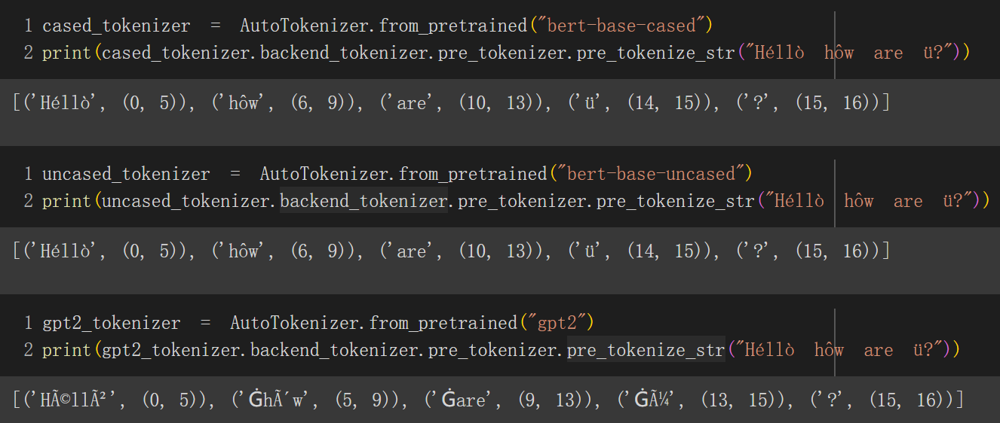
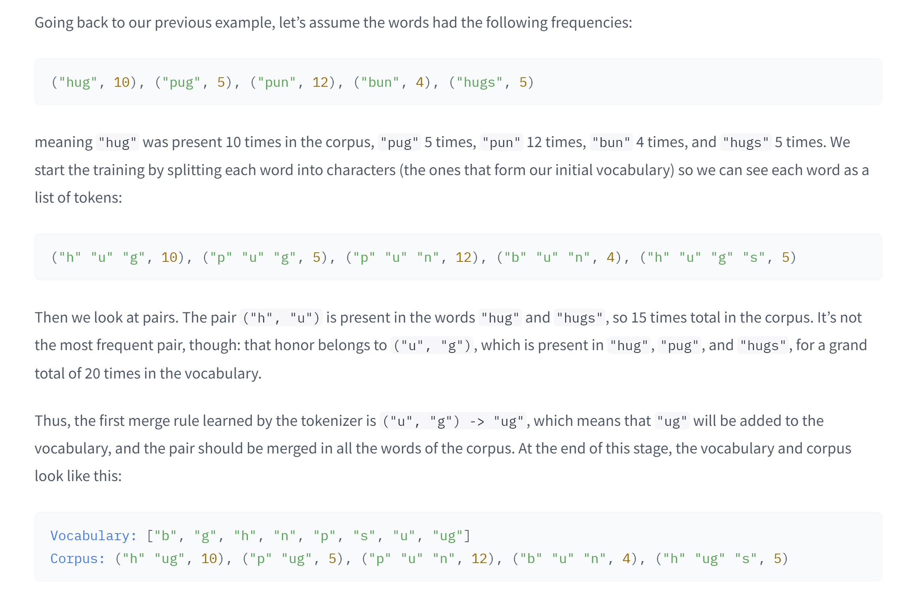
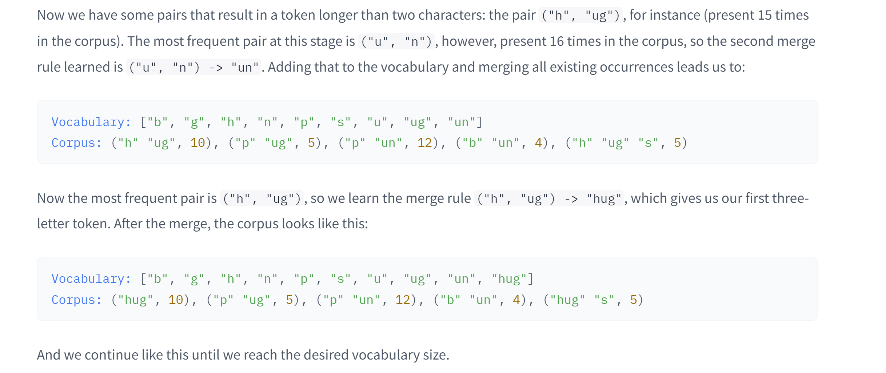
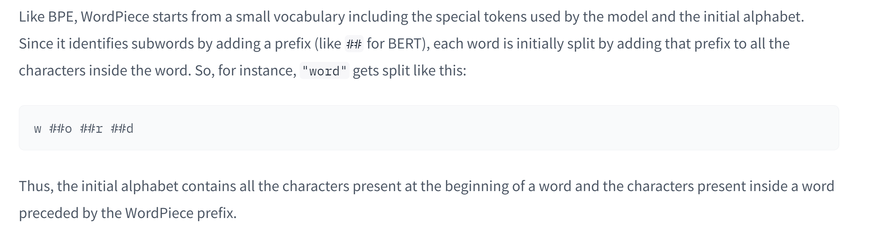
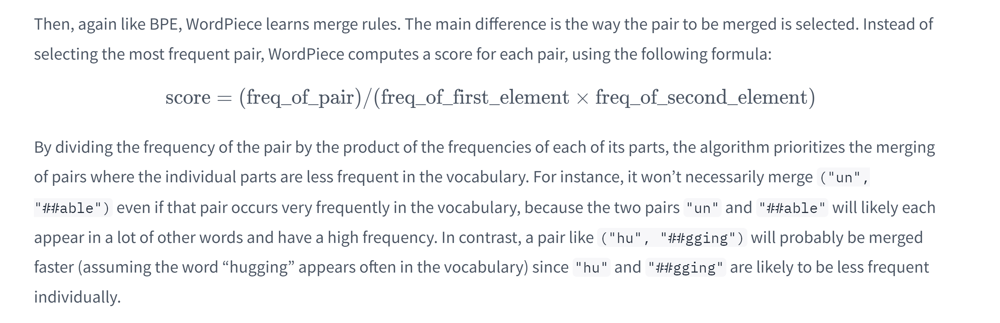
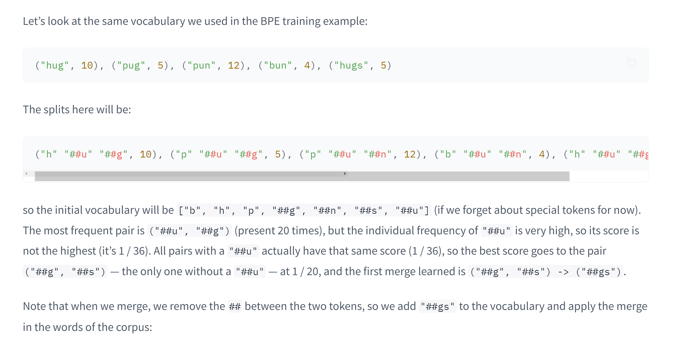
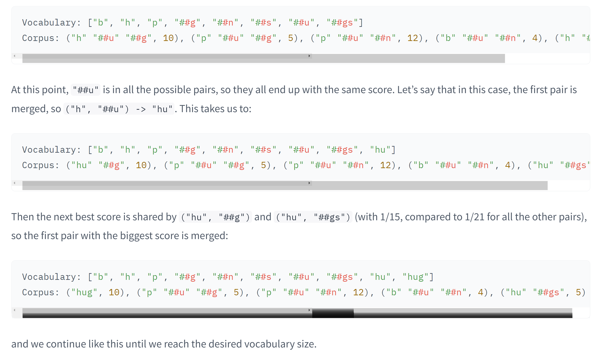
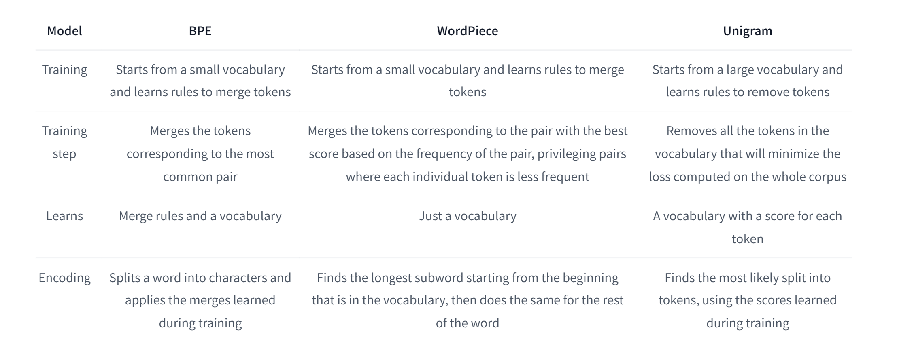

# Pipelines
> [!def]
> 
> In short, each 🤗 tokenizer has their unique internal components:
> - **normalization:** General clean up, removing unwanted whitespace, casing.
> - **pre-tokenization:** Encode the raw text for downstream tokenization tasks. For example, `["How are you today"] -> [("how", (0, 3)), ("are", (3, 6)), ("you", (6, 9)), ("today", (9, 14))]`
> - **tokenization:** The actual tokenization algorithm.
> 	- Splitting the words into subwords(or characters based on algorithm type), e.g. `[("how", (0, 3)), ("are", (3, 6)), ("you", (6, 9)), ("today", (9, 14))] -> ["h", "o", "w", "u", "a", "r","e", "t", "d", "y"]`
> 	- Apply merge rules learned in order on those splits.

## Normalization
> [!def]
> The normalization step involves some general cleanup, such as removing needless whitespace, lowercasing, and/or removing accents.The 
> 
> - The 🤗 Transformers `tokenizer` has an attribute called `backend_tokenizer` that provides access to the underlying tokenizer from the 🤗 Tokenizers library
> 
> - `normalizer` attribute of the `tokenizer` object has a `normalize_str()` method that we can use to see how the normalization is performed
> 
> 

## Pre-tokenization
> [!def]
> 
> 不同的`Tokenizer`使用不同的`pre-tokenization`策略，比如:
> - `Bert Tokenizer`(前两个)，会在`Normalization`步骤中删去空格
> - `GPT2 Tokenizer`, 不会山区空格，并且会在`pre-tokenization`的结果中将空格视为`token`的一部分，并用`G`来编码。

# 🤗Algorithms

## BPE(Byte Pair Encoding Algorithm)
### Algorithm
> [!important]
> **Reference:** https://towardsdatascience.com/byte-pair-encoding-subword-based-tokenization-algorithm-77828a70bee0
> 

## WordPiece(Subword-based Tokenization Algo)
### Algorithm
> [!important]
> **Reference:** https://towardsdatascience.com/wordpiece-subword-based-tokenization-algorithm-1fbd14394ed7
> 
> **Splitting the words:** 
> 
> 
> **Merge Procedures:** 
> 
> 

### Example
> [!example]
> 

## Unigram(Character-based Tokenization)
### Algorithm
> [!algo]

## Summary
> [!important]
> **Reference:** https://towardsdatascience.com/word-subword-and-character-based-tokenization-know-the-difference-ea0976b64e17
> 

