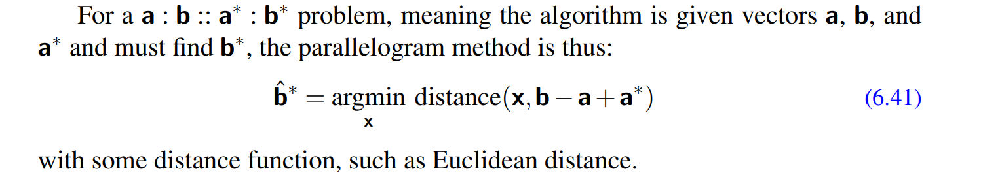
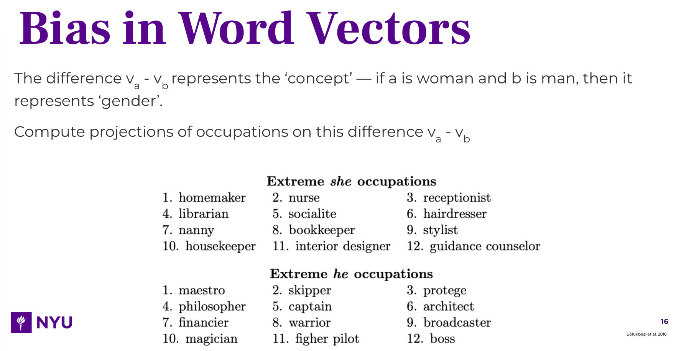
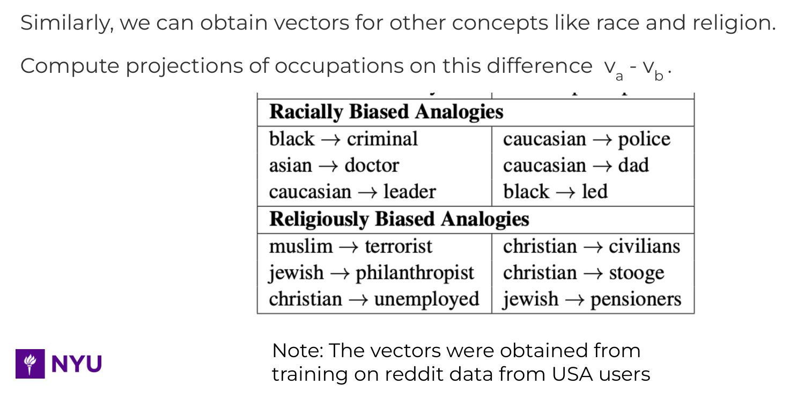

# Word Similarity
## Problem Formulation
> [!def]
> 

> [!bug] Caveats
> **Why not using metric like euclidean distance to measure similarity?**
> 
> Since the vector norm would grow linearly with the dimension of the embedding of the word. For example, using glove 50d to compare two words will generate smaller euclidean distance than glove 100d, 200d even if the two words are the same. 
> 
> In contrast, using cosine similarity would guarantee that the maximum value of the metric is 1, and you can think of the denominator as a normalizing factor that prevent the metric value from growing indefinitely.


## Code Implementation
> [!code]
```python
## Code heavily based on https://github.com/gemaatienza/Deep-Learning-Coursera/blob/master/5.%20Sequence%20Models/Operations%20on%20word%20vectors%20-%20v2.ipynb

import numpy as np
import collections
import os

def read_glove_vecs(glove_file):
    with open(glove_file, 'r') as f:
        words = set()
        word_to_vec_map = {}
        
        for line in f:
            line = line.strip().split()
            curr_word = line[0]
            words.add(curr_word)
            word_to_vec_map[curr_word] = np.array(line[1:], dtype=np.float64)
            
    return words, word_to_vec_map
	
	

words, word_to_vec_map = read_glove_vecs('glove.6B.50d.txt')

# words -- set of words in the vocabulary.
# word_to_vec_map -- dictionary mapping words to their respective vectors.


# Define cosine similarity function

def cosine_similarity(u, v):
    """
    Cosine similarity reflects the degree of similariy between u and v
        
    Arguments:
        u -- a word vector of shape (n,)          
        v -- a word vector of shape (n,)

    Returns:
        cosine_similarity -- the cosine similarity between u and v defined by the formula above.
    """
    
    distance = 0.0
    
    # Compute the dot product between u and v
    dot = np.dot(u,v)
    # Compute the L2 norm of u
    norm_u = np.linalg.norm(u)
    
    # Compute the L2 norm of v
    norm_v = np.linalg.norm(v)
    # Compute the cosine similarity defined by formula
    cosine_similarity = dot/(norm_u*norm_v)
    
    return cosine_similarity
```
> [!test]
```python
# Are relation words more similar to each other?
father = word_to_vec_map["father"]
mother = word_to_vec_map["mother"]
brother = word_to_vec_map["brother"]
ball = word_to_vec_map["ball"]

print("cosine_similarity(mother, father) = ", cosine_similarity(father, mother))
print("cosine_similarity(mother, brother) = ", cosine_similarity(father, brother))
print("cosine_similarity(mother, ball) = ", cosine_similarity(father, ball))


# Are countries more similar to each other?
france = word_to_vec_map["france"]
italy = word_to_vec_map["italy"]
japan = word_to_vec_map["japan"]
canada = word_to_vec_map["canada"]

print("cosine_similarity(france, italy) = ", cosine_similarity(france, italy))
print("cosine_similarity(france, canada) = ", cosine_similarity(france, canada))
print("cosine_similarity(france, japan) = ", cosine_similarity(france, japan))
print("cosine_similarity(france, ball) = ", cosine_similarity(france, ball))
```


# Word Analogy
## Problem Formulation
> [!def]
> 本质就是`A is to B as C is to what?`, 用符号表示就是`apple:tree::grape:?`(表示`apple is to tree as grape is to ?`, 一种答案就是`vine`)。
> 
> 用最优化公式表示就是$argmin_{x}distance(b-a,x-a^*)$:
> 
> 


## Code Implementation
> [!code]
> Word Analogy Task -- we will first write the core function which returns the best answer. We will do this iterating over all words in the vocabulary, and computing the similarity of the difference (a - b, c - d).
```python
## Word Analogy

# Function to find the best word which fits the analogy

def complete_analogy(word_a, word_b, word_c, word_to_vec_map):
    """
    Performs the word analogy task as explained above: a is to b as c is to ____. 
    
    Arguments:
    word_a -- a word, string
    word_b -- a word, string
    word_c -- a word, string
    word_to_vec_map -- dictionary that maps words to their corresponding vectors. 
    
    Returns:
    best_word --  the word such that v_b - v_a is close to v_best_word - v_c, as measured by cosine similarity
    """
    
    # convert words to lower case
    word_a, word_b, word_c = word_a.lower(), word_b.lower(), word_c.lower()
    
    # Get the word embeddings v_a, v_b and v_c (≈1-3 lines)
    e_a = word_to_vec_map.get(word_a)
    e_b = word_to_vec_map.get(word_b)
    e_c = word_to_vec_map.get(word_c)
    # e_a, e_b, e_c = word_to_vec_map[word_a], word_to_vec_map[word_b], word_to_vec_map[word_c]
    
    words = word_to_vec_map.keys()
    max_cosine_sim = -100              # Initialize max_cosine_sim to a large negative number
    best_word = None                   # Initialize best_word with None, it will help keep track of the word to output

    # loop over the whole word vector set
    for w in words:        
        # to avoid best_word being one of the input words, pass on them.
        if w in [word_a, word_b, word_c] :
            continue
        
        # Compute cosine similarity between the vector (e_b - e_a) and the vector ((w's vector representation) - e_c)  (≈1 line)
        cosine_sim = cosine_similarity(np.subtract(e_b,e_a), np.subtract(word_to_vec_map.get(w),e_c))
        
        # If the cosine_sim is more than the max_cosine_sim seen so far,
            # then: set the new max_cosine_sim to the current cosine_sim and the best_word to the current word (≈3 lines)
        if cosine_sim > max_cosine_sim:
            max_cosine_sim = cosine_sim
            best_word = w
        
    return best_word
```
> [!test]
```python
# May take 1-2 minutes to run

triads_to_try = [('italy', 'italian', 'spain'), ('india', 'delhi', 'japan'),
                 ('man', 'woman', 'boy'), ('small', 'smaller', 'large'),
                 ('small', 'smaller', 'big')]
for triad in triads_to_try:
    print ('{} -> {} :: {} -> {}'.format( *triad, complete_analogy(*triad,word_to_vec_map)))
"""
	italy -> italian :: spain -> spanish
	india -> delhi :: japan -> tokyo
	man -> woman :: boy -> girl
	small -> smaller :: large -> larger
	small -> smaller :: big -> competitors
"""
```


# Bias in Word Vectors
## Definition
> [!def]
> 
> For example:
> - `black - criminal` represents race
> - `muslim - terrorist` represents relogion


## Debias Word Vectors
> [!def]
> 
```python
### Debiasing word vectors

# 1. Bias in Word Vectors --- we will start off by identifying the direction corresponding to a particular concept (e.g. gender), and then compute similarity of common occupations with this concept. Note that a positive value indicates similarity with 'woman' more than 'man', and a negative value indicates the other way around.

# Compute the vector for gender
g = word_to_vec_map['woman'] - word_to_vec_map['man']

# Conider the cosine similarity of different words with g

print ('List of names and their similarities with constructed vector:')

# Word list
name_list = ['homemaker', 'nanny', 'nurse', 'receptionist', 'magician', 'architect', 'boss', 'scientist']

for w in name_list:
    print (w, cosine_similarity(word_to_vec_map[w], g))
"""
List of names and their similarities with constructed vector:
homemaker 0.4272061180602086
nanny 0.28719293921749317
nurse 0.38030879680687524
receptionist 0.3307794175059374
magician -0.2385883242639807
architect -0.18345345423169837
boss -0.4439767394197472
scientist -0.05193035281313462
"""

# 2. To debias word projects, we will define a function which projects the vectors onto the concept and then subtracts it from the original vector. 
def neutralize(word, g, word_to_vec_map):
    """
    Removes the bias of "word" by projecting it on the space orthogonal to the bias axis. 
    This function ensures that gender neutral words are zero in the gender subspace.
    
    Arguments:
        word -- string indicating the word to debias
        g -- numpy-array of shape (50,), corresponding to the bias axis (such as gender)
        word_to_vec_map -- dictionary mapping words to their corresponding vectors.
    
    Returns:
        e_debiased -- neutralized word vector representation of the input "word"
    """
    
    # Select word vector representation of "word". Use word_to_vec_map. (≈ 1 line)
    e = word_to_vec_map[word]
    
    # Compute e_biascomponent using the formula give above. (≈ 1 line)
    e_biascomponent = (np.dot(e,g)/np.linalg.norm(g)**2)*g
 
    # Neutralize e by substracting e_biascomponent from it 
    # e_debiased should be equal to its orthogonal projection. (≈ 1 line)
    e_debiased = e-e_biascomponent
    
    return e_debiased


# 3. To evaluate our debiasing method, we will compare the similarity of the original and debiased vectors with the vectors corresponding to our concept (e.g. gender).
e = "receptionist"
print("cosine similarity between " + e + " and g, before neutralizing: ", cosine_similarity(word_to_vec_map["receptionist"], g))

e_debiased = neutralize("receptionist", g, word_to_vec_map)
print("cosine similarity between " + e + " and g, after neutralizing: ", cosine_similarity(e_debiased, g))

e = "boss"
print("cosine similarity between " + e + " and g, before neutralizing: ", cosine_similarity(word_to_vec_map["boss"], g))

e_debiased = neutralize("boss", g, word_to_vec_map)
print("cosine similarity between " + e + " and g, after neutralizing: ", cosine_similarity(e_debiased, g))

"""
cosine similarity between receptionist and g, before neutralizing:  0.3307794175059374
cosine similarity between receptionist and g, after neutralizing:  -2.099120994400013e-17
cosine similarity between boss and g, before neutralizing:  -0.4439767394197472
cosine similarity between boss and g, after neutralizing:  -8.569698399890252e-17
"""
```


## Debiasing Methods - INLP
> [!important]
> 

