[03_Sequence_Containers.zip](https://www.yuque.com/attachments/yuque/0/2023/zip/12393765/1675431969441-5bf9d841-99ec-4987-94a1-4aa74baa7581.zip)
> 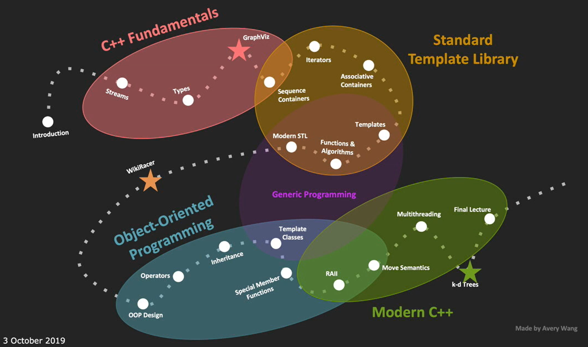

# 1 Overview of STL
> 

# 2 Sequence Containers
> 

## std::vector
> 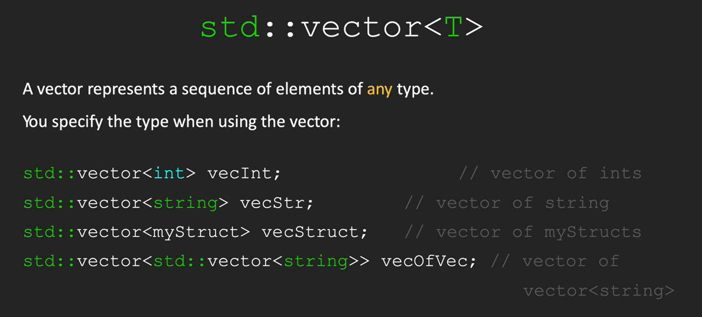
> `add()/push_back()`和`get(i)/at(i)`方法是`Stanford Library`和`STL`的不同之处。
> 

### Bound Check
> 

### Insertion Speed
> 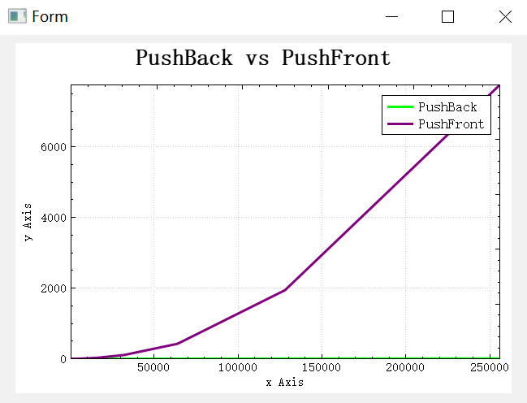

## std::deque
> 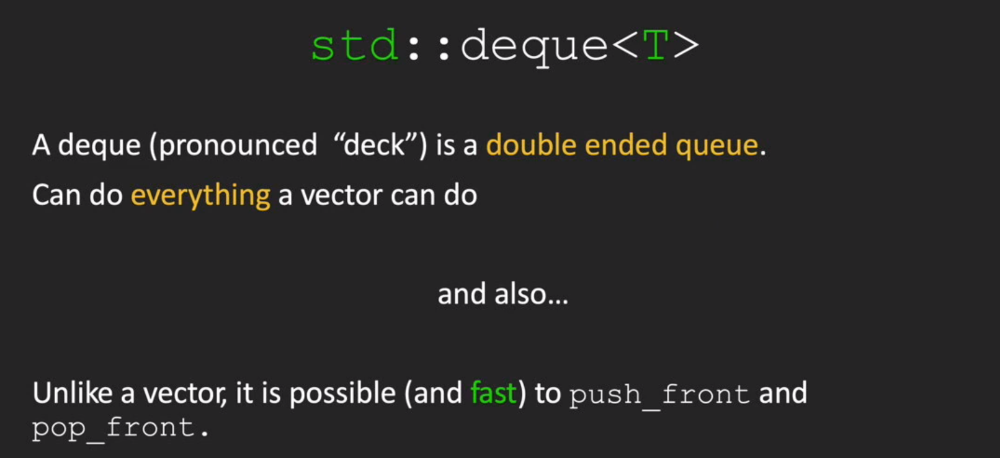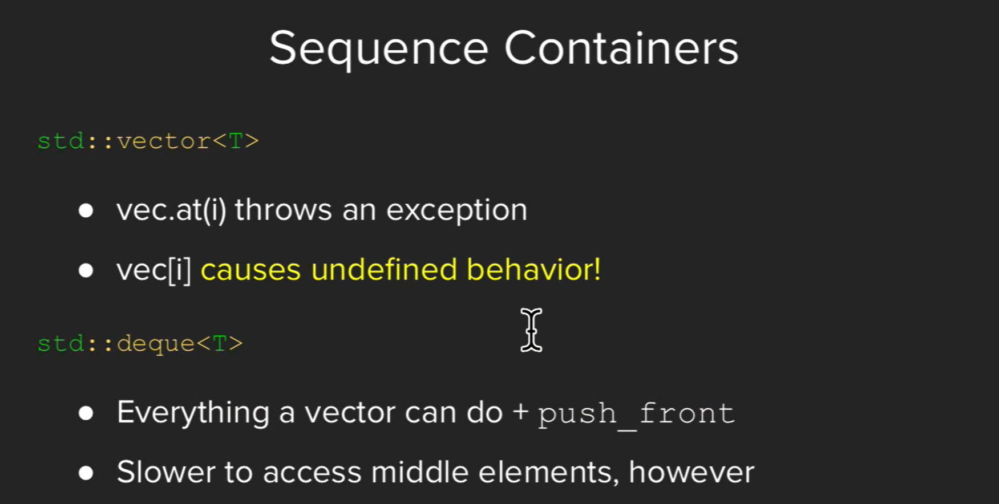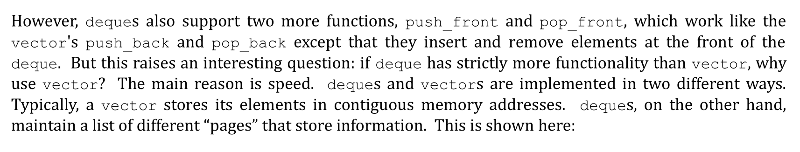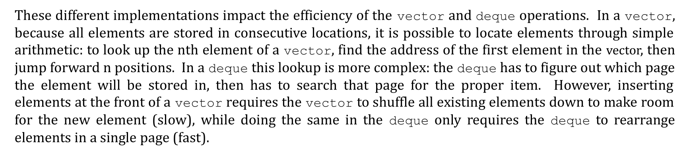

**std::vector vs std::deque**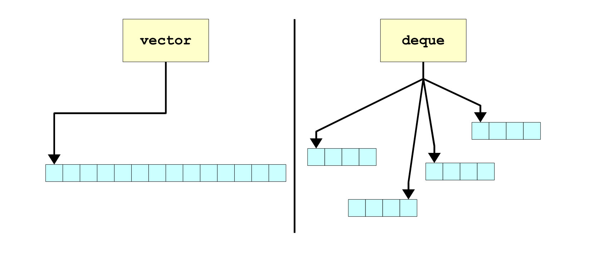

### Insertion Speed
> 

## Random access
> 

# 3 Container Adaptors
## Why Stack and Queue are adaptors?
> 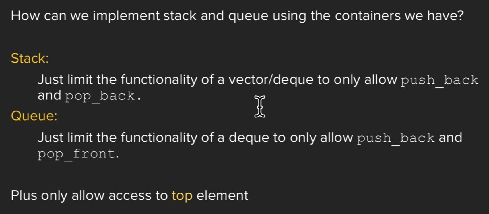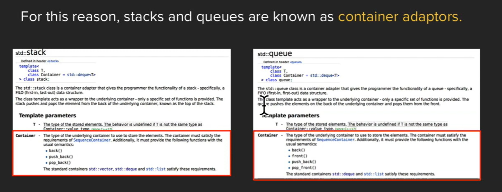

## Why not just use a vector/deque?
> 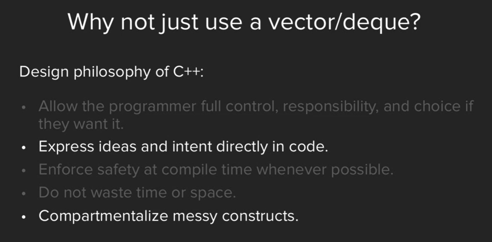

