[04_Associative_Containers.zip](https://www.yuque.com/attachments/yuque/0/2023/zip/12393765/1675431916818-df9819bd-2871-4e6d-be8d-6965b6f3424e.zip)
# 1 Basic Concepts
## Definition
> 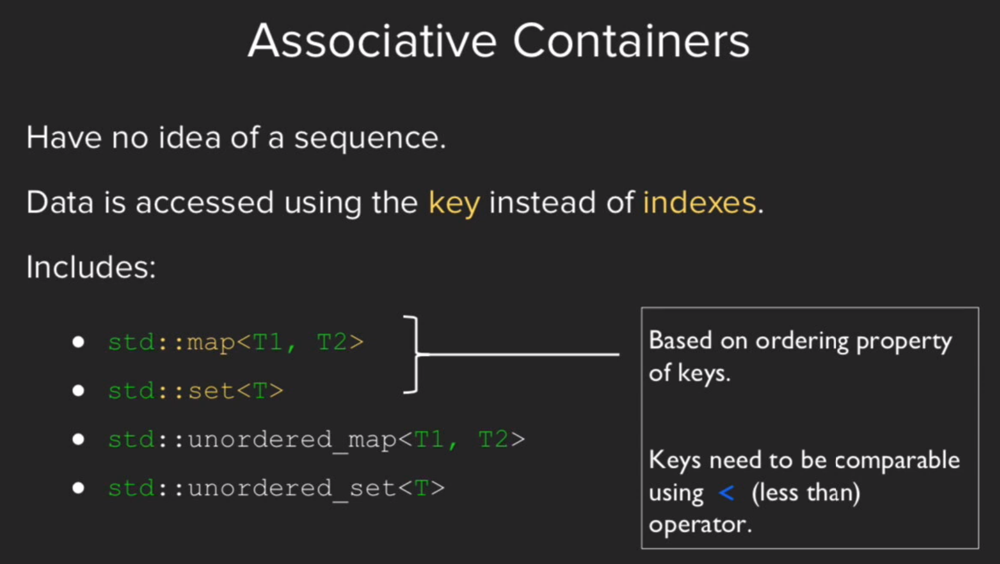


## When to Use Each?
> 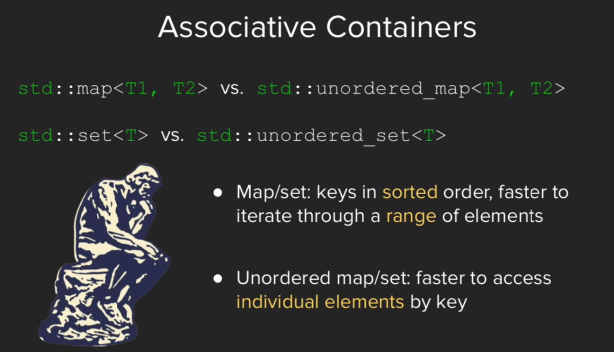


## std::map
> 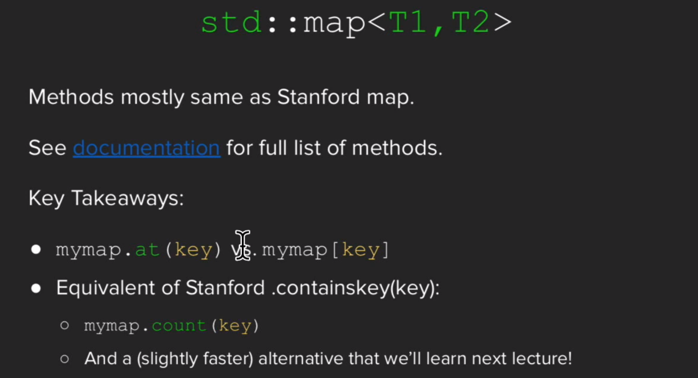

```cpp
#include <iostream>
#include <string>
#include <map>
#include <sstream>


using std::string;  using std::cin;
using std::cout;    using std::endl;

// GetLine asks the user to type in a response at the command line. It returns
// the user input as a string.
string GetLine() {
    string response;
    std::getline(cin, response);
    return response;
}

int main() {
    // We will use a map to count the appearances of words, as well as how many
    // times we encounter them.
    std::map<string, int> frequencyMap;

    cout << "Enter words." << endl;
    while (true) {
        cout << "> ";
        string response = GetLine();
        if (response.empty()) break;
        std::istringstream stream(response);
        string word;
        while(stream >> word) {
            // This single line is doing a ton of work. The square bracket notation for
            // accessing values in maps will return a reference to the value associated
            // with the specified key. We can then modify it with ++ directly.
            //
            // However, if response is not already a key in the map, the square brackets
            // do a bit of extra work first. They automatically insert a new key-value
            // pair into the map, where the key is response and the value is a
            // reasonable default value -- in the case of integers, 0.
            ++frequencyMap[word];
        }
    }

    cout << "Enter words to look up." << endl;
    while (true) {
        cout << "> ";
        string response = GetLine();
        if (response.empty()) break;

        // Returns the number of keys equal to response.
        // In anything but a multimap/multiset, this is
        // either going to be 1 or 0.
        if (frequencyMap.count(response)) {
            cout << frequencyMap[response] << " entries found." << endl;
        } else {
            cout << "None." << endl;
        }
    }
    return 0;
}
```
> `map.get(key)`会在`map`中查找是否有`key`的存在，如果没有就会报错
> `map[key]`会在`map`中查找是否有`key`的存在，如果没有就会自动插入`Autoinsert`
> `map.count(key)`, 计算`map`中的`key`出现了几次，对于`single map`中，只会返回`0 or 1`, 但是在`multi-map`或者`milti-set`中可能会返回多次。

:::success

:::

## std::set
> 


## std::pair
> 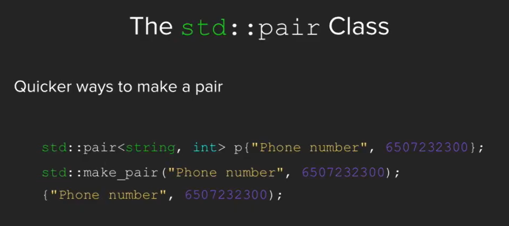


## std::multimap
> 
> 没有`[]/get(key)`是因为一个`key`可以对应多个`value`，所以返回值不唯一，这在`C++`中不能实现，`python`中因为函数的返回值可以有多个，所以似乎可以实现。


# 2 Iterators
## Basic Usage&Example
> 

```cpp
// ========================================================================

#include <iostream>
#include <set>

using std::cout;    using std::endl;
using std::set;

int main() {
    // We first populate this set of integers with the numbers from 0 to 9,
    // inclusive.
    set<int> container;
    for (int i = 0; i < 10; ++i)
        container.insert(i);

    // Now, we iterate through the container and print each element one at a time.
    // We do this using an iterator object which starts at the container's
    // beginning. We keep looping as long as we haven't hit the end of the
    // container yet. Inside the loop, we ask for the current value (*itr), and
    // then instruct the iterator to move to the next location (++itr).
    set<int>::iterator itr = container.begin();
    while (itr != container.end()) {
        cout << *itr << ' ';
        ++itr;
    }
    cout << endl;

    // alternatively:
    set<int>::iterator itr2;
    for(itr2 = container.begin(); itr2 != container.end(); ++itr2) {
        cout << *itr2 << ' ';
    }

    cout << endl;

    return 0;
}
```

## Advantage of Iterator
> 


## More Example
> 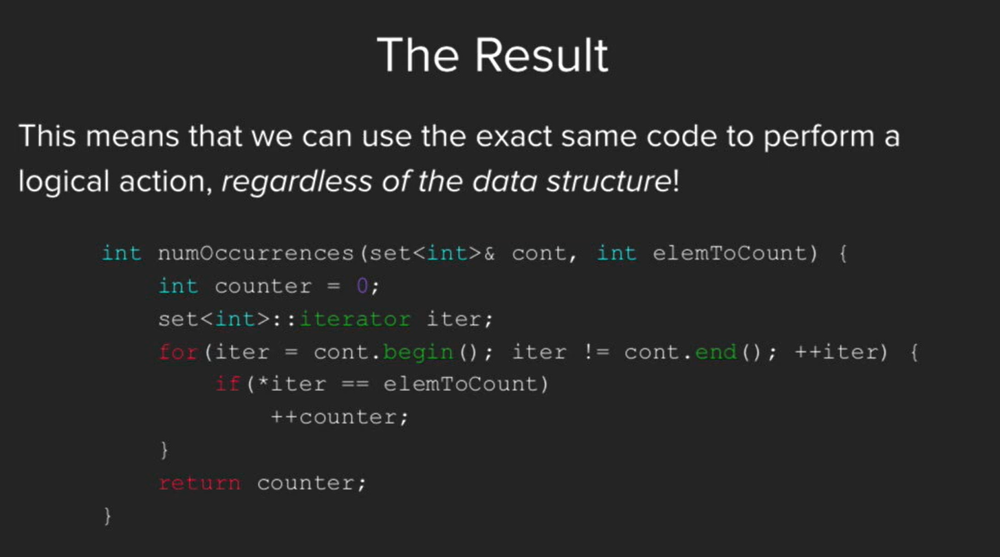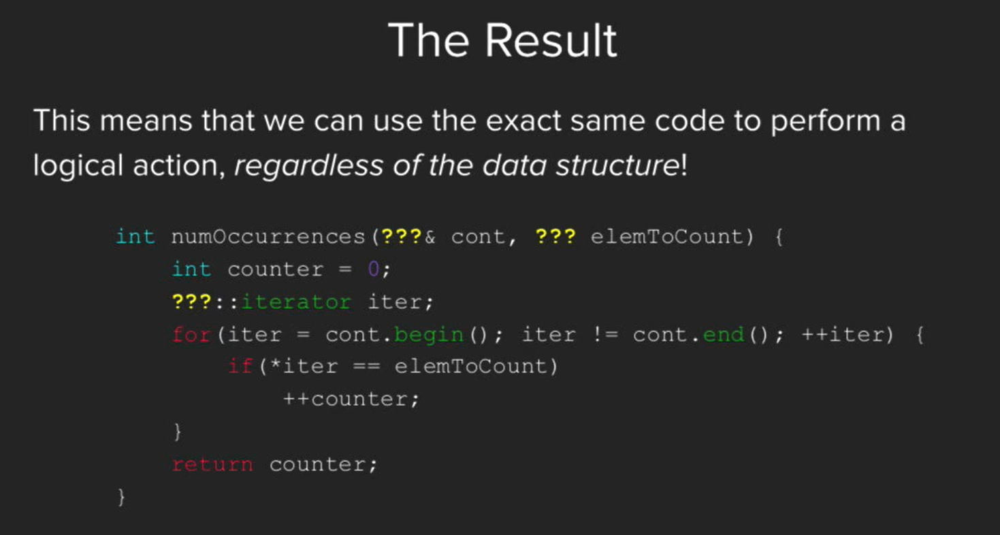


## Further Iterator Usages⭐⭐⭐⭐⭐
```cpp
#include <iostream>
#include <string>
#include <sstream>
#include <vector>
#include <set>
#include <algorithm>

using std::string;  using std::cin;
using std::cout;    using std::endl;
using std::vector;     using std::stringstream;
using std::set;


int main() {
    vector<int> vec{3,1,4,1,5,9,2,6,5,3};

    // 1. we can use iterators in algorithms like sort to sort a vecotr
    std::sort(vec.begin(), vec.end());


    // 2. we can also use the find algorithm to look for an element
    // in a collection and return an iterator to it
    // find() is faster than calling .count() to find an element in a collection since
    // count() is implemented using find().
    vector<int>::iterator it = std::find(vec.begin(), vec.end(), 5);
    if(it != vec.end()) {
       cout << "Found elem " << *it << endl;
    } else {
       cout << "Element not found " << endl;
    }
    // *Important: the vec.end() points to the index right after the last element 
    // of the container.


    set<int> mySet{4,1,3,5,55,5, 9, 22, 19, 28};

    // 3. we can iterate through a range of elements in a sorted collection
    // lower_bound: returns an iterator to the first element not less than the given key
	// upper_bound: returns an iterator to the first element not greater than the given key
    set<int>::iterator iter = mySet.lower_bound(7);
    set<int>::iterator end = mySet.upper_bound(28);

    while(iter != end) {
        cout << *iter << endl; // 9 19 22 28
        ++iter;
    }

    return 0;
}

```

### find&range
> **Important Notes:**
> 1. The `???.end()` points to the index right after the last element of the container.
> 2. We use `find(???.begin(), ???.end())`more often to find an element in an arbitrary container and perfer not to use `count(elem)`since `find()`is faster than `count()`and `count()`is implemented upon `find()`
> 
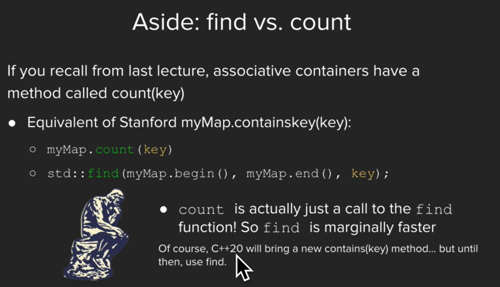
> 3. **We can iterate through a range of elements in a sorted collection:**
> 


### range for loop
> 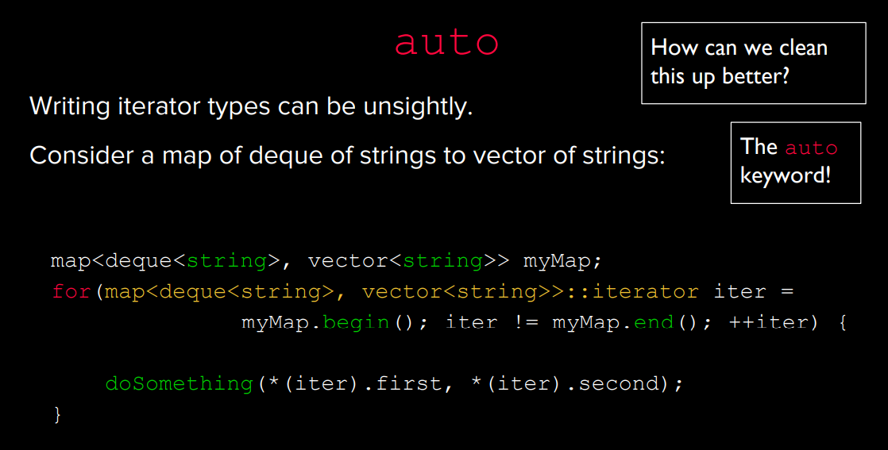


## Notes on auto
> 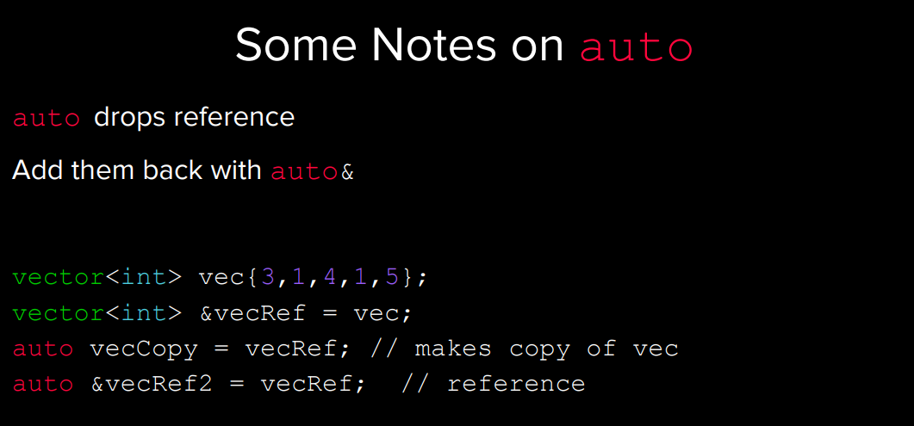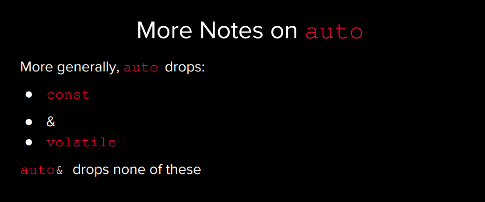


## Notes on ++iter
> 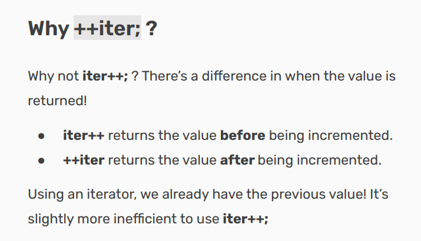


# 3 Iterator Types⭐⭐⭐⭐⭐
## Overview
> 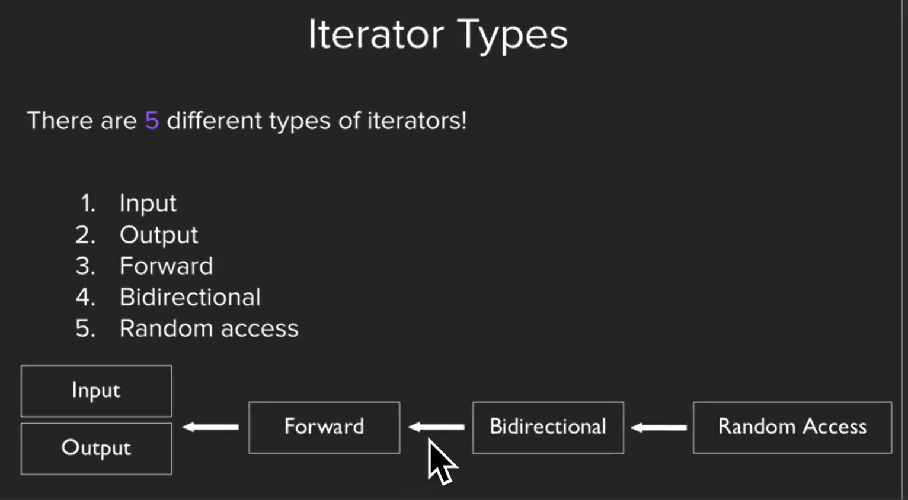
> 上面的链条可以理解为继承链，表明链条右侧的`Iterator`比左侧的功能更强大。
> 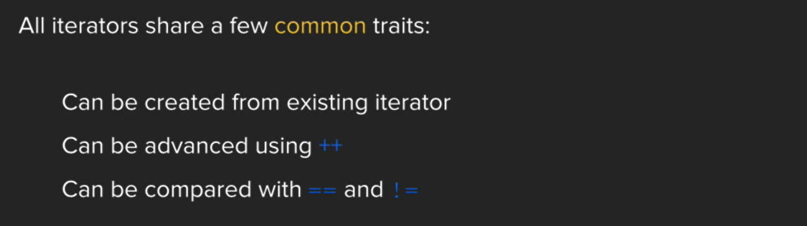

**Example**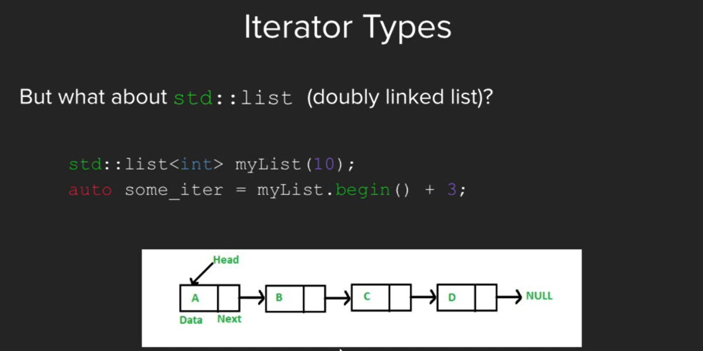


## Input Iterators
> 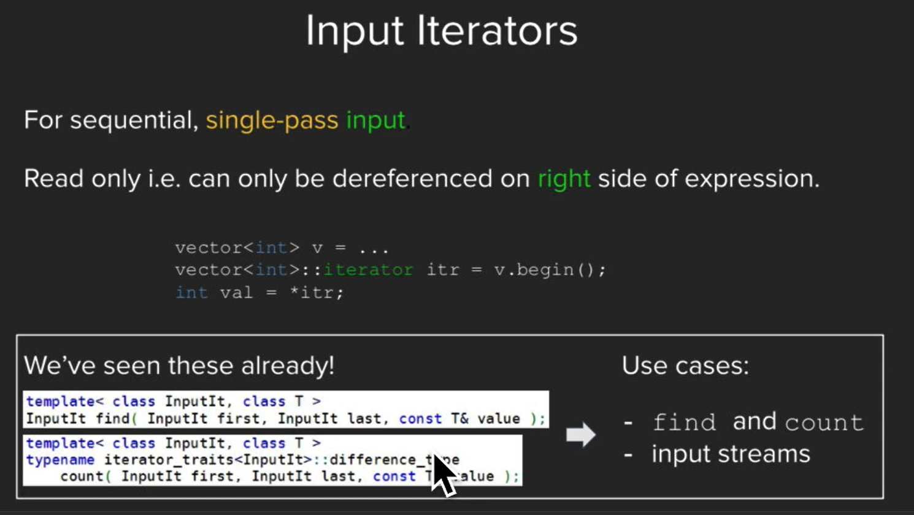
> 只能一次移动一个`index`, `can only increment by one`


## Output Iterators
> 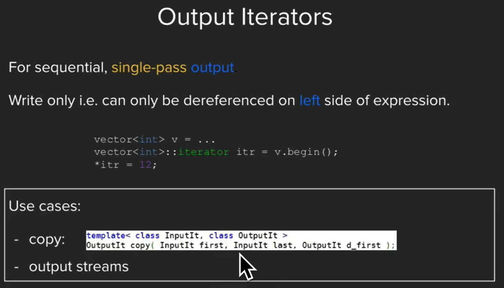


## Forward Iterators
> 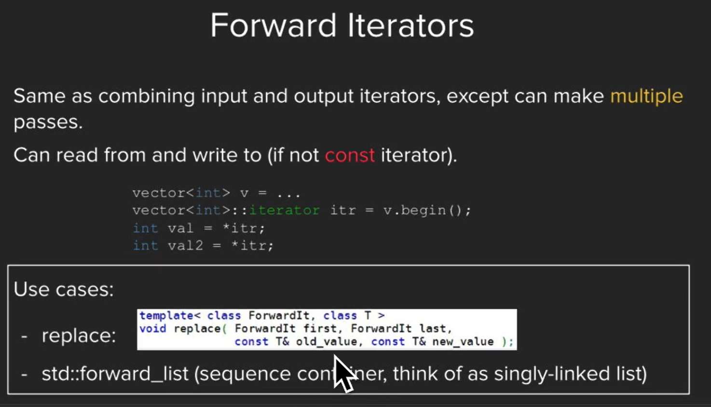


## Bidrectional Iterators
> 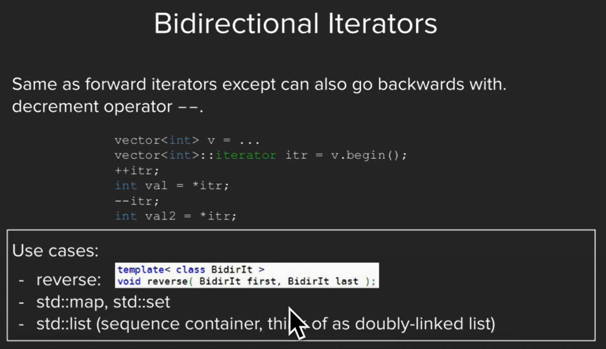


## Random Access Iterators
> 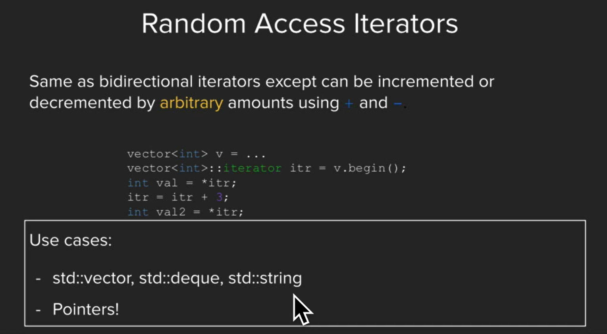


## Summary
> 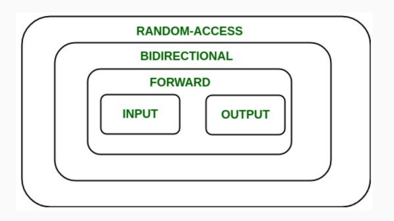


# 4 Pointers
[lecture6_iterators_and_pointers_w23.pdf](https://www.yuque.com/attachments/yuque/0/2023/pdf/12393765/1675583917682-8d5d4606-3c86-43ff-9a44-952fcb7e1d6e.pdf)

## Memory
> 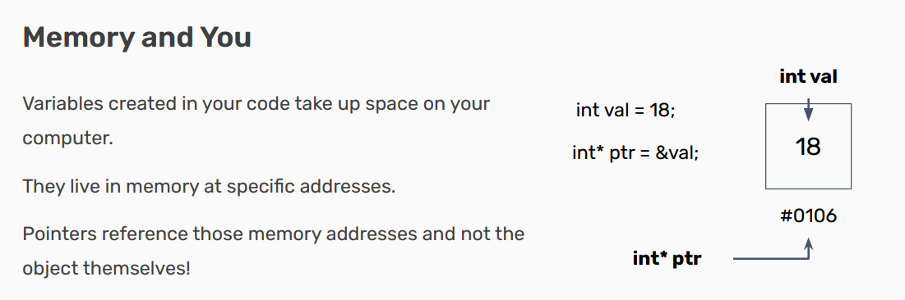


## Dereferencing
> 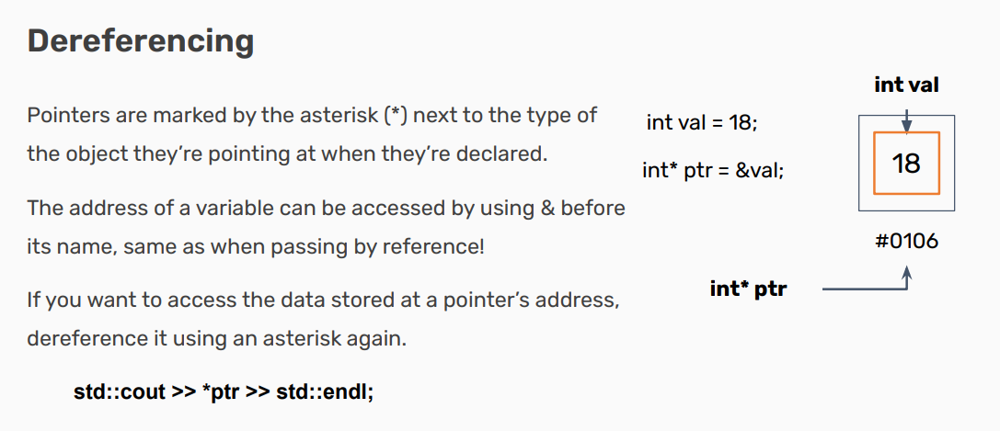


## Object Instance
> 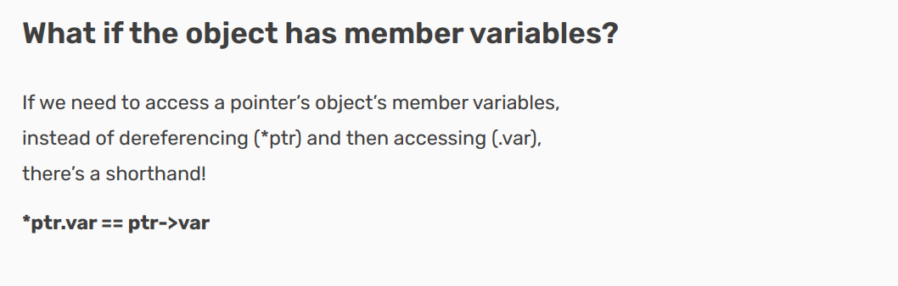


## Summary
> 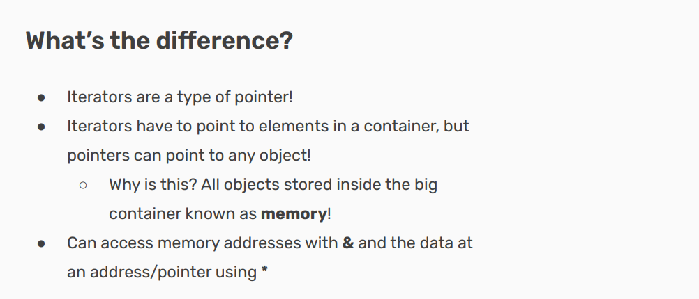


# 5 Structs Recap
## Initialization of Structs
> 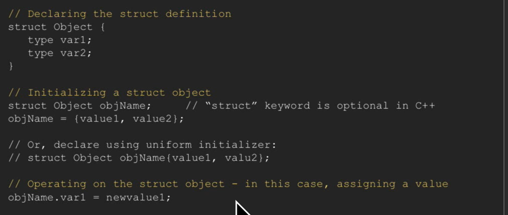
> 可以省略`struct keyword`


## General Struct Syntax
> 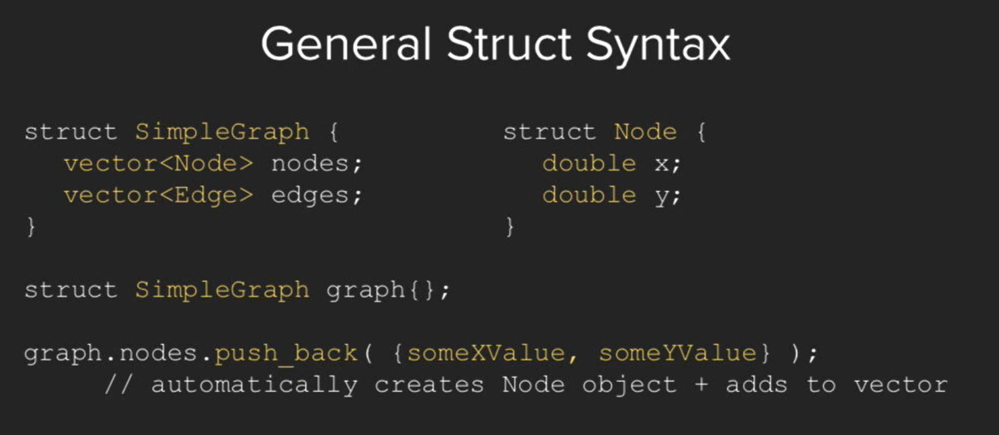

