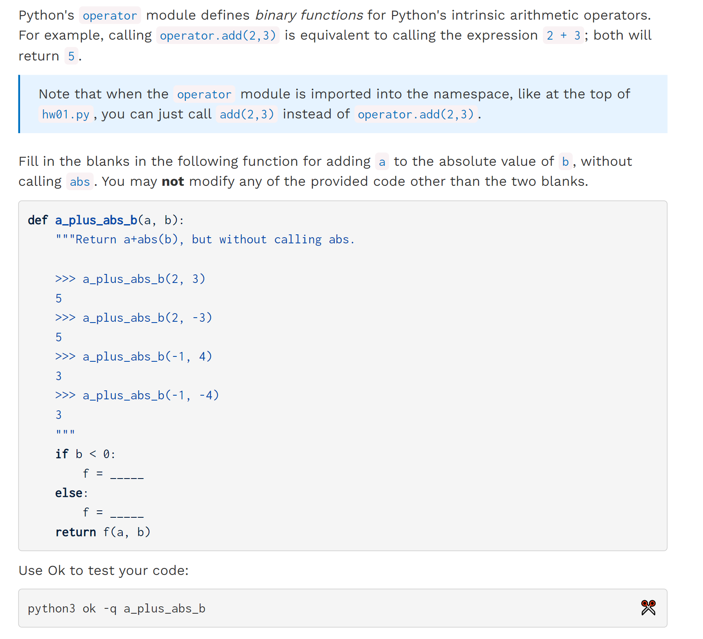
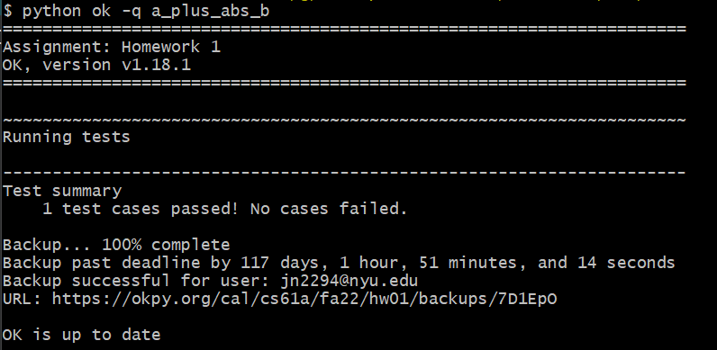
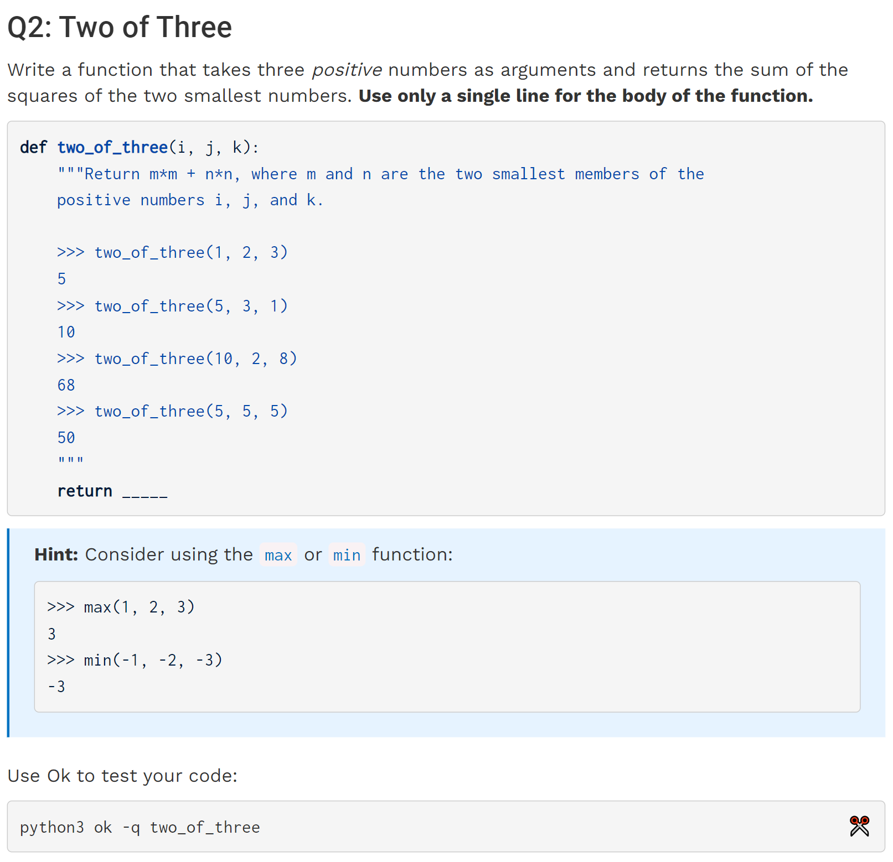
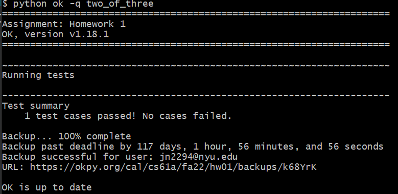
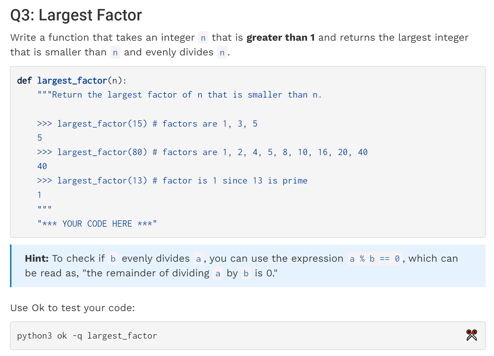
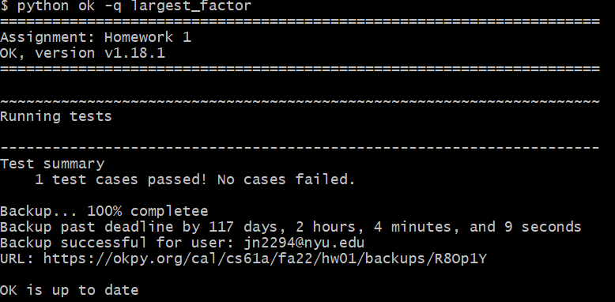
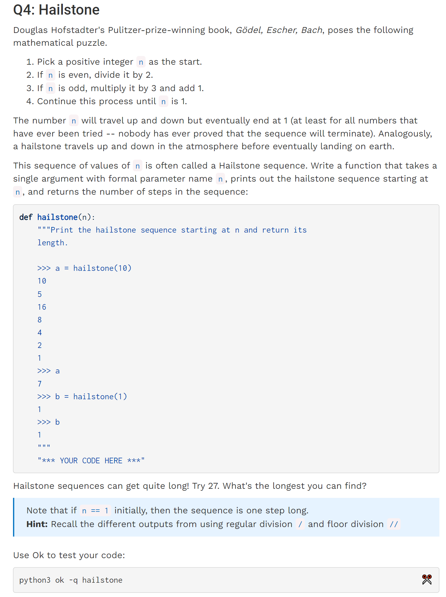

[hw01.zip](https://www.yuque.com/attachments/yuque/0/2022/zip/12393765/1672199091291-a28a84d6-fec9-4567-b14d-fa2adef63794.zip)

# Q1 A Plus Abs B
:::info

:::
```java
def a_plus_abs_b(a, b):
    """Return a+abs(b), but without calling abs.

    >>> a_plus_abs_b(2, 3)
    5
    >>> a_plus_abs_b(2, -3)
    5
    >>> a_plus_abs_b(-1, 4)
    3
    >>> a_plus_abs_b(-1, -4)
    3
    """
    if b < 0:
        f = sub
    else:
        f = add
    return f(a, b)

```
**Output**
# 
# Q2 Two of Three
:::info

:::
```java
def two_of_three(i, j, k):
    """
    Return m*m + n*n, where m and n are the two smallest members of the
    positive numbers i, j, and k.

    >>> two_of_three(1, 2, 3)
    5
    >>> two_of_three(5, 3, 1)
    10
    >>> two_of_three(10, 2, 8)
    68
    >>> two_of_three(5, 5, 5)
    50
    """
    res =  i**2+j**2+k**2 - max(i,j,k)**2
    return res

```
**Output**

# Q3 Largest Factor
:::info

:::
```java
def largest_factor(n):
    """
    Return the largest factor of n that is smaller than n.

    >>> largest_factor(15) # factors are 1, 3, 5
    5
    >>> largest_factor(80) # factors are 1, 2, 4, 5, 8, 10, 16, 20, 40
    40
    >>> largest_factor(13) # factor is 1 since 13 is prime
    1
    """
    "*** YOUR CODE HERE ***"
    for i in range(n//2,0,-1):
        if n % i == 0:
            return i

```
**Output**

# Q4 Hailstone
:::info

:::
```java
def hailstone(n):
    """
    Print the hailstone sequence starting at n and return its
    length.

    >>> a = hailstone(10)
    10
    5
    16
    8
    4
    2
    1
    >>> a
    7
    >>> b = hailstone(1)
    1
    >>> b
    1
    """
    "*** YOUR CODE HERE ***"
    step = 1
    while n != 1:
        print(n)
        if n % 2 == 0:
            n //= 2
        else:
            n = 3*n + 1
        step += 1
    print(1)
    return step
```
**Output - 10**
