[released_assets_slides_02-Functions_full.pdf](https://www.yuque.com/attachments/yuque/0/2022/pdf/12393765/1672219108534-1fb97166-08f3-42f7-95fd-28b07706d193.pdf)
:::info
Ch 1.1~1.2
:::

# Expression
## Definition
:::info
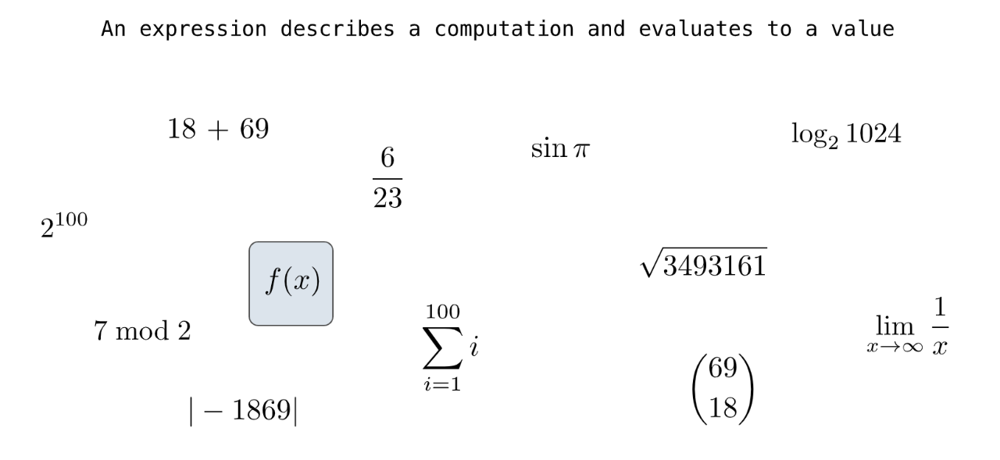
:::

## Call Expression
:::info
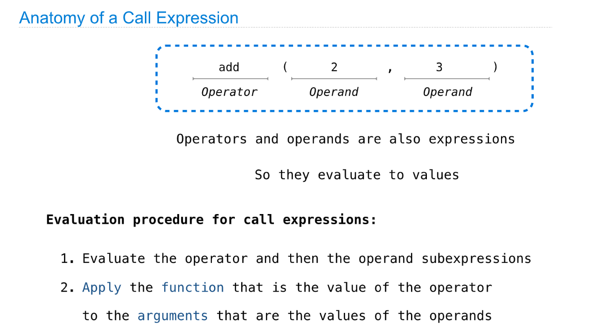
只要记住先`evaluate operator`, 再从左到右依次`evaluate operand`即可
:::
```python
# Call expressions
max(2, 3)
min(1, -2, 3, -4, 5)
pow(100, 2)
pow(2, 100)
```

## Expression Tree
:::info
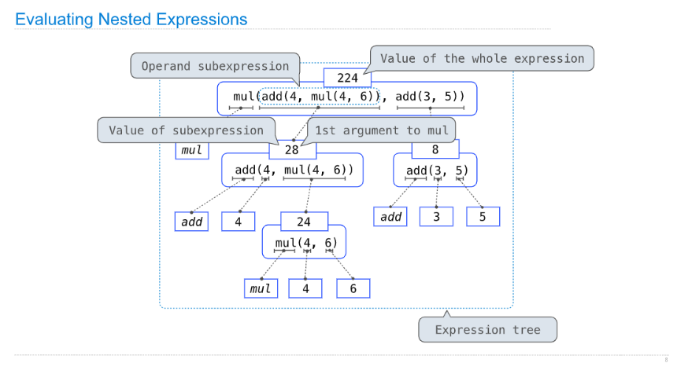
从外往里一层一层`evaluate`未知的`Operator`，然后从左到右依次`evaluate`未知的`Operator`
:::

## Type of Expressions
:::info
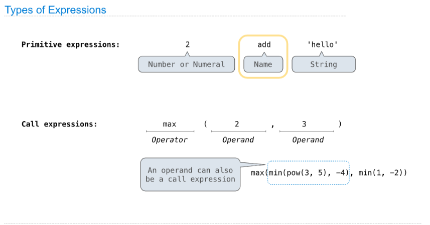
:::


## Evaluating Expression
:::info
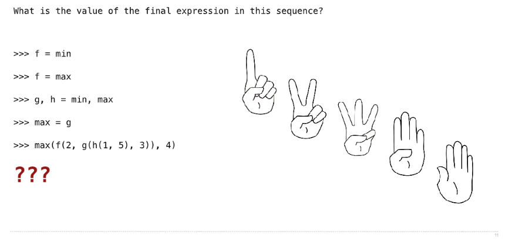
**Answer:**
`min(max(2, min(max(1, 5),3)), 4) =>min(max(2, 5), 3) => min(5,3) => 3`
:::

# Name and Environment
## Module Import
```python
# Imports
from math import pi
pi * 71 / 223
from math import sin
sin(pi/2)
```

## Name
:::info
**Name:** 简单理解为就是变量名
**NameScope:** 变量空间
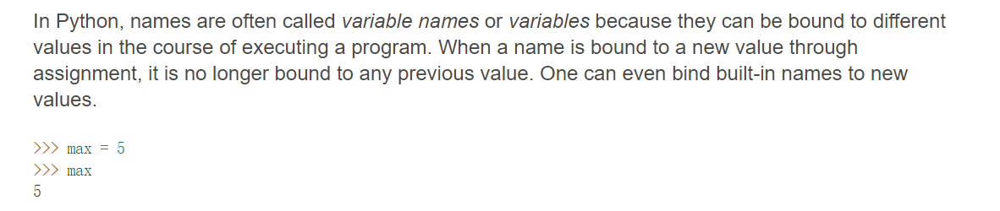
:::


## Environment Diagrams
:::info
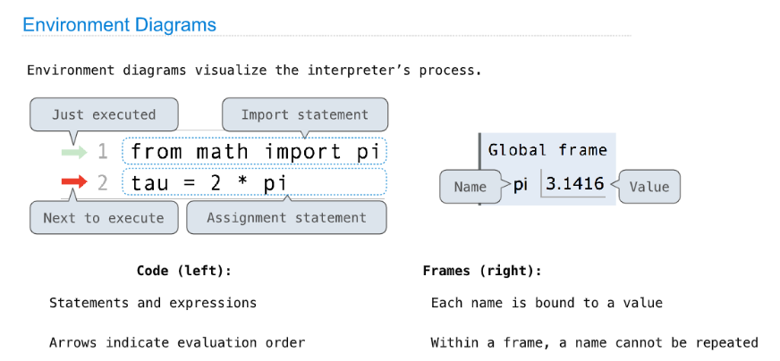
:::


## Assignment Statements
:::info
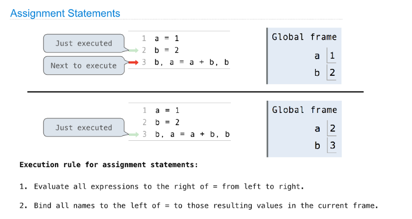
:::
```python
# Assignment
radius = 10
2 * radius

# Multiple Assignment
area, circ = pi * radius * radius, 2 * pi * radius
radius = 20

# Name conflicts
def square(square):
    return mul(square, square)
square(4)

```
Evaluation Expression Environment Diagram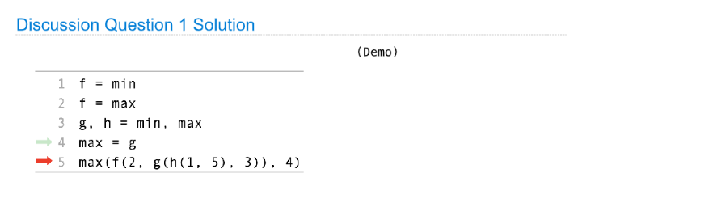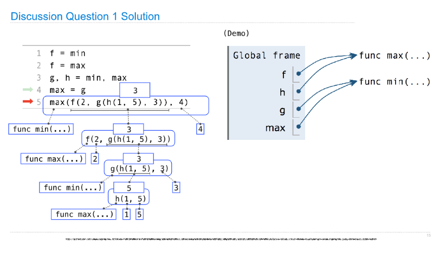


## Pure& Non-pure Function
### Pure Functions
:::info
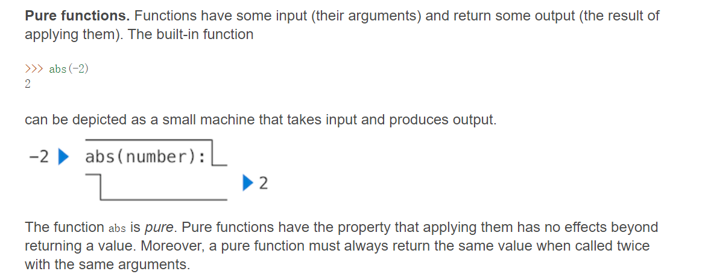
:::

### Non-Pure Functions
:::info
就是调用函数之后除了返回值以外还会产生副作用，比如函数体中有`print`。
或者每次调用函数都会返回不同的结果，比如有`random`模块。
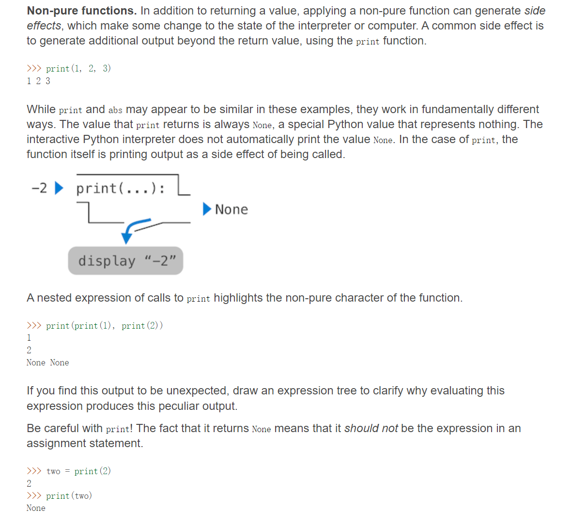
**A side effect is not a value; it's anything that happens as a consequence of calling a function.**
:::
**Nested Expressions with Print**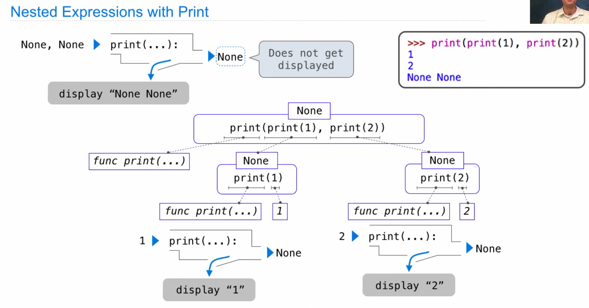


### None
:::info
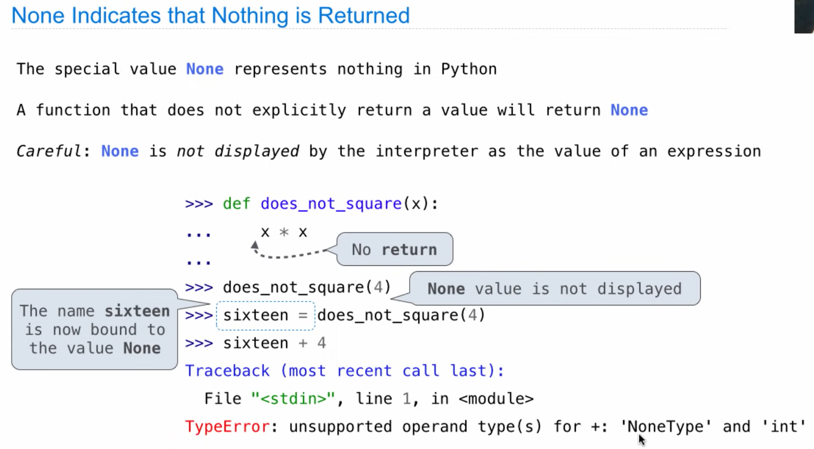
:::

## Defining Functions
:::info
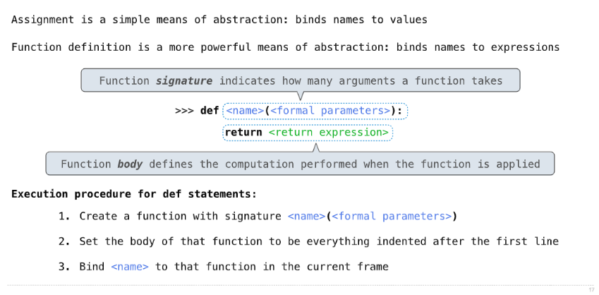
:::
```python
# Function values
max
max(3, 4)
f = max
f
f(3, 4)
max = 7
f(3, 4)
f(3, max)
f = 2
# f(3, 4)
__builtins__.max

# User-defined functions
from operator import add, mul

def square(x):
    return mul(x, x)

square(21)
square(add(2, 5))
square(square(3))

def sum_squares(x, y):
    return add(square(x), square(y))
sum_squares(3, 4)
sum_squares(5, 12)

# area function
def area():
    return pi * radius * radius
area()
radius = 20
area()
radius = 10
area()
```


## Calling Functions
:::info
函数在`def`的时候只有`Global Frame`, 但是在`Global Frame`中将`square`绑定到了`func square`的内存空间:
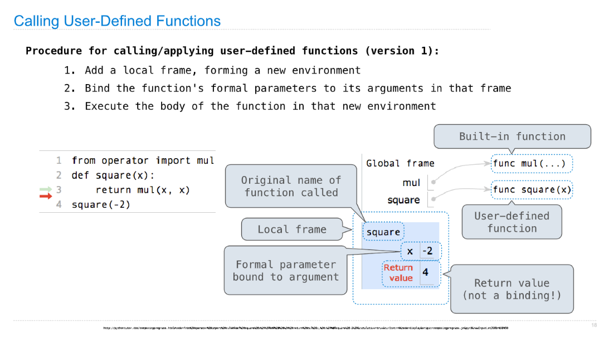
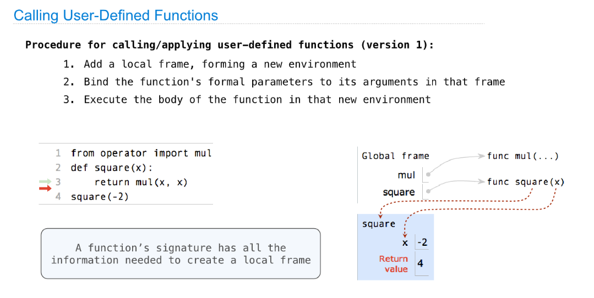
:::

## Looking up Names in Environments
:::info
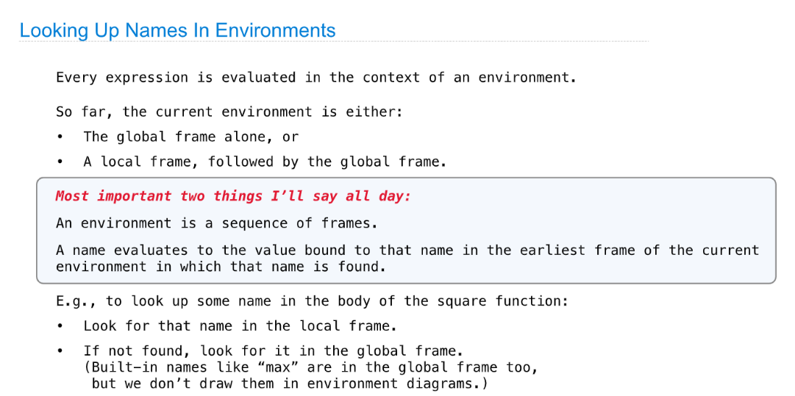
类比作用域链
:::
