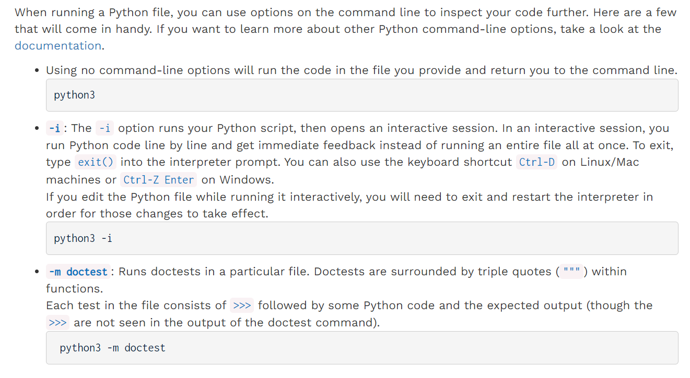

# Activate OK Labs
> **先安装**`**Python 3**`
> **激活步骤:**
> 1. 启动`Windows Powershell/CMD`
> 2. 输入`python ok -q python-basics -u`
> 3. 作答即可, 然后按提示输入邮箱。


# Problem: Twenty-Twenty
> `Windows`在`PowerShell`中可以输入`start .`打开`Shell`所在的`Working Directory`

```python
def twenty_twenty():
    """Come up with the most creative expression that evaluates to 2020,
    using only numbers and the +, *, and - operators.

    >>> twenty_twenty()
    2020
    """
    return ______

```
```python
def twenty_twenty():
    """Come up with the most creative expression that evaluates to 2020,
    using only numbers and the +, *, and - operators.

    >>> twenty_twenty()
    2020
    """

    res = 2000 + 20
    
    return res

```

# Useful Python Command Line
> 


# Submission
> 1. 定位到`lab00/`
> 2. `python ok --submit`

