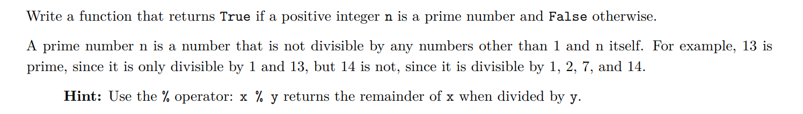
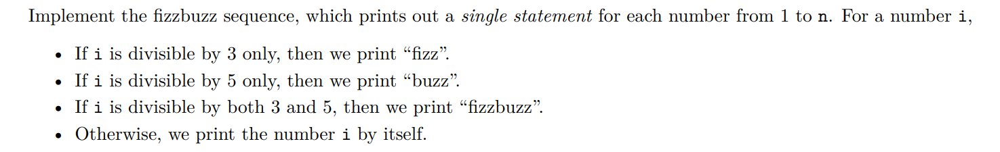
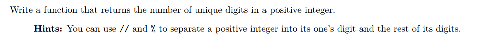
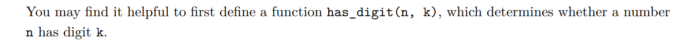
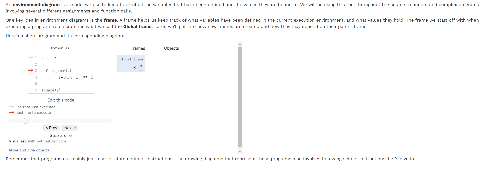
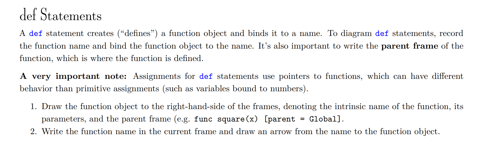
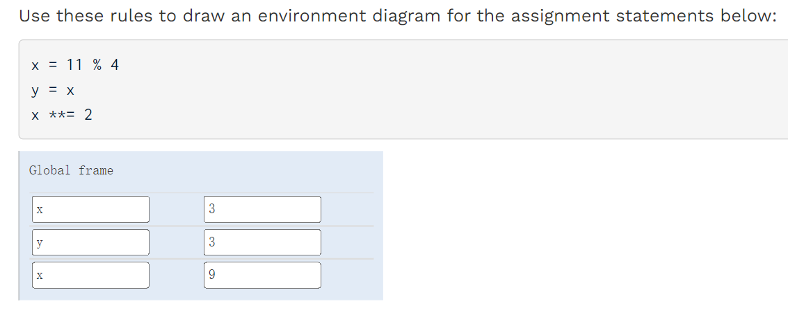
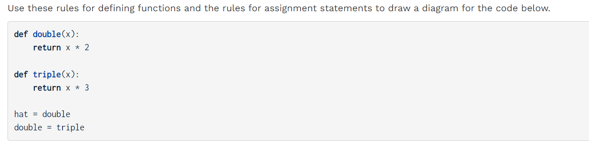
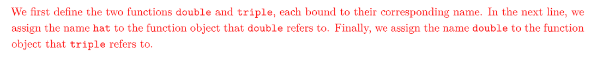
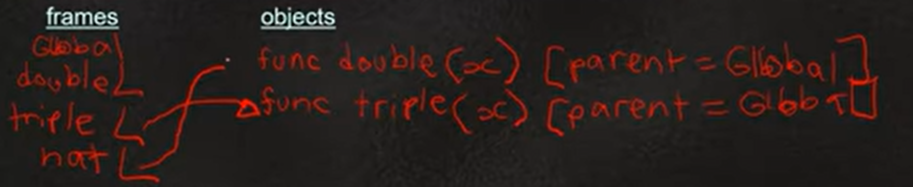

[released_disc_disc01_disc01.pdf](https://www.yuque.com/attachments/yuque/0/2022/pdf/12393765/1672304956584-6ccce691-31b9-4868-bfe8-044d9bde6f2b.pdf)
[released_disc_sol-disc01_disc01.pdf](https://www.yuque.com/attachments/yuque/0/2022/pdf/12393765/1672305027728-307626ed-7f38-4e6f-aaf5-d6128b1f2de2.pdf)

# Control Structures
## Q4: Is Prime
> 

```python
def is_prime(n):
    """
    >>> is_prime(10)
    False
    >>> is_prime(7)
    True
    >>> is_prime(1) # one is not a prime number!!
    False
    """
    "*** YOUR CODE HERE ***"
    if n == 1:
        return False
    k = 2
    while k < n:
        if n % k == 0:
            return False
        k += 1
    return True
```

## Q5: Fizzbuzz
> 

```python
def fizzbuzz(n):
    """
    >>> result = fizzbuzz(16)
    1
    2
    fizz
    4
    buzz
    fizz
    7
    8
    fizz
    buzz
    11
    fizz
    13
    14
    fizzbuzz
    16
    >>> result is None  # No return value
    True
    """
    "*** YOUR CODE HERE ***" 
	i = 1
	while i <= n:
		if i % 3 == 0 and i % 5 == 0:
			print('fizzbuzz')
		elif i % 3 == 0:
			print('fizz')
		elif i % 5 == 0:
			print('buzz')
		else:
			print(i)
		i += 1
```


## Q6: Unique Digits
> 

```python
def unique_digits(n):
    """Return the number of unique digits in positive integer n.

    >>> unique_digits(8675309) # All are unique
    7
    >>> unique_digits(1313131) # 1 and 3
    2
    >>> unique_digits(13173131) # 1, 3, and 7
    3
    >>> unique_digits(10000) # 0 and 1
    2
    >>> unique_digits(101) # 0 and 1
    2
    >>> unique_digits(10) # 0 and 1
    2
    """
    "*** YOUR CODE HERE ***"
	tot = 0
    while n > 0:
        k, n = n % 10, n // 10
        if has_digit(n,k):
            continue
        else:
            tot += 1
    return tot

def has_digit(n, k):
    """Returns whether K is a digit in N.
    >>> has_digit(10, 1)
    True
    >>> has_digit(12, 7)
    False
    """
    "*** YOUR CODE HERE ***"
    while n > 0:
        if n % 10 == k:
            return True
        else:
            n //= 10
    return False
```
```python
# 因为一共就10个数位, 0~9, 所以unique number数量最多是10 
def unique_digits_alt(n):
    unique = 0
    i = 0
    while i < 10:
    	if has_digit(n, i):
    		unique += 1
    	i += 1
    return unique

def has_digit(n, k):
    while n > 0:
        if n % 10 == k:
            return True
        else:
            n //= 10
    return False
```


# Environment Diagrams
## Assignment Statements
> 


## def Statements
> 


## Q7 Assignment Diagram
> 


## Q8 def Diagram
> 
> 

