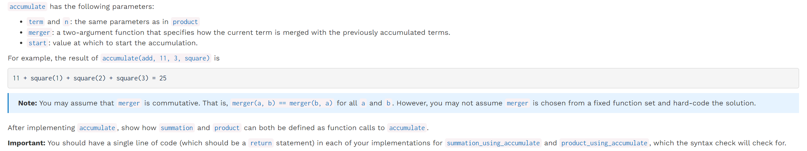
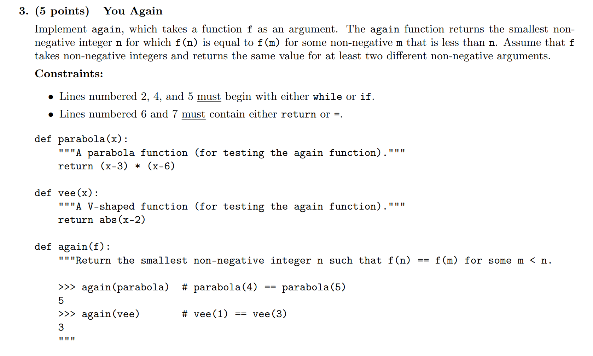
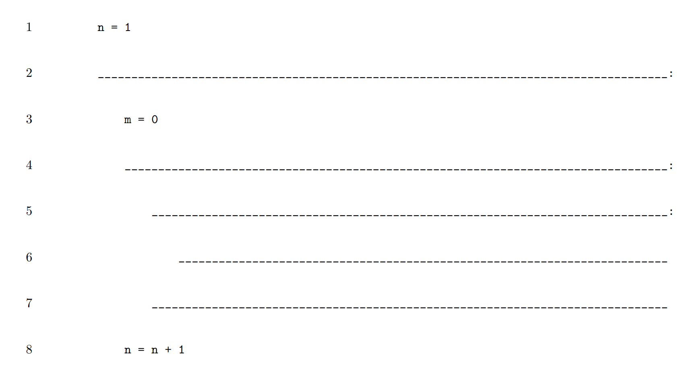
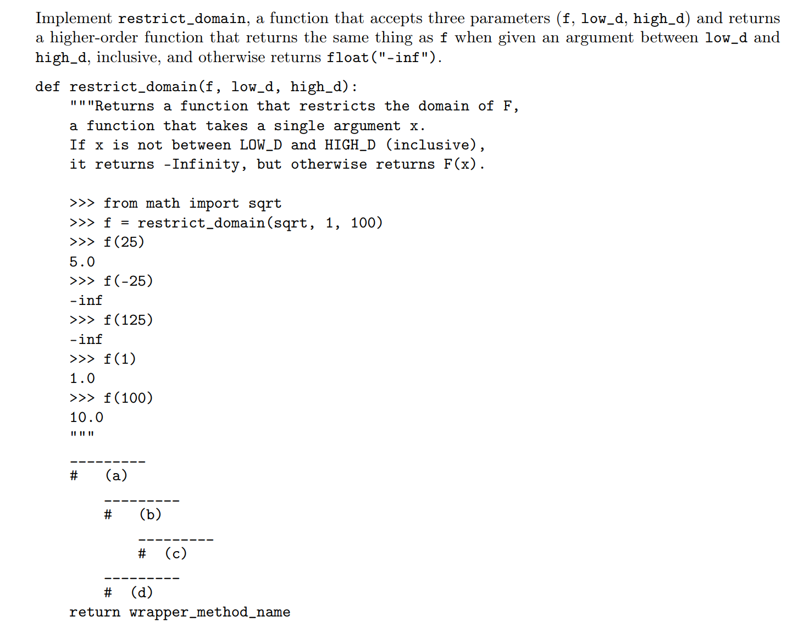
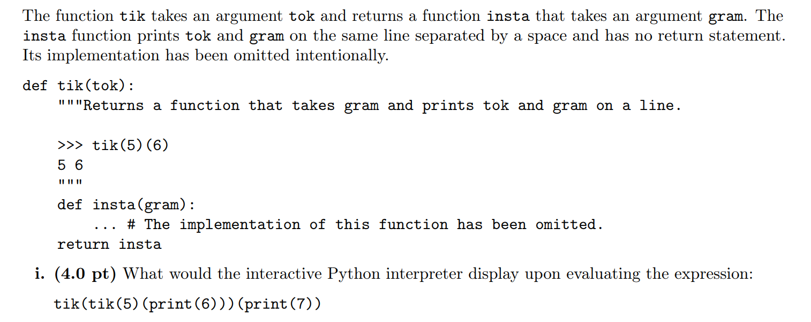
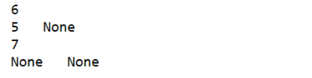

[hw02.zip](https://www.yuque.com/attachments/yuque/0/2022/zip/12393765/1672307721538-cd1cf597-57ce-44ba-b67f-b46bfca56b68.zip)
[sol-hw2.zip](https://www.yuque.com/attachments/yuque/0/2022/zip/12393765/1672307901353-6bbace8e-6091-4369-a8b7-9c149b96ecee.zip)
[hw02.pdf](https://www.yuque.com/attachments/yuque/0/2022/pdf/12393765/1672308313982-44b7c0e0-19a6-4a11-b0cf-7499f54b6eb9.pdf)

# Q1: Product
> 

```python

def product(n, term):
    """Return the product of the first n terms in a sequence.

    n: a positive integer
    term:  a function that takes one argument to produce the term

    >>> product(3, identity)  # 1 * 2 * 3
    6
    >>> product(5, identity)  # 1 * 2 * 3 * 4 * 5
    120
    >>> product(3, square)    # 1^2 * 2^2 * 3^2
    36
    >>> product(5, square)    # 1^2 * 2^2 * 3^2 * 4^2 * 5^2
    14400
    >>> product(3, increment) # (1+1) * (2+1) * (3+1)
    24
    >>> product(3, triple)    # 1*3 * 2*3 * 3*3
    162
    """
    "*** YOUR CODE HERE ***"
```
```python
def product(n, term):
    "*** YOUR CODE HERE ***"
    res = 1
    for i in range(1,n+1):
        res *= term(i)
    return res
```
```python
def product(n, term):
    total, k = 1, 1
    while k <= n:
        total, k = term(k) * total, k + 1
    return total

```

# Q2: Accumulation
> 

```python


def accumulate(merger, start, n, term):
    """Return the result of merging the first n terms in a sequence and start.
    The terms to be merged are term(1), term(2), ..., term(n). merger is a
    two-argument commutative function.

    >>> accumulate(add, 0, 5, identity)  # 0 + 1 + 2 + 3 + 4 + 5
    15
    >>> accumulate(add, 11, 5, identity) # 11 + 1 + 2 + 3 + 4 + 5
    26
    >>> accumulate(add, 11, 0, identity) # 11
    11
    >>> accumulate(add, 11, 3, square)   # 11 + 1^2 + 2^2 + 3^2
    25
    >>> accumulate(mul, 2, 3, square)    # 2 * 1^2 * 2^2 * 3^2
    72
    >>> # 2 + (1^2 + 1) + (2^2 + 1) + (3^2 + 1)
    >>> accumulate(lambda x, y: x + y + 1, 2, 3, square)
    19
    >>> # ((2 * 1^2 * 2) * 2^2 * 2) * 3^2 * 2
    >>> accumulate(lambda x, y: 2 * x * y, 2, 3, square)
    576
    >>> accumulate(lambda x, y: (x + y) % 17, 19, 20, square)
    16
    """
    "*** YOUR CODE HERE ***"


def summation_using_accumulate(n, term):
    """Returns the sum: term(0) + ... + term(n), using accumulate.

    >>> summation_using_accumulate(5, square)
    55
    >>> summation_using_accumulate(5, triple)
    45
    >>> # You aren't expected to understand the code of this test.
    >>> # Check that the bodies of the functions are just return statements.
    >>> # If this errors, make sure you have removed the "***YOUR CODE HERE***".
    >>> import inspect, ast
    >>> [type(x).__name__ for x in ast.parse(inspect.getsource(summation_using_accumulate)).body[0].body]
    ['Expr', 'Return']
    """
    "*** YOUR CODE HERE ***"


def product_using_accumulate(n, term):
    """Returns the product: term(1) * ... * term(n), using accumulate.

    >>> product_using_accumulate(4, square)
    576
    >>> product_using_accumulate(6, triple)
    524880
    >>> # You aren't expected to understand the code of this test.
    >>> # Check that the bodies of the functions are just return statements.
    >>> # If this errors, make sure you have removed the "***YOUR CODE HERE***".
    >>> import inspect, ast
    >>> [type(x).__name__ for x in ast.parse(inspect.getsource(product_using_accumulate)).body[0].body]
    ['Expr', 'Return']
    """
    "*** YOUR CODE HERE ***"

```
```python
from operator import add, mul

square = lambda x: x * x

identity = lambda x: x

triple = lambda x: 3 * x

increment = lambda x: x + 1


HW_SOURCE_FILE = __file__


def product(n, term):
    """Return the product of the first n terms in a sequence.

    n: a positive integer
    term:  a function that takes one argument to produce the term

    >>> product(3, identity)  # 1 * 2 * 3
    6
    >>> product(5, identity)  # 1 * 2 * 3 * 4 * 5
    120
    >>> product(3, square)    # 1^2 * 2^2 * 3^2
    36
    >>> product(5, square)    # 1^2 * 2^2 * 3^2 * 4^2 * 5^2
    14400
    >>> product(3, increment) # (1+1) * (2+1) * (3+1)
    24
    >>> product(3, triple)    # 1*3 * 2*3 * 3*3
    162
    """
    "*** YOUR CODE HERE ***"
    res = 1
    for i in range(1,n+1):
        res *= term(i)
    return res


def accumulate(merger, start, n, term):
    """Return the result of merging the first n terms in a sequence and start.
    The terms to be merged are term(1), term(2), ..., term(n). merger is a
    two-argument commutative function.

    >>> accumulate(add, 0, 5, identity)  # 0 + 1 + 2 + 3 + 4 + 5
    15
    >>> accumulate(add, 11, 5, identity) # 11 + 1 + 2 + 3 + 4 + 5
    26
    >>> accumulate(add, 11, 0, identity) # 11
    11
    >>> accumulate(add, 11, 3, square)   # 11 + 1^2 + 2^2 + 3^2
    25
    >>> accumulate(mul, 2, 3, square)    # 2 * 1^2 * 2^2 * 3^2
    72
    >>> # 2 + (1^2 + 1) + (2^2 + 1) + (3^2 + 1)
    >>> accumulate(lambda x, y: x + y + 1, 2, 3, square)
    19
    >>> # ((2 * 1^2 * 2) * 2^2 * 2) * 3^2 * 2
    >>> accumulate(lambda x, y: 2 * x * y, 2, 3, square)
    576
    >>> accumulate(lambda x, y: (x + y) % 17, 19, 20, square)
    16
    """
    "*** YOUR CODE HERE ***"
    res = start
    i = 1
    while i <= n:
        res , i = merger(res,term(i)), i + 1
    return res


def summation_using_accumulate(n, term):
    """Returns the sum: term(0) + ... + term(n), using accumulate.

    >>> summation_using_accumulate(5, square)
    55
    >>> summation_using_accumulate(5, triple)
    45
    >>> # You aren't expected to understand the code of this test.
    >>> # Check that the bodies of the functions are just return statements.
    >>> # If this errors, make sure you have removed the "***YOUR CODE HERE***".
    >>> import inspect, ast
    >>> [type(x).__name__ for x in ast.parse(inspect.getsource(summation_using_accumulate)).body[0].body]
    ['Expr', 'Return']
    """
    "*** YOUR CODE HERE ***"
    return accumulate(add, 0, n ,term)


def product_using_accumulate(n, term):
    """Returns the product: term(1) * ... * term(n), using accumulate.

    >>> product_using_accumulate(4, square)
    576
    >>> product_using_accumulate(6, triple)
    524880
    >>> # You aren't expected to understand the code of this test.
    >>> # Check that the bodies of the functions are just return statements.
    >>> # If this errors, make sure you have removed the "***YOUR CODE HERE***".
    >>> import inspect, ast
    >>> [type(x).__name__ for x in ast.parse(inspect.getsource(product_using_accumulate)).body[0].body]
    ['Expr', 'Return']
    """
    "*** YOUR CODE HERE ***"
    return accumulate(mul, 1, n , term)

```
```python
def accumulate_reverse(merger, start, n, term):
    total, k = start, n
    while k >= 1:
        total, k = merger(total, term(k)), k - 1
    return total
```

# Exam Practice
## You Again - Function as Arguments
> 

**Template**
```python
def again(f):
    """Return the smallest non-negative integer n such that f(n) == f(m) for some m < n.
    >>> again(parabola) # parabola(4) == parabola(5)
    5
    >>> again(vee) # vee(1) == vee(3)
    3
    """
    n = 1
    while True:
        m = 0
        while m < n:
            if f(m) == f(n):
                return n
            m = m + 1
        n = n + 1

def parabola(x):
    """A parabola function (for testing the again function)."""
    return (x - 3) * (x - 6)


def vee(x):
    """A V-shaped function (for testing the again function)."""
    return abs(x - 2)


if __name__ == "__main__":
    print(again(parabola))
    print(again(vee))
```

## Domain on the range - Decorator
> 

```python
def restrict_domain(f, low_d, high_d):
    """Returns a function that restricts the domain of F,
    a function that takes a single argument x.
    If x is not between LOW_D and HIGH_D (inclusive),
    it returns -Infinity, but otherwise returns F(x).
    >>> from math import sqrt
    >>> f = restrict_domain(sqrt, 1, 100)
    >>> f(25)
    5.0
    >>> f(-25)
    -inf
    >>> f(125)
    -inf
    >>> f(1)
    1.0
    >>> f(100)
    10.0
    """
    def wrapper_method_name(value):
        if value < low_d or value > high_d:
            return float("-inf")
        return f(value)

    return wrapper_method_name


if __name__ == "__main__":
    from math import sqrt
    print(restrict_domain(sqrt, 1,100)(25))
```

## Tik-Tok
> 

**Solution**
只要记住先`evaluate operator`, 再从左到右依次`evaluate operand`即可
