[released_disc_disc04_disc04.pdf](https://www.yuque.com/attachments/yuque/0/2022/pdf/12393765/1672482908678-f7e4baf9-a419-4778-8b71-52afbfd75444.pdf)
[released_disc_sol-disc04_disc04.pdf](https://www.yuque.com/attachments/yuque/0/2022/pdf/12393765/1672482908766-56e62c60-cc36-4aaf-87cd-e850c63b6027.pdf)

# Q1 Count Stair Ways
> 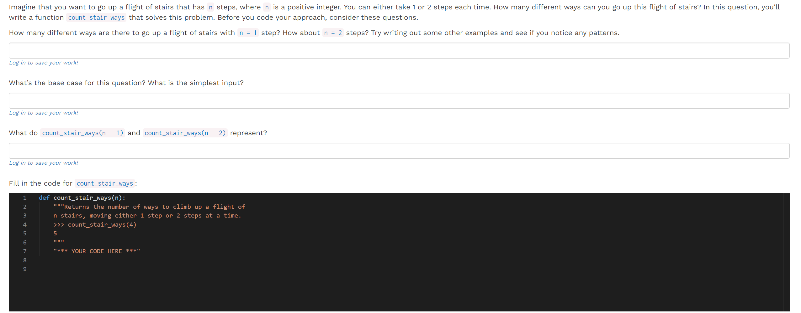

**Solution**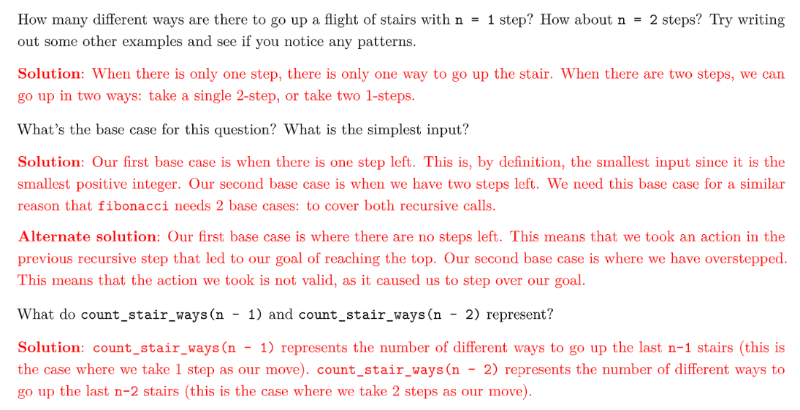
参数`n`代表的是我们还剩下`n`步要走，于是可以使用递归来解。
```python
def count_stair_ways(n):
    if n == 1:
        return 1
    elif n == 2:
        return 2

    return count_stair_ways(n-1)+count_stair_ways(n-2)


# Alt
def count_stair_ways(n):
    if n == 0:
        # 这里返回1可以结合我们之前的partitions问题, n == 0 时代表一种路径搜索完成。
        return 1  
    elif n < 0:
        return 0

    return count_stair_ways(n-1)+count_stair_ways(n-2)

```


# Q2 Count K⭐⭐⭐⭐⭐
> 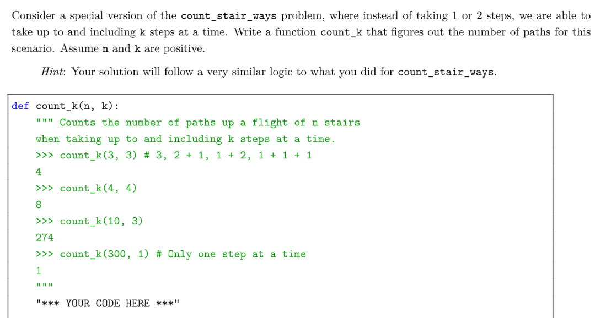
> 本题看似可以用`Partitions`的算法求解，但实际上这和`Partitions`是两类问题。
> - `Partition`问题是组合问题，关注的是可行性，有点类似于剪枝之后的`Tree`, 有点像贪婪算法。
> - 本题是排列问题，关注的是策略，因为我先走`3`步和后走`3`步是两种不同的策略，是对`Tree`的遍历，是一种穷举。
> - 所以我们可以借鉴`Q1`中的写法，进行一些`Extension`
> 
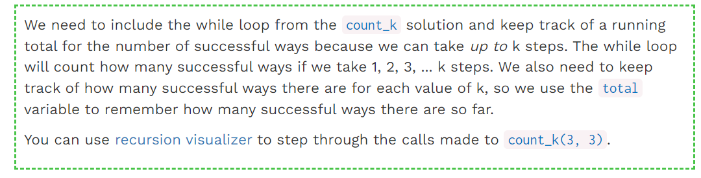

```python
def count_k(n, k):
    if n == 0:
        return 1
    elif n < 0:
        return 0
    else:
        total = 0
        i = 1
        while i <= k:
            total += count_k(n - i, k)
            i += 1
        return total
```

# Q3 WWPD: Lists
> 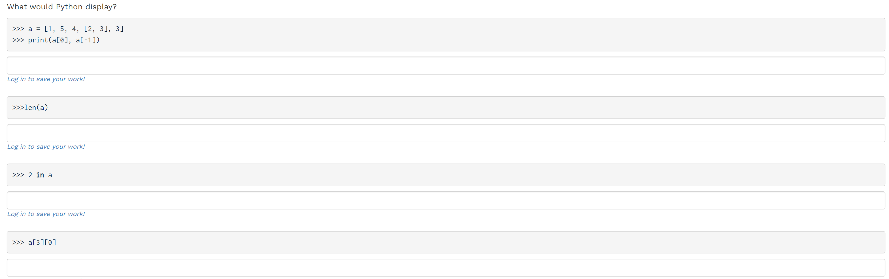

**Solution**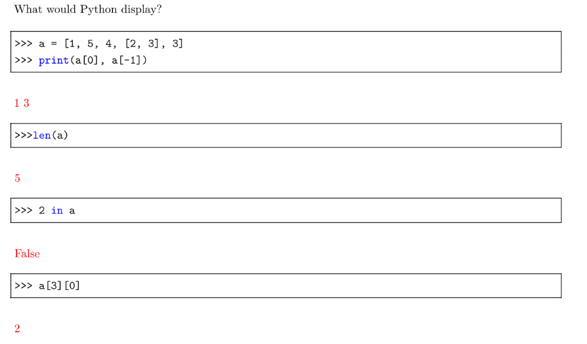

# Q4 Even Weighted
> 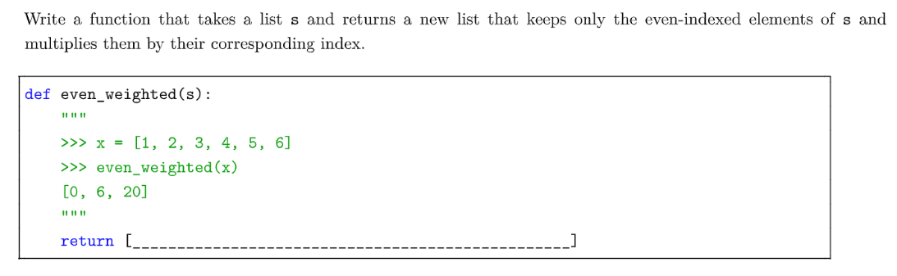

```python
def even_weighted(s):
    """
    >>> x = [1, 2, 3, 4, 5, 6]
    >>> even_weighted(x)
    [0, 6, 20]
    """
    return [index * s[index] for index in range(len(s)) if index % 2 == 0]
```
Analysis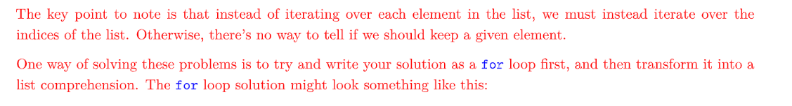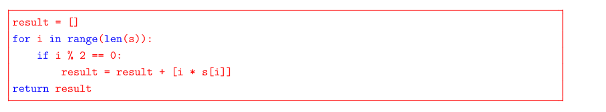


# Q5 Max Product⭐⭐⭐⭐⭐
> 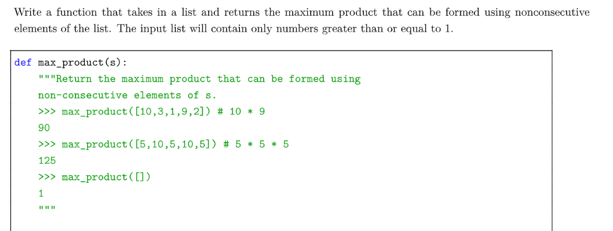

```python
def max_product(s):
    """Return the maximum product that can be formed using
    non-consecutive elements of s.
    >>> max_product([10,3,1,9,2]) # 10 * 9
    90
    >>> max_product([5,10,5,10,5]) # 5 * 5 * 5
    125
    >>> max_product([])
    1
    """
    if len(s) == 0:
        return 1
    elif len(s) == 1:
        return s[0]
    elif len(s) == 2:
        return max(s[0],s[1])

    return max(max_product(s[:-1]),max_product(s[:-2])*s[-1])
```
```python
def max_product(s):
    """Return the maximum product that can be formed using
    non-consecutive elements of s.
    >>> max_product([10,3,1,9,2]) # 10 * 9
    90
    >>> max_product([5,10,5,10,5]) # 5 * 5 * 5
    125
    >>> max_product([])
    1
    """
    if len(s) == 0:
        return 1
    return max(max_product(s[:-1]),max_product(s[:-2])*s[-1])
```
**Analysis**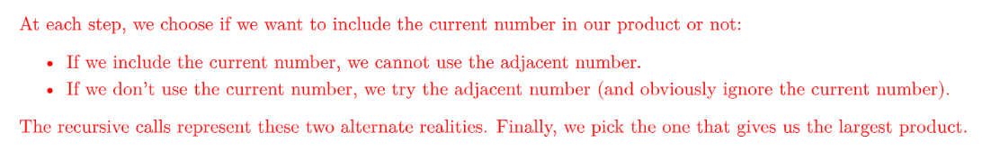


# Q6 WWPD: Dictionaries
> 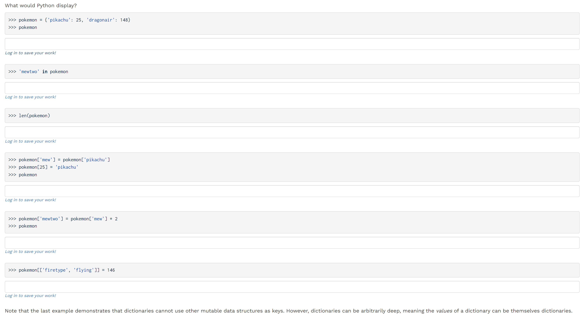

**Solution**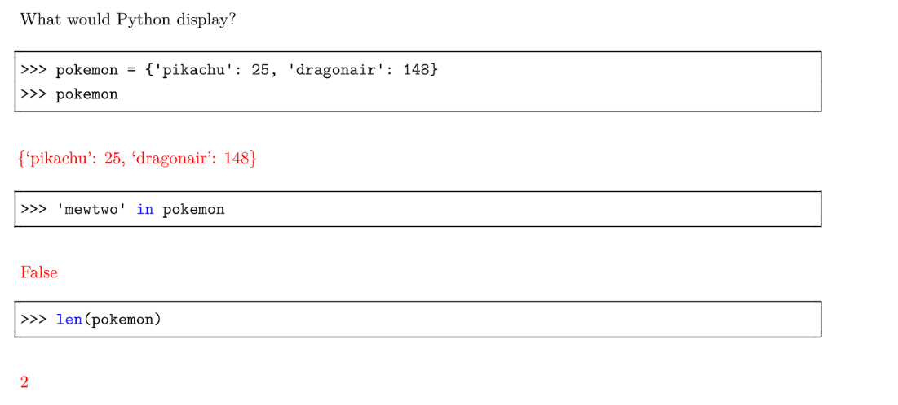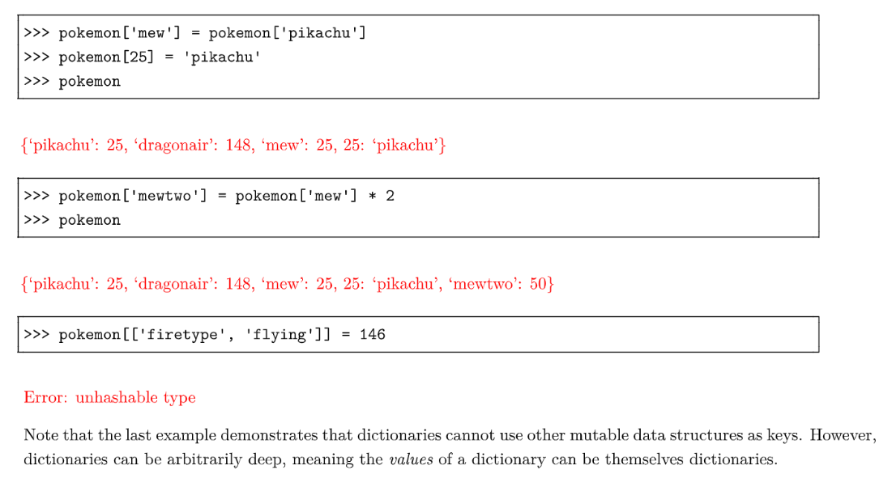
