[released_lab_lab04_lab04.zip](https://www.yuque.com/attachments/yuque/0/2022/zip/12393765/1672482832405-ced0a5f5-1327-4cd7-95e2-f4e1db7acb02.zip)
[released_lab_sol-lab04_lab04.zip](https://www.yuque.com/attachments/yuque/0/2022/zip/12393765/1672482832431-4778117e-6d28-414b-9c85-72bc8b307fb3.zip)
[Lab 4_ Recursion, Tree Recursion, Python Lists _ CS 61A Fall 2022.pdf](https://www.yuque.com/attachments/yuque/0/2022/pdf/12393765/1672482877395-b64bd013-c6d0-46ed-a95a-997baa9ce9ea.pdf)


# Recursion/Tree Recursion
## Q1 Squared Virahanka Fibonacci
> 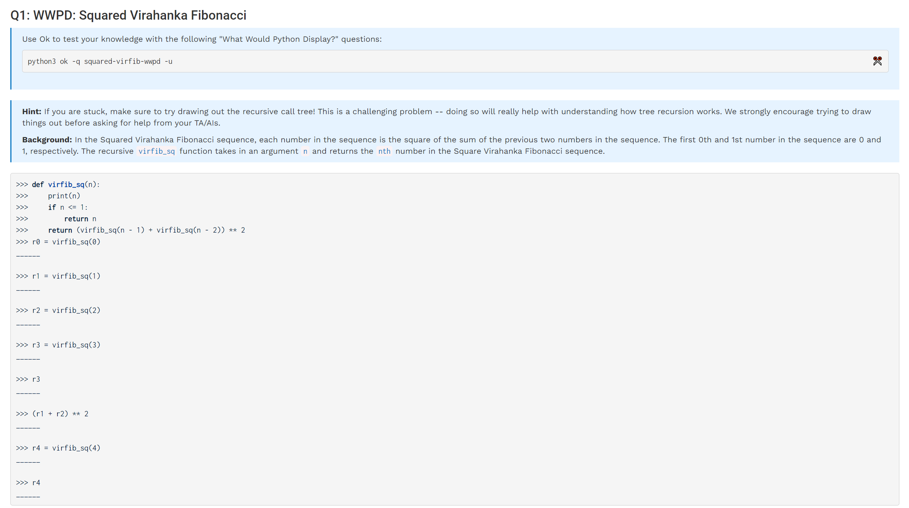

**Solution to fn(3)**我们可以画一颗recursion tree: [https://recursion.vercel.app/](https://recursion.vercel.app/)
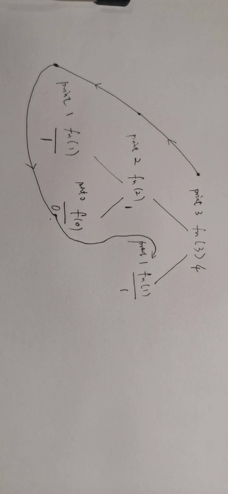
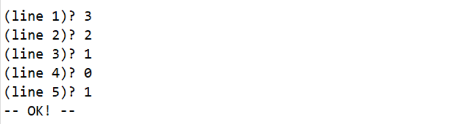
**Solution to fn(4)**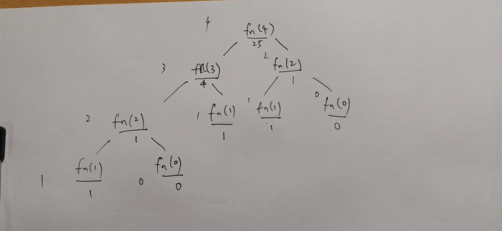
**print output:** 432101210
**return output:** 25

## Q2 Summation
> 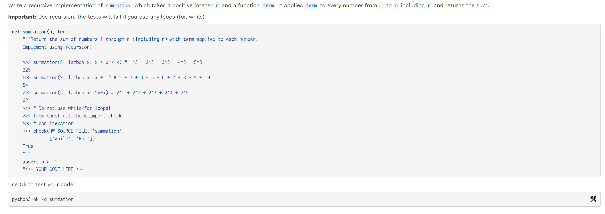

```python
def summation(n, term):
    """Return the sum of numbers 1 through n (including n) wíth term applied to each number.
    Implement using recursion!

    >>> summation(5, lambda x: x * x * x) # 1^3 + 2^3 + 3^3 + 4^3 + 5^3
    225
    >>> summation(9, lambda x: x + 1) # 2 + 3 + 4 + 5 + 6 + 7 + 8 + 9 + 10
    54
    >>> summation(5, lambda x: 2**x) # 2^1 + 2^2 + 2^3 + 2^4 + 2^5
    62
    >>> # Do not use while/for loops!
    >>> from construct_check import check
    >>> # ban iteration
    >>> check(HW_SOURCE_FILE, 'summation',
    ...       ['While', 'For'])
    True
    """
    assert n >= 1
    "*** YOUR CODE HERE ***"
    if n == 1:
        return term(n)

    return summation(n-1, term) + term(n)
```

## Q3 Pascal's Triangle⭐⭐⭐
> 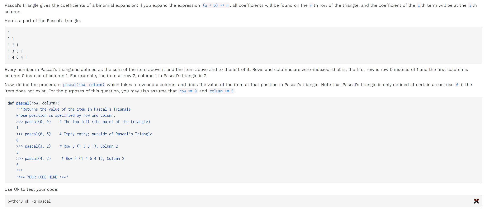

```python
def pascal(row, column):
    if row < column:
        return 0
    elif column == 0:
        return 1
    elif row == column:
        return 1

    return pascal(row-1, column-1)+pascal(row-1,column)
```
```python
def pascal(row, column):
    if column == 0:
        return 1
    elif row == 0:
        return 0
    else:
        above = pascal(row - 1, column)
        above_left = pascal(row - 1, column - 1)
        return above + above_left
    # First base case: every number in the leftmost column of the triangle is 1.
    # Second base case: There is only one number in the topmost row, which is already
    # accounted for by the first base case.
```


## Q4 Insect Combinatorics
> 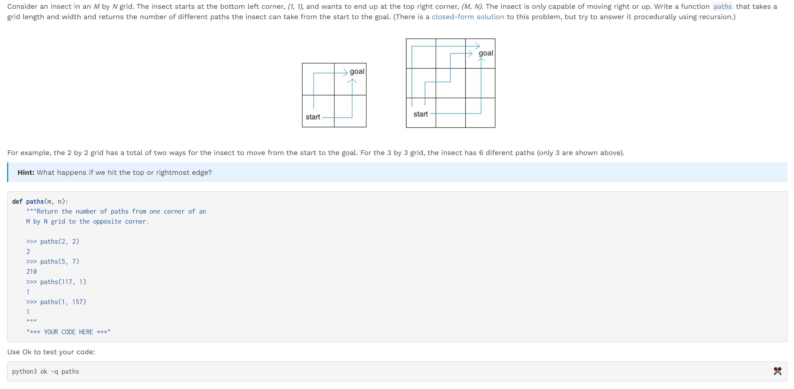
> 本题的关键在于只能向右或者向上走，所以我们下面给出的两种解法都是成立的。

```python
def paths(m, n):
    """Return the number of paths from one corner of an
    M by N grid to the opposite corner.

    >>> paths(2, 2)
    2
    >>> paths(5, 7)
    210
    >>> paths(117, 1)
    1
    >>> paths(1, 157)
    1
    """
    if m == 1 or n == 1:
        return 1
    return paths(m - 1, n) + paths(m, n - 1)
    # Base case: Look at the two visual examples given. Since the insect
    # can only move to the right or up, once it hits either the very right side
    # or the top edge, it has already reached a unique path -- the insect has
    # no choice but to go straight up or straight right (respectively) at that point.
    # There is no way for it to backtrack by going left or down.

    # Alternative solution:
    if m == 1 and n == 1:
        return 1
    if m < 1 or n < 1:
        return 0
    return paths(m - 1, n) + paths(m, n - 1)
    # This solution is similar to the alternate solution for Count Stair Ways from Discussion 4 --
    # if we reach the exact destination, we have found a unique path (first base case), but if
    # we overshoot, we have not found a valid path (second base case).

    # Notice, however, that this solution is not as short and simple as the first solution
    # since it doesn't make use of the insect's restricted movements (only right or up)
    # to cut the program short. We have to reach the exact destination for the second solution,
    # while in the first we just have to reach the right or top boundary.

```


# List Comprehensions
## Q5 Couple
> 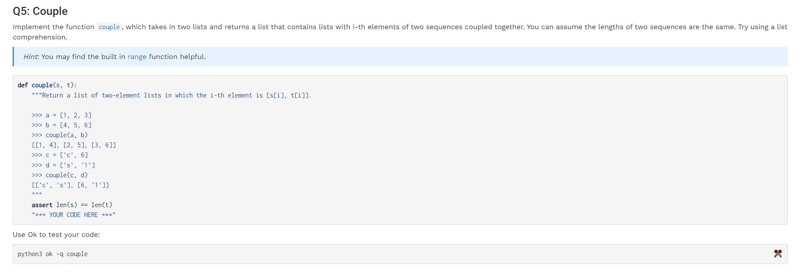

```python
def couple(s, t):
    """Return a list of two-element lists in which the i-th element is [s[i], t[i]].

    >>> a = [1, 2, 3]
    >>> b = [4, 5, 6]
    >>> couple(a, b)
    [[1, 4], [2, 5], [3, 6]]
    >>> c = ['c', 6]
    >>> d = ['s', '1']
    >>> couple(c, d)
    [['c', 's'], [6, '1']]
    """
    assert len(s) == len(t)
    "*** YOUR CODE HERE ***"
    return [[s[i], t[i]] for i in range(len(s))]
```

# Optional Questions
## Recursion
### Q6 Double Eights - Recursion
> 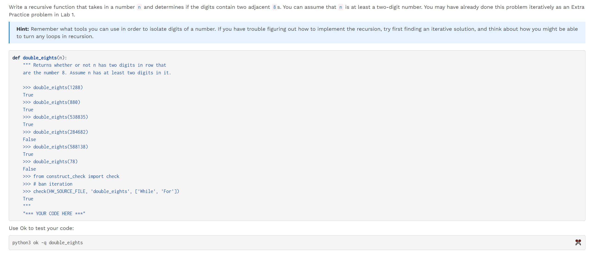

```python
def double_eights(n):
    """ Returns whether or not n has two digits in row that
    are the number 8. Assume n has at least two digits in it.

    >>> double_eights(1288)
    True
    >>> double_eights(880)
    True
    >>> double_eights(538835)
    True
    >>> double_eights(284682)
    False
    >>> double_eights(588138)
    True
    >>> double_eights(78)
    False
    >>> double_eights(799)
    False
    >>> from construct_check import check
    >>> # ban iteration
    >>> check(HW_SOURCE_FILE, 'double_eights', ['While', 'For'])
    True
    """
    "*** YOUR CODE HERE ***"
    if n < 100:
        return ((n // 10) % 10) == n % 10 == 8

    return double_eights(n // 10) or ((n // 10) % 10) == n % 10 == 8

```
```python
def double_eights(n):
    last, second_last = n % 10, n // 10 % 10
    if last == 8 and second_last == 8:
        return True
    elif n < 100:
        return False
    return double_eights(n // 10)


 # Alternate solution
def double_eights(n):
    last, second_last = n % 10, n // 10 % 10
    if n < 10:
        return False
    return (last == 8 and second_last == 8) or double_eights(n // 10)
```
**Analysis**由于是存在性问题，所以我们用`or`连接即可。


## List Comprehensions
### Q7 Coordinates
> 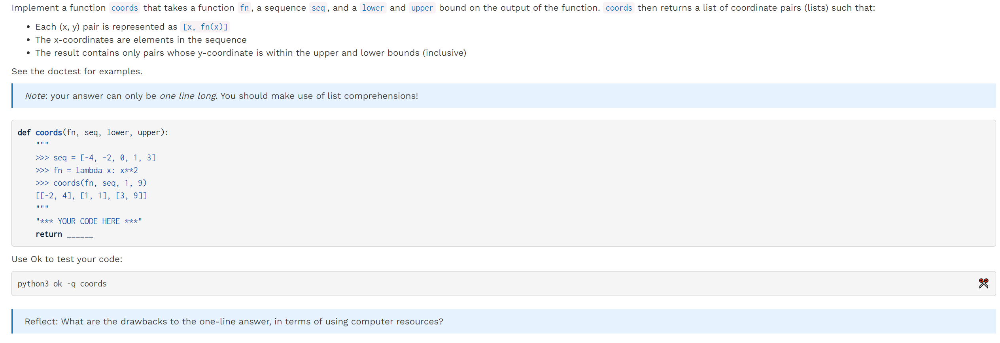

```python
def coords(fn, seq, lower, upper):
    """
    >>> seq = [-4, -2, 0, 1, 3]
    >>> fn = lambda x: x**2
    >>> coords(fn, seq, 1, 9)
    [[-2, 4], [1, 1], [3, 9]]
    """
    return [[x, fn(x)] for x in seq if lower <= fn(x) <= upper]
```


### Q8 Riffle Shuffle⭐⭐⭐⭐⭐
> 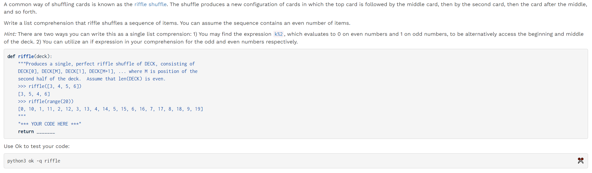

```python
def riffle(deck):
    """Produces a single, perfect riffle shuffle of DECK, consisting of
    DECK[0], DECK[M], DECK[1], DECK[M+1], ... where M is position of the
    second half of the deck.  Assume that len(DECK) is even.
    >>> riffle([3, 4, 5, 6])
    [3, 5, 4, 6]
    >>> riffle(range(20))
    [0, 10, 1, 11, 2, 12, 3, 13, 4, 14, 5, 15, 6, 16, 7, 17, 8, 18, 9, 19]
    """
    return [deck[(i % 2) * len(deck) // 2 + i // 2] for i in range(len(deck))]

# ALTERNATE SOLUTION
def riffle(deck):
    return [deck[i // 2] if i % 2 == 0 else deck[len(deck) // 2 + i // 2] for i in range(len(deck))]

```
> `Alternate Solution`中的`List Comprehension`中嵌套`Boolean Expression`的方式值得参考。
> 另外，本题中的`alternating iteration`也值得`generalization`, `i // 2`的作用就是在遍历的时候把`for i in range(0,len(list))`变成`0,0,1,1,2,2,3,3,..., len(list)//2-1, len(list)//2-1`的形式，这样我们只要利用`i % 2==0`来判断`0,0`中的哪一个`0`需要通过`+len(list)//2`跨越半个`list`达到`alternating iteration`的目的。
> 同样的，如果我们要把一个`list`分成三个部分(假设`list`的长度能被`3`整除)，则我们同样可以构造一个`i//3`将`for i in range(0,len(list))`变成`0,0,0,1,1,1,2,2,2,..., len(list)//3-1,len(list)//3-1,len(list)//3-1`的形式。

