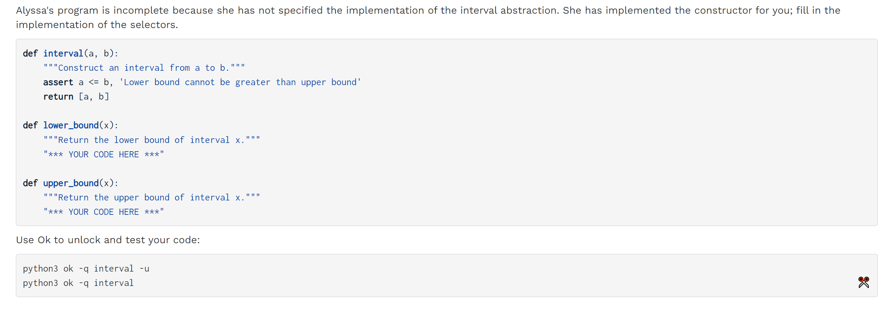

[released_hw_hw04_hw04.zip](https://www.yuque.com/attachments/yuque/0/2023/zip/12393765/1672578445387-1656ae6b-13de-49ec-8e39-b9b16a8d4972.zip)
[released_hw_sol-hw04_hw04.zip](https://www.yuque.com/attachments/yuque/0/2023/zip/12393765/1672578445394-4cc7ec66-426e-46c4-b771-4403d1c0c14a.zip)
[Homework 4 _ CS 61A Fall 2022.pdf](https://www.yuque.com/attachments/yuque/0/2023/pdf/12393765/1672640779167-fe420d09-4314-4058-8544-4043ad9b7c44.pdf)
[Homework 4 Solutions _ CS 61A Fall 2022.pdf](https://www.yuque.com/attachments/yuque/0/2023/pdf/12393765/1672640779241-ed385f5e-d346-4c1d-8266-59838266c73c.pdf)

# Q1 Midterm Survey
> 


# Min Depth - Arms-length Recursion
> 


# Mobiles - Binary Tree
> 

## Q2 Weights
> 

```python
def mobile(left, right):
    """Construct a mobile from a left arm and a right arm."""
    assert is_arm(left), "left must be a arm"
    assert is_arm(right), "right must be a arm"
    return ['mobile', left, right]

def is_mobile(m):
    """Return whether m is a mobile."""
    return type(m) == list and len(m) == 3 and m[0] == 'mobile'

def left(m):
    """Select the left arm of a mobile."""
    assert is_mobile(m), "must call left on a mobile"
    return m[1]

def right(m):
    """Select the right arm of a mobile."""
    assert is_mobile(m), "must call right on a mobile"
    return m[2]

def arm(length, mobile_or_planet):
    """Construct a arm: a length of rod with a mobile or planet at the end."""
    assert is_mobile(mobile_or_planet) or is_planet(mobile_or_planet)
    return ['arm', length, mobile_or_planet]

def is_arm(s):
    """Return whether s is a arm."""
    return type(s) == list and len(s) == 3 and s[0] == 'arm'

def length(s):
    """Select the length of a arm."""
    assert is_arm(s), "must call length on a arm"
    return s[1]

def end(s):
    """Select the mobile or planet hanging at the end of a arm."""
    assert is_arm(s), "must call end on a arm"
    return s[2]

def examples():
    t = mobile(arm(1, planet(2)),
               arm(2, planet(1)))
    u = mobile(arm(5, planet(1)),
               arm(1, mobile(arm(2, planet(3)),
                              arm(3, planet(2)))))
    v = mobile(arm(4, t), arm(2, u))
    return (t, u, v)

    
def total_weight(m):
    """Return the total weight of m, a planet or mobile.

    >>> t, u, v = examples()
    >>> total_weight(t)
    3
    >>> total_weight(u)
    6
    >>> total_weight(v)
    9
    >>> from construct_check import check
    >>> # checking for abstraction barrier violations by banning indexing
    >>> check(HW_SOURCE_FILE, 'total_weight', ['Index'])
    True
    """
    if is_planet(m):
        return mass(m)
    else:
        assert is_mobile(m), "must get total weight of a mobile or a planet"
        return total_weight(end(left(m))) + total_weight(end(right(m)))


# Problems
def planet(mass):
    """Construct a planet of some mass."""
    assert mass > 0
    "*** YOUR CODE HERE ***"

def mass(w):
    """Select the mass of a planet."""
    assert is_planet(w), 'must call mass on a planet'
    "*** YOUR CODE HERE ***"

def is_planet(w):
    """Whether w is a planet."""
    return type(w) == list and len(w) == 2 and w[0] == 'planet'
```
```python
def planet(mass):
    """Construct a planet of some mass."""
    assert mass > 0
    "*** YOUR CODE HERE ***"
    return ['planet', mass]


def mass(w):
    """Select the mass of a planet."""
    assert is_planet(w), 'must call mass on a planet'
    "*** YOUR CODE HERE ***"
    return w[1]
```

## Q3 Balanced
> 
> 注意，两个条件都要满足。

```python
def balanced(m):
    """Return whether m is balanced.

    >>> t, u, v = examples()
    >>> balanced(t)
    True
    >>> balanced(v)
    True
    >>> w = mobile(arm(3, t), arm(2, u))
    >>> balanced(w)
    False
    >>> balanced(mobile(arm(1, v), arm(1, w)))
    False
    >>> balanced(mobile(arm(1, w), arm(1, v)))
    False
    >>> from construct_check import check
    >>> # checking for abstraction barrier violations by banning indexing
    >>> check(HW_SOURCE_FILE, 'balanced', ['Index'])
    True
    """
    "*** YOUR CODE HERE ***"
    if is_planet(m):
        return True

    left_m, left_a = end(left(m)), left(m)
    right_m, right_a = end(right(m)), right(m)

    return length(left_a) * total_weight(left_m) == length(right_a) * total_weight(right_m)  and \
           balanced(left_m) and balanced(right_m)

```
```python
def balanced(m):
    """Return whether m is balanced.

    >>> t, u, v = examples()
    >>> balanced(t)
    True
    >>> balanced(v)
    True
    >>> w = mobile(arm(3, t), arm(2, u))
    >>> balanced(w)
    False
    >>> balanced(mobile(arm(1, v), arm(1, w)))
    False
    >>> balanced(mobile(arm(1, w), arm(1, v)))
    False
    >>> from construct_check import check
    >>> # checking for abstraction barrier violations by banning indexing
    >>> check(HW_SOURCE_FILE, 'balanced', ['Index'])
    True
    """
    if is_planet(m):
        return True
    else:
        left_end, right_end = end(left(m)), end(right(m))
        torque_left = length(left(m)) * total_weight(left_end)
        torque_right = length(right(m)) * total_weight(right_end)
        return torque_left == torque_right and balanced(left_end) and balanced(right_end)
```


## Q4 Totals
> 

```python

def totals_tree(m):
    """Return a tree representing the mobile with its total weight at the root.

    >>> t, u, v = examples()
    >>> print_tree(totals_tree(t))
    3
      2
      1
    >>> print_tree(totals_tree(u))
    6
      1
      5
        3
        2
    >>> print_tree(totals_tree(v))
    9
      3
        2
        1
      6
        1
        5
          3
          2
    >>> from construct_check import check
    >>> # checking for abstraction barrier violations by banning indexing
    >>> check(HW_SOURCE_FILE, 'totals_tree', ['Index'])
    True
    """
    "*** YOUR CODE HERE ***"
    if is_planet(m):
        return tree(mass(m))

    left_m, right_m = end(left(m)), end(right(m))
    left_w, right_w = total_weight(left_m), total_weight(right_m)

    return tree(left_w + right_w, [totals_tree(left_m), totals_tree(right_m)])
```
```python
def totals_tree(m):
    """Return a tree representing the mobile with its total weight at the root.

    >>> t, u, v = examples()
    >>> print_tree(totals_tree(t))
    3
      2
      1
    >>> print_tree(totals_tree(u))
    6
      1
      5
        3
        2
    >>> print_tree(totals_tree(v))
    9
      3
        2
        1
      6
        1
        5
          3
          2
    >>> from construct_check import check
    >>> # checking for abstraction barrier violations by banning indexing
    >>> check(HW_SOURCE_FILE, 'totals_tree', ['Index'])
    True
    """
    if is_planet(m):
        return tree(mass(m))
    else:
        branches = [totals_tree(end(f(m))) for f in [left, right]]
        return tree(sum([label(b) for b in branches]), branches)
```


# More Trees
## Q5 Replace Loki at Leaf
> 

```python
def replace_loki_at_leaf(t, lokis_replacement):
    """Returns a new tree where every leaf value equal to "loki" has
    been replaced with lokis_replacement.

    >>> yggdrasil = tree('odin',
    ...                  [tree('balder',
    ...                        [tree('loki'),
    ...                         tree('freya')]),
    ...                   tree('frigg',
    ...                        [tree('loki')]),
    ...                   tree('loki',
    ...                        [tree('sif'),
    ...                         tree('loki')]),
    ...                   tree('loki')])
    >>> laerad = copy_tree(yggdrasil) # copy yggdrasil for testing purposes
    >>> print_tree(replace_loki_at_leaf(yggdrasil, 'freya'))
    odin
      balder
        freya
        freya
      frigg
        freya
      loki
        sif
        freya
      freya
    >>> laerad == yggdrasil # Make sure original tree is unmodified
    True
    """
    "*** YOUR CODE HERE ***"
    if is_leaf(t):
        if label(t) == 'loki':
            return tree(lokis_replacement)
        else:
            return t

    new_branches = [replace_loki_at_leaf(b, lokis_replacement) for b in branches(t)]

    return tree(label(t), new_branches)
```
```python
def replace_loki_at_leaf(t, lokis_replacement):
    """Returns a new tree where every leaf value equal to "loki" has
    been replaced with lokis_replacement.

    >>> yggdrasil = tree('odin',
    ...                  [tree('balder',
    ...                        [tree('loki'),
    ...                         tree('freya')]),
    ...                   tree('frigg',
    ...                        [tree('loki')]),
    ...                   tree('loki',
    ...                        [tree('sif'),
    ...                         tree('loki')]),
    ...                   tree('loki')])
    >>> laerad = copy_tree(yggdrasil) # copy yggdrasil for testing purposes
    >>> print_tree(replace_loki_at_leaf(yggdrasil, 'freya'))
    odin
      balder
        freya
        freya
      frigg
        freya
      loki
        sif
        freya
      freya
    >>> laerad == yggdrasil # Make sure original tree is unmodified
    True
    """
    if is_leaf(t) and label(t) == "loki":
        return tree(lokis_replacement)
    else:
        bs = [replace_loki_at_leaf(b, lokis_replacement) for b in branches(t)]
        return tree(label(t), bs)
```


## Q6 Trie - Has Path⭐⭐⭐⭐⭐
> 
> 本题对`path`的定义是一定要到达`leaf`的才算`path`，需要注意。

```python
def has_path(t, word):
    """Return whether there is a path in a tree where the entries along the path
    spell out a particular word.

    >>> greetings = tree('h', [tree('i'),
    ...                        tree('e', [tree('l', [tree('l', [tree('o')])]),
    ...                                   tree('y')])])
    >>> print_tree(greetings)
    h
      i
      e
        l
          l
            o
        y
    >>> has_path(greetings, 'h')
    True
    >>> has_path(greetings, 'i')
    False
    >>> has_path(greetings, 'hi')
    True
    >>> has_path(greetings, 'hello')
    True
    >>> has_path(greetings, 'hey')
    True
    >>> has_path(greetings, 'bye')
    False
    >>> has_path(greetings, 'hint')
    False
    """
    assert len(word) > 0, 'no path for empty word.'
    "*** YOUR CODE HERE ***"
    # 如果当前层都不匹配就不用遍历下面的branches了，剪枝
    if label(t) != word[0]:
        return False
    # 如果当前层匹配，且已经是leaf 则返回true
    elif len(word) == 1:
        return True
	# 当前层匹配，但不是leaf,就看看有没有branches满足。
    return any([has_path(b, word[1:]) for b in branches(t)])
```
```python
def has_path(t, word):
    """Return whether there is a path in a tree where the entries along the path
    spell out a particular word.

    >>> greetings = tree('h', [tree('i'),
    ...                        tree('e', [tree('l', [tree('l', [tree('o')])]),
    ...                                   tree('y')])])
    >>> print_tree(greetings)
    h
      i
      e
        l
          l
            o
        y
    >>> has_path(greetings, 'h')
    True
    >>> has_path(greetings, 'i')
    False
    >>> has_path(greetings, 'hi')
    True
    >>> has_path(greetings, 'hello')
    True
    >>> has_path(greetings, 'hey')
    True
    >>> has_path(greetings, 'bye')
    False
    >>> has_path(greetings, 'hint')
    False
    """
    assert len(word) > 0, 'no path for empty word.'
    if label(t) != word[0]:
        return False
    elif len(word) == 1:
        return True
    for b in branches(t):
        if has_path(b, word[1:]):
            return True
    return False
```


# Data Abstraction
> 

## Q7 Interval Abstraction
> 

```python
def lower_bound(x):
    """Return the lower bound of interval x."""
    "*** YOUR CODE HERE ***"
    return x[0]


def upper_bound(x):
    """Return the upper bound of interval x."""
    "*** YOUR CODE HERE ***"
    return x[1]
```

## Q8 Interval Arithmetic
**Problem Description(Too Long)**
```python
def mul_interval(x, y):
    """Return the interval that contains the product of any value in x and any
    value in y."""
    p1 = lower_bound(x) * lower_bound(y)
    p2 = lower_bound(x) * upper_bound(y)
    p3 = upper_bound(x) * lower_bound(y)
    p4 = upper_bound(x) * upper_bound(y)
    return interval(min(p1, p2, p3, p4), max(p1, p2, p3, p4))

def sub_interval(x, y):
    """Return the interval that contains the difference between any value in x
    and any value in y."""
    "*** YOUR CODE HERE ***"
    negative_y = interval(-upper_bound(y), -lower_bound(y))
    return add_interval(x, negative_y)

def div_interval(x, y):
    """Return the interval that contains the quotient of any value in x divided by
    any value in y. Division is implemented as the multiplication of x by the
    reciprocal of y."""
    "*** YOUR CODE HERE ***"
    assert upper_bound(y) * lower_bound(y) > 0
    # Alternate
    # assert not (lower_bound(y) <= 0 <= upper_bound(y)), 'Divide by zero'
    reciprocal_y = interval(1 / upper_bound(y), 1 / lower_bound(y))
    return mul_interval(x, reciprocal_y)


```


## Q9 Par Diff - 并联电阻
> 

```python
def check_par():
    """Return two intervals that give different results for parallel resistors.

    >>> r1, r2 = check_par()
    >>> x = par1(r1, r2)
    >>> y = par2(r1, r2)
    >>> lower_bound(x) != lower_bound(y) or upper_bound(x) != upper_bound(y)
    True
    """
    r1 = interval(1, 3)  # Replace this line!
    r2 = interval(1, 1)  # Replace this line!
    return r1, r2

# Alt
def check_par():
    """Return two intervals that give different results for parallel resistors.

    >>> r1, r2 = check_par()
    >>> x = par1(r1, r2)
    >>> y = par2(r1, r2)
    >>> lower_bound(x) != lower_bound(y) or upper_bound(x) != upper_bound(y)
    True
    """
    r1 = interval(1, 2)
    r2 = interval(3, 4)
    return r1, r2

```


# Exam Practice - max(iterable, key)
## Q10 Exp_Tree⭐⭐⭐⭐⭐
**Problem Description**
```python
def exp_tree(values):
    """
    Returns the exponential tree that can be made from VALUES
    with the greatest possible root label
    >>> print_tree(exp_tree([5]))
    5
    >>> print_tree(exp_tree([3, 2]))
    9
    3
    2
    >>> print_tree(exp_tree([2, 3, 2]))
    512
    2
    9
    3
    2
    >>> lst = [3, 1, 2, 3]
    >>> print_tree(exp_tree(lst))
    6561
    3
    3
    1
    8
    2
    3
    """
    if __________:
        return __________
    else:
        def tree_at_split(i):
            base = exp_tree(__________)
            exponent = exp_tree(__________)
            return tree(__________, [base, exponent])
        trees = [tree_at_split(i) for i in range(1, len(values))]
        return max(trees, key=__________)


```
```python
def exp_tree(values):
    """
    Returns the exponential tree that can be made from VALUES
    with the greatest possible root label
    >>> print_tree(exp_tree([5]))
    5
    >>> print_tree(exp_tree([3, 2]))
    9
    3
    2
    >>> print_tree(exp_tree([2, 3, 2]))
    512
    2
    9
    3
    2
    >>> lst = [3, 1, 2, 3]
    >>> print_tree(exp_tree(lst))
    6561
    3
    3
    1
    8
    2
    3
    """
    if len(values) == 1:
        return tree(values[0])
    else:
        # 这个函数闭包定义在exp_tree里面非常巧妙，利用闭包的性质获取上一层函数split之后的values
        # 然后进一步split。
        def tree_at_split(i):
            base = exp_tree(values[:i])
            exponent = exp_tree(values[i:])
            return tree(label(base) ** label(exponent), [base, exponent])
        trees = [tree_at_split(i) for i in range(1, len(values))]
        return max(trees, key=lambda x:x[0])

```
> 非常经典的题目，二分法和高阶函数的运用。
> `max(list, key = func)`很有用，在本题中，`list`中全部是以`list`构建的`tree`(记为`elem`), 而根据题目可知，`label(tree)`就是`exponent`的结果，于是我们只要比较`elem[0]`即可。


## Partitions with Restriction
> 下面的两题属于同一类问题, 都是有限制的`Partitions`问题。目的在于要寻找一个不一定从`root`开始，但是需要`Consecutive`的`sub-path`, 技巧如下:
> 1. 一般需要定义一个`helper_func(t, constraint, can_skip)`, 参数含义如下: 
> 
`t(数据结构)`: 待遍历的`tree`结构
> `constraint`: 限制性条件，比如求某个特定的和，或者限制长度。
> `can_skip(状态变量)`: 表示如果当前节点被包括进来了，则我们后续不能再主动的跳过任何节点了，因为我们题目要求`path is consecutive`，这和我们之前的`partition`问题区分开了，所以我们要加入这个参数。如果当前节点没有被选择，即被跳过了，则后续我们可以选择跳过当前节点直到我们包括进来了第一个节点。
> 2. 终止条件一般是到达叶子节点了或者被限制条件框死了。
> 3. `Recursion`步骤一般如下:
> 
包含当前节点，遍历所有的`branches`, 更新限制性条件，并设置状态为`True`, 表示后续的子树的根节点必须全部包括进来，直到遇到限制而停止。
> 跳过当前节点，遍历所有`branches`, 限制性条件不变，并设置状态为`False`, 给下次是否要包括节点留下余地。
> 4. 初始化步骤: 调用`helper(t, constraint, False)`


### Q11 Leaf it to me⭐⭐⭐⭐⭐
**Problem Description**
```python
def max_path(t, k):
    """ Return a list of the labels on any path in tree t of length at most k with the greatest sum
    >>> t1 = tree(6, [tree(3, [tree(8)]), tree(1, [tree(9), tree(3)])])
    >>> max_path(t1, 3)
    [6, 3, 8]
    >>> max_path(t1, 2)
    [3, 8]
    >>> t2 = tree(5, [t1, tree(7)])
    >>> max_path(t2, 1)
    [9]
    >>> max_path(t2, 2)
    [5, 7]
    >>> max_path(t2, 3)
    [6, 3, 8]
    """
    def helper(t, k, on_path):
        if ______________________________________________________________________:
            return []
        elif ____________________________________________________________________:
            return [label(t)]
        a = __________________________________________________________
        if ______________________________________________________________________:
            return ____________(___________________, key = _______________________)
        else:
            b = __________________________________________________________
            return _____________(___________________, key = ______________________)
    return helper(t, k, False)

```
```python
def max_path(t, k):
    """ Return a list of the labels on any path in tree t of length at most k with the greatest sum
    >>> t1 = tree(6, [tree(3, [tree(8)]), tree(1, [tree(9), tree(3)])])
    >>> max_path(t1, 3)
    [6, 3, 8]
    >>> max_path(t1, 2)
    [3, 8]
    >>> t2 = tree(5, [t1, tree(7)])
    >>> max_path(t2, 1)
    [9]
    >>> max_path(t2, 2)
    [5, 7]
    >>> max_path(t2, 3)
    [6, 3, 8]
    """
    def helper(t, k, can_skip):
        # length =0 无解
        if k == 0:
            return []
        # 到头了
        elif is_leaf(t):
            return [label(t)]
        a = [[label(t)] + helper(b, k-1, False) for b in branches(t)]
        if not can_skip:
            return max(a, key = lambda x:sum(x))
        else:
            b = [helper(b, k, True) for b in branches(t)]
            return max(a + b, key = lambda x:sum(x))
    return helper(t, k, True)
```


### Q12 Temmie Flakes⭐⭐⭐⭐⭐
**Problem Description**
```python
def count_ways(t, total):
    """Return the number of ways that any sequence of consecutive nodes in a root-to-leaf path
    can sum to total.
    >>> t1 = tree(5, [tree(1, [tree(2, [tree(1)]),
    ... tree(1, [tree(4, [tree(2, [tree(2)])])])]),
    ... tree(3, [tree(2, [tree(2),
    ... tree(3)])]),
    ... tree(3, [tree(1, [tree(3)])])])
    >>> count_ways(t1, 7)
    4
    >>> count_ways(t1, 4)
    6
    >>> t2 = tree(2, [tree(-10, [tree(12)]),
    ... tree(1, [tree(1),
    ... tree(-1, [tree(2)])])])
    >>> count_ways(t2, 2)
    6
    >>> count_ways(t2, 4)
    3
    """
    def paths(__________________________________):
        ways = 0
        if _____________________________________:
            ____________________________________
        ways += sum(____________________________________________________________________________)
        if _____________________________________:
            ____________________________________________________________________________________
        return ways
    return _____________________________________________________________________
```
```python
def count_ways(t, total):
    """Return the number of ways that any sequence of consecutive nodes in a root-to-leaf path
    can sum to total.
    >>> t1 = tree(5, [tree(1, [tree(2, [tree(1)]),
    ... tree(1, [tree(4, [tree(2, [tree(2)])])])]),
    ... tree(3, [tree(2, [tree(2),
    ... tree(3)])]),
    ... tree(3, [tree(1, [tree(3)])])])
    >>> count_ways(t1, 7)
    4
    >>> count_ways(t1, 4)
    6
    >>> t2 = tree(2, [tree(-10, [tree(12)]),
    ... tree(1, [tree(1),
    ... tree(-1, [tree(2)])])])
    >>> count_ways(t2, 2)
    6
    >>> count_ways(t2, 4)
    3
    """
    def paths(t, total, on_path):
        ways = 0
        if total == label(t):
            ways += 1
        ways += sum([paths(b, total - label(t), True) for b in branches(t)])
        if not on_path:
            ways += sum([paths(b, total, False) for b in branches(t)])
        return ways
    return paths(t, total, False)

```
