[released_lab_lab05_lab05.zip](https://www.yuque.com/attachments/yuque/0/2023/zip/12393765/1672577937649-7c24d7fd-6c3b-42ec-a6dd-1ad8b3d4e864.zip)
[released_lab_sol-lab05_lab05.zip](https://www.yuque.com/attachments/yuque/0/2023/zip/12393765/1672577949073-03c962f7-4d7e-4b92-8ed5-24c0f50926ae.zip)
[Lab 5_ Trees, Data Abstraction, Python Lists _ CS 61A Fall 2022.pdf](https://www.yuque.com/attachments/yuque/0/2023/pdf/12393765/1672578040857-545af810-8cd9-4a24-8db4-90d57bd56df8.pdf)

# Lists
## Q1 List Flattening
> 
> 本题提供两种思路，一种是`for`循环遍历整个列表，遇到`list type`的就递归一下；另一种是不用`for`循环，逐渐缩减原始列表的长度，并且逐一审查每个元素。本质上没有区别，只是可能在递归终止条件上有差别。

```python
def flatten(s):
    if type(s) != list:
        return [s]

    result = []
    for ele in s:
        if type(ele) == list:
            result += flatten(ele)
        else:
            result += [ele]
    return result
```
```python
def flatten(s):
    if not s:
        return []
    elif type(s[0]) == list:
        return flatten(s[0]) + flatten(s[1:])
    else:
        return [s[0]] + flatten(s[1:])
```


# Data Abstraction
## Q2 Distance
> 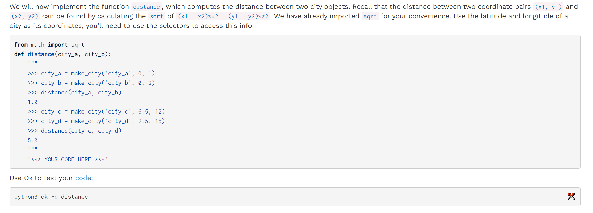

```python
from math import sqrt


def distance(city_a, city_b):
    """
    >>> city_a = make_city('city_a', 0, 1)
    >>> city_b = make_city('city_b', 0, 2)
    >>> distance(city_a, city_b)
    1.0
    >>> city_c = make_city('city_c', 6.5, 12)
    >>> city_d = make_city('city_d', 2.5, 15)
    >>> distance(city_c, city_d)
    5.0
    """
    "*** YOUR CODE HERE ***"
    lat_a, lon_a = get_lat(city_a), get_lon(city_a)
    lat_b, lon_b = get_lat(city_b), get_lon(city_b)
    return sqrt((lat_a - lat_b) ** 2 + (lon_a - lon_b) ** 2)

```
```python
def distance(city_a, city_b):
    """
    >>> city_a = make_city('city_a', 0, 1)
    >>> city_b = make_city('city_b', 0, 2)
    >>> distance(city_a, city_b)
    1.0
    >>> city_c = make_city('city_c', 6.5, 12)
    >>> city_d = make_city('city_d', 2.5, 15)
    >>> distance(city_c, city_d)
    5.0
    """
    lat_1, lon_1 = get_lat(city_a), get_lon(city_a)
    lat_2, lon_2 = get_lat(city_b), get_lon(city_b)
    return sqrt((lat_1 - lat_2)**2 + (lon_1 - lon_2)**2)
```

## Q3 Closer City
> 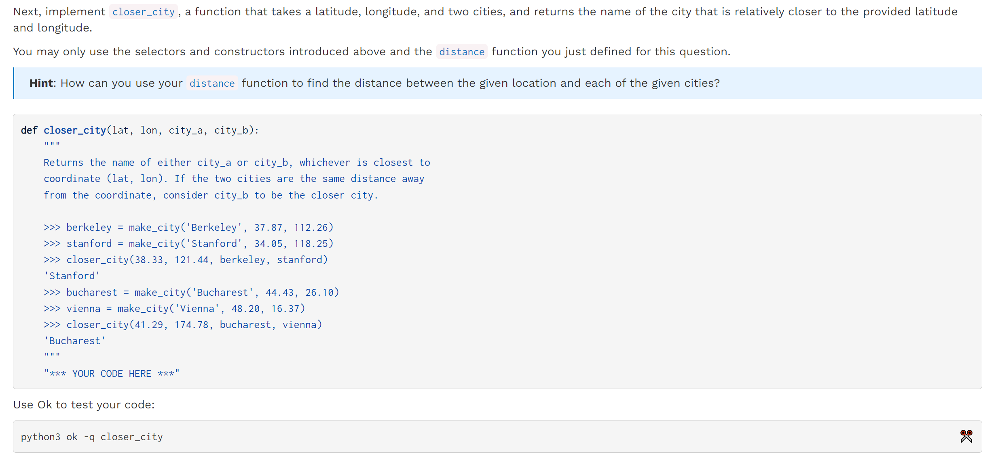

```python
def closer_city(lat, lon, city_a, city_b):
    """
    Returns the name of either city_a or city_b, whichever is closest to
    coordinate (lat, lon). If the two cities are the same distance away
    from the coordinate, consider city_b to be the closer city.

    >>> berkeley = make_city('Berkeley', 37.87, 112.26)
    >>> stanford = make_city('Stanford', 34.05, 118.25)
    >>> closer_city(38.33, 121.44, berkeley, stanford)
    'Stanford'
    >>> bucharest = make_city('Bucharest', 44.43, 26.10)
    >>> vienna = make_city('Vienna', 48.20, 16.37)
    >>> closer_city(41.29, 174.78, bucharest, vienna)
    'Bucharest'
    """
    "*** YOUR CODE HERE ***"
    city_m = make_city('m',lat,lon)
    dist_ma, dist_mb = distance(city_m, city_a), distance(city_m, city_b)
    return get_name(city_a) if dist_ma < dist_mb else get_name(city_b)
```
```python
def closer_city(lat, lon, city_a, city_b):
    """
    Returns the name of either city_a or city_b, whichever is closest to
    coordinate (lat, lon). If the two cities are the same distance away
    from the coordinate, consider city_b to be the closer city.

    >>> berkeley = make_city('Berkeley', 37.87, 112.26)
    >>> stanford = make_city('Stanford', 34.05, 118.25)
    >>> closer_city(38.33, 121.44, berkeley, stanford)
    'Stanford'
    >>> bucharest = make_city('Bucharest', 44.43, 26.10)
    >>> vienna = make_city('Vienna', 48.20, 16.37)
    >>> closer_city(41.29, 174.78, bucharest, vienna)
    'Bucharest'
    """
    new_city = make_city('arb', lat, lon)
    dist1 = distance(city_a, new_city)
    dist2 = distance(city_b, new_city)
    if dist1 < dist2:
         return get_name(city_a)
    return get_name(city_b)

```


## Q4 Abstraction Barrier Checker
> 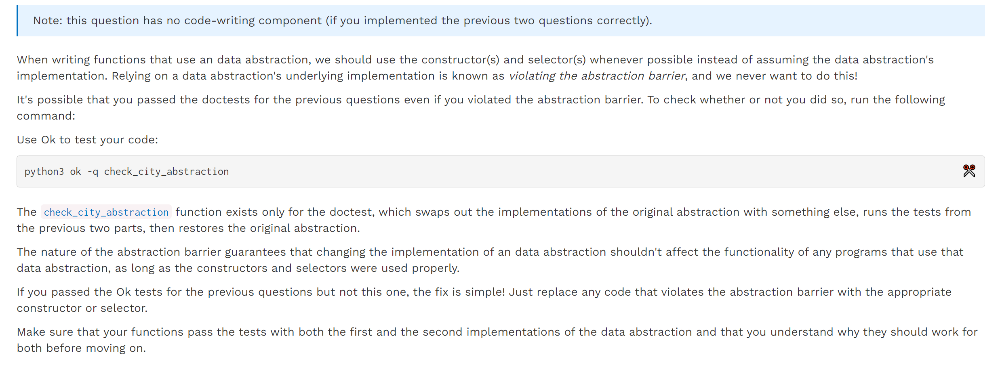
> 我们不能`assume``city`的实现方式，比如我们不能直接通过`city[0]`获取`city_name`，而是要通过`get_name(city)`来获取`city_name`

**Output**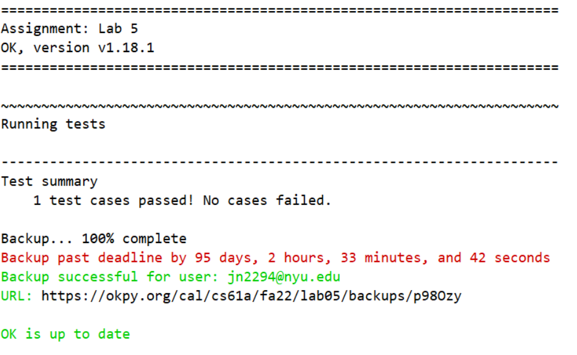


# Trees
## Q5 Finding Berries⭐⭐
> 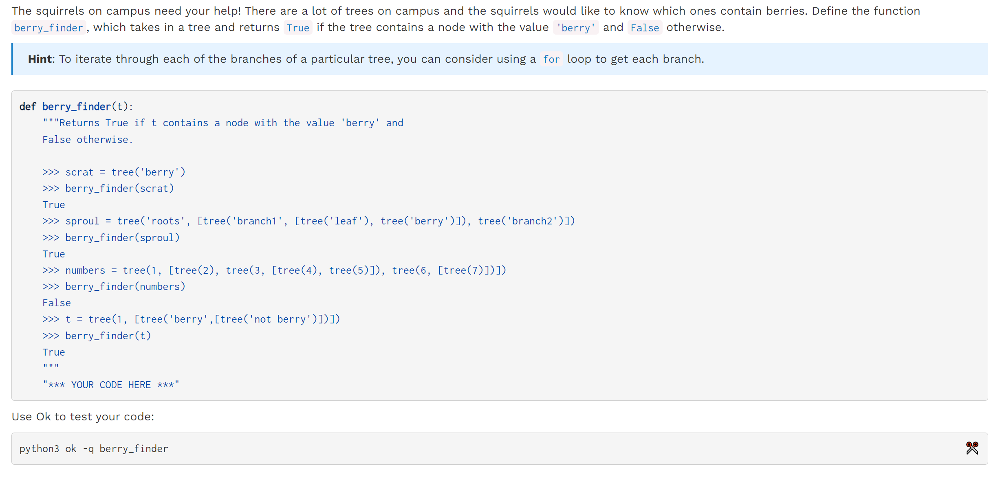
> 本题的核心在于`for`循环, 如果我们在`for`循环调用`berry_finder(b)`的过程中就有`true`返回，则就会顺着`if berry_finder(b): return True`的链条一路返回出去而不会执行最后一句`return False`, 如果`for`循环都结束了还没有找到，才返回`False`。
> 本题和`Discussion 05`中的`Q6`如出一辙，所以我们的终止条件只需要写:`if label(t) == 'berry' return True`即可。
> 但是终止条件的设计也会导致算法运行效率的不同:
> 1. 第一种`Inefficient`的实现中，我们的终止条件是`if is_leaf(t)`, 这势必会导致我们调用`berry_finder(b)`时一直要到`leaf`才结束
> 2. 第二种相对`Efficient`的实现中，我们的终止条件是`if label(t)`, 所以每次`berry_finder(b)`调用不用遍历到`is_leaf`才结束，可以省下不少步骤。
> 3. 下面的`Visualizer`可以帮助我们可视化这个算法的执行步数。

```python
def berry_finder(t):
    """Returns True if t contains a node with the value 'berry' and 
    False otherwise.

    >>> scrat = tree('berry')
    >>> berry_finder(scrat)
    True
    >>> sproul = tree('roots', [tree('branch1', [tree('leaf'), tree('berry')]), tree('branch2')])
    >>> berry_finder(sproul)
    True
    >>> numbers = tree(1, [tree(2), tree(3, [tree(4), tree(5)]), tree(6, [tree(7)])])
    >>> berry_finder(numbers)
    False
    >>> t = tree(1, [tree('berry',[tree('not berry')])])
    >>> berry_finder(t)
    True
    """
    "*** YOUR CODE HERE ***"
    # Be careful with the logic here if you choose to write the code like this
    if is_leaf(t):
        if label(t) != 'berry':
            return False
        return True

    # 如果所有的branch中都找不到
    for b in branches(t):
        if berry_finder(b) or label(t) == 'berry':
            return True
    # 才返回False, 但凡有一个branch找到了，这一行就不会被执行。
    return False
```
```python
def berry_finder(t):
    """Returns True if t contains a node with the value 'berry' and 
    False otherwise.

    >>> scrat = tree('berry')
    >>> berry_finder(scrat)
    True
    >>> sproul = tree('roots', [tree('branch1', [tree('leaf'), tree('berry')]), tree('branch2')])
    >>> berry_finder(sproul)
    True
    >>> numbers = tree(1, [tree(2), tree(3, [tree(4), tree(5)]), tree(6, [tree(7)])])
    >>> berry_finder(numbers)
    False
    >>> t = tree(1, [tree('berry',[tree('not berry')])])
    >>> berry_finder(t)
    True
    """
    if label(t) == 'berry':
        return True
    for b in branches(t):
        if berry_finder(b):
            return True
    return False

# Alternative solution


def berry_finder_alt(t):
    if label(t) == 'berry':
        return True
    return True in [berry_finder(b) for b in branches(t)]
```
```python
def berry_finder(t):
    # Efficient
    if label(t) == 'berry':
        return True
    for b in branches(t):
        if berry_finder(b):
            return True
    return False

	# Inefficient
    # if is_leaf(t):
    #     if label(t) != 'berry':
    #         return False
    #     return True

    # # 如果所有的branch中都找不到
    # for b in branches(t):
    #     if berry_finder(b) or label(t) == 'berry':
    #         return True
    # # 才返回False, 但凡有一个branch找到了，这一行就不会被执行。
    # return False
    

def tree(label, branches=[]):
    """Construct a tree with the given label value and a list of branches."""
    if change_abstraction.changed:
        for branch in branches:
            assert is_tree(branch), 'branches must be trees'
        return {'label': label, 'branches': list(branches)}
    else:
        for branch in branches:
            assert is_tree(branch), 'branches must be trees'
        return [label] + list(branches)


def label(tree):
    """Return the label value of a tree."""
    if change_abstraction.changed:
        return tree['label']
    else:
        return tree[0]


def branches(tree):
    """Return the list of branches of the given tree."""
    if change_abstraction.changed:
        return tree['branches']
    else:
        return tree[1:]


def is_tree(tree):
    """Returns True if the given tree is a tree, and False otherwise."""
    if change_abstraction.changed:
        if type(tree) != dict or len(tree) != 2:
            return False
        for branch in branches(tree):
            if not is_tree(branch):
                return False
        return True
    else:
        if type(tree) != list or len(tree) < 1:
            return False
        for branch in branches(tree):
            if not is_tree(branch):
                return False
        return True


def is_leaf(tree):
    """Returns True if the given tree's list of branches is empty, and False
    otherwise.
    """
    return not branches(tree)
    
    
def change_abstraction(change):
    """
    For testing purposes.
    >>> change_abstraction(True)
    >>> change_abstraction.changed
    True
    """
    change_abstraction.changed = change


change_abstraction.changed = False

    
scrat = tree('berry')
berry_finder(scrat)

```
**Visualizer**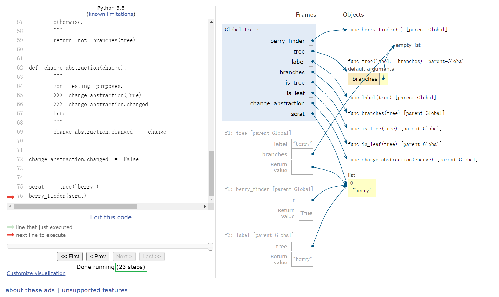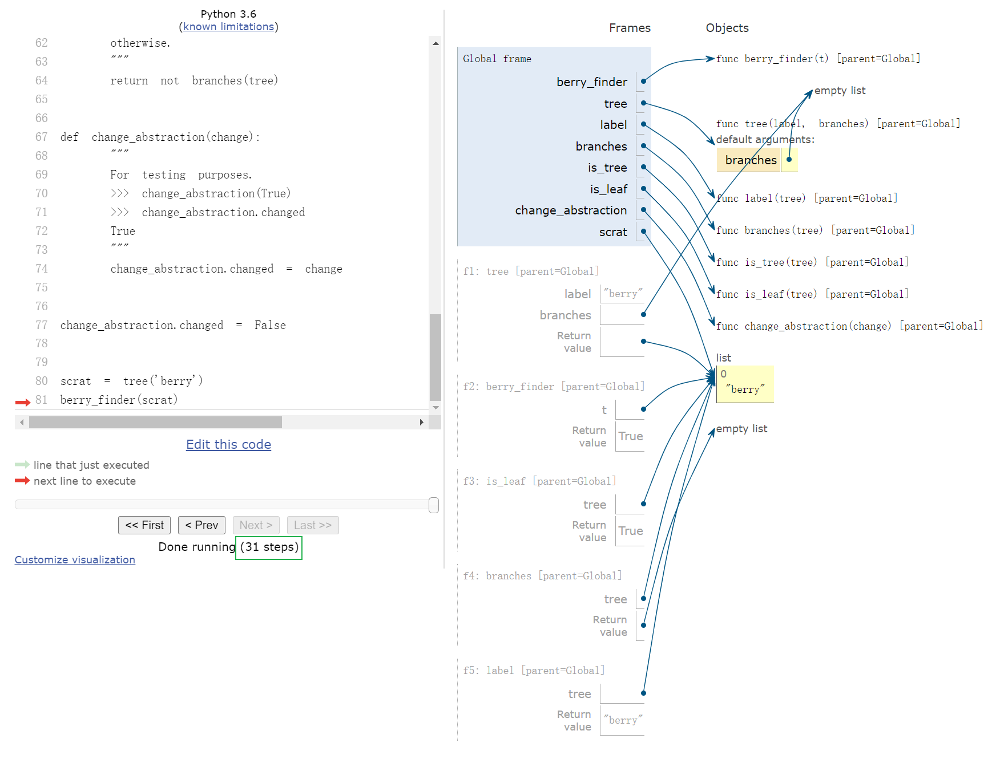

## Q6 Sprout Leaves
> 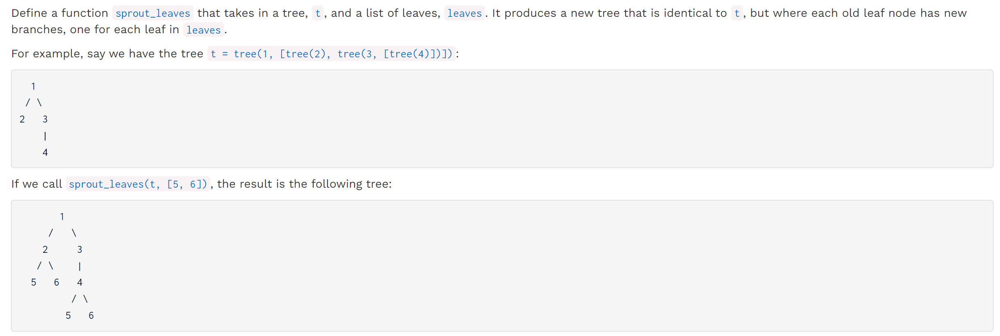
> **注意不要假设是二叉树!**

```python
def sprout_leaves(t, leaves):
    """Sprout new leaves containing the data in leaves at each leaf in
    the original tree t and return the resulting tree.

    >>> t1 = tree(1, [tree(2), tree(3)])
    >>> print_tree(t1)
    1
      2
      3
    >>> new1 = sprout_leaves(t1, [4, 5])
    >>> print_tree(new1)
    1
      2
        4
        5
      3
        4
        5

    >>> t2 = tree(1, [tree(2, [tree(3)])])
    >>> print_tree(t2)
    1
      2
        3
    >>> new2 = sprout_leaves(t2, [6, 1, 2])
    >>> print_tree(new2)
    1
      2
        3
          6
          1
          2
    """
    "*** YOUR CODE HERE ***"
```
```python
def sprout_leaves(t, leaves):
    if is_leaf(t):
        # Be careful not to write code like:
        # tree(t, [tree(leaves[0]),tree(leaves[1])])
        # 这里有两个错误，第一是t, 第二是我们假设树是二叉的。
        return tree(label(t), [tree(leaf) for leaf in leaves])

    return tree(label(t), [sprout_leaves(b, leaves) for b in branches(t)])

```
```python

def sprout_leaves(t, leaves):
    if is_leaf(t):
        return tree(label(t), [tree(leaf) for leaf in leaves])
    return tree(label(t), [sprout_leaves(s, leaves) for s in branches(t)])
```


## Q7 Abstraction Barrier Checker
> 

**Output**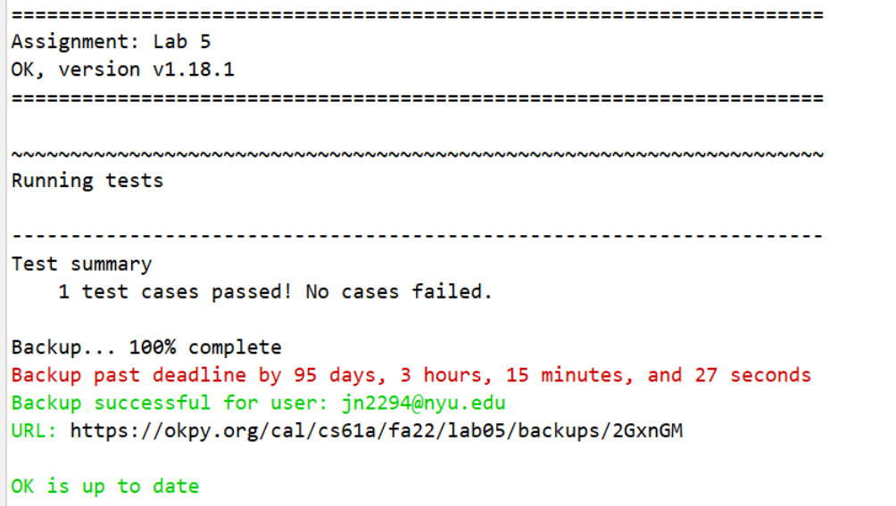


# Optional Exercises
## Q8 Preorder Traversal List⭐⭐⭐⭐⭐
> 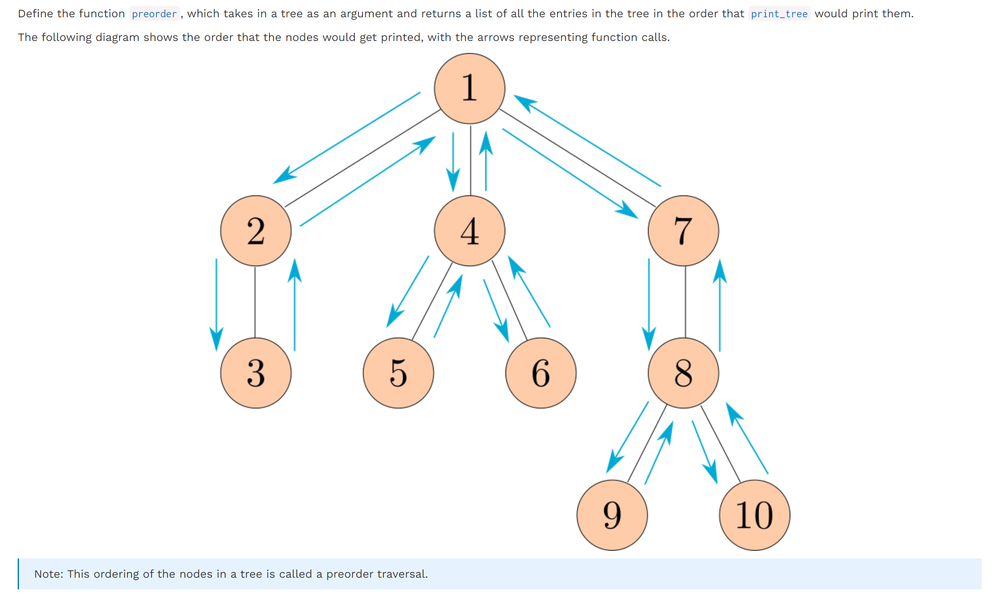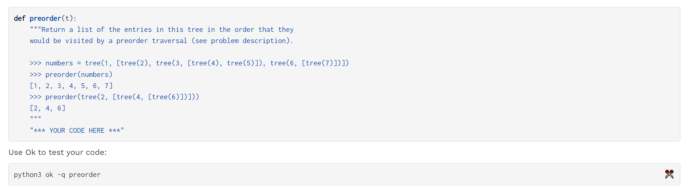
> 本题非常经典，必须掌握，思路也很简单，如果是二叉树则遵循（上，左，右顺序即可）

```python
def preorder(t):
    """Return a list of the entries in this tree in the order that they
    would be visited by a preorder traversal (see problem description).

    >>> numbers = tree(1, [tree(2), tree(3, [tree(4), tree(5)]), tree(6, [tree(7)])])
    >>> preorder(numbers)
    [1, 2, 3, 4, 5, 6, 7]
    >>> preorder(tree(2, [tree(4, [tree(6)])]))
    [2, 4, 6]
    """
    "*** YOUR CODE HERE ***"
    if is_leaf(t):
        return [label(t)]

    result = [label(t)]
    for b in branches(t):
        result += preorder(b)

    return result
```
```python
def preorder(t):
    """Return a list of the entries in this tree in the order that they
    would be visited by a preorder traversal (see problem description).

    >>> numbers = tree(1, [tree(2), tree(3, [tree(4), tree(5)]), tree(6, [tree(7)])])
    >>> preorder(numbers)
    [1, 2, 3, 4, 5, 6, 7]
    >>> preorder(tree(2, [tree(4, [tree(6)])]))
    [2, 4, 6]
    """
    if branches(t) == []:
        return [label(t)]
    flattened_branches = []
    for child in branches(t):
        flattened_branches += preorder(child)
    return [label(t)] + flattened_branches
```


## Q9 Add trees⭐⭐⭐⭐⭐
> 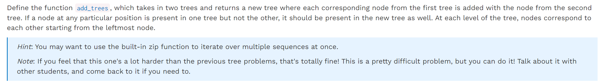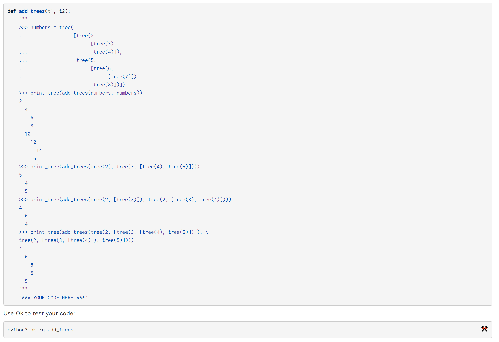

```python
def add_trees(t1, t2):
    # Base case one (or both) are a leaf
    if is_leaf(t1) or is_leaf(t2):
        # Branches will be an empty list for the tree which is a leaf
        return tree(label(t1) + label(t2), branches(t2) + branches(t1))
    else:
        new_branches = []

        # Recursively call add_trees when both t1 and t2 have a branch
        for i in range(min(len(branches(t1)), len(branches(t2)))):
            new_branches += [add_trees(branches(t1)[i], branches(t2)[i])]
        # Now add the leftover branches to new_branches
        for i in range(min(len(branches(t1)), len(branches(t2))), max(len(branches(t1)), len(branches(t2)))):
            if len(branches(t1)) > len(branches(t2)):
                new_branches += [branches(t1)[i]]
            else:
                new_branches += [branches(t2)[i]]

    return tree(label(t1) + label(t2), new_branches)

    
# Alternative solution using zip
def add_trees_alternate(t1, t2):
    # 填充None的原因在这里
    if not t1:
        return t2
    if not t2:
        return t1
    new_label = label(t1) + label(t2)
    t1_branches, t2_branches = branches(t1), branches(t2)
    length_t1, length_t2 = len(t1_branches), len(t2_branches)
    # 无法对齐的部分填充为None
    if length_t1 < length_t2:
        t1_branches += [None for _ in range(length_t1, length_t2)]
    elif length_t1 > length_t2:
        t2_branches += [None for _ in range(length_t2, length_t1)]
    return tree(new_label, [add_trees(branch1, branch2) for branch1, branch2 in zip(t1_branches, t2_branches)])
```
