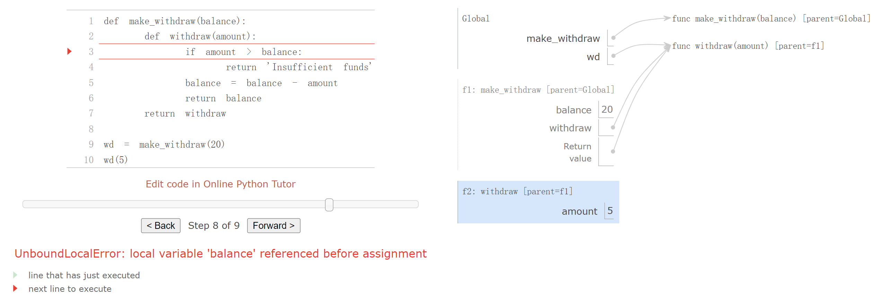

> Ch 2.3 ~ 2.4: [http://composingprograms.com/pages/23-sequences.html](http://composingprograms.com/pages/23-sequences.html)

[released_assets_slides_14-Trees_full.pdf](https://www.yuque.com/attachments/yuque/0/2023/pdf/12393765/1672577890106-2cbe6625-98dd-44ef-910e-f61b27cafabc.pdf)
[released_assets_slides_15-Mutability_full.pdf](https://www.yuque.com/attachments/yuque/0/2023/pdf/12393765/1672577890259-0d40519c-6571-422b-a385-eac4a8b146be.pdf)
[released_assets_slides_16-Syntax_full.pdf](https://www.yuque.com/attachments/yuque/0/2023/pdf/12393765/1672577889938-d9359864-d92a-4a46-b3a4-5fce7b5497d6.pdf)

# 1 Trees
## Definition⭐⭐
> 


## Construct Trees⭐⭐⭐⭐⭐
### Abstraction
> 
> 右图中(二叉树)打印出来的树形结构就是: `tree = [label, left_branch_list, right_branch_list]`, 其中:
> 1. `[...]`就是整棵树
> 2. `label`是树的`root`
> 3. `left_branch_list`: 因为也是一个`[...]`结构，所以也是一颗树
> 4. `right_branch_list`: 因为也是一个`[...]`结构，所以也是一颗树
> 
所以我们看到，树可以由一个嵌套列表构成。如果我们要访问树的结构，就要使用规定的`selector`, 比如`label(tree)`和`branches(tree)`, 比如下面的几种调用方式
> 1. `t=tree(1, [tree(5), [tree(7)], tree(6)])`
> 2. `label(t) => 1`
> 3. `branches(t) => [[5, [7]], [6]]`
> 4. `is_tree(branches(t)[0]) => true`, 其中`branches(t)[0]`就是左子树，`branches(t)[1]`就是右子树。
> 5. `label(branches(t)[0]) => 5`

```python
def tree(label, branches=[]):
    for branch in branches:
        assert is_tree(branch), 'branches must be trees'
    return [label] + list(branches)

def label(tree):
    return tree[0]

def branches(tree):
    return tree[1:]

def is_tree(tree):
    if type(tree) != list or len(tree) < 1:
        return False
    for branch in branches(tree):
        if not is_tree(branch):
            return False
    return True

def is_leaf(tree):
    return not branches(tree)
```


### Method Collection
> 


## Tree Processing
### Build a fib Tree
> 还记得我们之前学习过的`fib tree`, 是下面的样子:
> 
> 现在我们手头有`tree constructor`, 于是可以用程序构造出来，代码如下:

```python
def fib_tree(n):
    """Construct a Fibonacci tree.

    >>> fib_tree(1)
    [1]
    >>> fib_tree(3)
    [2, [1], [1, [0], [1]]]
    >>> fib_tree(5)
    [5, [2, [1], [1, [0], [1]]], [3, [1, [0], [1]], [2, [1], [1, [0], [1]]]]]
    """
    if n == 0 or n == 1:
        return tree(n)
    else:
        left = fib_tree(n-2)
        right = fib_tree(n-1)
        fib_n = label(left) + label(right)
        return tree(fib_n, [left, right])
```

### Counting Leaves
> 

```python
def count_leaves(t):
    """The number of leaves in tree.

    >>> count_leaves(fib_tree(5))
    8
    """
    # No branches
    if is_leaf(t):
        return 1
    else:
        return sum([count_leaves(b) for b in branches(t)])
```
> 我们尝试调用`count_leaves(fib_tree(10)) => 89`, 而`89`是`1,1,2,3,5,....89`数列中的第`11`项。


### Collecting Leaves -sum syntax⭐⭐⭐
> 
> 上面的`implementation`中，我们使用了`python`的一个关于`sum`的很有意思的语法, 他的如下:
> `sum([[contents1], [contents2], [contents3]], [])=> [contents1, contents2, contents3]`, 其实就是把大列表中的每个小列表都进行蜕皮操作，然后把内部的精华取出来形成一个新的提纯列表。

```python
def leaves(tree):
    """Return a list containing the leaf labels of tree.

    >>> leaves(fib_tree(5))
    [1, 0, 1, 0, 1, 1, 0, 1]
    """
    if is_leaf(tree):
        return [label(tree)]
    else:
        """
        我们采用sum([...],[])语法的原因是，每次调用leaves()都会返回一个列表，而
        这样会导致下面的list comprehension操作形成一个[[labels1],[labels2],...]
        的结构, 但是我们只需要[labels1, labels2, ...]。
        """
        return sum([leaves(b) for b in branches(tree)], [])
```


### Modifying Trees⭐⭐⭐
> 
> `increment_leaves(t)`更新`tree`的`leave labels`
> `increment(t)`更新`tree`的所有`labels`，注意递归条件不是那么显然，当`branches(t)`为空列表时递归调用停止。

```python
def increment_leaves(t):
    """Return a tree like t but with leaf labels incremented.
    """
    # 递归终止条件，对leaf直接increment操作即可
    if is_leaf(t):
        return tree(label(t) + 1)
    else:
        # 对每个branch代表的tree进行递归调用更新leaves
        bs = [increment_leaves(b) for b in branches(t)]
        # 更新当前树的branches
        return tree(label(t), bs)


# 更新所有trees的labels
def increment(t):
    """Return a tree like t but with all labels incremented.
    """
    # 当branches(t)为空列表时递归调用停止。
    return tree(label(t) + 1, [increment(b) for b in branches(t)])
```

### Printing Tree Structure
> 要求: Print a representation of this tree in which each label is indented by two spaces times its depth from the root. 使用递归实现

```python
def print_tree(t, indent=0):
    """Print a representation of this tree in which each label is
    indented by two spaces times its depth from the root.

    >>> print_tree(tree(1))
    1
    >>> print_tree(tree(1, [tree(2)]))
    1
      2
    >>> print_tree(fib_tree(4))
    3
      1
        0
        1
      2
        1
        1
          0
          1
    """
    print('  ' * indent + str(label(t)))
    for b in branches(t):
        print_tree(b, indent + 1)
```


### Print Sums
> Print the sum of labels along the path from the root to each leaf. If the label are strings, then concat them.

```python
haste = tree('h', [tree('a', [tree('s'), tree('t')]), tree('e')])


# 使用参数传递递归过程的状态更新
def print_sums(t, path_sum):
    """Print the sum of labels along the path from the root to each leaf.

    >>> print_sums(tree(3, [tree(4), tree(5, [tree(6)])]), 0)
    7
    14
    >>> print_sums(haste, '')
    has
    hat
    he
    """
    path_sum = path_sum + label(t)
    if is_leaf(t):
        print(path_sum)
    else:
        for branch in branches(t):
            print_sums(branch, path_sum)
```


### Summing Paths⭐⭐⭐
> 

**Solution**
```python
def count_paths(t, total):
    """Return the number of paths from the root to any node in t 
    for which the labels along the path sum to total.
	"""
    if label(t) == total:
        found = 1
    else:
        found = 0
    return found + sum([count_paths(b, total - label(t)) for b in branches(t)])
```


### Count Partitions - Trees⭐⭐⭐⭐⭐
> 

```python
def partition_tree(n, m):
    """Return a partition tree of n using parts of up to m."""
    # 表示这个路径是可行的
    if n == 0:
        return tree(True)
    # 表示这条路径不行
    elif n < 0 or m == 0:
        return tree(False)
    else:
        left = partition_tree(n-m, m)
        right = partition_tree(n, m-1)
        return tree(m, [left, right])

def print_parts(tree, partition=[]):
    if is_leaf(tree):
        # 如果这条路径可行，即label(tree) evaluates to True
        if label(tree):
            # 把这一路上收集到的都打印出来
            print(' + '.join(partition))
    else:
        # 左子树是用了m的路径，右子树是至多用m-1的路径
        left, right = branches(tree)        # Sequence Unpacking
        m = str(label(tree))
        # 用了m, 于是要把m加到当前的路径中去
        print_parts(left, partition + [m])   # The path that use m
        # 没有用m, partition不变
        print_parts(right, partition)        # The path that doesn't use m, but up to m
```
**Output**


## Tree Binarization⭐⭐⭐⭐⭐
> 
> 下面的代码展示了我们如何从一个给定列表创建一颗二叉树的过程。

```python
def tree(label, branches=[]):
    for branch in branches:
        assert is_tree(branch), 'branches must be trees'
    return [label] + list(branches)

def label(tree):
    return tree[0]

def branches(tree):
    return tree[1:]

def is_tree(tree):
    if type(tree) != list or len(tree) < 1:
        return False
    for branch in branches(tree):
        if not is_tree(branch):
            return False
    return True

def is_leaf(tree):
    return not branches(tree)

# 主函数
def right_binarize(tree):
    """Construct a right-branching binary tree."""
    if is_leaf(tree):
        return tree
    if len(tree) > 2:
        tree = [tree[0], tree[1:]]
    return [right_binarize(b) for b in tree]
```
**Test Output**


# 2 Linked Lists
## Definition & Implementation
> Linked lists have recursive structure: the rest of a linked list is a linked list or **'empty'**. We can define an abstract data representation to validate, construct, and select the components of linked lists.
> This example demonstrates a common pattern of computation with linked lists, where each step in an iteration operates on an increasingly shorter suffix of the original list. This incremental processing to find the length and elements of a linked list does take some time to compute. Python's built-in sequence types are implemented in a different way that does not have a large cost for computing the length of a sequence or retrieving its elements. 
> 后续的`CS61B`会讲解`Java`的标准实现。

```python
empty = 'empty'
def is_link(s):
    """s is a linked list if it is empty or a (first, rest) pair."""
    return s == empty or (len(s) == 2 and is_link(s[1]))

# Constructor
def link(first, rest):
    """Construct a linked list from its first element and the rest."""
    assert is_link(rest), "rest must be a linked list."
    return [first, rest]

# Selector1, return the label
def first(s):
    """Return the first element of a linked list s."""
    assert is_link(s), "first only applies to linked lists."
    assert s != empty, "empty linked list has no first element."
    return s[0]

# Selector2, return the linked list
def rest(s):
    """Return the rest of the elements of a linked list s."""
    assert is_link(s), "rest only applies to linked lists."
    assert s != empty, "empty linked list has no rest."
    return s[1]

# Iteration
def len_link(s):
    """Return the length of linked list s."""
    length = 0
    while s != empty:
        s, length = rest(s), length + 1
    return length

    
def getitem_link(s, i):
    """Return the element at index i of linked list s."""
    while i > 0:
        s, i = rest(s), i - 1
    return first(s)

# Recursive
def len_link_recursive(s):
    """Return the length of a linked list s."""
    if s == empty:
        return 0
    return 1 + len_link_recursive(rest(s))

    
def getitem_link_recursive(s, i):
    """Return the element at index i of linked list s."""
    if i == 0:
        return first(s)
    return getitem_link_recursive(rest(s), i - 1)
    
    
# Output
four = link(1, link(2, link(3, link(4, empty))))
>>> first(four)
1
>>> rest(four)
[2, [3, [4, 'empty']]]
>>> len_link(four)
4
>>> getitem_link(four, 1)
2
>>> len_link_recursive(four)
4
>>> getitem_link_recursive(four, 1)
2
```
```python
def extend_link(s, t):
    """Return a list with the elements of s followed by those of t."""
    assert is_link(s) and is_link(t)
    if s == empty:
        return t
    else:
        return link(first(s), extend_link(rest(s), t))
    
>>> extend_link(four, four)
[1, [2, [3, [4, [1, [2, [3, [4, 'empty']]]]]]]]


# 这个函数会修改linked-list的每一个元素，因为如果我们要修改linked-list
# 就必须要遍历一遍，更改原来的结构，所以我们需要使用link构造器最终返回一个
# 修改过元素的，全新的linked-list
def apply_to_all_link(f, s):
    """Apply f to each element of s."""
    assert is_link(s)
    if s == empty:
        return s
    else:
        return link(f(first(s)), apply_to_all_link(f, rest(s)))
 
>>> apply_to_all_link(lambda x: x*x, four)
[1, [4, [9, [16, 'empty']]]]


def keep_if_link(f, s):
    """Return a list with elements of s for which f(e) is true."""
    assert is_link(s)
    if s == empty:
        return s
    else:
        kept = keep_if_link(f, rest(s))
        if f(first(s)):
            return link(first(s), kept)
        else:
            return kept
            
>>> keep_if_link(lambda x: x%2 == 0, four)
[2, [4, 'empty']]


def join_link(s, separator):
    """Return a string of all elements in s separated by separator."""
    if s == empty:
        return ""
    elif rest(s) == empty:
        return str(first(s))
    else:
        return str(first(s)) + separator + join_link(rest(s), separator)

        
>>> join_link(four, ", ")
'1, 2, 3, 4'
```
**Environment Diagram**


## Count Partitions - Linked List⭐⭐⭐⭐⭐
> 

```python
def partitions(n, m):
    """Return a linked list of partitions of n using parts of up to m.
    Each partition is represented as a linked list.
    """
    if n == 0:
         # A list containing the empty partition
        return link(empty, empty) # ['empty', 'empty']
    elif n < 0 or m == 0:
        return empty
    else:
        # partitions(n-m,m)获得一个linked_list of linked_list
        # [linked_list1, [linked_list2, [linked_list3, .... ]]]
        using_m = partitions(n-m, m)
        # 这句代码是难点，作用是给所有的using_m的linked_list的头部加上一个m
        # 相当于批量操作增加长度了，相当于
        # [m+linked_list1, [m+linked_list2, [m+linked_list3, .... ]]]
        with_m = apply_to_all_link(lambda s: link(m, s), using_m)
        # without_m 就不需要这种操作了
        without_m = partitions(n, m-1)
        # 把当前的with_m的路径解法(还没遍历完)，放在without_m路径解法之前
        return extend_link(with_m, without_m)


def extend_link(s, t):
    """Return a list with the elements of s followed by those of t."""
    assert is_link(s) and is_link(t)
    if s == empty:
        return t
    else:
        return link(first(s), extend_link(rest(s), t))


def apply_to_all_link(f, s):
    """Apply f to each element of s."""
    assert is_link(s)
    if s == empty:
        return s
    else:
        return link(f(first(s)), apply_to_all_link(f, rest(s)))


def join_link(s, separator):
    """Return a string of all elements in s separated by separator."""
    if s == empty:
        return ""
    elif rest(s) == empty:
        return str(first(s))
    else:
        return str(first(s)) + separator + join_link(rest(s), separator)
        

def print_partitions(n, m):
        lists = partitions(n, m)
        strings = apply_to_all_link(lambda s: join_link(s, " + "), lists)
        print(join_link(strings, "\n"))


>>> print_partitions(6, 4)
4 + 2
4 + 1 + 1
3 + 3
3 + 2 + 1
3 + 1 + 1 + 1
2 + 2 + 2
2 + 2 + 1 + 1
2 + 1 + 1 + 1 + 1
1 + 1 + 1 + 1 + 1 + 1
```

# 3 Mutability
## Objects
### Definition
> _Objects_ 
> 1. Combine data values with behavior. 
> 2. Represent information, but also _behave_ like the things that they represent. 
> 
The logic of how an object interacts with other objects is bundled along with the information that encodes the object's value. When an object is printed, it knows how to spell itself out in text. 
> If an object is composed of parts, it knows how to reveal those parts on demand. 
> Objects are both information and processes, bundled together to represent the properties, interactions, and behaviors of complex things.
> 


### Date Object
> **Object Construction:** `date(year, month, day)`
> **Attribute Accessing: **`<dateObject>.<attri_name>`(`<attri_name>=year, month, day`)
> **Method Invokation:** `<dateObject>.<func_name>`(`strftime('%A %B %d')`,将`dateObject`转换成英文表达) 

```python
from datetime import date

# Construction
today = date(2015, 2, 20)
freedom = date(2015, 5, 12)
str(freedom - today)         # 81 days, 0:00:00

# Accessing attributes 
today.year                   # 2015
today.month                  # 2
 
# Invoking Methods
today.strftime('%A %B %d')   # 'Friday February 20'
```


### Strings
> 

```python
def string_demos():
    "Hello".lower()    # hello
    "Hello".upper()    # HELLO
    "Hello".swapcase() # hELLO
    hex(ord('A'))      # Return ASCII , 65
    print('\a')         # Error
    print('1\n2\n3')    # Multiple lines
    from unicodedata import lookup, name
    name('A')  		        # LATIN CAPTIAL LETTER A
    name('a')			    # LATIN SMALL LETTER A
    lookup('SNOWMAN')       # svg
    lookup('SOCCER BALL')   # svg
    lookup('BABY')          # svg
    s = lookup('SNOWMAN')
```


## Mutation Operations
### List& Dict Mutation
> 

```python
def list_demos():
    suits = ['coin', 'string', 'myriad']  # A list literal
    original_suits = suits
    suits.pop()             # Removes and returns the final element
    suits.remove('string')  # Removes the first element that equals the argument
    suits.append('cup')              # Add an element to the end
    suits.extend(['sword', 'club'])  # Add all elements of a list to the end
    suits[2] = 'spade'  # Replace an element
    suits
    suits[0:2] = ['heart', 'diamond']  # Replace a slice
    [suit.upper() for suit in suits]   # Constructing new list from the original one
    [suit[1:4] for suit in suits if len(suit) == 5]
```
```python
def dict_demos():
    numerals = {'I': 1.0, 'V': 5, 'X': 10}
    numerals['X']
    numerals['I'] = 1
    numerals['L'] = 50
    numerals
    sum(numerals.values())
    dict([(3, 9), (4, 16), (5, 25)])
    numerals.get('A', 0)
    numerals.get('V', 0)
```


### Reference Passing
> 
> 对于一个`Mutable Object`作为参数的情况，会作为引用传递，和`C++`中的引用传递的行为一致。


## Tuples - Immutable Sequence⭐⭐⭐
> 
> 对于`tuple`来说，我们不能更改内部元素的直接引用，但是可以更改内部`Mutable Object`内部元素的值。

```python
def tuple_demos():
    (3, 4, 5, 6)       # (3,4,5,6)
    3, 4, 5, 6         # (3,4,5,6)
    ()                 # ()
    tuple()            # ()
    tuple([1, 2, 3])   # (3,4,5)
    # tuple(2)
    (2,)               # Must add the comma here, (2,)
    (3, 4) + (5, 6)    # Concat: (3,4,5,6)
    (3, 4, 5) * 2
    5 in (3, 4, 5)

    # Immutable as key
    # {[1]: 2}
    {1: [2]}
    {(1, 2): 3}
    {([1], 2): 3} # TypeError: If there is mutable objects in tuple, then it cannot be key
    {tuple([1, 2]): 3}
```


## Sameness and Change
### Identity
> 


### Identity Operator
> 

```python
def identity_demos():
    # Identity objects are always equal values
    a = [10]
    b = a
    a == b          # True
    a is b          # True
    a.extend([20, 30])   # a = [10,20,30]
    a == b               # True
    a is b               # True

    # Not identity objects
    a = [10]
    b = [10]
    a == b          # True
    a is not b      # True
    a.append(20)    # a = [10,20]
    a != b          # True
```

## Mutable Default Arguments⭐⭐⭐⭐⭐
> 


## Local and Non Local⭐⭐⭐⭐⭐
### Definition
> Lists and dictionaries have **local state**:  they are changing values that have some particular contents at any point in the execution of a program. The word "state" implies an evolving process in which that state may change.
> Functions can also have** local state**. 
> **Python Particulars.** This pattern of non-local assignment is a general feature of programming languages with higher-order functions and lexical scope. Most other languages do not require a **nonlocal** statement at all. Instead, non-local assignment is often the default behavior of assignment statements.
> Python also has an unusual restriction regarding the lookup of names: within the body of a function, all instances of a name must refer to the same frame. As a result, Python cannot look up the value of a name in a non-local frame, then bind that same name in the local frame, because the same name would be accessed in two different frames in the same function. This restriction allows Python to pre-compute which frame contains each name before executing the body of a function. When this restriction is violated, a confusing error message results.
> 


### Mutable Function(Non-pure)
> 


### Persistent Local State
> 
> 还记得我们在`Project 1`中看到的`dice.py/make_test_dice()`函数, 用到了`nonlocal`关键字，这是因为如果我们不加的话，默认更新的是`local state`中的`index`。在下面的代码中，我们其实没有更新`local 的 index`，而是创建了一个`index`变量，流程如下:
> 1. 由于函数`dice()`在定义的时候处在`make_test_dice`的`lexcial scoping`中(即函数的`environment`取决于其在定义的时候所处的`scope`中)。且我们在`make_test_dice`中定义了一个`local variable`，是`index`。
> 2. 当函数`dice`被执行的时候，第`13`行，`index = (index + 1) % len(outcomes)`，等号右侧`evaluate`的过程中，`interpreter`先在`dice()`自己的`scope`中寻找这个变量，发现没有，于是去他的父级作用域中找`index`, 找到了，然后赋值给自己`scope`中创建的这个变量`index`。所以这个过程中，外层的那个`index`实际上没有被更新。所以我们需要加上`nonlocal`表明我们要更新外层的那个`index`。

```python
def make_test_dice(*outcomes):
    assert len(outcomes) > 0, 'You must supply outcomes to make_test_dice'
    for o in outcomes:
        assert type(o) == int and o >= 1, 'Outcome is not a positive integer'

    # Very useful techniques called closure, which can be used to create a counter.
    # Get incremented each time the dice() is called.
    index = len(outcomes) - 1

    def dice():
        # update the index in the closure
        nonlocal index
        index = (index + 1) % len(outcomes)
        return outcomes[index]
    return dice
```
> 而在上面的`banking account`例子中，我们之所以没有使用`nonlocal`是因为，`b`是一个`mutable object`, 所以代码`b[0] = b[0] - amount`实际上不是创建了新的变量，而是利用`b`这个`reference`更新了父级作用域中的`b`中的值，这是没有问题的。

```python
def make_withdraw_list(balance):
    b = [balance]
    def withdraw(amount):
        if amount > b[0]:
            return 'Insufficient funds'
        b[0] = b[0] - amount
        return b[0]
    return withdraw
```


### Benefits of nonlocal assignment
> Non-local assignment is an important step on our path to viewing a program as a collection of independent and autonomous _objects_, which interact with each other but each manage their own internal state.
> In particular, non-local assignment has given us the ability to maintain some state that is local to a function, but evolves over successive calls to that function.
> 比如`project 1`中的那个`make_test_dice`函数, 又比如下面的例子:
> 
> **我们调用了**`**make_withdraw**`**两次，创建了**`**f1**`**和**`**f2**`**两个**`**frame**`**:**
> 1. `f1`中的`balance`赋值为`20`, 调用`wd(8)`时，通过`nonlocal`更新`f1`中的`balanace`值为`12`
> 2. `f2`中的`balance`赋值为`7`, 调用`wd2(6)`时，通过`nonlocal`更新`f2`中的`balanace`值为`1`
> 3. `f1`和`f2`互不干扰。
> 
In this way, each instance of **withdraw（**`**wd**`**,**`**wd2**`**）** maintains its own balance state, but that state is inaccessible to any other function in the program. Viewing this situation at a higher level, we have created an abstraction of a bank account that manages its own internals but behaves in a way that models accounts in the world: it changes over time based on its own history of withdrawal requests.


### Cost of nonlocal assigment
> Our environment model of computation cleanly extends to explain the effects of non-local assignment. However, non-local assignment introduces some important nuances in the way we think about names and values.
> Previously, our values did not change; only our names and bindings changed. When two names **a** and **b** were both bound to the value 4, it did not matter whether they were bound to the same 4 or different 4's. As far as we could tell, there was only one 4 object that never changed.
> However, functions with state do not behave this way. When two names **wd** and **wd2** are both bound to a **withdraw** function, it _does_ matter whether they are bound to the same function or different instances of that function. Consider the following example, which contrasts the one we just analyzed. In this case, calling the function named by **wd2** did change the value of the function named by **wd**, because both names refer to the same function.
> 
> **我们调用了**`**make_withdraw**`**一次，创建了**`**f1**`**一个**`**frame**`**:**
> 1. `f1`中的`balance`赋值为`12`, 调用`wd2(12)`时，通过`nonlocal`更新`f1`中`balanace`值为`11`
> 
调用`wd(1)`时，通过`nonlocal`更新`f1`中的`balanace`值为`10`
> 2. 不同函数引用指向同一个函数，所以调用的是同一个函数，更新了`f1`两次。
> 
It is not unusual for two names to **co-refer to the same value** in the world, and so it is in our programs. But, as values change over time, we must be very careful to understand the effect of a change on other names that might refer to those values.
> The key to correctly analyzing code with non-local assignment is to remember that only function calls can introduce new frames. Assignment statements always change bindings in existing frames. In this case, unless **make_withdraw** is called twice, there can be only one binding for **balance**.


## Implementing Lists and Dictionaries
### Dispatch Function⭐⭐⭐⭐⭐
> We will represent a mutable linked list by a function that has a linked list as its local state. Lists need to have an identity, like any mutable value. In particular, we cannot use `**None**` to represent an empty mutable list, because two empty lists are not identical values (e.g., appending to one does not append to the other), but `**None is None**`. On the other hand, two different functions that each have `**empty**` as their local state will suffice to distinguish two empty lists.
> If a mutable linked list is a function, what arguments does it take? The answer exhibits a general pattern in programming:_ _**_the function is a dispatch function and its arguments are first a message, followed by additional arguments to parameterize that method_**. This message is a string naming what the function should do. 
> **Dispatch functions **are effectively many functions in one: the message determines the behavior of the function, and the additional arguments are used in that behavior.
> Our mutable list will respond to five different messages: `**len**`, `**getitem**`, `**push_first**`, `**pop_first**`, and `**str**`. The first two implement the behaviors of the sequence abstraction. The next two add or remove the first element of the list. The final message returns a string representation of the whole linked list.

```python
def mutable_link():
    """Return a functional implementation of a mutable linked list."""
    contents = empty
    def dispatch(message, value=None):
        nonlocal contents
        if message == 'len':
            return len_link(contents)
        elif message == 'getitem':
            return getitem_link(contents, value)
        elif message == 'push_first':
            contents = link(value, contents)
        elif message == 'pop_first':
            f = first(contents)
            contents = rest(contents)
            return f
        elif message == 'str':
            return join_link(contents, ", ")
    return dispatch


"""
 Construct a functionally implemented linked list from 
 any built-in sequence, simply by adding each element in reverse order.
"""
def to_mutable_link(source):
    """Return a functional list with the same contents as source."""
    s = mutable_link()
    for element in reversed(source):
        s('push_first', element)
    return s

>>> s = to_mutable_link(suits)
>>> type(s)
<class 'function'>
>>> print(s('str'))
heart, diamond, spade, club
>>> s('pop_first')
'heart'
>>> print(s('str'))
diamond, spade, club
```


### Messaging Passing⭐⭐⭐
> 


### Dictionaries
```python
def dictionary():
    """Return a functional implementation of a dictionary."""
    records = []
    def getitem(key):
        matches = [r for r in records if r[0] == key]
        if len(matches) == 1:
            key, value = matches[0]
            return value
    def setitem(key, value):
        nonlocal records
        non_matches = [r for r in records if r[0] != key]
        records = non_matches + [[key, value]]
    def dispatch(message, key=None, value=None):
        if message == 'getitem':
            return getitem(key)
        elif message == 'setitem':
            setitem(key, value)
    return dispatch

>>> d = dictionary()
>>> d('setitem', 3, 9)
>>> d('setitem', 4, 16)
>>> d('getitem', 3)
9
>>> d('getitem', 4)
16
```


## Dispatch Dictonaries⭐⭐⭐
> `Dispatch`有两种实现方式，一种是前面介绍过的使用`if statements`，另一种就是本节要介绍的，使用`dictionary`的`key-value`的方式以及闭包实现。

```python
def account(initial_balance):
    def deposit(amount):
        dispatch['balance'] += amount
        return dispatch['balance']
    def withdraw(amount):
        if amount > dispatch['balance']:
            return 'Insufficient funds'
        dispatch['balance'] -= amount
        return dispatch['balance']
    dispatch = {'deposit':   deposit,
                'withdraw':  withdraw,
                'balance':   initial_balance}
    return dispatch

def withdraw(account, amount):
    return account['withdraw'](amount)
def deposit(account, amount):
    return account['deposit'](amount)
def check_balance(account):
    return account['balance']

a = account(20)
deposit(a, 5)
withdraw(a, 17)
check_balance(a)
```
**Environment Diagram**


## *Declarative Programming⭐⭐⭐⭐⭐
### Definition
> [http://composingprograms.com/pages/24-mutable-data.html#propagating-constraints](http://composingprograms.com/pages/24-mutable-data.html#propagating-constraints)
> `Mutable data`允许我们模拟有变化的系统，但也允许我们建立新类型的抽象概念。在这个扩展的例子中，我们将`nonlocal assignment`、`list`和`dictionary`结合起来，建立一个`constraint-based system`，支持多方向的计算。将程序表达为约束条件是一种`Declarative Programming`，在这种编程中，程序员声明要解决的问题的结构，但不关注任何计算的细节。
> 计算机程序在传统上被组织为`One-Directional Computations`，对**预先指定的参数**进行操作以产生所需的**输出**。例如，我们以前考虑过理想气体定律，它通过玻尔兹曼常数（）将理想气体的压力（）、体积（）、数量（）和温度（）联系起来。
> 
> 这样一个方程不是单向的。给定任何四个量，我们可以用这个方程来计算第五个量。然而，将该方程翻译成传统的计算机语言，将迫使我们选择其中四个量来计算第五个量。因此，一个计算压力的函数不能用来计算温度，尽管这两个量的计算来自同一个方程。
> 在本节中，我们概述了线性关系的一般模型的设计。我们定义了数量之间的原始约束，比如一个执行数学关系的`adder(a, b, c)`约束。
> 我们还定义了一种组合方式，这样原始约束就可以被组合起来以表达更复杂的关系。这样一来，我们的程序就类似于一种编程语言。我们通过构建一个网络来组合约束，在这个网络中，约束由连接器连接。连接器是一个 "持有 "一个值的对象，它可以参与一个或多个约束。
> 例如，我们知道华氏温度和摄氏温度之间的关系是:
> 
> 这个方程是和之间的一个复杂约束，这样的约束可以被认为是一个由`adder`、`multiplier`和`constant`约束组成的网络, 如图所示:
> 
> 在这个图中，我们看到左边的`Multiplier`有三个终端，分别标为、和，这些终端将乘法器与网络的其他部分连接起来，具体如下。端与`celcius`链接器相连，它将保存摄氏温度。端与一个连接器相连，它也与一个容纳的常数盒相连。乘法器盒约束为和的乘积的端与另一个乘法器盒的端相连，其与常数相连，其与和约束中的一个项相连。
> 这样一个网络的计算过程如下。
> 当一个连接器被赋予一个值时（这个值由用户或者盒子的计算结果给定），它就会唤醒其相关的所有约束（除了刚刚唤醒它的约束），告知它们它有一个值。然后，每个被唤醒的约束盒子会轮询其连接器，看是否有足够的信息来确定一个连接器的值。如果是的话，该框就会设置该连接器，然后唤醒其所有相关的约束，以此类推。
> 例如，在摄氏度和华氏度之间的转换中，、和立即被常数框设置为、和。连接器唤醒乘法器和加法器，它们确定没有足够的信息可以继续进行。
> 如果用户（或网络的其他部分）将摄氏连接器设置为一个值（例如），最左边的乘法器将被唤醒，它将把设置为。然后唤醒第二个乘法器，它将设置为，唤醒加法器，它将华氏度连接器的值设置为。


### Using the Constraint System
> 首先我们根据上面的抽象逻辑，将代码逻辑写出。
> 1. 我们需要两个可变的`connector`，分别代表摄氏度和华氏度，于是我们可以先构造两个:
> 
`celsius = connector('Celsius') `
> `fahrenheit = connector('Fahrenheit')`
> 2. 然后我们实现上文提到的网络结构, 定义为`converter(celcius, fahrenheit)`
> 3. **Connectors**(`u,v,w,x,y`) are dictionaries that hold a current value and respond to messages that manipulate that value. 
> 4. **Constraints**(`adder, multiplier, constant`) will not change the value of connectors directly, but instead will do so by sending messages, so that the connector can notify other constraints in response to the change. In this way, a connector represents a number, but also encapsulates connector behavior.

```python
def converter(c, f):
    """Connect c to f with constraints to convert from Celsius to Fahrenheit."""
    u, v, w, x, y = [connector() for _ in range(5)]   # Five Connectors
    multiplier(c, w, u)    # Constraint : c * w = u 
    multiplier(v, x, u)    # Constraint : v * w = u 
    adder(v, y, f)         # Constraint : v + y = f 
    constant(w, 9)		   # Constant: w = 9
    constant(x, 5)         # Constant: x = 5
    constant(y, 32)        # Constant: y = 32

    
>>> converter(celsius, fahrenheit)
```


### Implementing the system
> 

```python
from operator import add, sub
from operator import mul, truediv


def adder(a, b, c):
    """The constraint that a + b = c."""
    return make_ternary_constraint(a, b, c, add, sub, sub)

def multiplier(a, b, c):
        """The constraint that a * b = c."""
        return make_ternary_constraint(a, b, c, mul, truediv, truediv)

def make_ternary_constraint(a, b, c, ab, ca, cb):
    """The constraint that ab(a,b)=c and ca(c,a)=b and cb(c,b) = a."""
    def new_value():
        av, bv, cv = [connector['has_val']() for connector in (a, b, c)]
        if av and bv:
            c['set_val'](constraint, ab(a['val'], b['val']))
        elif av and cv:
            b['set_val'](constraint, ca(c['val'], a['val']))
        elif bv and cv:
            a['set_val'](constraint, cb(c['val'], b['val']))
    def forget_value():
        for connector in (a, b, c):
            connector['forget'](constraint)
    constraint = {'new_val': new_value, 'forget': forget_value}
    for connector in (a, b, c):
        connector['connect'](constraint)
    return constraint
```
```python
def constant(connector, value):
    """The constraint that connector = value."""
    constraint = {}
    connector['set_val'](constraint, value)
    return constraint
```
```python
def inform_all_except(source, message, constraints):
    """Inform all constraints of the message, except source."""
    for c in constraints:
        if c != source:
            c[message]()

def connector(name=None):
    """A connector between constraints. A connector is represented as a dictionary 
    that contains a value, but also has response functions with local state. 
    The connector must track the informant that gave it its current value, 
    and a list of constraints in which it participates.
    
    The constructor connector has local functions for setting and forgetting values, 
    which are the responses to messages from constraints.
    """
    informant = None
    constraints = []
    """
    The local function set_value is called when there is a
    request to set the connector's value. 
    If the connector does not currently have a value, 
    it will set its value and remember as informant the 
    source constraint that requested the value to be set. 
    Then the connector will notify all of its participating 
    constraints except the constraint that requested the value to be set.
    This is accomplished using the following iterative function.
    """
    def set_value(source, value):
        nonlocal informant
        val = connector['val']
        if val is None:
            informant, connector['val'] = source, value
            if name is not None:
                print(name, '=', value)
            inform_all_except(source, 'new_val', constraints)
        else:
            if val != value:
                print('Contradiction detected:', val, 'vs', value)
                
    def forget_value(source):
        """
        If a connector is asked to forget its value, it calls the local function
        forget-value, which first checks to make sure that the request 
        is coming from the same constraint that set the value originally.
        If so, the connector informs its associated constraints about the 
        loss of the value.
        """
        nonlocal informant
        if informant == source:
            informant, connector['val'] = None, None
            if name is not None:
                print(name, 'is forgotten')
            inform_all_except(source, 'forget', constraints)

    """
    A connector is again a dispatch dictionary for the five messages
    used by constraints to communicate with connectors. 
    Four responses are functions, and the final response is the value itself.
    """
    connector = {'val': None,
                 'set_val': set_value,
                 'forget': forget_value,
                 'has_val': lambda: connector['val'] is not None,   # Closure
                 'connect': lambda source: constraints.append(source)}
    """
    The response to the message has_val indicates whether the connector has a value. 
    The response to the message connect adds the source constraint to the list of 
    constraints.
    """
    return connector
```


# 4 Natural Language Processing
## English Syntax
> 
> **Compositional:** You can put together scattered pieces by some rules to form something larger.
> 下面是一些`Tag`的参考: [https://blog.csdn.net/qq_40765537/article/details/117830103](https://blog.csdn.net/qq_40765537/article/details/117830103)

| **Number** | **Tag** | **Description** | **中文翻译** |
| --- | --- | --- | --- |
| 1. | CC | Coordinating conjunction | 对等连词，对等连词 |
| 2. | CD | Cardinal number | 基数 |
| 3. | DT | Determiner | 限定词（置于名词前起限定作用，如 the、some、my 等） |
| 4. | EX | Existential there | 存在句 |
| 5. | FW | Foreign word | 外来语；外来词；外文原词 |
| 6. | IN | Preposition or subordinating conjunction | 介词或者从属连词 |
| 7. | JJ | Adjective | 形容词 |
| 8. | JJR | Adjective, comparative | 比较级形容词，例子：better（更好的） |
| 9. | JJS | Adjective, superlative | 最高级形容词，例子：best（最好的） |
| 10. | LS | List item marker | 列表项标记 |
| 11. | MD | Modal | 情态动词，在语法中，情态动词或情态助动词是一个如“can”或“would”之类的词，它与主动词连用，用来表达可能性、意图或必要性等观点 |
| 12. | NN | Noun, singular or mass | 名词，单数或质量 |
| 13. | NNS | Noun, plural | 名词,复数 |
| 14. | NNP | Proper noun, singular | 专有名词,单数 |
| 15. | NNPS | Proper noun, plural | 专有名词,复数 |
| 16. | PDT | Predeterminer | 前位限定词，在语法中，一个前位限定词是一个词，使用在限定词之前，但仍然是名词组的一部分。例如，‘all’ in ‘all the time’ and ‘both’ in 'both our children’是前位限定词。 |
| 17. | POS | Possessive ending | 所有格结尾。全部写法：所有格的写法一般是用“'s“和“of”表示。一般写法：一般常用：“'s”表示 |
| 18. | PRP | Personal pronoun | 人称代词 |
| 19. | PRP$ | Possessive pronoun | 物主代词，物主代词有形容词性（my, your等）和名词性（mine, yours等）两种，形容词性的物主代词属于限定词。 |
| 20. | RB | Adverb | 副词 |
| 21. | RBR | Adverb, comparative | 副词、比较级 |
| 22. | RBS | Adverb, superlative | 副词,最高级 |
| 23. | RP | Particle | 小品词（与动词构成短语动词的副词或介词） |
| 24. | SYM | Symbol | 符号 |
| 25. | TO | to | 到 |
| 26. | UH | Interjection | 感叹词；感叹语 |
| 27. | VB | Verb, base form | 动词原形 |
| 28. | VBD | Verb, past tense | 动词过去式 |
| 29. | VBG | Verb, gerund or present participle | 动词、动名词或现在分词 |
| 30. | VBN | Verb, past participle | 动词过去分词 |
| 31. | VBP | Verb, non-3rd person singular present | 动词，非第三人称单数现在时 |
| 32. | VBZ | Verb, 3rd person singular present | 动词，第三人称单数现在时 |
| 33. | WDT | Wh-determiner | WH限定词 |
| 34. | WP | Wh-pronoun | WH-代词 |
| 35. | WP$ | Possessive wh-pronoun | 所有格wh-代词 |
| 36. | WRB | Wh-adverb | WWh-副词 |


## Representing Trees as Nested List
### ADT Implementation Codes
> 

```python
# Trees
def tree(label, branches=[]):
    for branch in branches:
        assert is_tree(branch), 'branches must be trees'
    return [label] + list(branches)

def label(t):
    return t[0]

def branches(t):
    return t[1:]

def is_t(t):
    if type(t) != list or len(t) < 1:
        return False
    for branch in branches(t):
        if not is_t(branch):
            return False
    return True

def is_leaf(t):
    return not branches(t)

def leaves(t):
    """Return a list of the leaf labels of a tree."""
    if is_leaf(t):
        return [label(t)]
    else:
        return sum([leaves(b) for b in branches(t)], [])
```


### Replacing Words
```python
# Syntax
example = tree('FRAG', 
               [tree('NP',
                     [tree('DT', [tree('a')]),
                      tree('JJ', [tree('little')]),
                      tree('NN', [tree('bug')])]),
                tree('.', [tree('.')])])

from string import punctuation
contractions = ["n't", "'s", "'re", "'ve"]


# Transform the tree structure into a string of words by the spacing rules.
def words(t):
    """Return the words of a tree as a string.

    >>> words(example)
    'a little bug.'
    """
    s = ''
    for w in leaves(t):
        no_space = (w in punctuation and w != '$') or w in contractions
        # 如果我们才刚刚开始拼接，那肯定不需要加space
        # 或者，如果某个单词不需要加空格，那也不需要加空格
        if not s or no_space:
            s = s + w
        else:
            s = s + ' ' + w
    return s


def replace(t, s, w):
    """Return a tree like T with all nodes labeled S replaced by word W.

    >>> words(replace(example, 'JJ', 'huge'))
    'a huge bug.'
    """
    if label(t) == s:
        return tree(s, [tree(w)])
    else:
        return tree(label(t), [replace(b, s, w) for b in branches(t)])

```


## Represent Trees as Tokens
> 我们也可以将`Tree`表示成`Tokenized List`的形式，用于自然语言处理的任务。于是我们需要在保证`Constructor`和`Method`(理解为接口)名称不变的情况下做适配。改写`tree(label, branches=[])`, `branches(t)`, `label(t)`的函数体。
> 但是我们不需要重写`replace`函数，因为他对`Tree`操作，此时应该把`tree`当成整体来看，于是`replace`的函数体不应该做任何修改，可以直接移植。

### ADT Implementation Codes
> 
> **Remarks:**
> 1. `(...)`代表一个完整的`branch`(`sub-tree`)
> 2. `[label]`代表`leaf`
> 3. `['(', 'ROOT', 'leaf1', 'leaf2', ... , ')']`表示一个`branch`(`List Representation`)
> 4. 在最后一行代码中，我们又一次使用了`sum([],start=[])`语法。因为`branches`参数是一个`nested lists`, `[[branch1_token], [branch2_token], [branch3_token],...,[branchn_token]]`, `sum`就是将这些`tokens`组合起来，`[branch1_token,branch2_token,branch3_token,branchn_token]`。
> 


```python
# Representing trees
def tree(label, branches=[]):
    if not branches:
        return [label]
    else:
        return ['(', label] + sum(branches, start=[]) + [')']

# 改写label
def branches(t):
    # 表明是leaf node
    if t[0] != '(':
        return []
    # 表明是branch, 此时至少有一个括号, 表示当前branch的开始
    current_branch = []
    all_branches = []
    opened = 1  		 # 记录是否已经到达 ) , 即左右括号是否已经全部配对
    # 从 ( 开始遍历branch， 且从index 2开始
    for token in t[2:]:
        current_branch.append(token)
        if token == '(':
            opened += 1
        elif token == ')':
            opened -= 1
        # 这一行比较难理解，就是说当前branch中的某一个sub-branch (...) 已经配对了
        if opened == 1:
            all_branches.append(current_branch)
            current_branch = []
	# 完成对当前branch的左右括号的配对，如果无法配对则输入有错
    assert opened == 0 and current_branch == [')'], t
    return all_branches

# 改写label
def label(t):
    if len(t) == 1:
        return t[0]
    else:
        assert t[0] == '(', t    # 检查传入的 t 确实是一个tokenized tree
        return t[1]

# 将原始的nested树结构转换成tokenized的结构
example = tree('ROOT', 
               [tree('FRAG', 
                     [tree('NP',
                           [tree('DT', [tree('a')]),
                            tree('JJ', [tree('little')]),
                            tree('NN', [tree('bug')])]),
                      tree('.', [tree('.')])])])
```

### Reading Trees as Tokens
> 
> 下面的代码将从文件中读取树结构并且构造出带有`(`和`)`的`tokenized representation`.

```python
examples = """
(ROOT (SQ (VP (COP is)
     (NP (NN that))
     (NP (NP (DT a) (JJ big) (NN bug))
      (CC or)
      (NP (DT a) (JJ little) (NN bug))))
     (. ?)))

(ROOT (FRAG (NP (DT a) (JJ little) (NN bug)) (. .)))

""".split('\n')


# 从文件中读取树结构, 构造成tokenized tree, 然后使用我们的新接口
def read_trees(lines):
    """Return trees as lists of tokens from a list of lines.

    >>> for s in read_trees(examples):
    ...     print(s[:10])
    ['(', 'ROOT', '(', 'SQ', '(', 'VP', '(', 'COP', 'is', ')']
    ['(', 'ROOT', '(', 'FRAG', '(', 'NP', '(', 'DT', 'a', ')']
    """
    trees = []
    tokens = []
    for line in lines:
        if line.strip():
            spaced = line.replace('(', ' ( ').replace(')', ' ) ')
            tokens.extend(spaced.split())
            if tokens.count('(') == tokens.count(')'):
                trees.append(tokens)
                tokens = []
    return trees

def all_trees(path='CHILDESTreebank-curr/suppes.parsed'):
    return read_trees(open(path).readlines())
```


### Replacing Words
```python
# Transform the tree structure into a string of words by the spacing rules.
def words(t):
    """Return the words of a tree as a string.

    >>> words(example)
    'a little bug.'
    """
    s = ''
    for w in leaves(t):
        no_space = (w in punctuation and w != '$') or w in contractions
        # 如果我们才刚刚开始拼接，那肯定不需要加space
        # 或者，如果某个单词不需要加空格，那也不需要加空格
        if not s or no_space:
            s = s + w
        else:
            s = s + ' ' + w
    return s

def read_trees(lines):
    """Return trees as lists of tokens from a list of lines.

    >>> for s in read_trees(examples):
    ...     print(s[:10])
    ['(', 'ROOT', '(', 'SQ', '(', 'VP', '(', 'COP', 'is', ')']
    ['(', 'ROOT', '(', 'FRAG', '(', 'NP', '(', 'DT', 'a', ')']
    """
    trees = []
    tokens = []
    for line in lines:
        if line.strip():
            spaced = line.replace('(', ' ( ').replace(')', ' ) ')
            tokens.extend(spaced.split())
            if tokens.count('(') == tokens.count(')'):
                trees.append(tokens)
                tokens = []
    return trees


def all_trees(path='CHILDESTreebank-curr/suppes.parsed'):
    return read_trees(open(path).readlines())


def replace(t, s, w):
    """Return a tree like T with all nodes labeled S replaced by word W.

    >>> words(replace(example, 'JJ', 'huge'))
    'a huge bug.'
    """
    if label(t) == s:
        return tree(s, [tree(w)])
    else:
        return tree(label(t), [replace(b, s, w) for b in branches(t)])


def replace_all(s, w):
    """Print the result of replace(t, s, w) for all syntax trees t."""
    for t in all_trees():
        r = replace(t, s, w)
        if t != r:
            print('Original: ', words(t).lower())
            print('Replaced: ', words(r).lower()) 
            input() # Wait for the user to press enter/return
        
# replace_all('NNS', 'bears')
# replace_all('NP', 'Oski')
```
