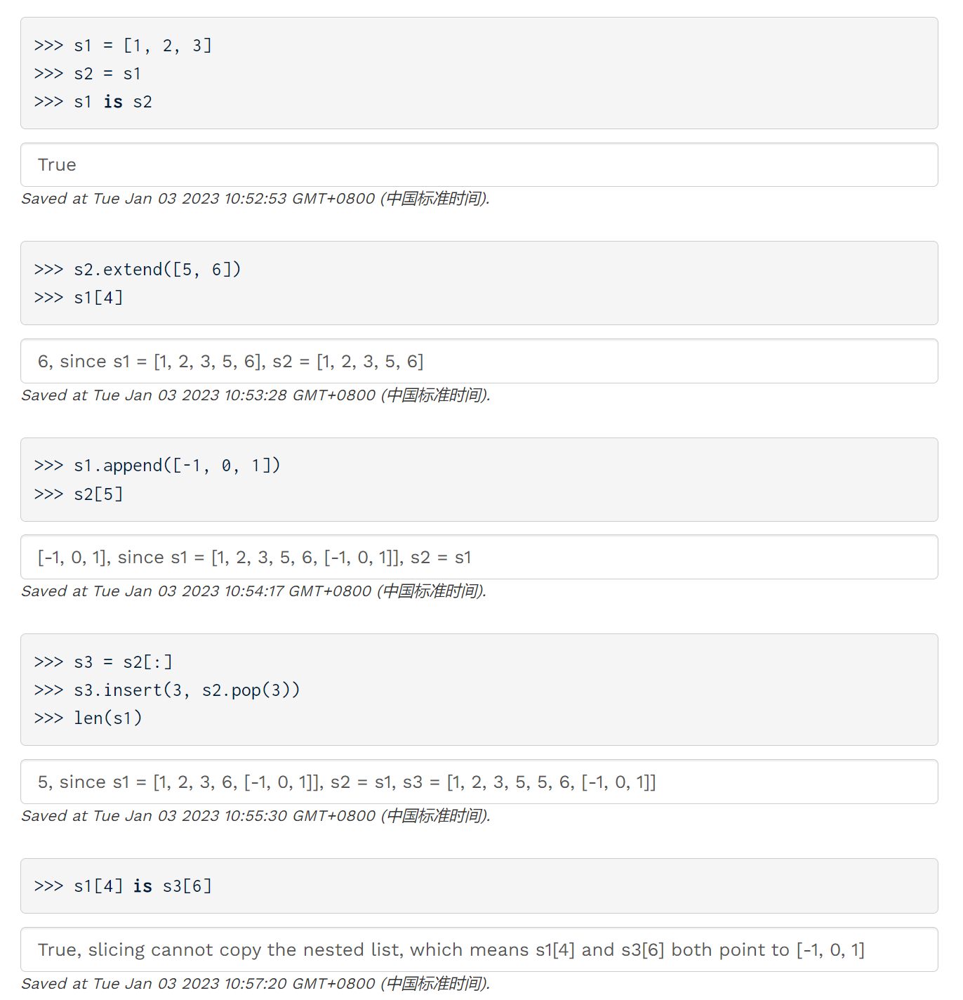

[released_disc_disc06_disc06.pdf](https://www.yuque.com/attachments/yuque/0/2023/pdf/12393765/1672667408588-9edf7c50-7fc5-4a92-a155-707fe890eb31.pdf)
[released_disc_sol-disc06_disc06.pdf](https://www.yuque.com/attachments/yuque/0/2023/pdf/12393765/1672667408606-86ce6439-ff2d-4c08-818b-9601a8cbb002.pdf)


# Mutability
## List Operations
> 

## Q1 WWPD: Mutability⭐⭐⭐⭐⭐
> See PDF Files, fundamental but important
> **Key Takeaways:**
> 1. Slicing operation will create a new copy, unaffected by further mutation of the old one.
> 2. Slicing operation is shallow copy, which doesn't recursively copy the nested list but only the reference.
> 3. `append(list)`add the list to the original list, creating a nested structure
> 4. `extend(list)`add the element of the list to the original list.

**Solution Group 1**
**Solution Group 2**
**Box and Pointer Graph**


## Q2 Add this Many
> 

```python
def add_this_many(x, el, s):
    """ Adds el to the end of s the number of times x occurs in s.
    >>> s = [1, 2, 4, 2, 1]
    >>> add_this_many(1, 5, s)
    >>> s
    [1, 2, 4, 2, 1, 5, 5]
    >>> add_this_many(2, 2, s)
    >>> s
    [1, 2, 4, 2, 1, 5, 5, 2, 2]
    """
    "*** YOUR CODE HERE ***"
    s.extend(len(list(filter(lambda t: t == x, s))) * [el])
```
**Alternate Solutions - append**

# Iterators
## Takeaways
> 


## Q3 WWPD: Iterators
> **Takeaways:**
> 1. `list(iterator)`will consume the rest of the iterables.
> 2. Since iteration is lazy, we can add and pop from the sequence when iterating.
> 3. Due to the special structure of dictionary, if we add or pop from dictionary while 

**Solution**


# Generators
## Takeaways
> 


## Q4 WWPD: Generators
> 

**Solution**


## Q5 Filter-Iter
> 
> **Takeaways:**
> 1. 正如我们在本周的`Lectures&Readings`中看到的那样: 
> 
`yield from <iterator>`, `yield from <generator>`,`yield from <iterable>` 均是合法的。
> `<iterator>`就比如说`iter(iterable)`
> `iterable`就可以是`range(5)`, `[1,2,3,4,5]`, 甚至是`dictionary`
> `<generator>`就可以是递归调用的`generator function`
> 2. `filter`函数返回一个`iterator`

```python
def filter_iter(iterable, f):
    """
    >>> is_even = lambda x: x % 2 == 0
    >>> list(filter_iter(range(5), is_even)) # a list of the values yielded from the call to filter_iter
    [0, 2, 4]
    >>> all_odd = (2*y-1 for y in range(5))
    >>> list(filter_iter(all_odd, is_even))
    []
    >>> naturals = (n for n in range(1, 100))
    >>> s = filter_iter(naturals, is_even)
    >>> next(s)
    2
    >>> next(s)
    4
    """
    "*** YOUR CODE HERE ***"
    yield from filter(f, iterable)
```
**Alternate Solutions**

## Q6 Primes Generator
> 

```python
def is_prime(n):
    """Returns True if n is a prime number and False otherwise.
    >>> is_prime(2)
    True
    >>> is_prime(16)
    False
    >>> is_prime(521)
    True
    """
    def helper(i):
        if i > (n ** 0.5): # Could replace with i == n
            return True
        elif n % i == 0:
            return False
        return helper(i + 1)
    return helper(2)

def primes_gen_ascending(n):
    """Generates primes in decreasing order.
    >>> pg = primes_gen_ascending(7)
    >>> list(pg)
    [2, 3, 5, 7]
    """
    if n == 1:
        return
    yield from primes_gen_ascending(n - 1)
    if is_prime(n):
        yield n

```
```python
def is_prime(n):
    """Returns True if n is a prime number and False otherwise.
    >>> is_prime(2)
    True
    >>> is_prime(16)
    False
    >>> is_prime(521)
    True
    """
    def helper(i):
        if i > (n ** 0.5): # Could replace with i == n
            return True
        elif n % i == 0:
            return False
        return helper(i + 1)
    return helper(2)


def primes_gen(n):
    """Generates primes in decreasing order.
    >>> pg = primes_gen(7)
    >>> list(pg)
    [7, 5, 3, 2]
    """
    if n == 1:
        return
    if is_prime(n):
        yield n
    yield from primes_gen(n-1)
```
**Solution - Descending**


## Q7 Generator Preorder⭐⭐⭐
> Part A, 参考[Lab05 Q8](https://www.yuque.com/alexman/ac5oth/ypvrb6ekku74b5eh#BzJZa)
> 
> Part B: 
> 
> 这个例子中就凸显了使用`yield`和`return`在递归中的明显区别。
> 在一个递归函数中，`yield`可以出现多次。换句话说, `yield`并不会立即终止当前函数的执行，而是相当于做了一个标记，然后所有在当前递归层中的`yield`结果都会被上一层函数调用的`yield from`捕获到。而`return`则会直接终止当前函数的执行并把结果返回到上一层的函数中。
> 所以我们使用`generator`实现递归的时候需要注意终止条件的书写。

```python

def preorder(t):
    """Return a list of the entries in this tree in the order that they
    would be visited by a preorder traversal (see problem description).

    >>> numbers = tree(1, [tree(2), tree(3, [tree(4), tree(5)]), tree(6, [tree(7)])])
    >>> preorder(numbers)
    [1, 2, 3, 4, 5, 6, 7]
    >>> preorder(tree(2, [tree(4, [tree(6)])]))
    [2, 4, 6]
    """
    "*** YOUR CODE HERE ***"
    if is_leaf(t):
        return [label(t)]

    result = [label(t)]
    for b in branches(t):
        result += preorder(b)

    return result

```
```python
def generate_preorder(t):
    """Yield the entries in this tree in the order that they
    would be visited by a preorder traversal (see problem description).

    >>> numbers = tree(1, [tree(2), tree(3, [tree(4), tree(5)]), tree(6, [tree(7)])])
    >>> gen = generate_preorder(numbers)
    >>> next(gen)
    1
    >>> list(gen)
    [2, 3, 4, 5, 6, 7]
    """
    "*** YOUR CODE HERE ***"
    # 注意这里千万不能加，否则结果就变成了[1,1,2,2,3,3,4,4,5,5,6,6,7,7]
	# if is_leaf(t):
    #     yield label(t)
    
    yield label(t)
    for b in branches(t):
        yield from generate_preorder(b)
```
**Solution**

## Q8 Mystery Reverse Environment Diagram
> 
> [https://pythontutor.com/cp/composingprograms.html#mode=edit](https://pythontutor.com/cp/composingprograms.html#mode=edit)
> 题目出的有点问题。

**Solution**
