[released_hw_hw05_hw05.zip](https://www.yuque.com/attachments/yuque/0/2023/zip/12393765/1672667447135-2cfa2cc3-5de7-4bc9-94c7-6469fc122044.zip)
[released_hw_sol-hw05_hw05.zip](https://www.yuque.com/attachments/yuque/0/2023/zip/12393765/1672667447137-c39d3da5-d116-45ba-9e35-60f79597ec4f.zip)
[Homework 5 _ CS 61A Fall 2022.pdf](https://www.yuque.com/attachments/yuque/0/2023/pdf/12393765/1672667518004-d52568d3-bd1b-487e-84e5-92dd8eeba6b5.pdf)
[Homework 5 Solutions _ CS 61A Fall 2022.pdf](https://www.yuque.com/attachments/yuque/0/2023/pdf/12393765/1672667518094-20164959-853b-450c-a4c2-53a4ad7b6d35.pdf)

# Required Questions
## Q1 Merge
> 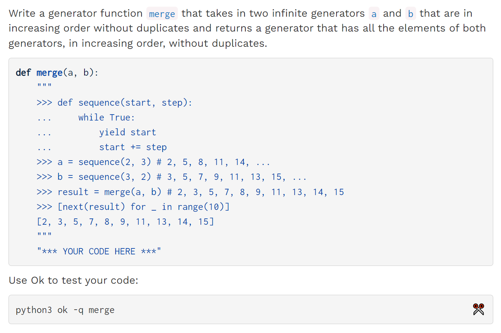
> 本题使用指针交替移动法，如果`a`元素小于`b`元素，则`yield b`且`next(b)`，如果大于则`yield(a); next(a)`如果等于则一起移动，因为我们不能重复。

```python
def merge(a, b):
    """
    >>> def sequence(start, step):
    ...     while True:
    ...         yield start
    ...         start += step
    >>> a = sequence(2, 3) # 2, 5, 8, 11, 14, ...
    >>> b = sequence(3, 2) # 3, 5, 7, 9, 11, 13, 15, ...
    >>> result = merge(a, b) # 2, 3, 5, 7, 8, 9, 11, 13, 14, 15
    >>> [next(result) for _ in range(10)]
    [2, 3, 5, 7, 8, 9, 11, 13, 14, 15]
    """
    "*** YOUR CODE HERE ***"
    seq_a = next(a)
    seq_b = next(b)
    while True:
        if seq_a > seq_b:
            yield seq_b
            seq_b = next(b)
        elif seq_a < seq_b:
            yield seq_a
            seq_a = next(a)
        else:
            yield seq_a
            seq_a = next(a)
            seq_b = next(b)

```
```python
def merge(a, b):
    """
    >>> def sequence(start, step):
    ...     while True:
    ...         yield start
    ...         start += step
    >>> a = sequence(2, 3) # 2, 5, 8, 11, 14, ...
    >>> b = sequence(3, 2) # 3, 5, 7, 9, 11, 13, 15, ...
    >>> result = merge(a, b) # 2, 3, 5, 7, 8, 9, 11, 13, 14, 15
    >>> [next(result) for _ in range(10)]
    [2, 3, 5, 7, 8, 9, 11, 13, 14, 15]
    """
    first_a, first_b = next(a), next(b)
    while True:
        if first_a == first_b:
            yield first_a
            first_a, first_b = next(a), next(b)
        elif first_a < first_b:
            yield first_a
            first_a = next(a)
        else:
            yield first_b
            first_b = next(b)

```

## Q2 Generate Permutations⭐⭐
> 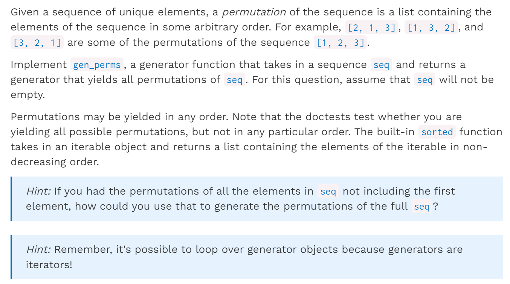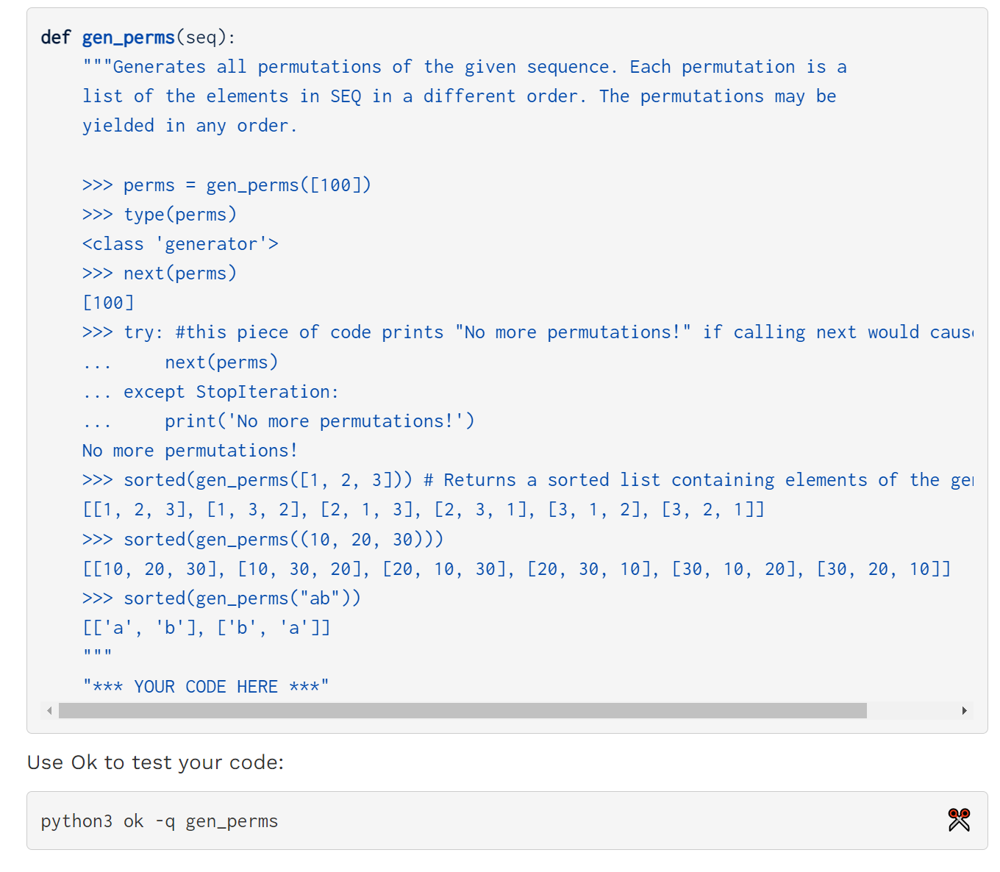
> 本题可以借助数学归纳的思想，如果我们已经有了三个元素的`permutation list`, 则如果增加了第四个元素，则需要在每种`permutation list`中的每一个可能的位置插入。用数学公式也很好理解，三个元素的排列有`3 x 2 x 1 = 6`种，四个元素的排列有`4 x 3 x 2 x 1 = 24`种。

```python

def gen_perms(seq):
    """Generates all permutations of the given sequence. Each permutation is a
    list of the elements in SEQ in a different order. The permutations may be
    yielded in any order.

    >>> perms = gen_perms([100])
    >>> type(perms)
    <class 'generator'>
    >>> next(perms)
    [100]
    >>> try: #this piece of code prints "No more permutations!" if calling next would cause an error
    ...     next(perms)
    ... except StopIteration:
    ...     print('No more permutations!')
    No more permutations!
    >>> sorted(gen_perms([1, 2, 3])) # Returns a sorted list containing elements of the generator
    [[1, 2, 3], [1, 3, 2], [2, 1, 3], [2, 3, 1], [3, 1, 2], [3, 2, 1]]
    >>> sorted(gen_perms((10, 20, 30)))
    [[10, 20, 30], [10, 30, 20], [20, 10, 30], [20, 30, 10], [30, 10, 20], [30, 20, 10]]
    >>> sorted(gen_perms("ab"))
    [['a', 'b'], ['b', 'a']]
    """
    "*** YOUR CODE HERE ***"
    if len(seq) == 1:
        yield [seq[-1]]
    else:
        result = []
        for permutation in gen_perms(seq[:-1]):
            for i in range(len(permutation)+1):
                permutation.insert(i, seq[-1])
                result.append(permutation[:])
                permutation.pop(i)
        yield from result
```
```python
def gen_perms(seq):
    """Generates all permutations of the given sequence. Each permutation is a
    list of the elements in SEQ in a different order. The permutations may be
    yielded in any order.

    >>> perms = gen_perms([100])
    >>> type(perms)
    <class 'generator'>
    >>> next(perms)
    [100]
    >>> try: #this piece of code prints "No more permutations!" if calling next would cause an error
    ...     next(perms)
    ... except StopIteration:
    ...     print('No more permutations!')
    No more permutations!
    >>> sorted(gen_perms([1, 2, 3])) # Returns a sorted list containing elements of the generator
    [[1, 2, 3], [1, 3, 2], [2, 1, 3], [2, 3, 1], [3, 1, 2], [3, 2, 1]]
    >>> sorted(gen_perms((10, 20, 30)))
    [[10, 20, 30], [10, 30, 20], [20, 10, 30], [20, 30, 10], [30, 10, 20], [30, 20, 10]]
    >>> sorted(gen_perms("ab"))
    [['a', 'b'], ['b', 'a']]
    """
    if not seq:
        yield []
    else:
        for perm in gen_perms(seq[1:]):
            for i in range(len(seq)):
                yield perm[:i] + [seq[0]] + perm[i:]
```
> 在`Solution-Smart`中，我们需要在每种`permutation`列表中插入新的元素，可以使用`seq[:i]+[new]+seq[i:]`实现。


## Q3 Yield Path⭐⭐⭐⭐⭐
> 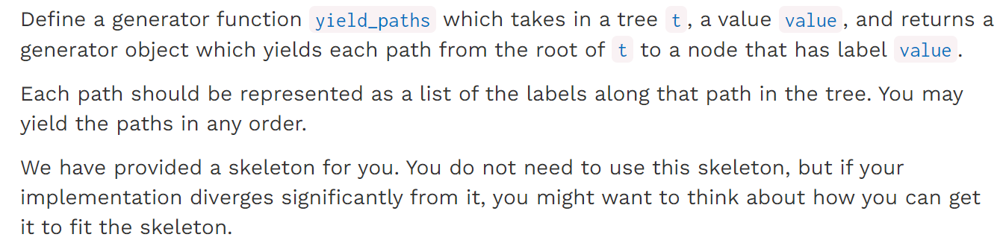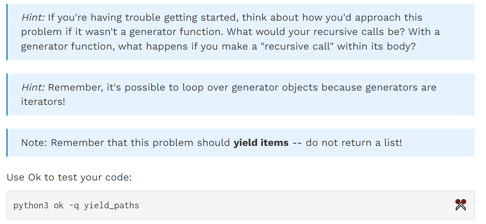

```python

def yield_paths(t, value):
    """Yields all possible paths from the root of t to a node with the label
    value as a list.

    >>> t1 = tree(1, [tree(2, [tree(3), tree(4, [tree(6)]), tree(5)]), tree(5)])
    >>> print_tree(t1)
    1
      2
        3
        4
          6
        5
      5
    >>> next(yield_paths(t1, 6))
    [1, 2, 4, 6]
    >>> path_to_5 = yield_paths(t1, 5)
    >>> sorted(list(path_to_5))
    [[1, 2, 5], [1, 5]]

    >>> t2 = tree(0, [tree(2, [t1])])
    >>> print_tree(t2)
    0
      2
        1
          2
            3
            4
              6
            5
          5
    >>> path_to_2 = yield_paths(t2, 2)
    >>> sorted(list(path_to_2))
    [[0, 2], [0, 2, 1, 2]]
    """
    "*** YOUR CODE HERE ***"
    for _______________ in _________________:
        for _______________ in _________________:
            "*** YOUR CODE HERE ***"
```
```python
def yield_paths(t, value):
    "*** YOUR CODE HERE ***"
    for b in branches(t):
        for path in yield_paths(b, value):
            "*** YOUR CODE HERE ***"
            yield [label(t)] + path
	# 如果这个Node没有branches, 即是leaf的时候，我们就yield 这个节点列表
    if label(t) == value:
        yield [label(t)]
```
```python
def yield_paths(t, value):
    """
    >>> t2 = tree(0, [tree(2, [t1])])
    >>> print_tree(t2)
    0
      2
        1
          2
            3
            4
              6
            5
          5
    >>> path_to_2 = yield_paths(t2, 2)
    >>> sorted(list(path_to_2))
    [[0, 2], [0, 2, 1, 2]]
    """
    if label(t) == value:
    	yield [value]
    # 函数不会返回，而是继续向下寻找，所以不会漏掉[0,2,1,2]这个情况
    for b in branches(t):
    	for path in yield_paths(b, value):
    		yield [label(t)] + path

```
**Analysis**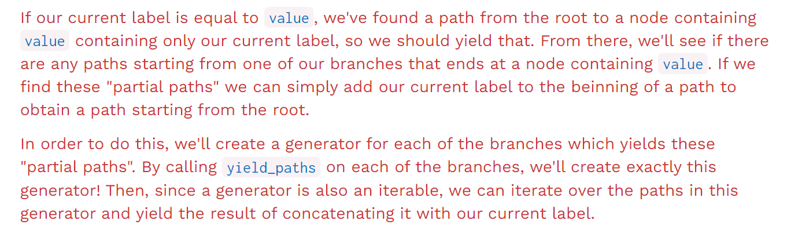
> 本题还可以使用普通的`Recursion`进行求解。但是会复杂很多，而且有非常多的注意点。

```python
# Alt - Normal Recursion
def yield_path_recur(t,value):
    res = []

    def helper(t, value, curr_path):
        curr_path += [label(t)]
        if label(t) == value:
            res.append(curr_path)
        for b in branches(t):
            helper(b, value, curr_path[:])

    helper(t,value, [])
    return res
```


# Optional Questions
## Q4 Infinite Hailstone⭐⭐
> 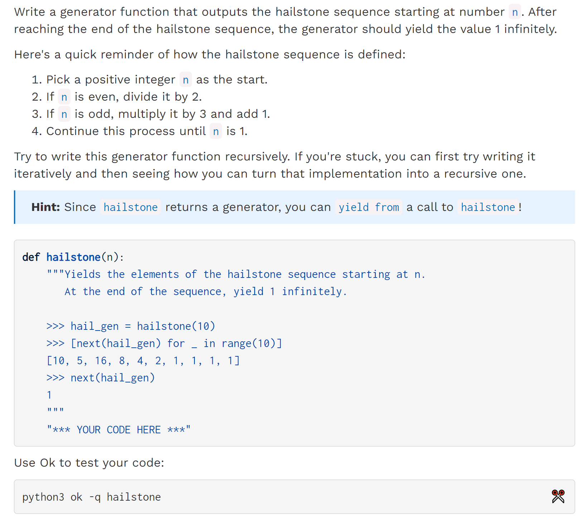

```python
def hailstone(n):
    """Yields the elements of the hailstone sequence starting at n.
       At the end of the sequence, yield 1 infinitely.

    >>> hail_gen = hailstone(10)
    >>> [next(hail_gen) for _ in range(10)]
    [10, 5, 16, 8, 4, 2, 1, 1, 1, 1]
    >>> next(hail_gen)
    1
    """
    "*** YOUR CODE HERE ***"
    if n == 1:
        while True:
            yield 1

    yield n
    if n % 2 == 1:
        yield from hailstone(3 * n + 1)
    else:
        yield from hailstone(n // 2)
```
```python
def hailstone(n):
    """Yields the elements of the hailstone sequence starting at n.
       At the end of the sequence, yield 1 infinitely.

    >>> hail_gen = hailstone(10)
    >>> [next(hail_gen) for _ in range(10)]
    [10, 5, 16, 8, 4, 2, 1, 1, 1, 1]
    >>> next(hail_gen)
    1
    """
    yield n
    if n == 1:
        yield from hailstone(n)
    elif n % 2 == 0:
        yield from hailstone(n // 2)
    else:
        yield from hailstone(n * 3 + 1)
```


## Q5 Higher-Order Generator⭐⭐⭐⭐
> 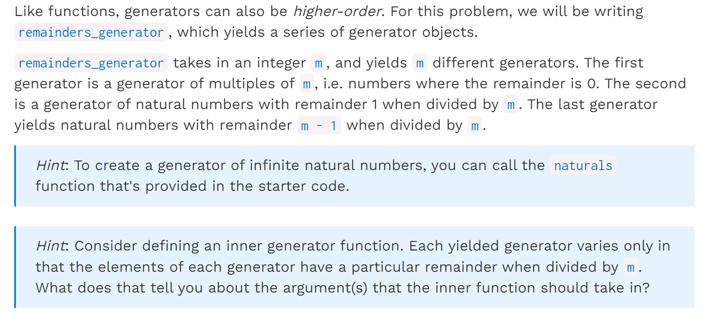

```python
def remainders_generator(m):
    """
    Yields m generators. The ith yielded generator yields natural numbers whose
    remainder is i when divided by m.

    >>> import types
    >>> [isinstance(gen, types.GeneratorType) for gen in remainders_generator(5)]
    [True, True, True, True, True]
    >>> remainders_four = remainders_generator(4)
    >>> for i in range(4):
    ...     print("First 3 natural numbers with remainder {0} when divided by 4:".format(i))
    ...     gen = next(remainders_four)
    ...     for _ in range(3):
    ...         print(next(gen))
    First 3 natural numbers with remainder 0 when divided by 4:
    4
    8
    12
    First 3 natural numbers with remainder 1 when divided by 4:
    1
    5
    9
    First 3 natural numbers with remainder 2 when divided by 4:
    2
    6
    10
    First 3 natural numbers with remainder 3 when divided by 4:
    3
    7
    11
    """
    "*** YOUR CODE HERE ***"
```
```python
def remainders_generator(m):
    """
    Yields m generators. The ith yielded generator yields natural numbers whose
    remainder is i when divided by m.

    >>> import types
    >>> [isinstance(gen, types.GeneratorType) for gen in remainders_generator(5)]
    [True, True, True, True, True]
    >>> remainders_four = remainders_generator(4)
    >>> for i in range(4):
    ...     print("First 3 natural numbers with remainder {0} when divided by 4:".format(i))
    ...     gen = next(remainders_four)
    ...     for _ in range(3):
    ...         print(next(gen))
    First 3 natural numbers with remainder 0 when divided by 4:
    4
    8
    12
    First 3 natural numbers with remainder 1 when divided by 4:
    1
    5
    9
    First 3 natural numbers with remainder 2 when divided by 4:
    2
    6
    10
    First 3 natural numbers with remainder 3 when divided by 4:
    3
    7
    11
    """
    def gen(i):
        for e in naturals():
            if e % m == i:
                yield e
    for i in range(m):
        yield gen(i)

```


# Exam Practice
## Q6 Constant Generator⭐⭐⭐⭐
> 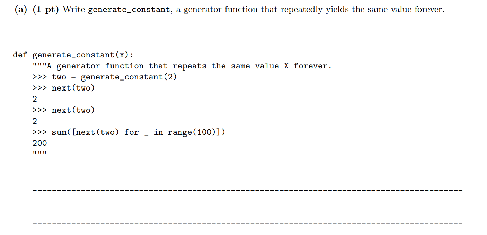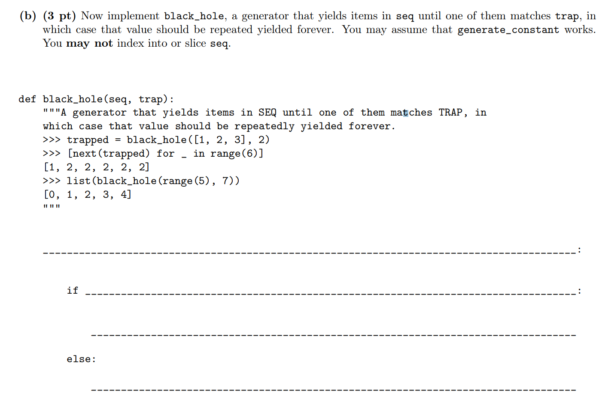

```python
# a
def generate_constant(x):
    """A generator function that repeats the same value X forever.
    >>> two = generate_constant(2)
    >>> next(two)
    2
    >>> next(two)
    2
    >>> sum([next(two) for _ in range(100)])
    200
    """
    yield x
    yield from generate_constant(x)


def black_hole(seq, trap):
    """A generator that yields items in SEQ until one of them matches TRAP, in
    which case that value should be repeatedly yielded forever.
    >>> trapped = black_hole([1, 2, 3], 2)
    >>> [next(trapped) for _ in range(6)]
    [1, 2, 2, 2, 2, 2]
    >>> list(black_hole(range(5), 7))
    [0, 1, 2, 3, 4]
    """
    for i in seq:
        if i == trap:
            yield from generate_constant(trap)
        else:
            yield i
```
**Solution - While Loop with Yield**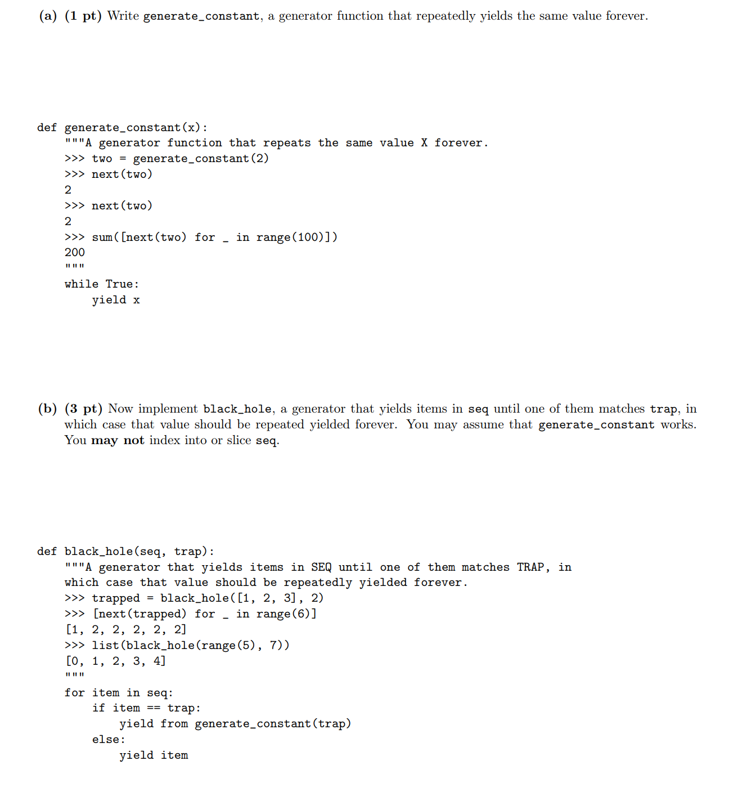


## Q7 Iterators are inevitable⭐⭐⭐
> 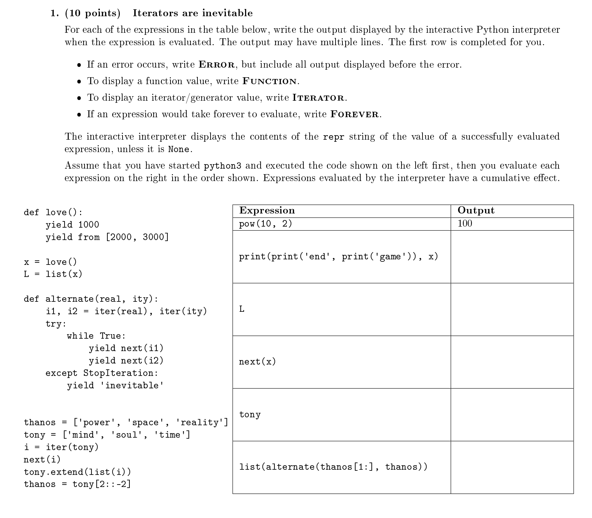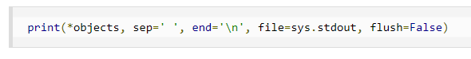
> 本题极其易错，问的是左侧代码执行完毕后的输出。

**Solution and Environment Diagram**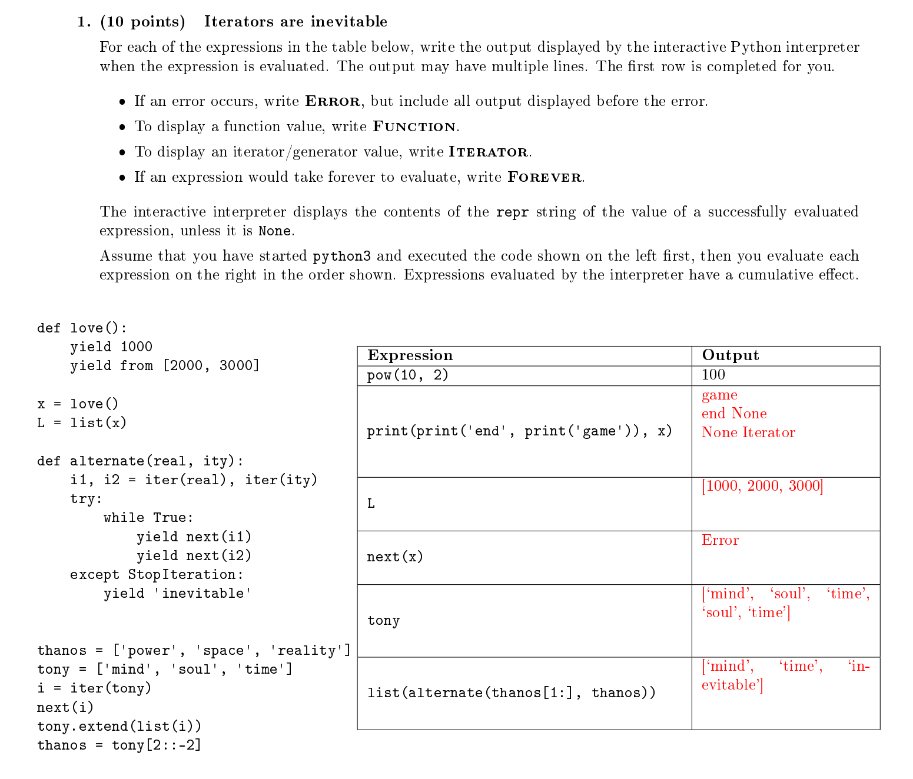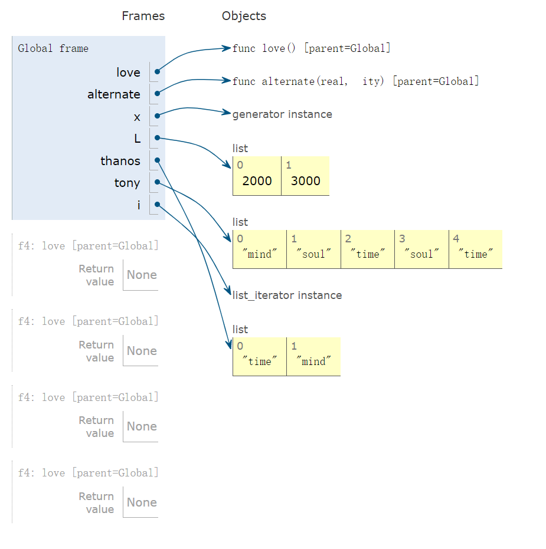


## Q8 Trie⭐⭐⭐⭐⭐
> 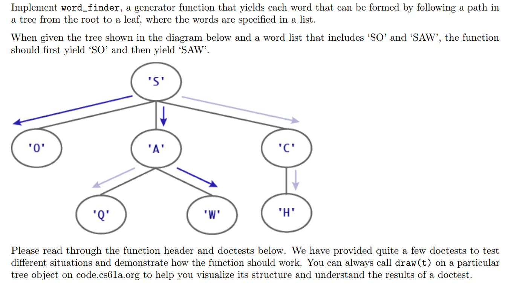
> 和[Homework 04 Q6](https://www.yuque.com/alexman/ac5oth/vff2y5la32hlt6z0#hI5Eb)很类似

```python

def word_finder(letter_tree, words_list):
    """ Generates each word that can be formed by following a path
    in TREE_OF_LETTERS from the root to a leaf,
    where WORDS_LIST is a list of allowed words (with no duplicates).
    # Case 1: 2 words found
    >>> words = ['SO', 'SAT', 'SAME', 'SAW', 'SOW']
    >>> t = Tree("S", [Tree("O"), Tree("A", [Tree("Q"), Tree("W")]), Tree("C", [Tree("H")])])
    >>> gen = word_finder(t, words)
    >>> next(gen)
    'SO'
    >>> next(gen)
    'SAW'
    >>> list(word_finder(t, words))
    ['SO', 'SAW']
    # Case 2: No words found
    >>> t = Tree("S", [Tree("I"), Tree("A", [Tree("Q"), Tree("E")]), Tree("C", [Tree("H")])])
    >>> list(word_finder(t, words))
    []
    # Case 3: Same word twice
    >>> t = Tree("S", [Tree("O"), Tree("O")] )
    >>> list(word_finder(t, words))
    ['SO', 'SO']
    # Case 4: Words that start the same
    >>> words = ['TAB', 'TAR', 'BAT', 'BAR', 'RAT']
    >>> t = Tree("T", [Tree("A", [Tree("R"), Tree("B")])])
    >>> list(word_finder(t, words))
    ['TAR', 'TAB']
    # Case 5: Single letter words
    >>> words = ['A', 'AN', 'AH']
    >>> t = Tree("A")
    >>> list(word_finder(t, words))
    ['A']
    # Case 6: Words end in leaf
    >>> words = ['A', 'AN', 'AH']
    >>> t = Tree("A", [Tree("H"), Tree("N")])
    >>> list(word_finder(t, words))
    ['AH', 'AN']
    # Case 7: Words start at root
    >>> words = ['GO', 'BEARS', 'GOB', 'EARS']
    >>> t = Tree("B", [Tree("E", [Tree("A", [Tree("R", [Tree("S")])])])])
    >>> list(word_finder(t, words))
    ['BEARS']
    # Case 8: This special test ensures that your solution does *not*
    # pre-compute all the words before yielding the first one.
    # If done correctly, your solution should error only when it
    # tries to find the second word in this tree.
    >>> words = ['SO', 'SAM', 'SAT', 'SAME', 'SAW', 'SOW']
    >>> t = Tree("S", [Tree("O"), Tree("A", [Tree("Q"), Tree(1)]), Tree("C", [Tree(1)])])
    >>> gen = word_finder(t, words)
    >>> next(gen)
    'SO'
    >>> try:
    ... next(gen)
    ... except TypeError:
    ... print("Got a TypeError!")
    ... else:
    ... print("Expected a TypeError!")
    Got a TypeError!
    """
    def _________(____):
        _______________ # Optional
        if ____________:
            yield ______________
        for ___________:
            yield from _________
    yield from __________
```
```python
def word_finder(letter_tree, words_list):
    def word_builder(t, word_so_far):
        word_so_far += t.label
        if t.is_leaf() and word_so_far in words_list:
            yield word_so_far
        for b in t.branches:
            yield from word_builder(b, word_so_far):
    yield from word_builder(letter_tree, "")
```
**Walkthrough**[https://cs61a.org/exam/sp21/mt2/guide/#the-tree-of-l-i-f-e](https://cs61a.org/exam/sp21/mt2/guide/#the-tree-of-l-i-f-e)


## Q9 Power of Two with Yield⭐⭐⭐
> 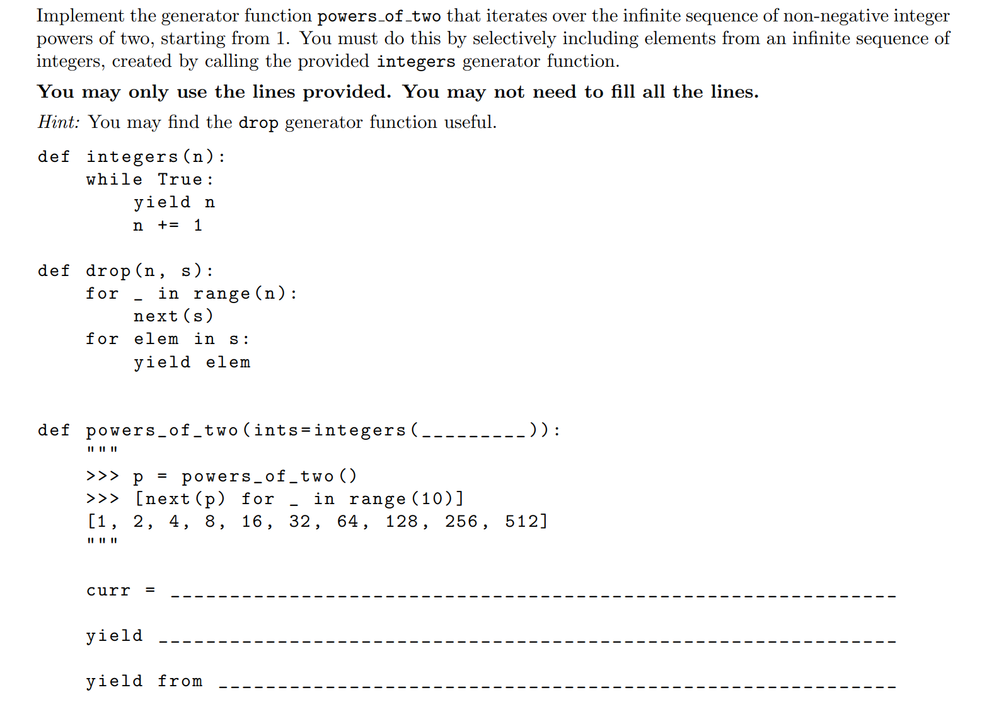

```python
def integers ( n ):
    while True :
        yield n
        n += 1

def drop (n , s ):
    for _ in range ( n ):
        next ( s )
    for elem in s :
        yield elem


# 这个ints生成器会一直存有最新的位置信息
def powers_of_two ( ints = integers ( 1 )):
    """
    >>> p = powers_of_two ()
    >>> [ next (p) for _ in range (10)]
    [1, 2, 4, 8, 16, 32, 64, 128, 256, 512]
    """
    curr = next(ints)
    yield curr
    yield from powers_of_two(drop(curr-1 ,ints))
```


## Q10 Repeated Call with Yield⭐⭐
> 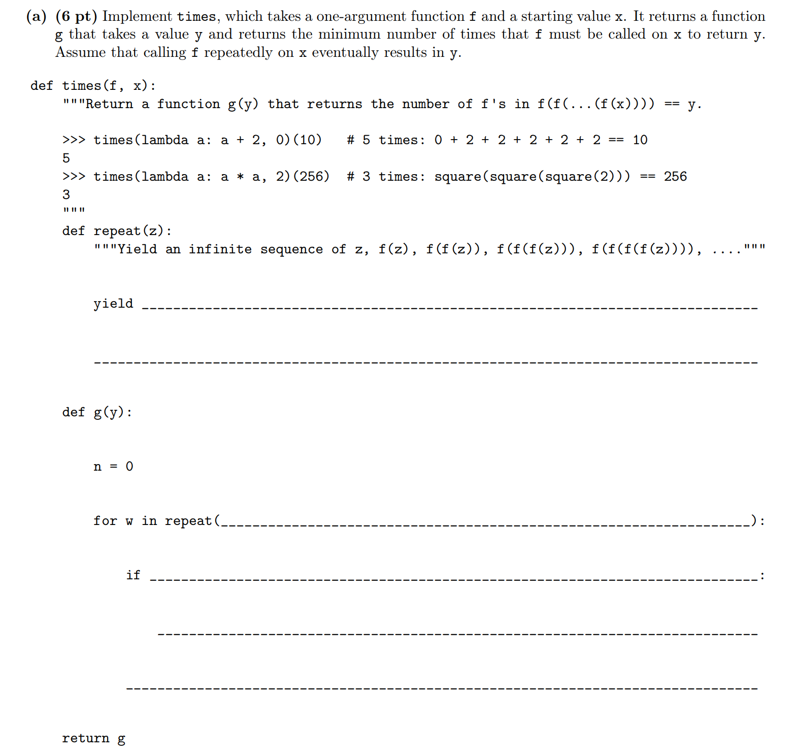
> 本题我们了解到了`yield`可以更方便地实现`repeated call`的功能，详见下面的`repeat(...)`函数。

```python
def times(f, x):
    """Return a function g(y) that returns the number of f's in f(f(...(f(x)))) == y.
    >>> times(lambda a: a + 2, 0)(10) # 5 times: 0 + 2 + 2 + 2 + 2 + 2 == 10
    5
    >>> times(lambda a: a * a, 2)(256) # 3 times: square(square(square(2))) == 256
    3
    """
    def repeat(z):
        """Yield an infinite sequence of z, f(z), f(f(z)), f(f(f(z))), f(f(f(f(z)))), ...."""
        yield z
        yield from repeat(f(z))

    def g(y):
        n = 0
        for w in repeat(x):
            if w == y:
                return n
            n += 1
    return g
```
