[released_lab_lab07_lab07.zip](https://www.yuque.com/attachments/yuque/0/2023/zip/12393765/1672753775157-e9d0e752-53b0-4c3c-b0bf-2fe3579a02db.zip)
[released_lab_sol-lab07_lab07.zip](https://www.yuque.com/attachments/yuque/0/2023/zip/12393765/1672753775210-538269d2-cca6-4712-ac87-6452fb1874b1.zip)
[Lab 7_ Object-Oriented Programming _ CS 61A Fall 2022.pdf](https://www.yuque.com/attachments/yuque/0/2023/pdf/12393765/1672753832169-5157841c-fe5b-4d65-8bec-2edbc95474c0.pdf)

# Basics
## Q1: WWPD: Classy Cars
> 详见zip文件。
> **Takeaways:**
> 1. `Class`不能访问`instance`上定义或者添加的`attributes`或者`methods`
> 2. 通过`instance.new_attri`不会改变`Class.new_attri`，而只会在该`instance`上挂载。


# Coding Practice
## Background
> 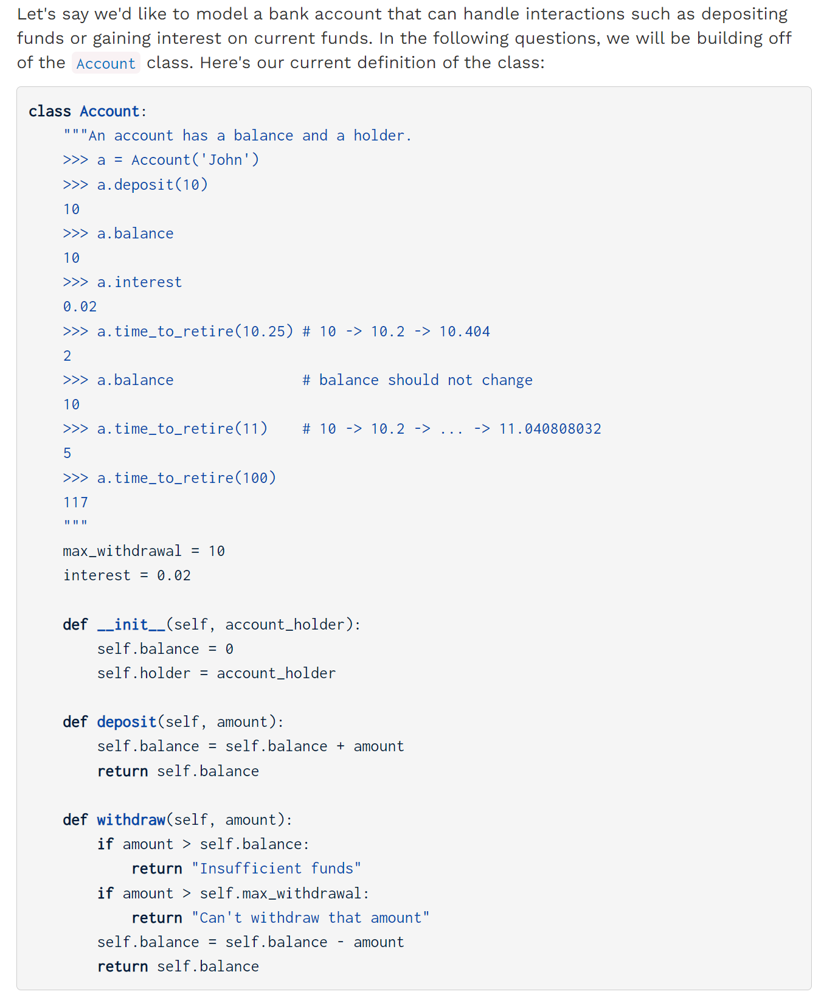


## Q2 Retirement
> 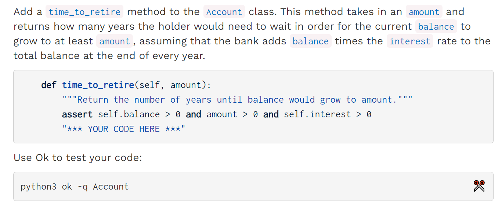

```python
class Account:
    """An account has a balance and a holder.
    >>> a = Account('John')
    >>> a.deposit(10)
    10
    >>> a.balance
    10
    >>> a.interest
    0.02
    >>> a.time_to_retire(10.25) # 10 -> 10.2 -> 10.404
    2
    >>> a.balance               # balance should not change
    10
    >>> a.time_to_retire(11)    # 10 -> 10.2 -> ... -> 11.040808032
    5
    >>> a.time_to_retire(100)
    117
    """
    max_withdrawal = 10
    interest = 0.02

    def __init__(self, account_holder):
        self.balance = 0
        self.holder = account_holder

    def deposit(self, amount):
        self.balance = self.balance + amount
        return self.balance

    def withdraw(self, amount):
        if amount > self.balance:
            return "Insufficient funds"
        if amount > self.max_withdrawal:
            return "Can't withdraw that amount"
        self.balance = self.balance - amount
        return self.balance

    def time_to_retire(self, amount):
        """Return the number of years until balance would grow to amount."""
        assert self.balance > 0 and amount > 0 and self.interest > 0
        "*** YOUR CODE HERE ***"
        time, multipler = 0, 1 + self.interest
        curr = self.balance * multipler
        while curr < amount:
            curr, time = curr * multipler, time + 1
        return time + 1
```
```python
class Account:
    max_withdrawal = 10
    interest = 0.02

    def __init__(self, account_holder):
        self.balance = 0
        self.holder = account_holder

    def deposit(self, amount):
        self.balance = self.balance + amount
        return self.balance

    def withdraw(self, amount):
        if amount > self.balance:
            return "Insufficient funds"
        if amount > self.max_withdrawal:
            return "Can't withdraw that amount"
        self.balance = self.balance - amount
        return self.balance

    def time_to_retire(self, amount):
        """Return the number of years until balance would grow to amount."""
        assert self.balance > 0 and amount > 0 and self.interest > 0
        future = self.balance
        years = 0
        while future < amount:
            future += self.interest * future
            years += 1
        return years
```

## Q3 FreeChecking
> 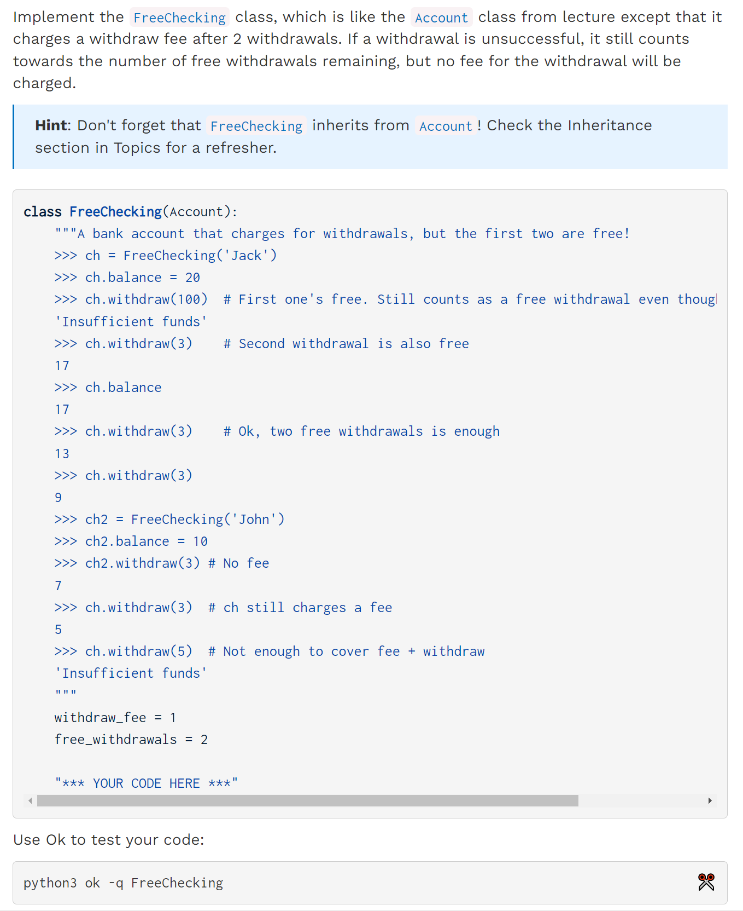

```python
class FreeChecking(Account):
    """A bank account that charges for withdrawals, but the first two are free!
    >>> ch = FreeChecking('Jack')
    >>> ch.balance = 20
    >>> ch.withdraw(100)  # First one's free. Still counts as a free withdrawal even though it was unsuccessful
    'Insufficient funds'
    >>> ch.withdraw(3)    # Second withdrawal is also free
    17
    >>> ch.balance
    17
    >>> ch.withdraw(3)    # Ok, two free withdrawals is enough
    13
    >>> ch.withdraw(3)
    9
    >>> ch2 = FreeChecking('John')
    >>> ch2.balance = 10
    >>> ch2.withdraw(3) # No fee
    7
    >>> ch.withdraw(3)  # ch still charges a fee
    5
    >>> ch.withdraw(5)  # Not enough to cover fee + withdraw
    'Insufficient funds'
    """
    withdraw_fee = 1
    free_withdrawals = 2

    "*** YOUR CODE HERE ***"
    def __init__(self,name, withdraw_fee = withdraw_fee, free_withdrawls = free_withdrawals):
        super().__init__(name)
        self.withdraw_fee = withdraw_fee
        self.free_withdrawals = free_withdrawls


    def withdraw(self, amount):
        if self.free_withdrawals > 0:
            self.free_withdrawals -= 1
            return super().withdraw(amount)
        else:
            return super().withdraw(amount + self.withdraw_fee)
```
```python
class FreeChecking(Account):
    """A bank account that charges for withdrawals, but the first two are free!
    >>> ch = FreeChecking('Jack')
    >>> ch.balance = 20
    >>> ch.withdraw(100)  # First one's free. Still counts as a free withdrawal even though it was unsuccessful
    'Insufficient funds'
    >>> ch.withdraw(3)    # Second withdrawal is also free
    17
    >>> ch.balance
    17
    >>> ch.withdraw(3)    # Ok, two free withdrawals is enough
    13
    >>> ch.withdraw(3)
    9
    >>> ch2 = FreeChecking('John')
    >>> ch2.balance = 10
    >>> ch2.withdraw(3) # No fee
    7
    >>> ch.withdraw(3)  # ch still charges a fee
    5
    >>> ch.withdraw(5)  # Not enough to cover fee + withdraw
    'Insufficient funds'
    """
    withdraw_fee = 1
    free_withdrawals = 2

    def __init__(self, account_holder):
        super().__init__(account_holder)
        self.withdrawals = 0

    def withdraw(self, amount):
        self.withdrawals += 1
        fee = 0
        if self.withdrawals > self.free_withdrawals:
            fee = self.withdraw_fee
        return super().withdraw(amount + fee)

    # Alternative solution where you don't need to include init.
    # Check out the video solution for more.
    def withdraw(self, amount):
        # 这一行相当于self.free_withdrawals = self.free_withdrawals - 1, 会给这个类
        # 创建一个新的变量，所以可以不用__init__
        self.free_withdrawals -= 1
        if self.free_withdrawals >= 0:
            return super().withdraw(amount)
        return super().withdraw(amount + self.withdraw_fee)
```

# Magic: the Lambda-ing
## Game Background
> 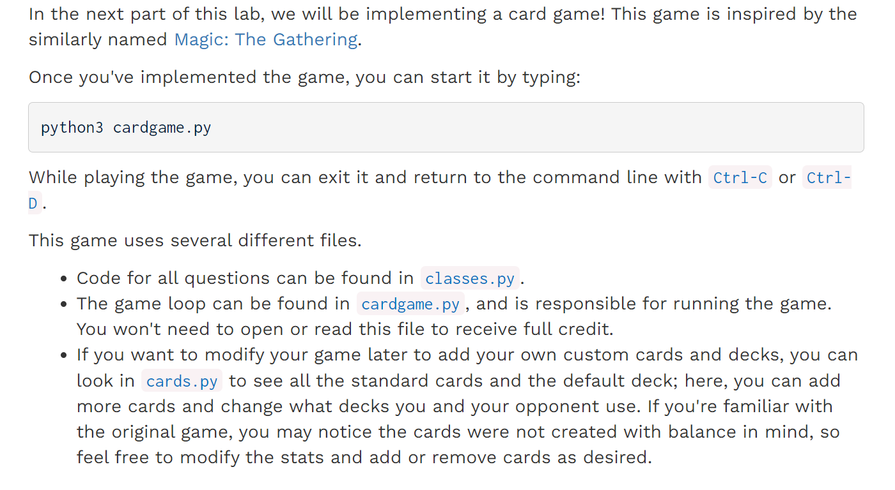


## Rules of the Game
> 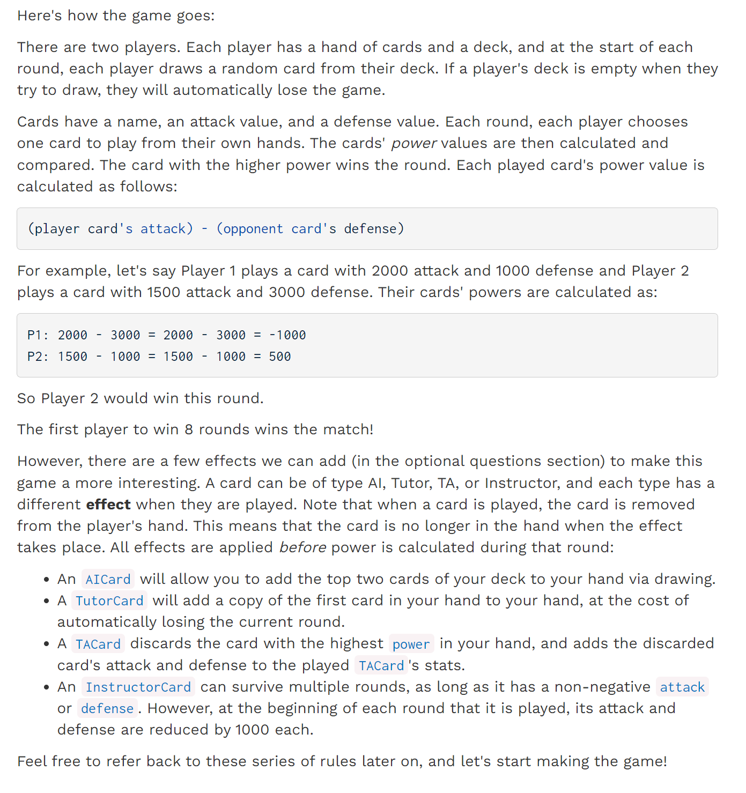


## Q4 Making Cards
> 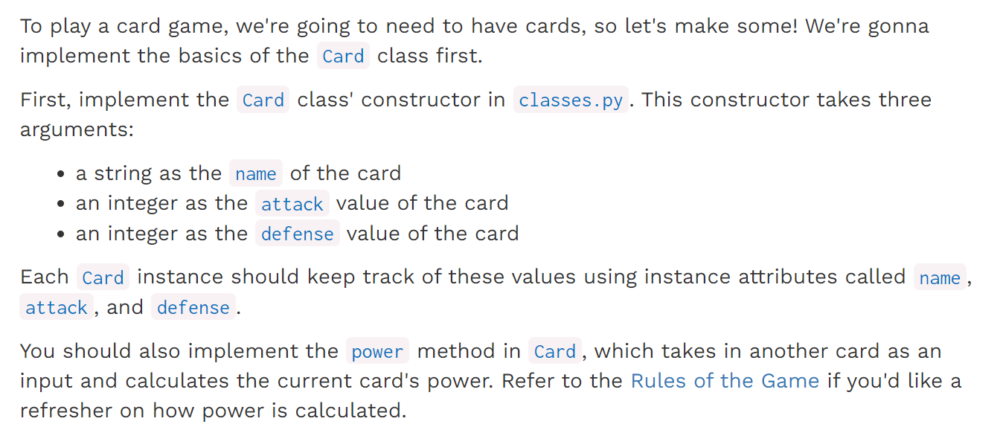
> `**Power**`**计算公式:**
> 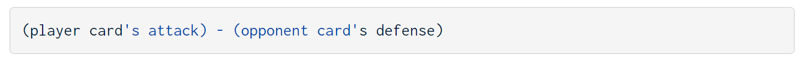

```python
class Card:
    cardtype = 'Staff'

    def __init__(self, name, attack, defense):
        """
        Create a Card object with a name, attack,
        and defense.
        >>> staff_member = Card('staff', 400, 300)
        >>> staff_member.name
        'staff'
        >>> staff_member.attack
        400
        >>> staff_member.defense
        300
        >>> other_staff = Card('other', 300, 500)
        >>> other_staff.attack
        300
        >>> other_staff.defense
        500
        """
        "*** YOUR CODE HERE ***"
        self.name = name
        self.attack = attack
        self.defense = defense


    def power(self, opponent_card):
        """
        Calculate power as:
        (player card's attack) - (opponent card's defense)
        >>> staff_member = Card('staff', 400, 300)
        >>> other_staff = Card('other', 300, 500)
        >>> staff_member.power(other_staff)
        -100
        >>> other_staff.power(staff_member)
        0
        >>> third_card = Card('third', 200, 400)
        >>> staff_member.power(third_card)
        0
        >>> third_card.power(staff_member)
        -100
        """
        "*** YOUR CODE HERE ***"
        return self.attack - opponent_card.defense


    def effect(self, opponent_card, player, opponent):
        """
        Cards have no default effect.
        """
        return

    def __repr__(self):
        """
        Returns a string which is a readable version of
        a card, in the form:
        <cardname>: <cardtype>, [<attack>, <defense>]
        """
        return '{}: {}, [{}, {}]'.format(self.name, self.cardtype, self.attack, self.defense)

    def copy(self):
        """
        Returns a copy of this card.
        """
        return Card(self.name, self.attack, self.defense)
```


## Q5 Making a Player
> 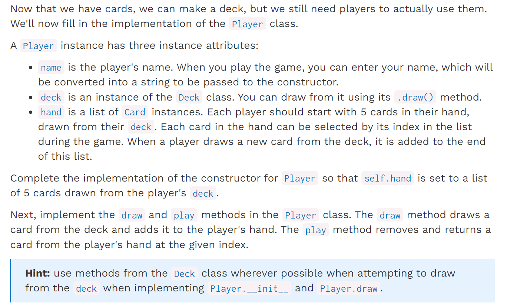

**Deck Class**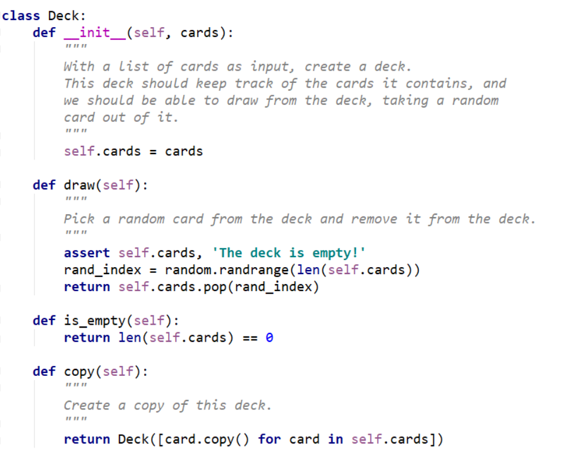
```python

class Player:
    def __init__(self, deck, name):
        """Initialize a Player object.
        A Player starts the game by drawing 5 cards from their deck. Each turn,
        a Player draws another card from the deck and chooses one to play.
        >>> test_card = Card('test', 100, 100)
        >>> test_deck = Deck([test_card.copy() for _ in range(6)])
        >>> test_player = Player(test_deck, 'tester')
        >>> len(test_deck.cards)
        1
        >>> len(test_player.hand)
        5
        """
        self.deck = deck
        self.name = name
        "*** YOUR CODE HERE ***"
        self.hand = [deck.draw() for _ in range(5)]

    def draw(self):
        """Draw a card from the player's deck and add it to their hand.
        >>> test_card = Card('test', 100, 100)
        >>> test_deck = Deck([test_card.copy() for _ in range(6)])
        >>> test_player = Player(test_deck, 'tester')
        >>> test_player.draw()
        >>> len(test_deck.cards)
        0
        >>> len(test_player.hand)
        6
        """
        assert not self.deck.is_empty(), 'Deck is empty!'
        "*** YOUR CODE HERE ***"
        self.hand.append(self.deck.draw())

    def play(self, index):
        """Remove and return a card from the player's hand at the given INDEX.
        >>> from cards import *
        >>> test_player = Player(standard_deck, 'tester')
        >>> ta1, ta2 = TACard("ta_1", 300, 400), TACard("ta_2", 500, 600)
        >>> tutor1, tutor2 = TutorCard("t1", 200, 500), TutorCard("t2", 600, 400)
        >>> test_player.hand = [ta1, ta2, tutor1, tutor2]
        >>> test_player.play(0) is ta1
        True
        >>> test_player.play(2) is tutor2
        True
        >>> len(test_player.hand)
        2
        """
        return self.hand.pop(index)

    def display_hand(self):
        """
        Display the player's current hand to the user.
        """
        print('Your hand:')
        for card_index, displayed_card in zip(range(len(self.hand)), [str(card) for card in self.hand]):
            indent = ' ' * (5 - len(str(card_index)))
            print(card_index, indent + displayed_card)

    def play_random(self):
        """
        Play a random card from hand.
        """
        return self.play(random.randrange(len(self.hand)))
```


# Optional Questions: Card Types
> 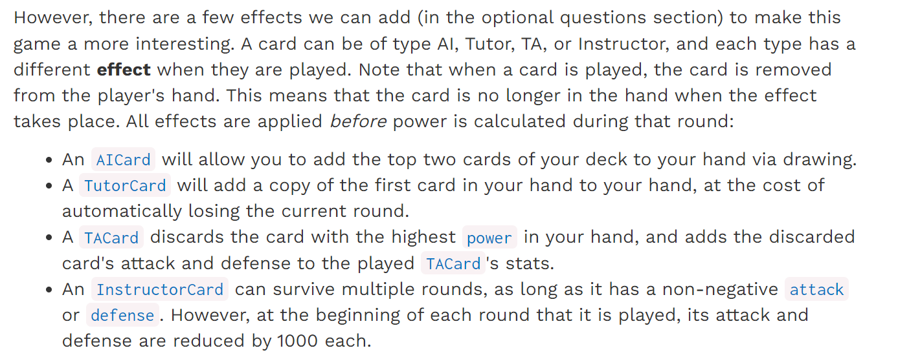

## Q6 AIs: Resourceful Resources
> 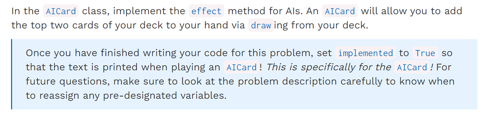

```python
class AICard(Card):
    cardtype = 'AI'

    def effect(self, opponent_card, player, opponent):
        """
        Add the top two cards of your deck to your hand via drawing.
        Once you have finished writing your code for this problem,
        set implemented to True so that the text is printed when
        playing an AICard.

        >>> from cards import *
        >>> player1, player2 = Player(standard_deck.copy(), 'p1'), Player(standard_deck.copy(), 'p2')
        >>> opponent_card = Card("other", 500, 500)
        >>> test_card = AICard("AI Card", 500, 500)
        >>> initial_deck_length = len(player1.deck.cards)
        >>> initial_hand_size = len(player1.hand)
        >>> test_card.effect(opponent_card, player1, player2)
        AI Card allows me to draw two cards!
        >>> initial_hand_size == len(player1.hand) - 2
        True
        >>> initial_deck_length == len(player1.deck.cards) + 2
        True
        """
        "*** YOUR CODE HERE ***"
        implemented = True   # Set from False to True
        
        # You should add your implementation above this.
        if implemented:
            print(f"{self.name} allows me to draw two cards!")

    def copy(self):
        """
        Create a copy of this card.
        """
        return AICard(self.name, self.attack, self.defense)
```
```python
class AICard(Card):
    cardtype = 'AI'

    def effect(self, opponent_card, player, opponent):
        """
        Add the top two cards of your deck to your hand via drawing.
        Once you have finished writing your code for this problem,
        set implemented to True so that the text is printed when
        playing an AICard.

        >>> from cards import *
        >>> player1, player2 = Player(standard_deck.copy(), 'p1'), Player(standard_deck.copy(), 'p2')
        >>> opponent_card = Card("other", 500, 500)
        >>> test_card = AICard("AI Card", 500, 500)
        >>> initial_deck_length = len(player1.deck.cards)
        >>> initial_hand_size = len(player1.hand)
        >>> test_card.effect(opponent_card, player1, player2)
        AI Card allows me to draw two cards!
        >>> initial_hand_size == len(player1.hand) - 2
        True
        >>> initial_deck_length == len(player1.deck.cards) + 2
        True
        """
        "*** YOUR CODE HERE ***"
        implemented = True   # Set from False to True
        player.draw()
        player.draw()
        # You should add your implementation above this.
        if implemented:
            print(f"{self.name} allows me to draw two cards!")

    def copy(self):
        """
        Create a copy of this card.
        """
        return AICard(self.name, self.attack, self.defense)
```


## Q7 Tutors: Sneaky Search
> 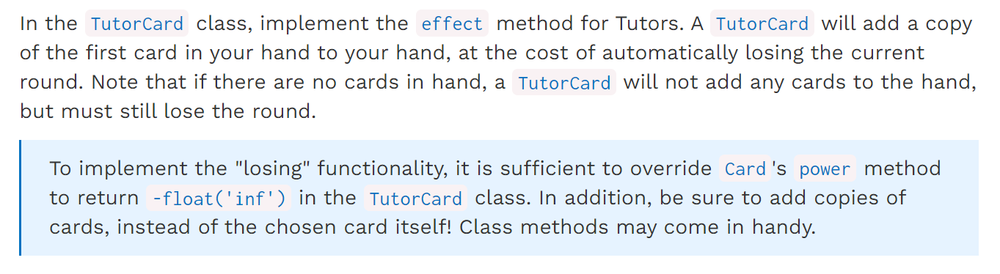

```python
class TutorCard(Card):
    cardtype = 'Tutor'

    def effect(self, opponent_card, player, opponent):
        """
        Add a copy of the first card in your hand
        to your hand, at the cost of losing the current
        round. If there are no cards in hand, this card does
        not add any cards, but still loses the round.  To
        implement the second part of this effect, a Tutor
        card's power should be less than all non-Tutor cards.

        >>> from cards import *
        >>> player1, player2 = Player(standard_deck.copy(), 'p1'), Player(standard_deck.copy(), 'p2')
        >>> opponent_card = Card("other", 500, 500)
        >>> test_card = TutorCard("Tutor Card", 10000, 10000)
        >>> player1.hand = [Card("card1", 0, 100), Card("card2", 100, 0)]
        >>> test_card.effect(opponent_card, player1, player2)
        Tutor Card allows me to add a copy of a card to my hand!
        >>> print(player1.hand)
        [card1: Staff, [0, 100], card2: Staff, [100, 0], card1: Staff, [0, 100]]
        >>> player1.hand[0] is player1.hand[2] # must add a copy!
        False
        >>> player1.hand = []
        >>> test_card.effect(opponent_card, player1, player2)
        >>> print(player1.hand) # must not add a card if not available
        []
        >>> test_card.power(opponent_card) < opponent_card.power(test_card)
        True
        """
        "*** YOUR CODE HERE ***"
        added = False
        # You should add your implementation above this.
        if added:
            print(f"{self.name} allows me to add a copy of a card to my hand!")

    "*** YOUR CODE HERE ***"

    def copy(self):
        """
        Create a copy of this card.
        """
        return TutorCard(self.name, self.attack, self.defense)
```
```python
class TutorCard(Card):
    cardtype = 'Tutor'

    def effect(self, opponent_card, player, opponent):
        """
        Add a copy of the first card in your hand
        to your hand, at the cost of losing the current
        round. If there are no cards in hand, this card does
        not add any cards, but still loses the round.  To
        implement the second part of this effect, a Tutor
        card's power should be less than all non-Tutor cards.

        >>> from cards import *
        >>> player1, player2 = Player(standard_deck.copy(), 'p1'), Player(standard_deck.copy(), 'p2')
        >>> opponent_card = Card("other", 500, 500)
        >>> test_card = TutorCard("Tutor Card", 10000, 10000)
        >>> player1.hand = [Card("card1", 0, 100), Card("card2", 100, 0)]
        >>> test_card.effect(opponent_card, player1, player2)
        Tutor Card allows me to add a copy of a card to my hand!
        >>> print(player1.hand)
        [card1: Staff, [0, 100], card2: Staff, [100, 0], card1: Staff, [0, 100]]
        >>> player1.hand[0] is player1.hand[2] # must add a copy!
        False
        >>> player1.hand = []
        >>> test_card.effect(opponent_card, player1, player2)
        >>> print(player1.hand) # must not add a card if not available
        []
        >>> test_card.power(opponent_card) < opponent_card.power(test_card)
        True
        """
        "*** YOUR CODE HERE ***"
        added = False

        if len(player.hand) > 0:
            player.hand.append(player.hand[0].copy())
            added = True

        # You should add your implementation above this.
        if added:
            print(f"{self.name} allows me to add a copy of a card to my hand!")

    "*** YOUR CODE HERE ***"
    def power(self, opponent_card):
        return -float('inf')

    def copy(self):
        """
        Create a copy of this card.
        """
        return TutorCard(self.name, self.attack, self.defense)
```

## Q8 TAs Power Transfer
> 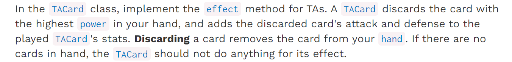

```python
class TACard(Card):
    cardtype = 'TA'

    def effect(self, opponent_card, player, opponent, arg=None):
        """
        Discard the card with the highest `power` in your hand,
        and add the discarded card's attack and defense
        to this card's own respective stats.

        >>> from cards import *
        >>> player1, player2 = Player(standard_deck.copy(), 'p1'), Player(standard_deck.copy(), 'p2')
        >>> opponent_card = Card("other", 500, 500)
        >>> test_card = TACard("TA Card", 500, 500)
        >>> player1.hand = []
        >>> test_card.effect(opponent_card, player1, player2) # if no cards in hand, no effect.
        >>> print(test_card.attack, test_card.defense)
        500 500
        >>> player1.hand = [Card("card1", 0, 100), TutorCard("tutor", 10000, 10000), Card("card3", 100, 0)]
        >>> test_card.effect(opponent_card, player1, player2) # must use card's power method.
        TA Card discards card3 from my hand to increase its own power!
        >>> print(player1.hand)
        [card1: Staff, [0, 100], tutor: Tutor, [10000, 10000]]
        >>> print(test_card.attack, test_card.defense)
        600 500
        """
        "*** YOUR CODE HERE ***"
        best_card = None
        # You should add your implementation above this.
        if best_card:
            print(f"{self.name} discards {best_card.name} from my hand to increase its own power!")

    def copy(self):
        """
        Create a copy of this card.
        """
        return TACard(self.name, self.attack, self.defense)

```
```python

class TACard(Card):
    cardtype = 'TA'

    def effect(self, opponent_card, player, opponent, arg=None):
        """
        Discard the card with the highest `power` in your hand,
        and add the discarded card's attack and defense
        to this card's own respective stats.

        >>> from cards import *
        >>> player1, player2 = Player(standard_deck.copy(), 'p1'), Player(standard_deck.copy(), 'p2')
        >>> opponent_card = Card("other", 500, 500)
        >>> test_card = TACard("TA Card", 500, 500)
        >>> player1.hand = []
        >>> test_card.effect(opponent_card, player1, player2) # if no cards in hand, no effect.
        >>> print(test_card.attack, test_card.defense)
        500 500
        >>> player1.hand = [Card("card1", 0, 100), TutorCard("tutor", 10000, 10000), Card("card3", 100, 0)]
        >>> test_card.effect(opponent_card, player1, player2) # must use card's power method.
        TA Card discards card3 from my hand to increase its own power!
        >>> print(player1.hand)
        [card1: Staff, [0, 100], tutor: Tutor, [10000, 10000]]
        >>> print(test_card.attack, test_card.defense)
        600 500
        """
        best_card = None
        if len(player.hand) > 0:
            best_card = max(player.hand, key=lambda c: c.power(opponent_card))
            self.attack += best_card.attack
            self.defense += best_card.defense
            player.hand.remove(best_card)
        # You should add your implementation above this.
        if best_card:
            print(f"{self.name} discards {best_card.name} from my hand to increase its own power!")

    def copy(self):
        """
        Create a copy of this card.
        """
        return TACard(self.name, self.attack, self.defense)
```

## Q9 Instructors: Immovable
> 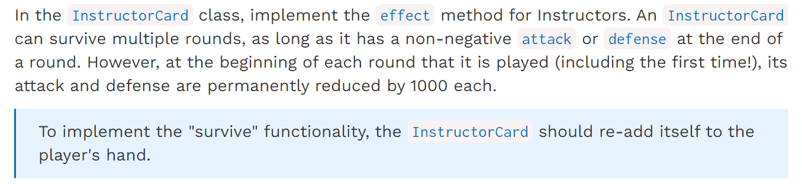

```python
class InstructorCard(Card):
    cardtype = 'Instructor'

    def effect(self, opponent_card, player, opponent, arg=None):
        """
        Survives multiple rounds, as long as it has a non-negative
        attack or defense at the end of a round. At the beginning of the round,
        its attack and defense are permanently reduced by 1000 each.
        If this card would survive, it is added back to the hand.

        >>> from cards import *
        >>> player1, player2 = Player(standard_deck.copy(), 'p1'), Player(standard_deck.copy(), 'p2')
        >>> opponent_card = Card("other", 500, 500)
        >>> test_card = InstructorCard("Instructor Card", 1000, 1000)
        >>> player1.hand = [Card("card1", 0, 100)]
        >>> test_card.effect(opponent_card, player1, player2)
        Instructor Card returns to my hand!
        >>> print(player1.hand) # survives with non-negative attack
        [card1: Staff, [0, 100], Instructor Card: Instructor, [0, 0]]
        >>> player1.hand = [Card("card1", 0, 100)]
        >>> test_card.effect(opponent_card, player1, player2)
        >>> print(player1.hand)
        [card1: Staff, [0, 100]]
        >>> print(test_card.attack, test_card.defense)
        -1000 -1000
        """
        "*** YOUR CODE HERE ***"
        re_add = False
        # You should add your implementation above this.
        if re_add:
            print(f"{self.name} returns to my hand!")

    def copy(self):
        return InstructorCard(self.name, self.attack, self.defense)
```
```python
class InstructorCard(Card):
    cardtype = 'Instructor'

    def effect(self, opponent_card, player, opponent, arg=None):
        """
        Survives multiple rounds, as long as it has a non-negative
        attack or defense at the end of a round. At the beginning of the round,
        its attack and defense are permanently reduced by 1000 each.
        If this card would survive, it is added back to the hand.

        >>> from cards import *
        >>> player1, player2 = Player(standard_deck.copy(), 'p1'), Player(standard_deck.copy(), 'p2')
        >>> opponent_card = Card("other", 500, 500)
        >>> test_card = InstructorCard("Instructor Card", 1000, 1000)
        >>> player1.hand = [Card("card1", 0, 100)]
        >>> test_card.effect(opponent_card, player1, player2)
        Instructor Card returns to my hand!
        >>> print(player1.hand) # survives with non-negative attack
        [card1: Staff, [0, 100], Instructor Card: Instructor, [0, 0]]
        >>> player1.hand = [Card("card1", 0, 100)]
        >>> test_card.effect(opponent_card, player1, player2)
        >>> print(player1.hand)
        [card1: Staff, [0, 100]]
        >>> print(test_card.attack, test_card.defense)
        -1000 -1000
        """
        "*** YOUR CODE HERE ***"
        re_add = False
        self.attack -= 1000
        self.defense -= 1000
        if self.attack >= 0 or self.defense >= 0:
            player.hand.append(self)
            re_add = True
        # You should add your implementation above this.
        if re_add:
            print(f"{self.name} returns to my hand!")

    def copy(self):
        return InstructorCard(self.name, self.attack, self.defense)

```
