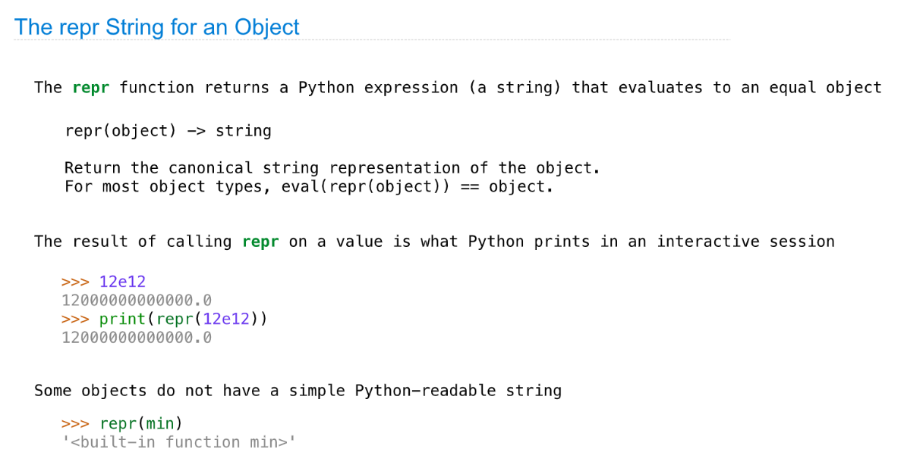
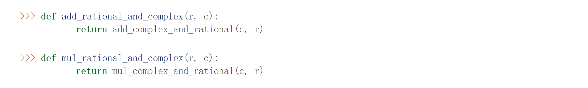
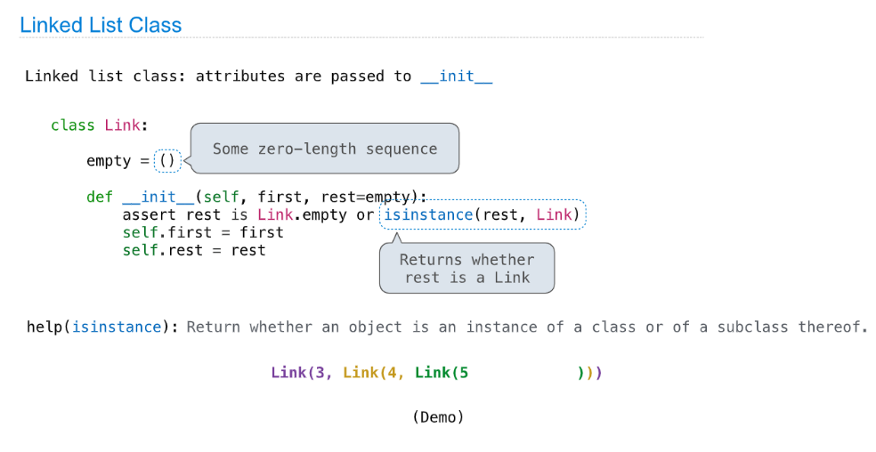
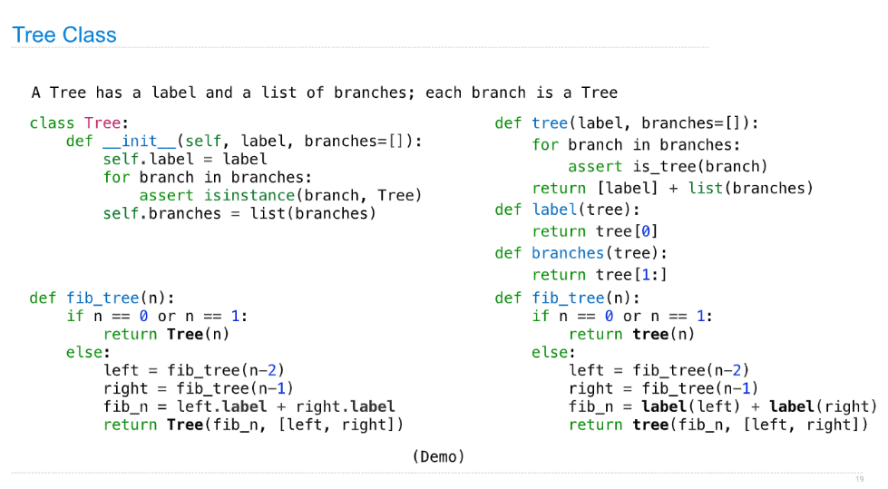

> Ch2.5: [http://composingprograms.com/pages/25-object-oriented-programming.html](http://composingprograms.com/pages/25-object-oriented-programming.html)
> Ch2.7: [http://composingprograms.com/pages/27-object-abstraction.html](http://composingprograms.com/pages/27-object-abstraction.html)
> Ch2.9: [http://composingprograms.com/pages/29-recursive-objects.html](http://composingprograms.com/pages/29-recursive-objects.html)

[released_assets_slides_20-Inheritance_full.pdf](https://www.yuque.com/attachments/yuque/0/2023/pdf/12393765/1672800017258-d6f238f9-13a3-40b2-8b49-3d8efaccf1c0.pdf)
[released_assets_slides_21-Representation_full.pdf](https://www.yuque.com/attachments/yuque/0/2023/pdf/12393765/1672800017102-dd49f0d9-c4e2-4639-b808-cb74adc1aa08.pdf)
[released_assets_slides_22-Composition_full.pdf](https://www.yuque.com/attachments/yuque/0/2023/pdf/12393765/1672800017186-7893d62f-e59b-4280-9270-58f8bdc6b031.pdf)

# 1 Inheritance
## Terminology
> 


## Assignment to Attributes
### Basics
> 

### 


## Inheritance& Attributes Lookup
### Basics and Demo
> 

```python
class Account:
    """An account has a balance and a holder.

    >>> a = Account('John')
    >>> a.holder
    'John'
    >>> a.deposit(100)
    100
    >>> a.withdraw(90)
    10
    >>> a.withdraw(90)
    'Insufficient funds'
    >>> a.balance
    10
    >>> a.interest
    0.02
    """

    interest = 0.02  # A class attribute

    def __init__(self, account_holder):
        self.holder = account_holder
        self.balance = 0

    def deposit(self, amount):
        """Add amount to balance."""
        self.balance = self.balance + amount
        return self.balance

    def withdraw(self, amount):
        """Subtract amount from balance if funds are available."""
        if amount > self.balance:
            return 'Insufficient funds'
        self.balance = self.balance - amount
        return self.balance


class CheckingAccount(Account):
    """A bank account that charges for withdrawals.

    >>> ch = CheckingAccount('Jack')
    >>> ch.balance = 20
    >>> ch.withdraw(5)
    14
    >>> ch.interest
    0.01
    """

    withdraw_fee = 1
    interest = 0.01

    def withdraw(self, amount):
        return Account.withdraw(self, amount + self.withdraw_fee)
        # Alternatively:
        return super().withdraw(amount + self.withdraw_fee)
```


### Practice⭐⭐⭐⭐⭐
> 

```python
class A:
    z = -1
    def f(self, x):
        return B(x-1)

class B(A):
    n = 4
    def __init__(self, y):
        if y:
            self.z = self.f(y)
        else:
            self.z = C(y+1)


class C(B):
    def f(self, x):
        return x

def WWPD():
    """What would Python Display?

    >>> a = A()
    >>> b = B(1)
    >>> b.n = 5
    >>> C(2).n
    4
    >>> C(2).z
    2
    >>> a.z == C.z
    True
    >>> a.z == b.z
    False
    >>> b.z.z.z
    1
    """
```
**Solution**

## OOP Design
### No Repetition
> 


### Inheritance and Composition
> 

```python
class Account:
    """An account has a balance and a holder.

    >>> a = Account('John')
    >>> a.holder
    'John'
    >>> a.deposit(100)
    100
    >>> a.withdraw(90)
    10
    >>> a.withdraw(90)
    'Insufficient funds'
    >>> a.balance
    10
    >>> a.interest
    0.02
    """

    interest = 0.02  # A class attribute

    def __init__(self, account_holder):
        self.holder = account_holder
        self.balance = 0

    def deposit(self, amount):
        """Add amount to balance."""
        self.balance = self.balance + amount
        return self.balance

    def withdraw(self, amount):
        """Subtract amount from balance if funds are available."""
        if amount > self.balance:
            return 'Insufficient funds'
        self.balance = self.balance - amount
        return self.balance


class CheckingAccount(Account):
    """A bank account that charges for withdrawals.

    >>> ch = CheckingAccount('Jack')
    >>> ch.balance = 20
    >>> ch.withdraw(5)
    14
    >>> ch.interest
    0.01
    """

    withdraw_fee = 1
    interest = 0.01

    def withdraw(self, amount):
        return Account.withdraw(self, amount + self.withdraw_fee)
        # Alternatively:
        return super().withdraw(amount + self.withdraw_fee)


        
class Bank:
    """A bank has accounts and pays interest.

    >>> bank = Bank()
    >>> john = bank.open_account('John', 10)
    >>> jack = bank.open_account('Jack', 5, CheckingAccount)
    >>> jack.interest
    0.01
    >>> john.interest = 0.06
    >>> bank.pay_interest()
    >>> john.balance
    10.6
    >>> jack.balance
    5.05
    """
    def __init__(self):
        self.accounts = []

    def open_account(self, holder, amount, account_type=Account):
        """Open an account_type for holder and deposit amount."""
        account = account_type(holder)
        account.deposit(amount)
        self.accounts.append(account)
        return account

    def pay_interest(self):
        """Pay interest to all accounts."""
        for account in self.accounts:
            account.deposit(account.balance * account.interest)
```
## 
## Multiple Inheritance(Demo)
> 

```python
class Account:
    """An account has a balance and a holder.

    >>> a = Account('John')
    >>> a.holder
    'John'
    >>> a.deposit(100)
    100
    >>> a.withdraw(90)
    10
    >>> a.withdraw(90)
    'Insufficient funds'
    >>> a.balance
    10
    >>> a.interest
    0.02
    """

    interest = 0.02  # A class attribute

    def __init__(self, account_holder):
        self.holder = account_holder
        self.balance = 0

    def deposit(self, amount):
        """Add amount to balance."""
        self.balance = self.balance + amount
        return self.balance

    def withdraw(self, amount):
        """Subtract amount from balance if funds are available."""
        if amount > self.balance:
            return 'Insufficient funds'
        self.balance = self.balance - amount
        return self.balance


class CheckingAccount(Account):
    """A bank account that charges for withdrawals.

    >>> ch = CheckingAccount('Jack')
    >>> ch.balance = 20
    >>> ch.withdraw(5)
    14
    >>> ch.interest
    0.01
    """

    withdraw_fee = 1
    interest = 0.01

    def withdraw(self, amount):
        return Account.withdraw(self, amount + self.withdraw_fee)
        # Alternatively:
        return super().withdraw(amount + self.withdraw_fee)
        

class SavingsAccount(Account):
    """A bank account that charges for deposits."""

    deposit_fee = 2

    def deposit(self, amount):
        return Account.deposit(self, amount - self.deposit_fee)


class AsSeenOnTVAccount(CheckingAccount, SavingsAccount):
    """A bank account that charges for everything."""

    def __init__(self, account_holder):
        self.holder = account_holder
        self.balance = 1  # A free dollar!

supers = [c.__name__ for c in AsSeenOnTVAccount.mro()]
```


# 2 OOP Abstraction
## String Representations
### Basics
> 


### repr Object
> 


### str Object
> 


### Demo
```python
def str_repr_demos():
    >>> from fractions import Fraction
    >>> half = Fraction(1, 2)
    >>> half     
    Fraction(1,2)
    >>> print(half)
    1/2
    >>> str(half)
    '1/2'
    >>> repr(half)
    'Fraction(1,2)'
    >>> eval(repr(half))   # object Fraction itself
    Fraction(1,2)
    >>> eval(str(half))    # float object
    0.5

    >>> s = 'Hello, World'
    >>> s
    'Hello, World'
    >>> print(s)
    Hello, World
    >>> print(str(s))
    Hello, World
    >>> print(repr(s))
    'Hello, World'
    >>> str(s)
    'Hello, World' 
    >>> repr(s)
    "'Hello, World'"       
    >>> eval(repr(s))    # eval(repr(s)) == s
    'Hello, World'
    >>> repr(repr(repr(s)))
    >>> eval(eval(eval(repr(repr(repr(s))))))  # repr和eval数量相同
	'Hello, World'
	>>> eval(s)
    # Errors: name 'Hello' is not defined, s is not a valid python expression to execute
```


## String Interpolation - F String
> 
> 就是可以用变量填充`string`

```python
def fstring_demos():
    """f-string demos.

    >>> f'2 + 2 = 2 + 2'
    '2 + 2 = 2 + 2'
    >>> f'2 + 2 = {2 + 2}'
    '2 + 2 = 4'
    >>> '2 + 2 = {2 + 2}'
    '2 + 2 = {2 + 2}'
    >>> f'2 + 2 = {abs(2 + 2)}'
    '2 + 2 = 4'
    >>> abs = float
    >>> f'2 + 2 = {abs(2 + 2)}'
    '2 + 2 = 4.0'
    >>> f'2 + 2 = {(lambda x: x + x)(2)}'
    '2 + 2 = 4'

    >>> from fractions import Fraction
    >>> half = Fraction(1, 2)
    >>> half
    Fraction(1, 2)
    >>> print(half)
    1/2
    >>> f'half of a half is {half * half}.'
    'half of a half is 1/4.'

    >>> s = [9, 8, 7]
    # 从左到右evaluate, 所以最后一个{s}就是[9]
    >>> f'because {s.pop()} {s.pop()} {s}'
    'because 7 8 [9]'
    """
```


## Polymorphic Functions
### Basics
> 


### Implementation of repr& str
> 
> `type(instance)`可以获取到当前对象所属的`class`, 以此来找到`class`上的`__repr__`方法而不是`instance`上的`__repr__`方法。

```python
class Bear:
    """A Bear.
    
    
    >>> oski = Bear()
    >>> oski
    Bear()
    >>> print(oski)
    a bear
    >>> print(str(oski))
    a bear
    >>> print(repr(oski))
    Bear()
    >>> print(oski.__repr__())
    oski
    >>> print(oski.__str__())
    oski the bear

    >>> print(str_(oski))
    a bear
    >>> print(repr_(oski))
    Bear()
    """
    def __init__(self):
        self.__repr__ = lambda: 'oski' # instance attribute
        self.__str__ = lambda: 'oski the bear'

    # 用户可以自定义
    def __repr__(self): # class attribute
        return 'Bear()'

    # 用户可以自定义
    def __str__(self):
        return 'a bear'

def print_bear():
    oski = Bear()
    
    print(oski)            
    print(str(oski))
    print(repr(oski))
    print(oski.__repr__())
    print(oski.__str__())

def repr_(x):
    s = type(x).__repr__(x)   # 这里__repr__(x)的参数x就是instance
    if not isinstance(s, str):
        raise TypeError
    return s

def str_(x):
    t = type(x)
    s = t.__str__(x)
    if not isinstance(s, str):
        raise TypeError
    # 没有定义__str__ 默认使用 __repr__
    if hasattr(t, '__str__'):
        return s
    else:
        return repr(x)
```


### Summary
> 1.  When it is only:
def __repr__(self):
	return 'Bear()'
a) oski is an instance of class Bear and when you call oski, Python just returns class attribute __repr__ --> Bear()
b) print(oski) is the same as calling print(str(oski)), and since no attributes for __str__** **has been defined,
Python just returns --> Bear()
c) print(repr(oski)) would just return  --> Bear() as defined by __repr__
d) print(oski.__str__()) is calling __str__ class attribute on the instance oski, and since it's not defined, just return repr(oski) --> Bear()
e) print(oski.__repr__() is calling `repr`_** **_class attribute on the instance oski, return  --> Bear() 
> 2.  When there are:
def __repr__(self):
	return 'Bear()'
def __str__(self):
	return 'a bear'
a) print(oski) is the same as calling print(str(oski)), and since  __str__ class attribute is now defined,
Python just returns --> a bear
c) print(repr(oski)) would just return --> Bear() as defined by __repr__
d) print(oski.__str__()) is calling __str__ class attribute on the instance oski, and returns as defined --> a bear
e) print(oski.__repr__()) is calling __repr__ class attribute on the instance oski, returns --> Bear() 
> 3.  When there are:
def __init__(self):
	self.__repr__= lambda: 'oski'
	self.__str__= lambda: 'this bear'
def  __repr__(self):
	return 'Bear()'
def __str__(self):
	return 'a bear'
a) print(oski) is the same as calling print(str(oski)), and the instance attribute is avoided so following __str__ class attribute, Python just returns --> a bear
c) print(repr(oski)) and the instance attribute is avoided, so would just return --> Bear() as defined by the class attribute __repr__
d) print(oski.__str__()) is calling __str__  instance attribute on oski since it's now defined, and returns as defined --> this bear
e) print(oski.__repr__()) is calling __repr__ instance attribute on oski, returns --> oski 
> 
> The newly defined repr(x) and str(x) functions basically summarize the rules above


## Interfaces& Multiple Representation
> 

```python
# Interfaces __add__ and __mul__, allowing for addition of different types of Complex
class Number:
        def __add__(self, other):
            return self.add(other)
        def __mul__(self, other):
            return self.mul(other)

            
class Complex(Number):
    def add(self, other):
        return ComplexRI(self.real + other.real, self.imag + other.imag)
    def mul(self, other):
        magnitude = self.magnitude * other.magnitude
        return ComplexMA(magnitude, self.angle + other.angle)

from math import atan2
class ComplexRI(Complex):
    def __init__(self, real, imag):
        self.real = real
        self.imag = imag

    # 可以直接通过dot expression访问
    @property
    def magnitude(self):
        return (self.real ** 2 + self.imag ** 2) ** 0.5
    @property
    def angle(self):
        return atan2(self.imag, self.real)
    def __repr__(self):
        return 'ComplexRI({0:g}, {1:g})'.format(self.real, self.imag)


from math import sin, cos, pi
class ComplexMA(Complex):
    def __init__(self, magnitude, angle):
        self.magnitude = magnitude
        self.angle = angle
    @property
    def real(self):
        return self.magnitude * cos(self.angle)
    @property
    def imag(self):
        return self.magnitude * sin(self.angle)
    def __repr__(self):
        return 'ComplexMA({0:g}, {1:g} * pi)'.format(self.magnitude, self.angle/pi)
```
**Output**


## Special Method Names
> 

```python
from fractions import gcd

class Ratio:
    """A mutable ratio.

    >>> f = Ratio(9, 15)
    >>> f
    Ratio(9, 15)
    >>> print(f)
    9/15

    >>> Ratio(1, 3) + Ratio(1, 6)
    Ratio(1, 2)
    >>> f + 1
    Ratio(8, 5)
    >>> 1 + f
    Ratio(8, 5)
    >>> 1.4 + f
    2.0
    """
    def __init__(self, n, d):
        self.numer = n
        self.denom = d

    def __repr__(self):  # For interpreter
        return 'Ratio({0}, {1})'.format(self.numer, self.denom)

    def __str__(self):   # human-readable 
        return '{0}/{1}'.format(self.numer, self.denom)

    def __add__(self, other):
        if isinstance(other, Ratio):
            n = self.numer * other.denom + self.denom * other.numer
            d = self.denom * other.denom
        elif isinstance(other, int):
            n = self.numer + self.denom * other
            d = self.denom
        else:
            return float(self) + other
        g = gcd(n, d)
        r = Ratio(n // g, d // g)
        return r

    __radd__ = __add__

    def __float__(self):
        return self.numer / self.denom
```


## Generic Function
> 


### Type Dispatching
> 
> 1. 通过`isinstance(instance, Class)`实现
> 

> 2. 通过在`instance`中设置一个`attribute`表示数据类型来实现
> 


#### Combine Complex with Rational
> 
> 为了保证`Commutivity`, 我们需要定义两组函数:
> 


#### Implementation
```python
class Number:
    def __add__(self, other):
        if self.type_tag == other.type_tag:
            return self.add(other)
        elif (self.type_tag, other.type_tag) in self.adders:
            return self.cross_apply(other, self.adders)
    def __mul__(self, other):
        if self.type_tag == other.type_tag:
            return self.mul(other)
        elif (self.type_tag, other.type_tag) in self.multipliers:
            return self.cross_apply(other, self.multipliers)
    def cross_apply(self, other, cross_fns):
        cross_fn = cross_fns[(self.type_tag, other.type_tag)]
        return cross_fn(self, other)
    # 需要四种组合
    adders = {("com", "rat"): add_complex_and_rational,
              ("rat", "com"): add_rational_and_complex}
    multipliers = {("com", "rat"): mul_complex_and_rational,
                   ("rat", "com"): mul_rational_and_complex}
```
**Output**


### Type Coercion
> 


#### Implementation
```python
class Number:
    def __add__(self, other):
        x, y = self.coerce(other)
        return x.add(y)
    def __mul__(self, other):
        x, y = self.coerce(other)
        return x.mul(y)
    def coerce(self, other):
        if self.type_tag == other.type_tag:
            return self, other
        elif (self.type_tag, other.type_tag) in self.coercions:
            return (self.coerce_to(other.type_tag), other)
        elif (other.type_tag, self.type_tag) in self.coercions:
            return (self, other.coerce_to(self.type_tag))
    def coerce_to(self, other_tag):
        coercion_fn = self.coercions[(self.type_tag, other_tag)]
        return coercion_fn(self)
    # 只需要一个
    coercions = {('rat', 'com'): rational_to_complex}
```

# 3 Recursive Objects
## Linked List Class
### Structure
> 
> 另一种写法:
> 


### Class Implementation
> 

```python
class Link:
    """A linked list.

    >>> s = Link(3, Link(4, Link(5)))
    >>> s
    Link(3, Link(4, Link(5)))
    >>> print(s)
    <3 4 5>
    >>> s.first
    3
    >>> s.rest
    Link(4, Link(5))
    >>> s.rest.first
    4
    >>> s.rest.first = 7
    >>> s
    Link(3, Link(7, Link(5)))
    >>> s.first = 6
    >>> s.rest.rest = Link.empty
    >>> s
    Link(6, Link(7))
    >>> print(s)
    <6 7>
    >>> print(s.rest)
    <7>
    >>> t = Link(1, Link(Link(2, Link(3)), Link(4)))
    >>> t
    Link(1, Link(Link(2, Link(3)), Link(4)))
    >>> print(t)
    <1 <2 3> 4>
    """
    empty = ()

    def __init__(self, first, rest=empty):
        assert rest is Link.empty or isinstance(rest, Link)
        self.first = first
        self.rest = rest

    def __repr__(self):
        if self.rest:
            rest_repr = ', ' + repr(self.rest)
        else:
            rest_repr = ''
        return 'Link(' + repr(self.first) + rest_repr + ')'

    def __str__(self):
        string = '<'
        while self.rest is not Link.empty:
            string += str(self.first) + ' '
            self = self.rest
        return string + str(self.first) + '>'

    # Recursive implementation
	def __getitem__(self, i):
            if i == 0:
                return self.first
            else:
                return self.rest[i-1]   # self.rest[i-1]实际上又调用了__getitem__函数

    # Recursive implementation
	def __len__(self):
        return 1 + len(self.rest)

	# Inspect the linked list
	def link_expression(s):
        """Return a string that would evaluate to s.
        >>> Link.__repr__ = link_expression
        >>> s
        Link(3, Link(4, Link(5)))
        """
        if s.rest is Link.empty:
            rest = ''
        else:
            rest = ', ' + link_expression(s.rest)
        return 'Link({0}{1})'.format(s.first, rest)
```


### Linked List Processing
> 

```python
square, odd = lambda x: x * x, lambda x: x % 2 == 1
list(map(square, filter(odd, range(1, 6))))  # [1, 9, 25]

 # Recursively prolonging the linked list
 def extend_link(s, t):
    """
    >>> extend_link(s, s)
    Link(3, Link(4, Link(5, Link(3, Link(4, Link(5))))))
    >>> Link.__add__ = extend_link
    >>> s + s
    Link(3, Link(4, Link(5, Link(3, Link(4, Link(5))))))
    """
    if s is Link.empty:
        return t
    else:
        return Link(s.first, extend_link(s.rest, t))


def range_link(start, end):
    """Return a Link containing consecutive integers from start to end.

    >>> range_link(3, 6)
    Link(3, Link(4, Link(5)))
    """
    if start >= end:
        return Link.empty
    else:
        return Link(start, range_link(start + 1, end))


def map_link(f, s):
    """Return a Link that contains f(x) for each x in Link s.

    >>> map_link(square, range_link(3, 6))
    Link(9, Link(16, Link(25)))
    """
    if s is Link.empty:
        return s
    else:
        return Link(f(s.first), map_link(f, s.rest))


def filter_link(f, s):
    """Return a Link that contains only the elements x of Link s for which f(x)
    is a true value.

    >>> filter_link(odd, range_link(3, 6))
    Link(3, Link(5))
    """
    if s is Link.empty:
        return s
    filtered_rest = filter_link(f, s.rest)
    if f(s.first):
        return Link(s.first, filtered_rest)
    else:
        return filtered_rest

def join_link(s, separator):
        if s is Link.empty:
            return ""
        elif s.rest is Link.empty:
            return str(s.first)
        else:
            return str(s.first) + separator + join_link(s.rest, separator)


map_link(square, filter_link(odd, range_link(1, 6)))  # Link(1, Link(9, Link(25)))
join_link(s, ", ")     # '3, 4, 5'

```


### Linked List Mutation
> 


### Counting Partitions - Linked List
> 

```python
def partitions(n, m):
        """Return a linked list of partitions of n using parts of up to m.
        Each partition is represented as a linked list.
        """
        if n == 0:
            return Link(Link.empty) # A list containing the empty partition
        elif n < 0 or m == 0:
            return Link.empty
        else:
            using_m = partitions(n-m, m)
            with_m = map_link(lambda s: Link(m, s), using_m)
            without_m = partitions(n, m-1)
            return with_m + without_m

 def print_partitions(n, m):
     """
     >>> print_partitions(6, 4)
    4 + 2
    4 + 1 + 1
    3 + 3
    3 + 2 + 1
    3 + 1 + 1 + 1
    2 + 2 + 2
    2 + 2 + 1 + 1
    2 + 1 + 1 + 1 + 1
    1 + 1 + 1 + 1 + 1 + 1
     """
    lists = partitions(n, m)
    strings = map_link(lambda s: join_link(s, " + "), lists)
    print(join_link(strings, "\n"))
```

## Tree Class
### Structure
> 


### Class Implementation
> 

```python
class Tree:
    """A tree is a label and a list of branches."""
    def __init__(self, label, branches=[]):
        self.label = label
        for branch in branches:
            assert isinstance(branch, Tree)
        self.branches = list(branches)

    def __repr__(self):
        if self.branches:
            branch_str = ', ' + repr(self.branches)
        else:
            branch_str = ''
        return 'Tree({0}{1})'.format(repr(self.label), branch_str)

    def __str__(self):
        return '\n'.join(self.indented())

    def indented(self):
        lines = []
        for b in self.branches:
            for line in b.indented():
                lines.append('  ' + line)
        return [str(self.label)] + lines

    def is_leaf(self):
        return not self.branches


def leaves(tree):
    """Return the leaf labels of a tree.

    >>> leaves(fib_tree(4))
    [0, 1, 1, 0, 1]
    """
    if tree.is_leaf():
        return [tree.label]
    else:
        return sum([leaves(b) for b in tree.branches], [])


def height(tree):
    """The height of a tree."""
    if tree.is_leaf():
        return 0
    else:
        return 1 + max([height(b) for b in tree.branches])
```


### Tree Mutation
#### Fib Tree
> 

```python
def fib_tree(n):
    """A Fibonacci tree.

    >>> print(fib_tree(4))
    3
      1
        0
        1
      2
        1
        1
          0
          1
    """
    if n == 0 or n == 1:
        return Tree(n)
    else:
        left = fib_tree(n-2)
        right = fib_tree(n-1)
        fib_n = left.label + right.label
        return Tree(fib_n, [left, right])
```


#### Pruning Tree
> 


