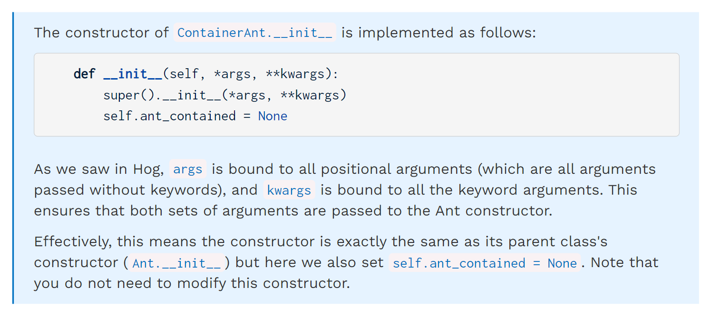
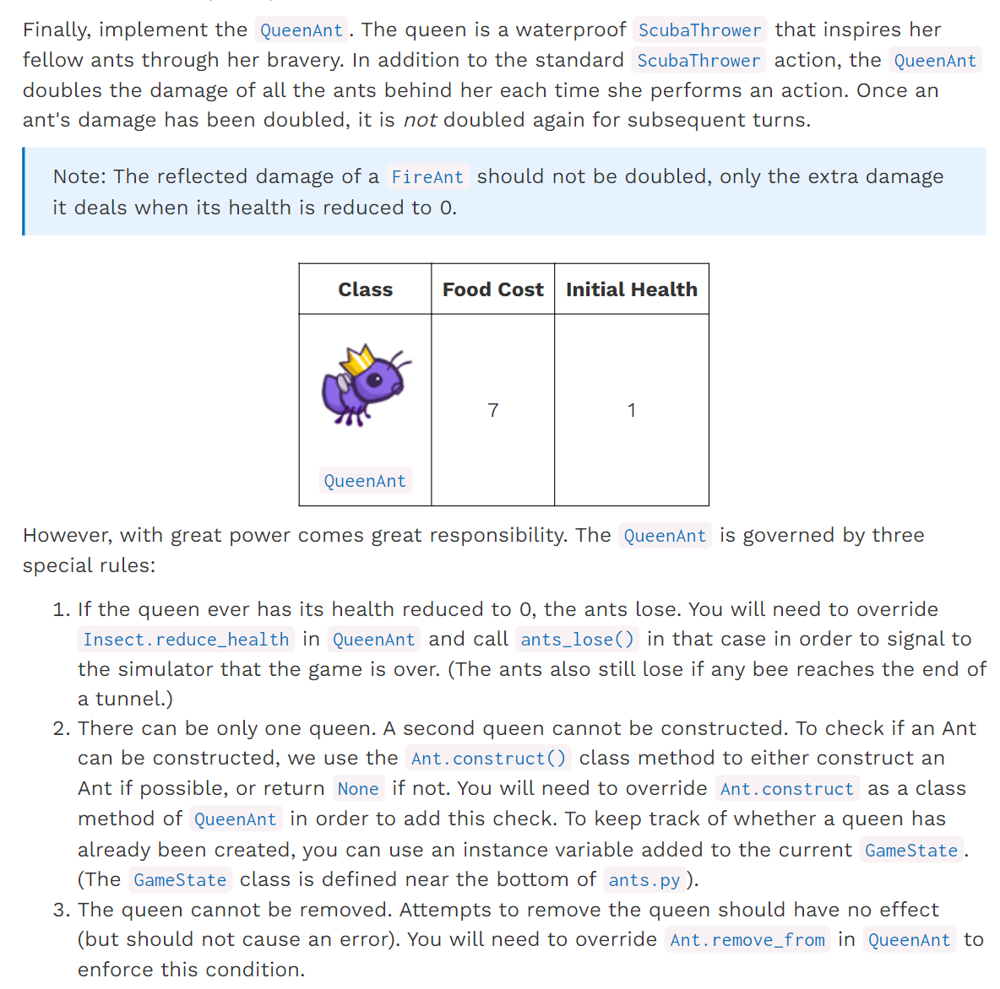
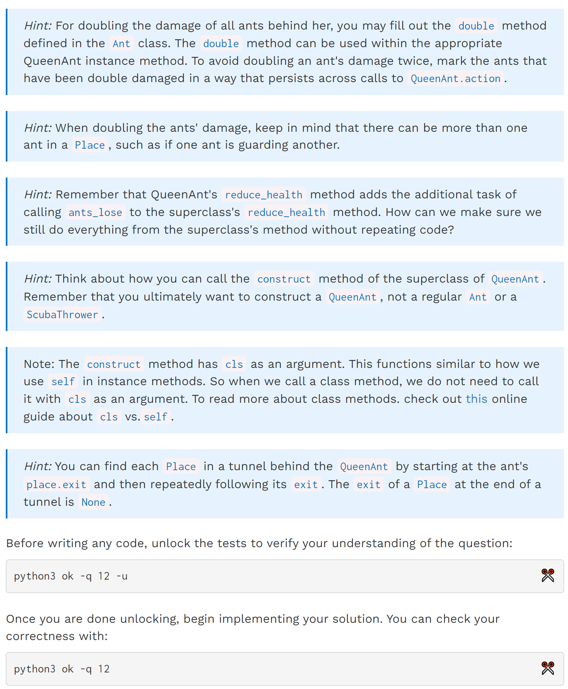
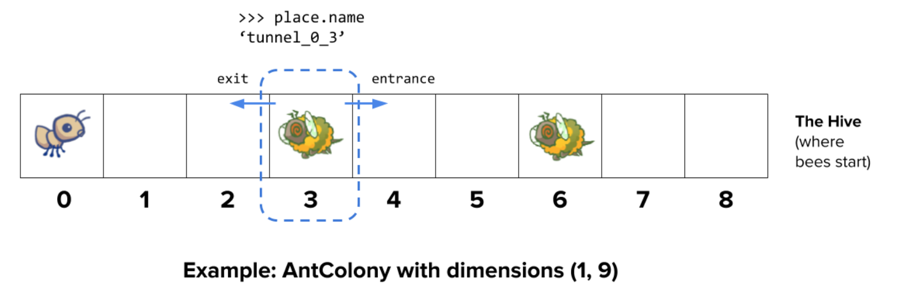
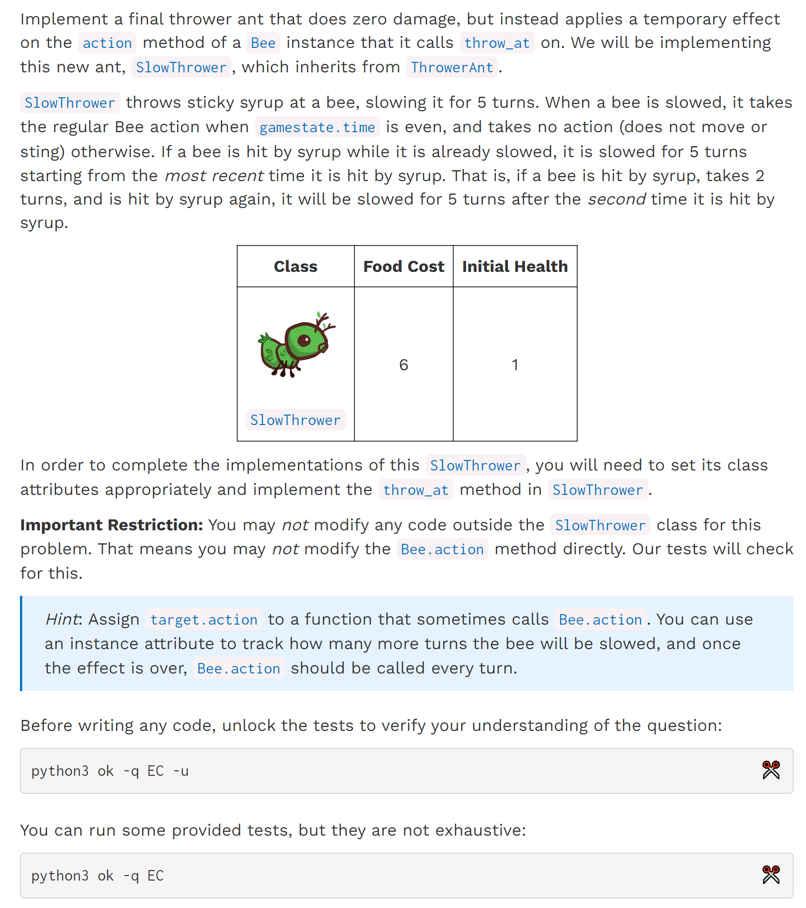
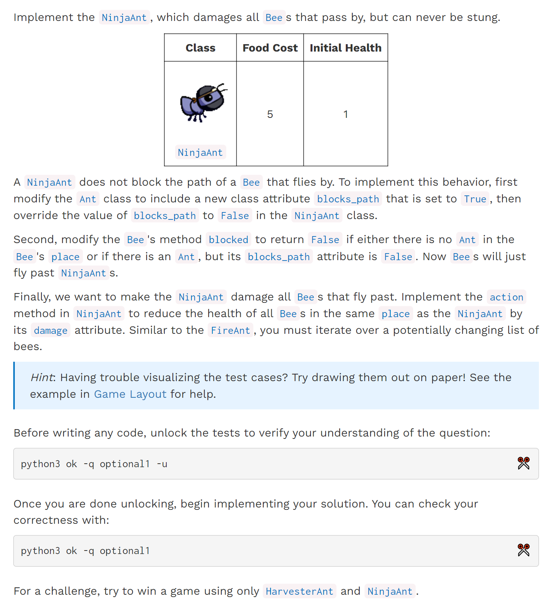
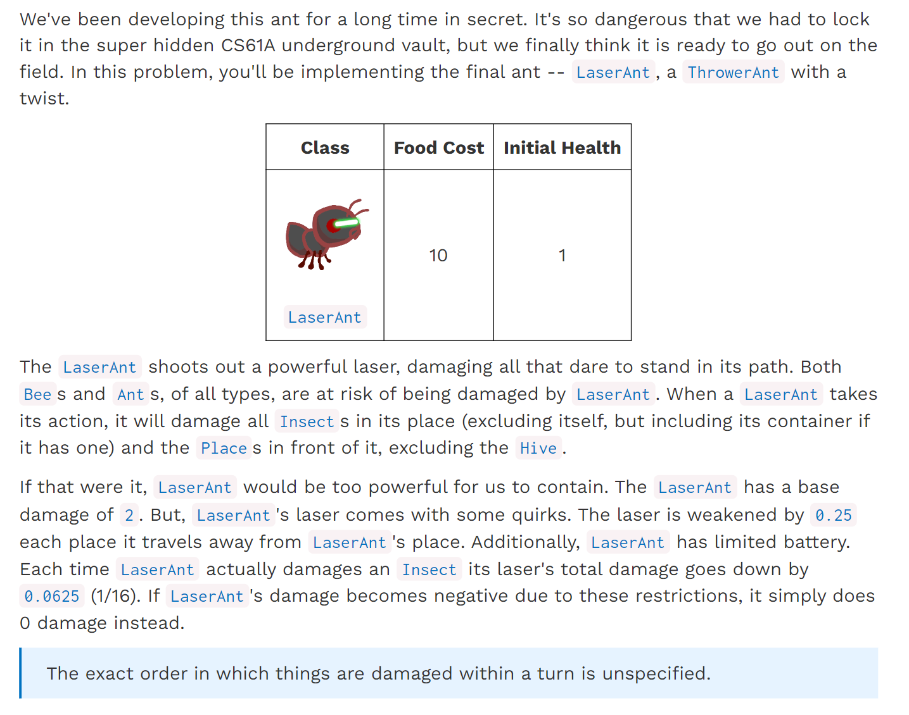
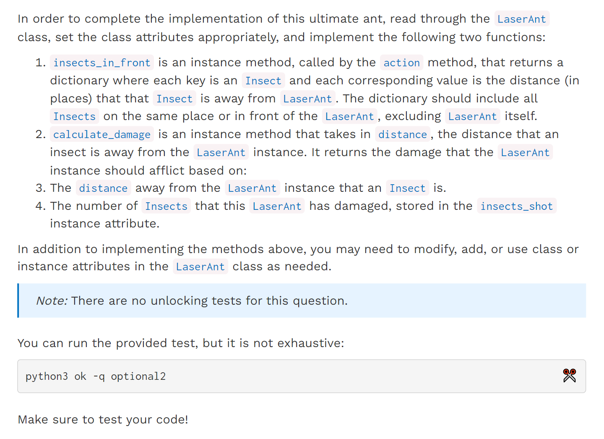

[released_proj_ants_ants.zip](https://www.yuque.com/attachments/yuque/0/2023/zip/12393765/1672828379599-20afcd22-26c3-4ec9-be33-f9fe6fc8f5ea.zip)
[ants.pdf](https://www.yuque.com/attachments/yuque/0/2023/pdf/12393765/1672828414499-b6b699ee-c0b3-4df5-84b4-52fe4b666f5e.pdf)
[released_proj_ants_diagram_ants_diagram.pdf](https://www.yuque.com/attachments/yuque/0/2023/pdf/12393765/1673155759676-3829f3dd-111e-44b7-8555-a9c875ad32bf.pdf)


# Important Required Questions
## P8a *args& **kwargs
> 
> 千万不要把`Ant Class`中的`implemented`改成`True`, 否则游戏会崩溃，要等三个`phase`全部做完了之后再`implemented = True`。


## P12 QueenAnts - cls⭐⭐⭐⭐⭐
:::info

`cls` and `self`: [https://pencilprogrammer.com/python-self-vs-cls/](https://pencilprogrammer.com/python-self-vs-cls/)
:::
**Hint**
```python
class Ant(Insect):
    """An Ant occupies a place and does work for the colony."""

    implemented = False  # Only implemented Ant classes should be instantiated
    food_cost = 0
    is_container = False
    # ADD CLASS ATTRIBUTES HERE

    def __init__(self, health=1):
        """Create an Insect with a HEALTH quantity."""
        super().__init__(health)

    @classmethod
    def construct(cls, gamestate):
        """Create an Ant for a given GameState, or return None if not possible."""
        if cls.food_cost > gamestate.food:
            print('Not enough food remains to place ' + cls.__name__)
            return
        return cls()

    def can_contain(self, other):
        return False

    def store_ant(self, other):
        assert False, "{0} cannot contain an ant".format(self)

    def remove_ant(self, other):
        assert False, "{0} cannot contain an ant".format(self)

    def add_to(self, place):
        if place.ant is None:
            place.ant = self
        else:
            # BEGIN Problem 8b
            # assert place.ant is None, 'Two ants in {0}'.format(place)
            assert place.ant.can_contain(self) or self.can_contain(place.ant), 'Two ants in {0}'.format(place)
            if place.ant.is_container:
                place.ant.store_ant(self)
            else:
                self.store_ant(place.ant)
                # Remember to modify the reference
                place.ant = self
            # END Problem 8b
        Insect.add_to(self, place)

    def remove_from(self, place):
        if place.ant is self:
            place.ant = None
        elif place.ant is None:
            assert False, '{0} is not in {1}'.format(self, place)
        else:
            place.ant.remove_ant(self)
        Insect.remove_from(self, place)

    def double(self):
        """Double this ants's damage, if it has not already been doubled."""
        # BEGIN Problem 12
        "*** YOUR CODE HERE ***"
        # Use has_attr to judge whether the damage has been doubled
        if not hasattr(self, 'is_doubled'):
            self.damage = self.damage * 2
            self.is_doubled = True
        # END Problem 12'

            
# BEGIN Problem 12
class QueenAnt(ScubaThrower):  # You should change this line
# END Problem 12
    """The Queen of the colony. The game is over if a bee enters her place."""

    name = 'Queen'
    food_cost = 7
    # OVERRIDE CLASS ATTRIBUTES HERE
    # BEGIN Problem 12
    implemented = True   # Change to True to view in the GUI
    # END Problem 12

    @classmethod
    def construct(cls, gamestate):
        """
        Returns a new instance of the Ant class if it is possible to construct, or
        returns None otherwise. Remember to call the construct() method of the superclass!
        """
        # BEGIN Problem 12
        "*** YOUR CODE HERE ***"
        if cls.food_cost > gamestate.food:
            print('Not enough food remains to place ' + cls.__name__)
            return
        elif hasattr(gamestate, "queen_created"):
            # Don't print anything
            return
        else:
            gamestate.queen_created = True
            # This is how we call the super_class's construct class method.
            return super().construct(gamestate)
        # END Problem 12

    def action(self, gamestate):
        """A queen ant throws a leaf, but also doubles the damage of ants
        in her tunnel.
        """
        # BEGIN Problem 12
        "*** YOUR CODE HERE ***"
        # Throw at the cloest bee, method inherited from Thrower Ant
        super().action(gamestate)
        # double the damage of the ants behind it, not the current tile
        curr_place = self.place.exit
        while curr_place is not None:
            # Take all the ants on this place
            ant_on_the_place = curr_place.ant
            if ant_on_the_place is not None:
                # If there are two ants
                if ant_on_the_place.is_container:
                    ant_contained = ant_on_the_place.ant_contained
                    if ant_contained is not None:
                        ant_contained.double()
                ant_on_the_place.double()
            curr_place = curr_place.exit
        # END Problem 12


    def remove_from(self, place):
        return


    def reduce_health(self, amount):
        """Reduce health by AMOUNT, and if the QueenAnt has no health
        remaining, signal the end of the game.
        """
        # BEGIN Problem 12
        "*** YOUR CODE HERE ***"
        # Call superclass method
        remaining_health = self.health - amount
        if remaining_health == 0:
            ants_lose()
        super().reduce_health(amount)
        # END Problem 12

```


## P13 SlowerTower - HOF⭐⭐⭐
:::info

:::
```python
class SlowThrower(ThrowerAnt):
    """ThrowerAnt that causes Slow on Bees."""

    name = 'Slow'
    food_cost = 6
    damage = 0
    slow_turns = 5
    # BEGIN Problem EC
    implemented = True   # Change to True to view in the GUI
    # END Problem EC

    def throw_at(self, target):

        # BEGIN Problem EC
        "*** YOUR CODE HERE ***"
        # Action taken at even timestamp
        # original action, cached
        original_action = target.action

        def call_action_even(gamestate):
            # Slowing effect time get decremented by 1
            target.slow_turns -= 1
            if gamestate.time % 2 == 0:
                # Be careful not to write target.action(gamestate)
                # This will cause infinite recursion due to self-reference
                # i.e target.action == call_action_even
                original_action(gamestate)
            # When slowing effect is over, switch back to original action call
            if target.slow_turns == 0:
                target.action = original_action

        # throw at the nearest bee
        super().throw_at(target)

        # Apply the slowing effect to the target
        # Reset the slowing effect
        target.slow_turns = self.slow_turns
        target.action = call_action_even
        # END Problem EC
```


# Optional Problems
## NinjaAnt
:::info

:::


## LaserAnt
:::info

:::
