[released_disc_disc08_disc08.pdf](https://www.yuque.com/attachments/yuque/0/2023/pdf/12393765/1672896572024-c675ecb5-b04a-49ef-a0d0-64e2bba476eb.pdf)
[released_disc_sol-disc08_disc08.pdf](https://www.yuque.com/attachments/yuque/0/2023/pdf/12393765/1672896572497-92a295af-e828-40e3-a3c7-6222b3446413.pdf)

# Representation
## Q1 WWPD: Representation⭐⭐⭐
> 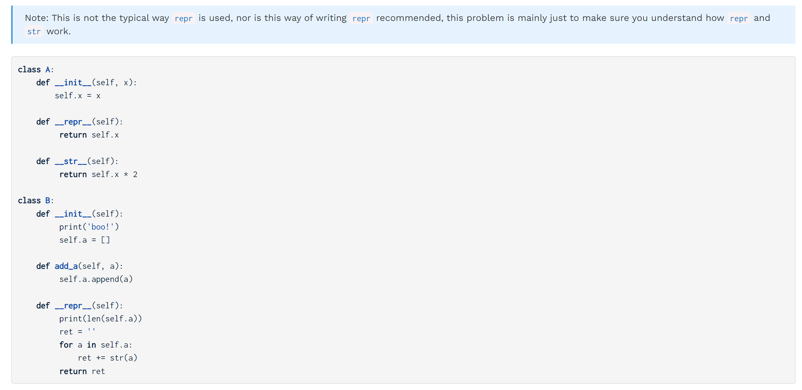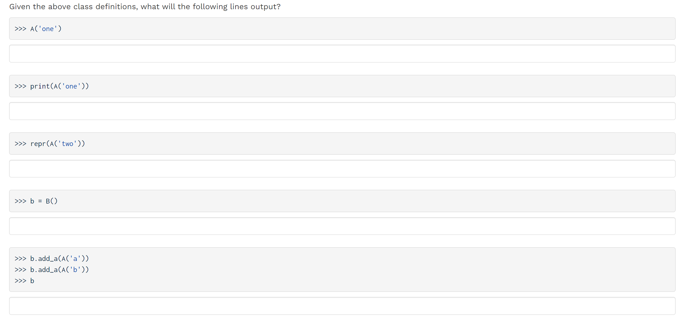
> `A('one')`会调用`repr()`方法，在`interactive interpreter`上就是没有字符串的`one`，尽管`repr`函数返回了字符串
> 而直接调用`repr(obj)`则会返回一个字符串来描述`obj`

**Solution and Explanations**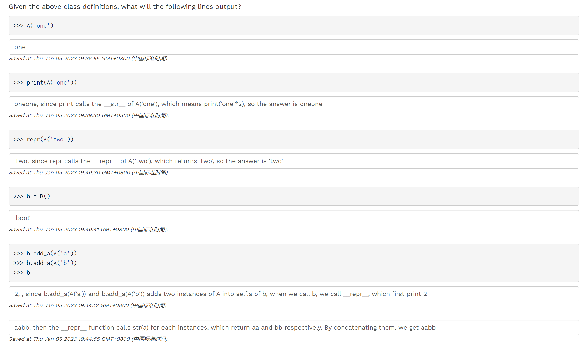


# Linked Lists
## Q2 The Hy-rules of Linked List
> 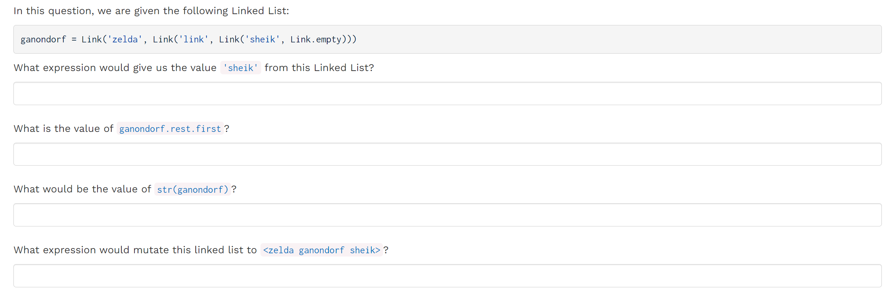

**Solution**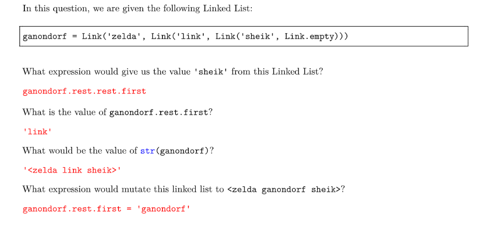


## Q3 Sum Nums
> 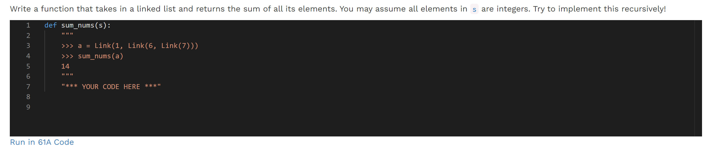

```python
def sum_nums(s):
    """
    >>> a = Link(1, Link(6, Link(7)))
    >>> sum_nums(a)
    14
    """
    "*** YOUR CODE HERE ***"
    pass


class Link:
    empty = ()

    def __init__(self, first, rest=empty):
        assert rest is Link.empty or isinstance(rest, Link)
        self.first = first
        self.rest = rest

    def __repr__(self):
        if self.rest is not Link.empty:
            rest_repr = ', ' + repr(self.rest)
        else:
            rest_repr = ''
        return 'Link(' + repr(self.first) + rest_repr + ')'

    def __str__(self):
        string = '<'
        while self.rest is not Link.empty:
            string += str(self.first) + ' '
            self = self.rest
        return string + str(self.first) + '>'

```
```python
def sum_nums(s):
    """
    >>> a = Link(1, Link(6, Link(7)))
    >>> sum_nums(a)
    14
    """
    "*** YOUR CODE HERE ***"
    if s.rest is Link.empty:
        return s.first

    return s.first + sum_nums(s.rest)
```
**Solution**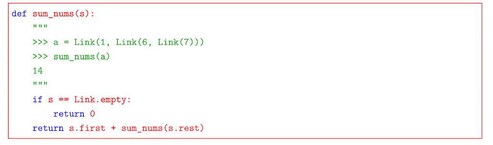

## Q4 Multiply Links⭐⭐⭐⭐
> 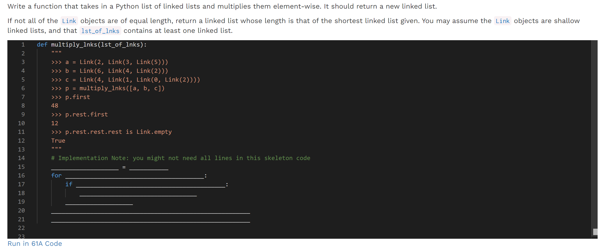
> 本题提供两种解法, `recursion`和`iteration`

```python
def multiply_lnks(lst_of_lnks):
    """
    >>> a = Link(2, Link(3, Link(5)))
    >>> b = Link(6, Link(4, Link(2)))
    >>> c = Link(4, Link(1, Link(0, Link(2))))
    >>> p = multiply_lnks([a, b, c])
    >>> p.first
    48
    >>> p.rest.first
    12
    >>> p.rest.rest.rest is Link.empty
    True
    """
    # Implementation Note: you might not need all lines in this skeleton code
    ___________________ = ___________
    for _______________________________________:
        if __________________________________________:
            _________________________________
        ___________________
	________________________________________________________
    ________________________________________________________


class Link:
    empty = ()

    def __init__(self, first, rest=empty):
        assert rest is Link.empty or isinstance(rest, Link)
        self.first = first
        self.rest = rest

    def __repr__(self):
        if self.rest is not Link.empty:
            rest_repr = ', ' + repr(self.rest)
        else:
            rest_repr = ''
        return 'Link(' + repr(self.first) + rest_repr + ')'

    def __str__(self):
        string = '<'
        while self.rest is not Link.empty:
            string += str(self.first) + ' '
            self = self.rest
        return string + str(self.first) + '>'
```
```python
def multiply_lnks(lst_of_lnks):
    """
    >>> a = Link(2, Link(3, Link(5)))
    >>> b = Link(6, Link(4, Link(2)))
    >>> c = Link(4, Link(1, Link(0, Link(2))))
    >>> p = multiply_lnks([a, b, c])
    >>> p.first
    48
    >>> p.rest.first
    12
    >>> p.rest.rest.rest is Link.empty
    True
    """
    # Implementation Note: you might not need all lines in this skeleton code
    curr_product = 1
    for linked_list in lst_of_lnks:
        # 这是为了返回最小长度的list, 不需要继续计算乘积了
        if linked_list is Link.empty:
            return linked_list
        curr_product *= linked_list.first
    lst_of_lnks_rest = [lnk.rest for lnk in lst_of_lnks]
    return Link(curr_product,multiply_lnks(lst_of_lnks_rest))
```
```python
def multiply_lnks(lst_of_lnks):
    """
    >>> a = Link(2, Link(3, Link(5)))
    >>> b = Link(6, Link(4, Link(2)))
    >>> c = Link(4, Link(1, Link(0, Link(2))))
    >>> p = multiply_lnks([a, b, c])
    >>> p.first
    48
    >>> p.rest.first
    12
    >>> p.rest.rest.rest is Link.empty
    True
    """
    import operator
    from functools import reduce
    def prod(factors):
        return reduce(operator.mul, factors, 1)

    head = Link.empty
    tail = head
    while Link.empty not in lst_of_lnks:
        all_prod = prod([l.first for l in lst_of_lnks])
        if head is Link.empty:
            head = Link(all_prod)
            tail = head
        else:
            tail.rest = Link(all_prod)
            tail = tail.rest
            lst_of_lnks = [l.rest for l in lst_of_lnks]
    return head
```
```python
def multiply_lnks(lst_of_lnks):
    """
    >>> a = Link(2, Link(3, Link(5)))
    >>> b = Link(6, Link(4, Link(2)))
    >>> c = Link(4, Link(1, Link(0, Link(2))))
    >>> p = multiply_lnks([a, b, c])
    >>> p.first
    48
    >>> p.rest.first
    12
    >>> p.rest.rest.rest is Link.empty
    True
    """
    curr_lnk_lst = lst_of_lnks
    # Tracker, will be updated
    p = Link(Link.empty)
    # head node
    res = p
    while Link.empty not in curr_lnk_lst:
        curr_product = 1
        for linked_list in curr_lnk_lst:
            curr_product *= linked_list.first
        curr_lnk_lst = [lnk.rest for lnk in curr_lnk_lst]
        p.first = curr_product
        p.rest = Link(Link.empty)
        p = p.rest
    return res
```
**Solution and Analysis**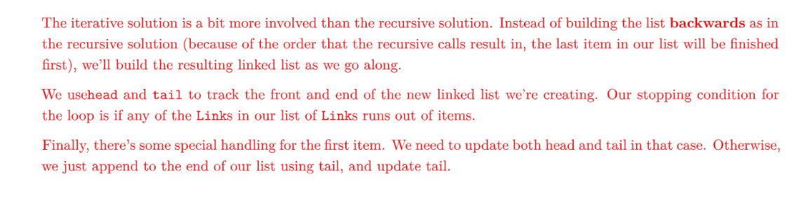


## Q5 Flip Two - Value⭐⭐⭐
> 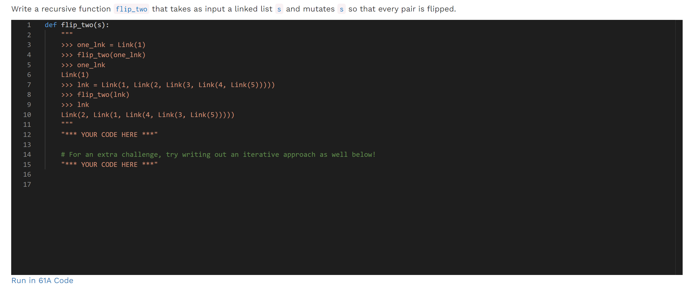
> 注意本题中我们不能创建新的`Link List`, 不能使用`Link`关键字。
> 另外，本课程中的`Linked_List`的实现是嵌套式的，而不是节点式的，所以`node.rest.rest = node`的操作并不能`flip`链表， 而是会切断链表，造成原有的链表引用变量访问不到正确的新的头结点。错误代码如下, 因为`21`行的递归调用并没有告诉当前递归层说我之后的链表的头结点是谁, 换句话说，假设当前递归循环将`2`和`1`对调了，那么我们需要把`1`链接到`4`上，但是我们不知道是不是`4`。
> 因此我们只能交换链表结点的值。下面的解法也都是交换链表的值。

```python
def flip_two(s):
    """
    >>> one_lnk = Link(1)
    >>> flip_two(one_lnk)
    >>> one_lnk
    Link(1)
    >>> lnk = Link(1, Link(2, Link(3, Link(4, Link(5)))))
    >>> flip_two(lnk)
    >>> lnk
    Link(2, Link(1, Link(4, Link(3, Link(5)))))
    """
    "*** YOUR CODE HERE ***"
    if s.rest is Link.empty or s is Link.empty:
        return

    new_head = s.rest
    tail = s.rest.rest
    s.rest = tail
    new_head.rest = s

    flip_two(tail)

```
```python
def flip_two(s):
    """
    >>> one_lnk = Link(1)
    >>> flip_two(one_lnk)
    >>> one_lnk
    Link(1)
    >>> lnk = Link(1, Link(2, Link(3, Link(4, Link(5)))))
    >>> flip_two(lnk)
    >>> lnk
    Link(2, Link(1, Link(4, Link(3, Link(5)))))
    """
    "*** YOUR CODE HERE ***"

    # For an extra challenge, try writing out an iterative approach as well below!
    "*** YOUR CODE HERE ***"
    pass

```
```python
def flip_two(s):
    if s.rest is Link.empty or s is Link.empty:
        return
    s.first, s.rest.first = s.rest.first, s.first
    flip_two(s.rest.rest)

```
```python
def flip_two(s):
    """
    >>> one_lnk = Link(1)
    >>> flip_two(one_lnk)
    >>> one_lnk
    Link(1)
    >>> lnk = Link(1, Link(2, Link(3, Link(4, Link(5)))))
    >>> flip_two(lnk)
    >>> lnk
    Link(2, Link(1, Link(4, Link(3, Link(5)))))
    """
    "*** YOUR CODE HERE ***"
    while s.rest is not Link.empty and s is not Link.empty:
        s.first, s.rest.first = s.rest.first, s.first
        s = s.rest.rest
```


# Trees
## Q6 Make Even
> 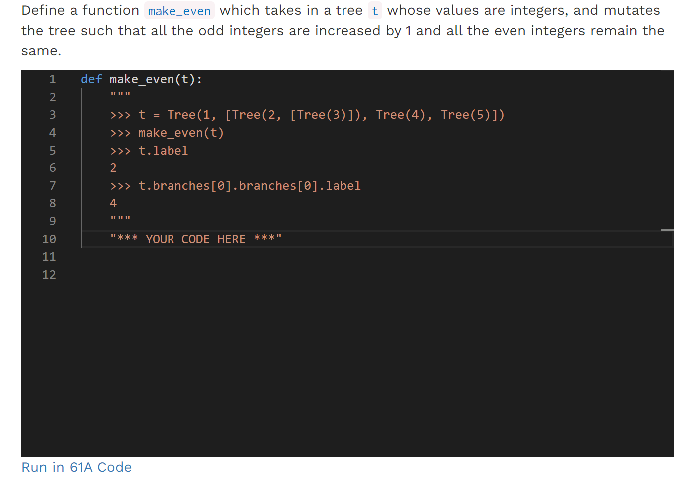

```python
def make_even(t):
    """
    >>> t = Tree(1, [Tree(2, [Tree(3)]), Tree(4), Tree(5)])
    >>> make_even(t)
    >>> t.label
    2
    >>> t.branches[0].branches[0].label
    4
    """
    "*** YOUR CODE HERE ***"

```
```python
def make_even(t):
    """
    >>> t = Tree(1, [Tree(2, [Tree(3)]), Tree(4), Tree(5)])
    >>> make_even(t)
    >>> t.label
    2
    >>> t.branches[0].branches[0].label
    4
    """
    "*** YOUR CODE HERE ***"
    if t.label % 2 == 1:
        t.label += 1

    for b in t.branches:
        make_even(b)
```
**Solution And Analysis**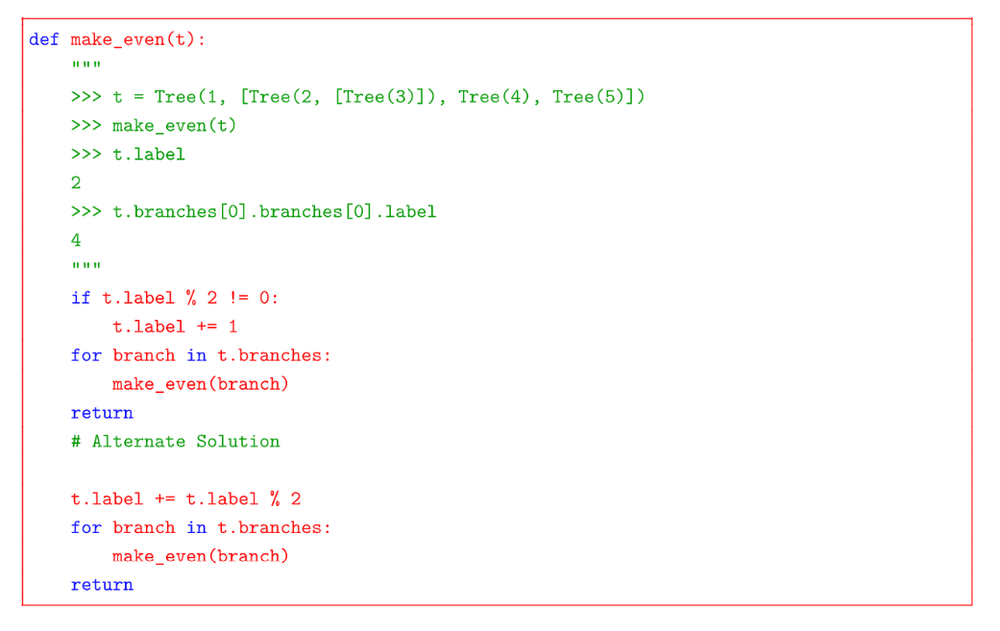

## Q7 Add Leaves⭐⭐⭐
> 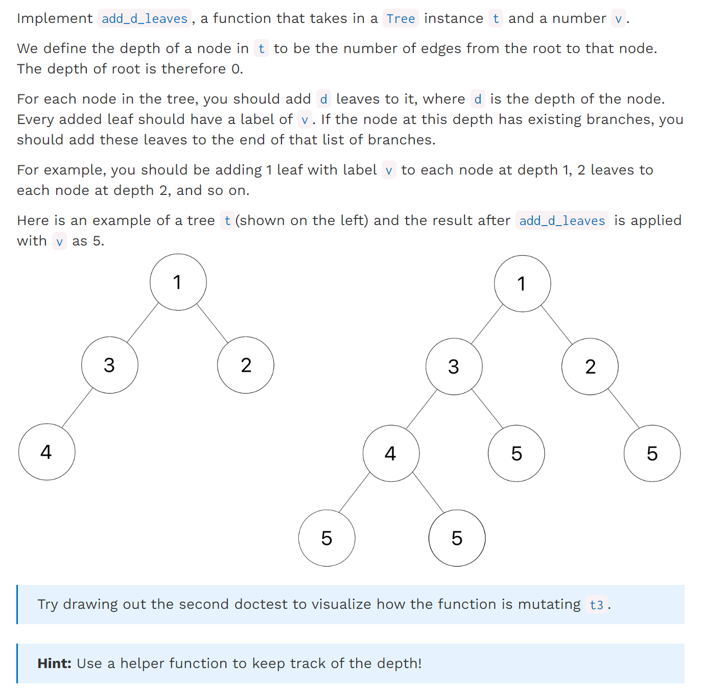

```python
def add_d_leaves(t, v):
    """Add d leaves containing v to each node at every depth d.

    >>> t_one_to_four = Tree(1, [Tree(2), Tree(3, [Tree(4)])])
    >>> print(t_one_to_four)
    1
      2
      3
        4
    >>> add_d_leaves(t_one_to_four, 5)
    >>> print(t_one_to_four)
    1
      2
        5
      3
        4
          5
          5
        5

    >>> t1 = Tree(1, [Tree(3)])
    >>> add_d_leaves(t1, 4)
    >>> t1
    Tree(1, [Tree(3, [Tree(4)])])
    >>> t2 = Tree(2, [Tree(5), Tree(6)])
    >>> t3 = Tree(3, [t1, Tree(0), t2])
    >>> print(t3)
    3
      1
        3
          4
      0
      2
        5
        6
    >>> add_d_leaves(t3, 10)
    >>> print(t3)
    3
      1
        3
          4
            10
            10
            10
          10
          10
        10
      0
        10
      2
        5
          10
          10
        6
          10
          10
        10
    """
    "*** YOUR CODE HERE ***"
    pass
```
```python
def add_d_leaves(t, v):
    # 闭包的性质让我们的helper function不需要v这个参数
    def helper(t, d):
        """
        The helper function to add_d_leaves
        :param t: tree structure
        :param v: value to be added
        :param d: curr depth
        :return:
        """
        for b in t.branches:
            helper(b, d+1)

        for _ in range(d):
            t.branches.append(Tree(v))
    helper(t,0)
```
**Solution and Analysis**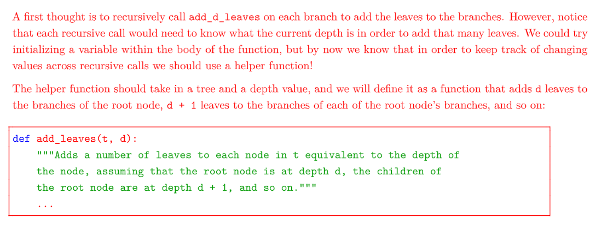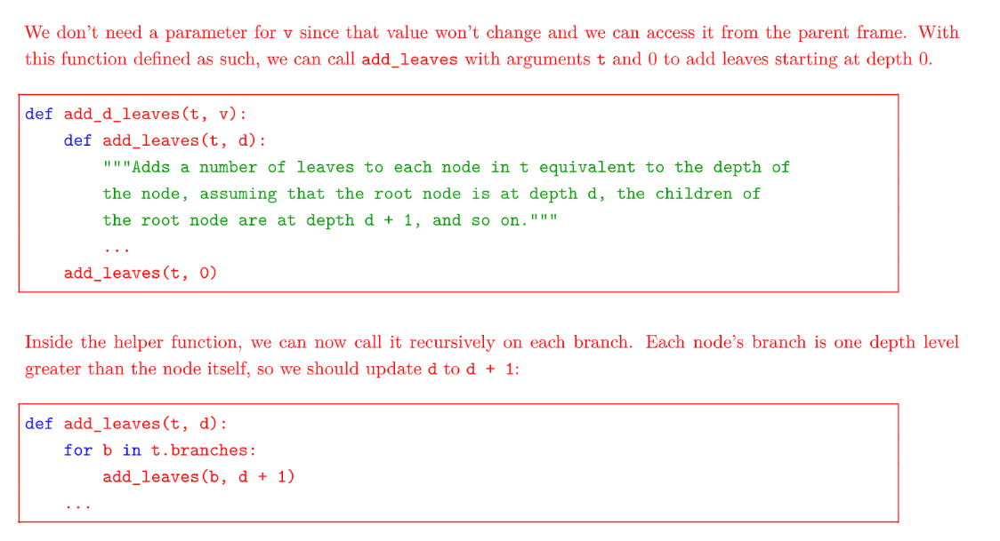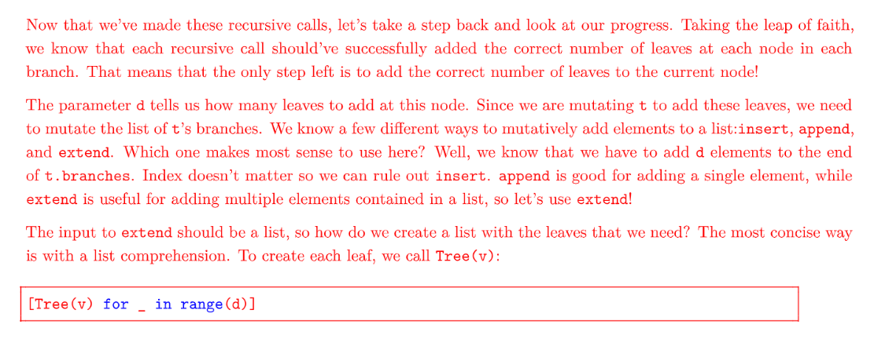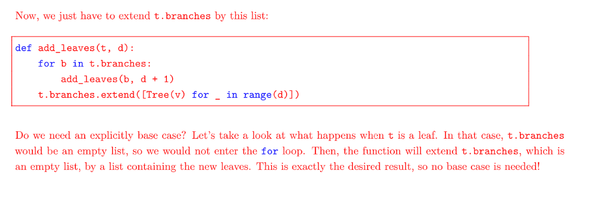

# Effiency (Orders of Growth)
## Examples
### Constant Order
> 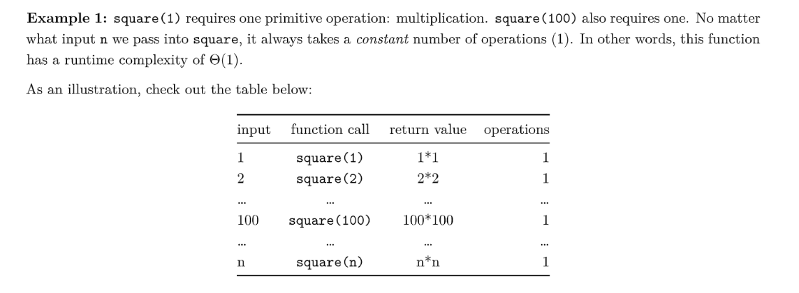


### Linear Order
> 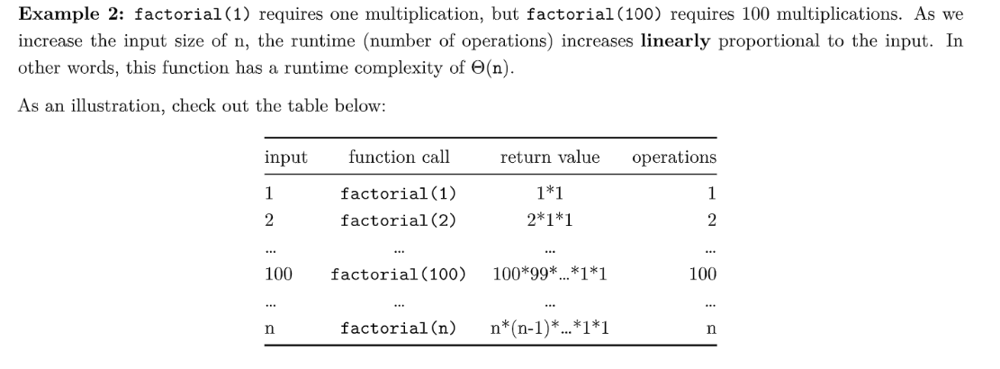


### Quadratic Order
> 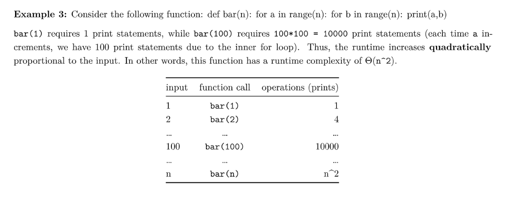


### Exponential Order
> 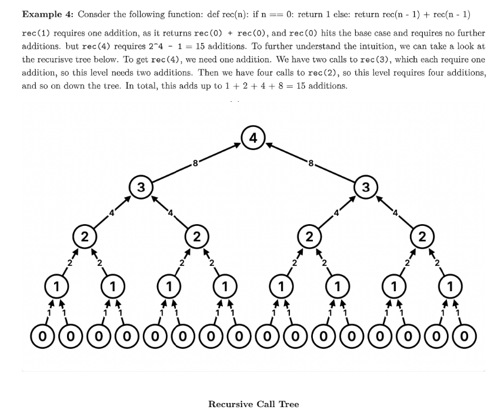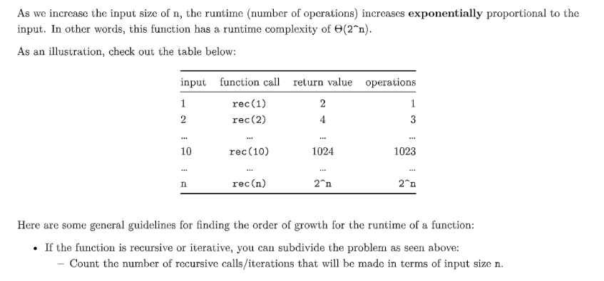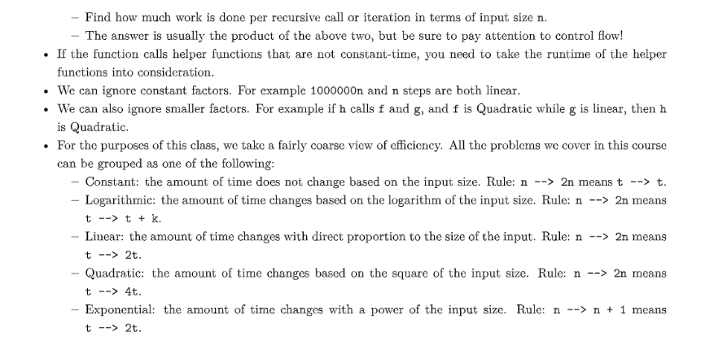


## Q8 WWPD: Orders of Growth
> 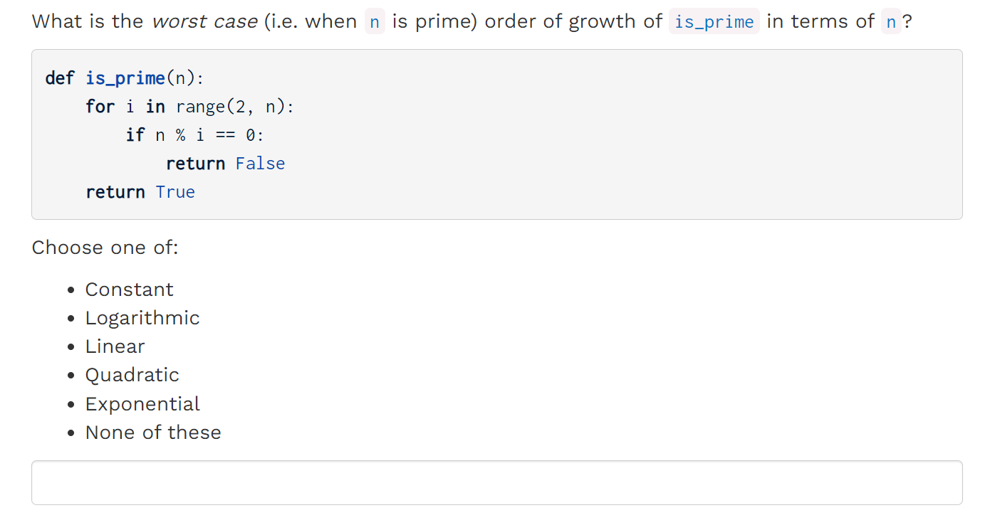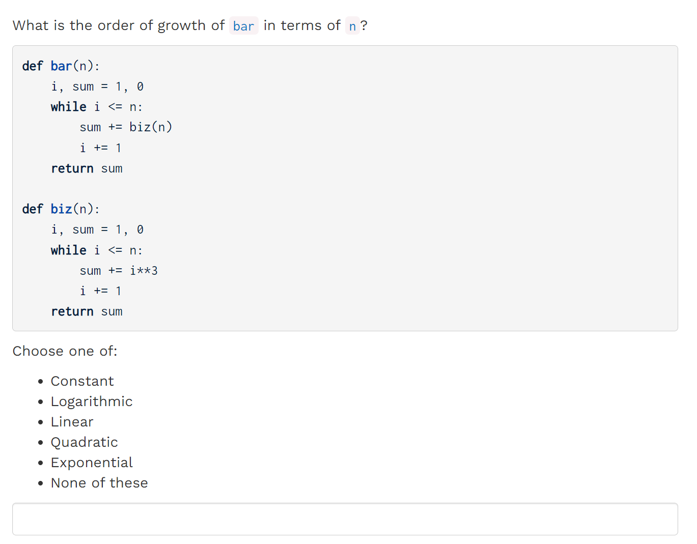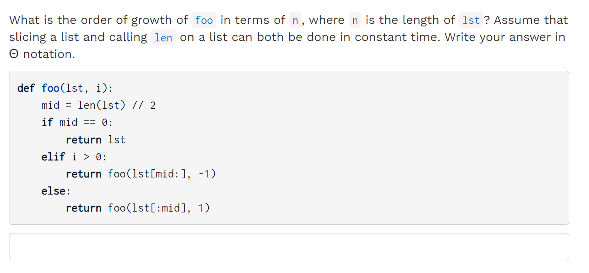

**Solution**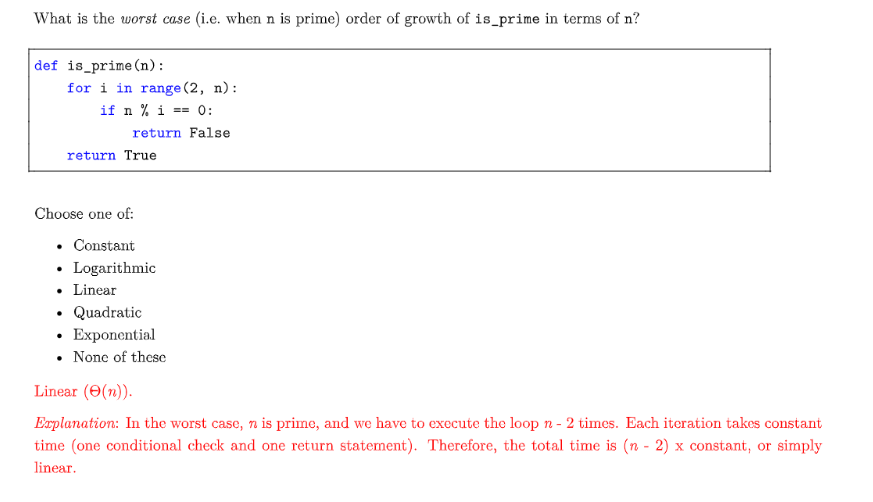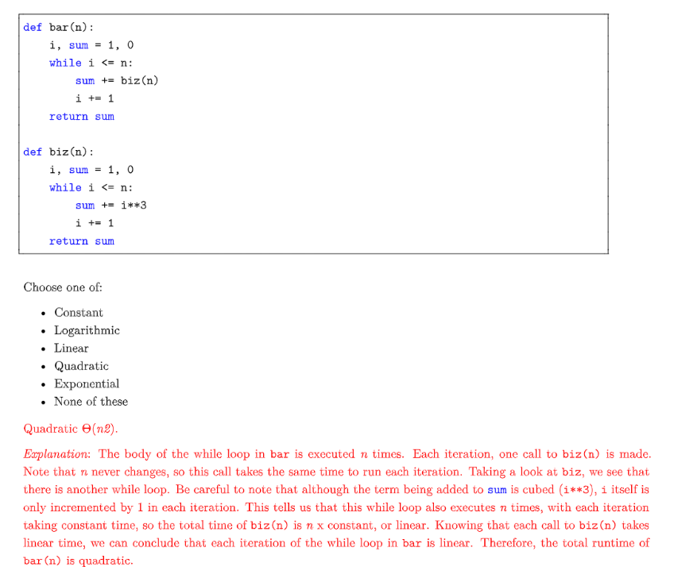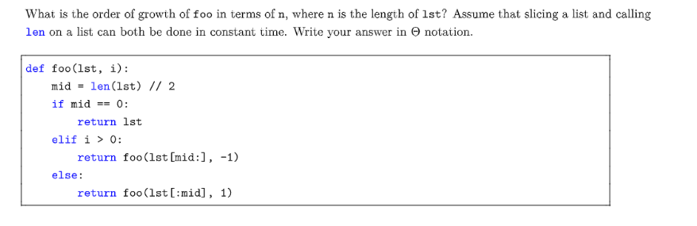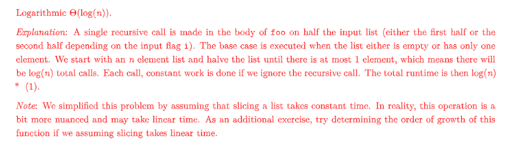
