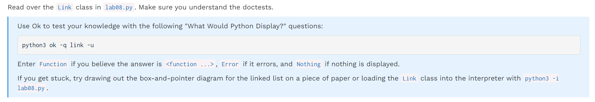
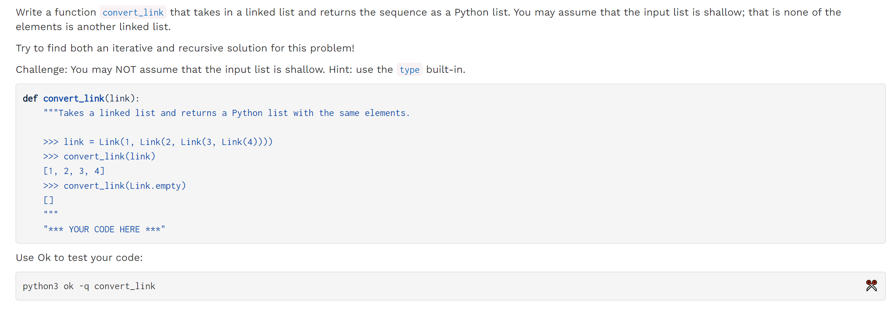
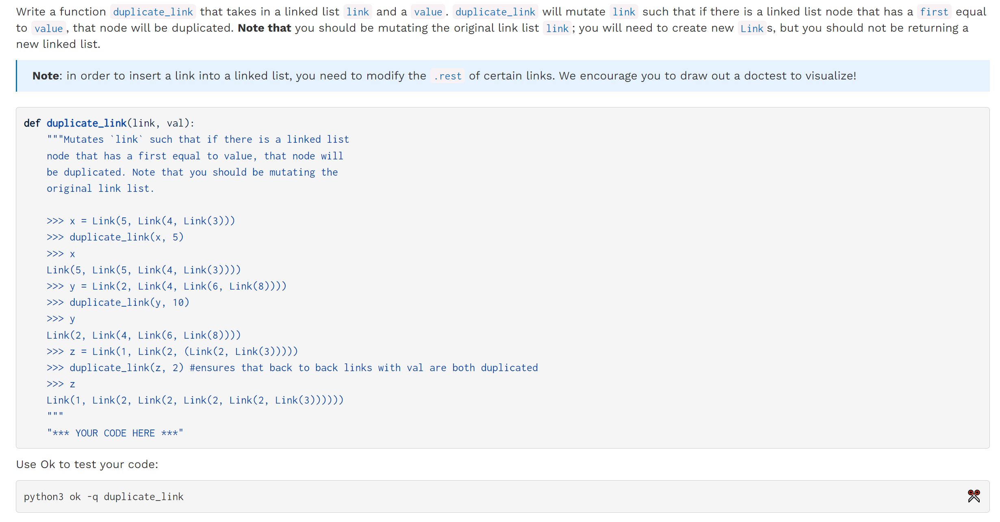
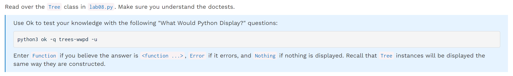
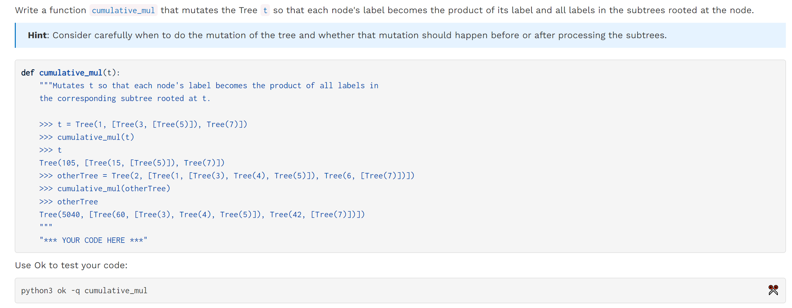
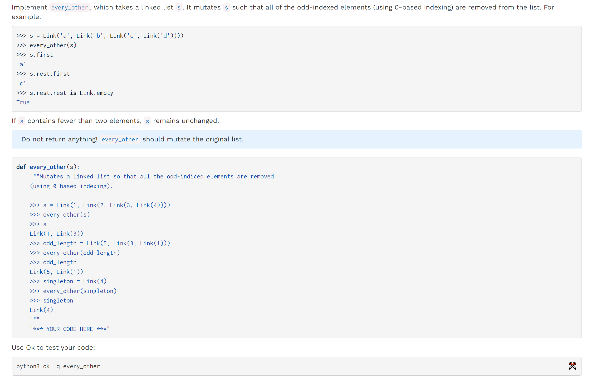
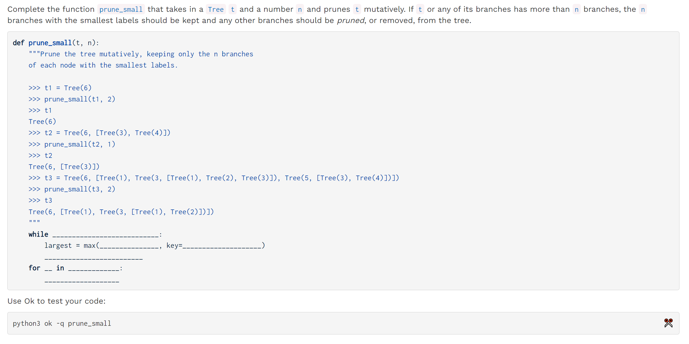

[released_lab_lab08_lab08.zip](https://www.yuque.com/attachments/yuque/0/2023/zip/12393765/1672896463318-d971d563-6112-47c2-92dc-bab4b77f4d28.zip)
[released_lab_sol-lab08_lab08.zip](https://www.yuque.com/attachments/yuque/0/2023/zip/12393765/1672896467518-6124539f-be22-46db-b113-4f8ebcdf5744.zip)
[Lab 8_ Linked Lists, Mutable Trees _ CS 61A Fall 2022.pdf](https://www.yuque.com/attachments/yuque/0/2023/pdf/12393765/1672896509579-d12cdabf-847a-4c57-9db5-5450fd1ff5f3.pdf)

# Linked Lists
## Q1 WWPD: Linked Lists
> 


## Q2 Convert Link
> 

```python
def convert_link(link):
    res = []
    while link is not Link.empty:
        res.append(link.first)
        link = link.rest

    return res

```
```python
def convert_link(link):
    """Takes a linked list and returns a Python list with the same elements.

    >>> link = Link(1, Link(2, Link(3, Link(4))))
    >>> convert_link(link)
    [1, 2, 3, 4]
    >>> convert_link(Link.empty)
    []
    """
    "*** YOUR CODE HERE ***"
    if link is Link.empty:
		return []
    
    return [link.first] + convert_link(link.rest)

```


## Q3 Duplicate Link
> 

```python
def duplicate_link(link, val):
    p = link
    while p.rest is not Link.empty:
        if p.first == val:
            rest_p = p.rest
            p.rest = Link(val, rest_p)
            p = p.rest.rest
        else:
            p = p.rest
```
```python
def duplicate_link(link, val):
    if link is Link.empty:
        return
    if link.first == val:
        rest_p = link.rest
        duplicate_link(rest_p, val)
        link.rest = Link(link.first, rest_p)
    else:
        duplicate_link(link.rest, val)
```


# Trees
## Q4 WWPD: Trees
> 


## Q5 Cumulative Mul
> 

```python
def cumulative_mul(t):
    if t.is_leaf():
        return
    
    for b in t.branches:
        # 先修改
        cumulative_mul(b)
        # 再更新
        t.label *= b.label

	# Alt
    for b in t.branches:
        cumulative_mul(b)
    total = t.label
    for b in t.branches:
        total *= b.label
    t.label = total
```

# Optional Questions
## Q6 Every Other⭐⭐⭐
> 

```python
def every_other(s):
    while s is not Link.empty and s.rest is not Link.empty:
        s.rest = s.rest.rest
        s = s.rest

```
```python
def every_other(s):
    # s is Link.empty 对应even length
    # s.rest is Link.empty 对应 odd length
    if s is Link.empty or s.rest is Link.empty:
        return
    else:
        s.rest = s.rest.rest
        every_other(s.rest)

```


## Q7 Prune Small
> 

```python
def prune_small(t, n):
    while len(t.branches) > n:
        largest = max([b for b in t.branches], key=lambda x: x.label)
        t.branches.remove(largest)
    for b in t.branches:
        prune_small(b, n)

```
