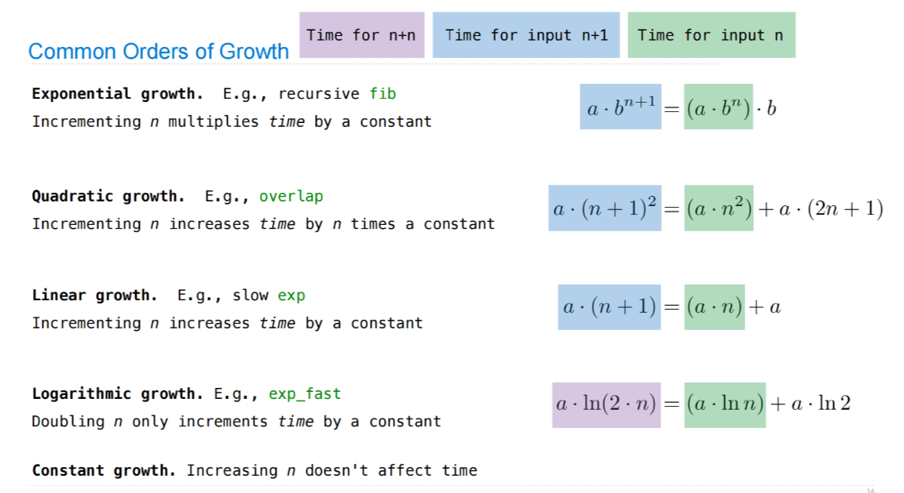
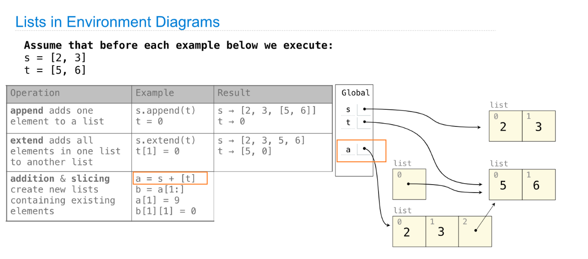
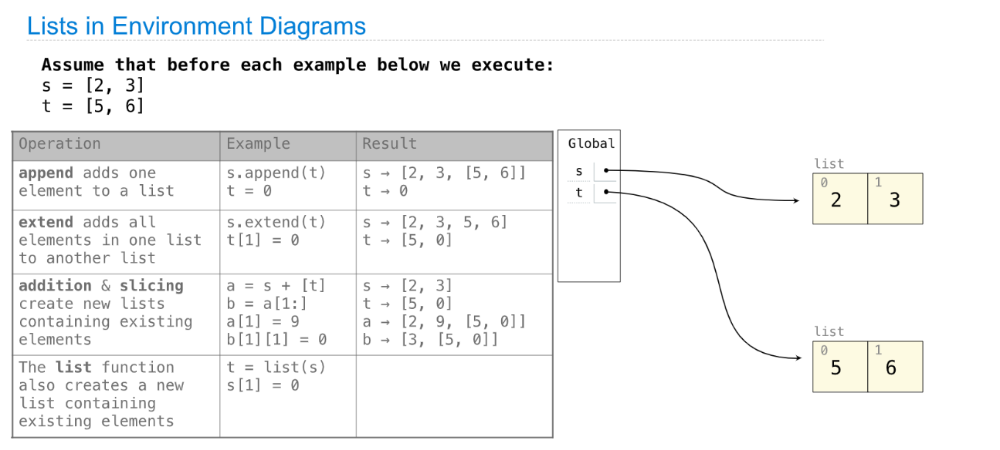

> Ch 2.8: [http://composingprograms.com/pages/28-efficiency.html](http://composingprograms.com/pages/28-efficiency.html)

[released_assets_slides_23-Efficiency_full.pdf](https://www.yuque.com/attachments/yuque/0/2023/pdf/12393765/1672901177203-06ff1389-3de4-4e5c-bbb5-84dc156def25.pdf)
[released_assets_slides_24-Decomposition_full.pdf](https://www.yuque.com/attachments/yuque/0/2023/pdf/12393765/1672901102663-bdb10ec4-a671-48a0-a150-3b3db2cc16a5.pdf)
[released_assets_slides_25-Data_Examples_full.pdf](https://www.yuque.com/attachments/yuque/0/2023/pdf/12393765/1672901144938-b3da7218-61b0-4994-bb25-f0be474dbee7.pdf)


# 1 Efficiency
## Fib Calls - Decorator Counter⭐⭐⭐
> 

```python
def count(f):
    """Return a counted version of f with a call_count attribute.

    >>> def fib(n):
    ...     if n == 0 or n == 1:
    ...         return n
    ...     else:
    ...         return fib(n-2) + fib(n-1)
    >>> fib = count(fib)
    >>> fib(20)
    6765
    >>> fib.call_count
    21891
    """
    def counted(*args):
        counted.call_count += 1
        return f(*args)
    counted.call_count = 0
    return counted


@count
def fib(n):
    """The nth Fibonacci number.

    >>> fib(20)
    6765
    """
    if n == 0 or n == 1:
        return n
    else:
        return fib(n-2) + fib(n-1)


if __name__ == "__main__":
    # If we don't use the decorator keyword, we should instead do
    # fib = count(fib) to obtain the same logic
    # 本质上fib = count(fib)就是确保我们后续在装饰器函数中调用fib的时候fib的引用已经
    # 指向了最新的函数count(*args)
    fib(5)
    print(fib.call_count)

```


## Memoization
> 

```python
# Fib call decorator
def count(f):
    """Return a counted version of f with a call_count attribute.

    >>> def fib(n):
    ...     if n == 0 or n == 1:
    ...         return n
    ...     else:
    ...         return fib(n-2) + fib(n-1)
    >>> fib = count(fib)
    >>> fib(20)
    6765
    >>> fib.call_count
    21891
    """
    def counted(*args):
        counted.call_count += 1
        return f(*args)
    counted.call_count = 0
    return counted

# Memoized version of fib(n)
def memo(f):
    """Memoize f.

    >>> def fib(n):
    ...     if n == 0 or n == 1:
    ...         return n
    ...     else:
    ...         return fib(n-2) + fib(n-1)
    >>> fib = count(fib)
    >>> fib(20)
    6765
    >>> fib.call_count
    21891
    >>> counted_fib = count(fib)
    >>> fib  = memo(counted_fib)
    >>> fib(20)
    6765
    >>> counted_fib.call_count
    21
    >>> fib(35)
    9227465
    >>> counted_fib.call_count
    36
    """
    cache = {}
    def memoized(n):
        if n not in cache:
            cache[n] = f(n)
        return cache[n]
    return memoized


# 先用memo装饰，再用count装饰
@count
@memo
def fib(n):
    """The nth Fibonacci number.

    >>> fib(20)
    6765
    """
    if n == 0 or n == 1:
        return n
    else:
        return fib(n-2) + fib(n-1)


if __name__ == "__main__":
    fib(5)
    # Same as 
    # fib = memo(fib); fib = count(fib)
    print(fib.call_count)
```
> 


## Exponentiation
> 

```python
def exp(b, n):
    """Return b to the n.

    >>> exp(2, 10)
    1024
    """
    if n == 0:
        return 1
    else:
        return b * exp(b, n-1)

def square(x):
    return x*x

def exp_fast(b, n):
    """Return b to the n.

    >>> exp_fast(2, 10)
    1024
    """
    if n == 0:
        return 1
    elif n % 2 == 0:
        return square(exp_fast(b, n//2))
    else:
        return b * exp_fast(b, n-1)

```

## Order of Growth
### Quadratic Time
> 

```python
def overlap(a, b):
    """Count the number of items that appear in both a and b.

    >>> overlap([3, 5, 7, 6], [4, 5, 6, 5])
    3
    """
    count = 0
    for item in a:
        for other in b:
            if item == other:
                count += 1
    return count

```

### Exponential Time
> 


### Common Orders of Growth
> 


## Big Theta and Big O Notations
> 


## Space 
### Memory Occupation
> 

```python
def count_frames(f):
    """Return a counted version of f with a max_count attribute.

    >>> def fib(n):
    ...     if n == 0 or n == 1:
    ...         return n
    ...     else:
    ...         return fib(n-2) + fib(n-1)
    >>> fib = count_frames(fib)
    >>> fib(20)
    6765
    >>> fib.open_count
    0
    >>> fib.max_count
    20
    >>> fib(25)
    75025
    >>> fib.max_count
    25
    """
    def counted(n):
        counted.open_count += 1
        counted.max_count = max(counted.max_count, counted.open_count)
        result = f(n)
        counted.open_count -= 1
        return result
    counted.open_count = 0
    counted.max_count = 0
    return counted

@count_frames
def fib(n):
    """The nth Fibonacci number.

    >>> fib(20)
    6765
    """
    if n == 0 or n == 1:
        return n
    else:
        return fib(n-2) + fib(n-1)

if __name__ == "__main__":
    fib(5)
    print(fib.open_count)
    print(fib.max_count)
```


### Fib Frames
> 
> 最右边的那个`branches`就是最长的调用链，长度为`5`


# 2 Decomposition
## Modular Design
> 


## Restaurant Search Example
### Data
> 


### Most Similar Restaurant
> 

**Solution**


### Speed Up the overlap
> 


### Complete Codes
```python
# Default ranking function to be sorting by stars in reversed order
def search(query, ranking=lambda r: -r.stars):
    results = [r for r in Restaurant.all if query in r.name]
    # Sort the restaurant ranking
    return sorted(results, key=ranking)

def reviewed_both(restaurant, other):
    # Fast Version
    return fast_overlap(restaurant.reviewers, other.reviewers)

    # Too Slow
    return len([r for r in restaurant.reviewers if r in other.reviewers])

def fast_overlap(s, t):
    """Return the overlap between sorted S and sorted T.

    >>> fast_overlap([2, 3, 5, 6, 7], [1, 4, 5, 6, 7, 8])
    3
    """
    count, i, j = 0, 0, 0
    while i < len(s) and j < len(t):
        if s[i] == t[j]:
            count, i, j = count + 1, i + 1, j + 1
        elif s[i] < t[j]:
            i += 1
        else:
            j += 1
    return count


class Restaurant:
    """A restaurant."""
    all = []
    def __init__(self, name, stars, reviewers):
        self.name = name
        self.stars = stars
        self.reviewers = sorted(reviewers) # reviewers
        Restaurant.all.append(self)

    def similar(self, k, similarity=reviewed_both):
        "Return the K most similar restaurants to SELF, using SIMILARITY for comparison."
        others = list(Restaurant.all)
        others.remove(self)
        return sorted(others, key=lambda r: -similarity(self, r))[:k]

    def __repr__(self):
        return '<' + self.name + '>'


# Reading Files
import json

reviewers_by_restaurant = {}
for line in open('reviews.json'):
    r = json.loads(line)
    business_id = r['business_id']
    if business_id not in reviewers_by_restaurant:
        reviewers_by_restaurant[business_id] = []
    reviewers_by_restaurant[business_id].append(r['user_id'])


for line in open('restaurants.json'):
    b = json.loads(line)
    reviewers = reviewers_by_restaurant.get(b['business_id'], [])
    Restaurant(b['name'], b['stars'], reviewers)


results = search('Thai')
for r in results:
    print(r.name, 'is similar to', r.similar(3))
```


# 3 Data Examples & Reviews
## Lists in Environment Diagrams
### Addition and Slicing
> 


### List Function
> 


### Slice Assignment
> 


### Removal & Slice Removal⭐⭐⭐⭐⭐
> 


## Lists of lists Environment Diagram
> 

**Solution**

## Objects
> 

**Solution**

```python
# Work

class Worker:
    greeting = 'Sir'
    def __init__(self):
        self.elf = Worker
    def work(self):
        return self.greeting + ', I work'
    def __repr__(self):
        return Bourgeoisie.greeting

class Bourgeoisie(Worker):
    greeting = 'Peon'
    def work(self):
        print(Worker.work(self))
        return 'My job is to gather wealth'

jack = Worker()
john = Bourgeoisie()
jack.greeting = 'Maam'

def work():
    """Working.

    >>> Worker().work()
    'Sir, I work'
    >>> jack
    Peon
    >>> jack.work()
    'Maam, I work'
    >>> john.work()
    Peon, I work
    'My job is to gather wealth'
    >>> john.elf.work(john)
    'Peon, I work'
    """
```

## Map/Filter/Max/Min ⭐⭐⭐⭐
> 

```python
def min_abs_indices(s):
    """Indices of all elements in list s that have the smallest absolute value.

    >>> min_abs_indices([-4, -3, -2, 3, 2, 4])
    [2, 4]
    >>> min_abs_indices([1, 2, 3, 4, 5])
    [0]
    """
    min_abs = min(map(abs, s))
    return list(filter(lambda i: abs(s[i]) == min_abs, range(len(s))))
    # OR
    return [i for i in range(len(s)) if abs(s[i]) == min_abs]

def largest_adj_sum(s):
    """Largest sum of two adjacent elements in a list s.

    >>> largest_adj_sum([-4, -3, -2, 3, 2, 4])
    6
    >>> largest_adj_sum([-4, 3, -2, -3, 2, -4])
    1
    """
    return max([x + y for x, y in zip(s[:-1], s[1:])])
    # OR
    return max([s[i] + s[i + 1] for i in range(len(s) - 1)])
    # OR
    return max(map(lambda i: s[i] + s[i + 1], range(len(s) - 1)))

def digit_dict(s):
    """Map each digit d to the lists of elements in s that end with d.

    >>> digit_dict([5, 8, 13, 21, 34, 55, 89])
    {1: [21], 3: [13], 4: [34], 5: [5, 55], 8: [8], 9: [89]}
    """
    return {i: [x for x in s if x % 10 == i] for i in range(10) if any([x % 10 == i for x in s])}
    # OR
    last_digits = list(map(lambda x: x % 10, s))
    return {i: [x for x in s if x % 10 == i] for i in range(10) if i in last_digits}

def all_have_an_equal(s):
    """Does every element equal some other element in s?

    >>> all_have_an_equal([-4, -3, -2, 3, 2, 4])
    False
    >>> all_have_an_equal([4, 3, 2, 3, 2, 4])
    True
    """
    return min([sum([1 for y in s if x == y]) for x in s]) > 1
    # OR
    return all([s[i] in s[:i] + s[i+1:] for i in range(len(s))])
    # OR
    return all(map(lambda x: s.count(x) > 1, s))
```

## Linked List
> 

```python
def ordered(s, key=lambda x: x):
    """Is Link s ordered?

    >>> ordered(Link(1, Link(3, Link(4))))
    True
    >>> ordered(Link(1, Link(4, Link(3))))
    False
    >>> ordered(Link(1, Link(-3, Link(4))))
    False
    >>> ordered(Link(1, Link(-3, Link(4))), key=abs)
    True
    >>> ordered(Link(-4, Link(-1, Link(3))))
    True
    >>> ordered(Link(-4, Link(-1, Link(3))), key=abs)
    False
    """
    if s is Link.empty or s.rest is Link.empty:
        return True
    elif key(s.first) > key(s.rest.first):
        return False
    else:
        return ordered(s.rest)

def merge(s, t):
    """Return a sorted Link containing the elements of sorted s & t.

    >>> a = Link(1, Link(5))
    >>> b = Link(1, Link(4))
    >>> merge(a, b)
    Link(1, Link(1, Link(4, Link(5))))
    >>> a
    Link(1, Link(5))
    >>> b
    Link(1, Link(4))
    """
    if s is Link.empty:
        return t
    elif t is Link.empty:
        return s
    elif s.first <= t.first:
        return Link(s.first, merge(s.rest, t))
    else:
        return Link(t.first, merge(s, t.rest))

def merge_in_place(s, t):
    """Return a sorted Link containing the elements of sorted s & t.

    >>> a = Link(1, Link(5))
    >>> b = Link(1, Link(4))
    >>> merge_in_place(a, b)
    Link(1, Link(1, Link(4, Link(5))))
    >>> a
    Link(1, Link(1, Link(4, Link(5))))
    >>> b
    Link(1, Link(4, Link(5)))
    """
    if s is Link.empty:
        return t
    elif t is Link.empty:
        return s
    elif s.first <= t.first:
        s.rest = merge_in_place(s.rest, t)
        return s
    else:
        t.rest = merge_in_place(s, t.rest)
        return t

class Link:
    """A linked list.

    >>> Link(1, Link(2, Link(3)))
    Link(1, Link(2, Link(3)))
    >>> s = Link(1, Link(Link(2, Link(3)), Link(4)))
    >>> s
    Link(1, Link(Link(2, Link(3)), Link(4)))
    >>> print(s)
    <1 <2 3> 4>
    """

    empty = ()

    def __init__(self, first, rest=empty):
        assert rest is Link.empty or isinstance(rest, Link)
        self.first = first
        self.rest = rest

    def __repr__(self):
        if self.rest:
            rest_repr = ', ' + repr(self.rest)
        else:
            rest_repr = ''
        return 'Link(' + repr(self.first) + rest_repr + ')'

    def __str__(self):
        string = '<'
        while self.rest is not Link.empty:
            string += str(self.first) + ' '
            self = self.rest
        return string + str(self.first) + '>'
```


