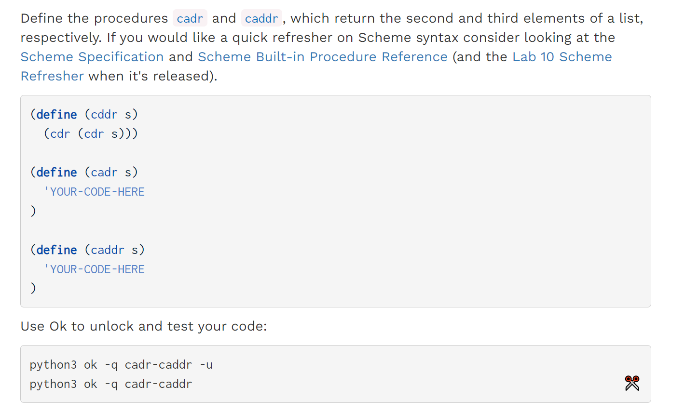
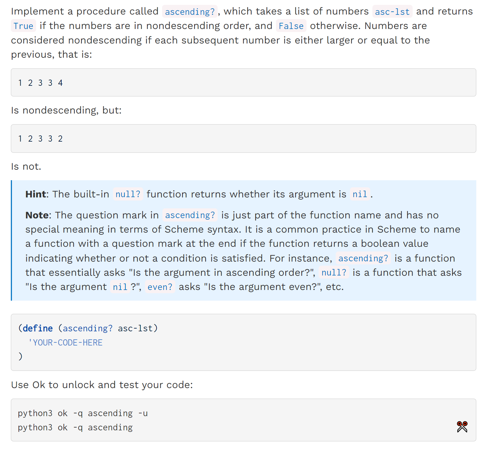
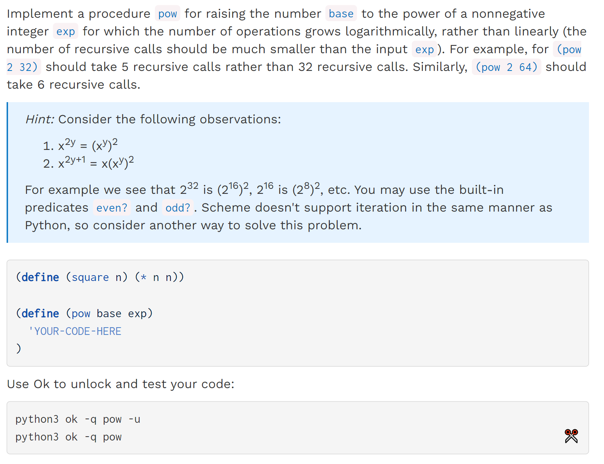

[released_hw_hw07_hw07.zip](https://www.yuque.com/attachments/yuque/0/2023/zip/12393765/1672909542536-7a507bd1-ea4f-49ac-acf2-e588b606d0ca.zip)
[released_hw_sol-hw07_hw07.zip](https://www.yuque.com/attachments/yuque/0/2023/zip/12393765/1672909542503-165164c3-8aba-4cd9-aa67-821f2a539e7d.zip)
[Homework 7 _ CS 61A Fall 2022.pdf](https://www.yuque.com/attachments/yuque/0/2023/pdf/12393765/1672909541244-1e129e39-3cce-4744-af93-bfccadb804ce.pdf)
[Homework 7 Solutions _ CS 61A Fall 2022.pdf](https://www.yuque.com/attachments/yuque/0/2023/pdf/12393765/1672909541412-7fe466fc-6ad1-4e51-845e-ef2e59feb9c7.pdf)


# Q1 Thane of Cadr
> 

```scheme
(define (cddr s) (cdr (cdr s)))

(define (cadr s) (car (cdr s)))

(define (caddr s) (car (cdr (cdr s))))
```
```scheme
(define (cddr s) (cdr (cdr s)))

(define (cadr s) (car (cdr s)))

(define (caddr s) (car (cddr s)))
```

# Q2 Ascending?⭐⭐⭐⭐⭐
> 

```scheme
(define (ascending? asc-lst)
  ; 注意，当(cdr asc-lst)是nil的时候，我们是没有办法通过(cal )来访问第一个元素的
  ; 所以不能写成(null? (car (cdr asc-lst)))
    (if (null? (cdr asc-lst))
        #t
        (if (> (car asc-lst) (car (cdr asc-lst)))
            #f
            (ascending? (cdr asc-lst))
        )
    )
)
```
```scheme
(define (ascending? asc-lst)
  (if (or (null? asc-lst) (null? (cdr asc-lst)))
      #t
      (and (<= (car asc-lst) (car (cdr asc-lst)))
           (ascending? (cdr asc-lst)))))
```


# Q3 Pow⭐⭐⭐
> 

```scheme
(define (square n) (* n n))

(define (pow base exp)
    (cond
        ((= exp 1) base)
        ((even? exp) (square (pow base (/ exp 2))))
        (else  (* base (square (pow base (/ (- exp 1) 2)))))
    )
)
```
```scheme
(define (pow base exp)
  (cond 
    ((= exp 0)   1)
    ((even? exp) (square (pow base (/ exp 2))))
    (else        (* base (pow base (- exp 1))))))

```
