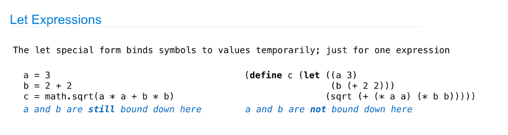

> **Ch 3.1&3.2: **[http://composingprograms.com/pages/31-introduction.html](http://composingprograms.com/pages/31-introduction.html)
> **Scheme Installation:** [https://inst.eecs.berkeley.edu//~scheme/precompiled/MS-Windows/](https://inst.eecs.berkeley.edu//~scheme/precompiled/MS-Windows/)
> **Scheme Specification:** [https://inst.eecs.berkeley.edu/~cs61a/sp21/articles/scheme-spec/#about-this-specification](https://inst.eecs.berkeley.edu/~cs61a/sp21/articles/scheme-spec/#about-this-specification)
> **Online Scheme Interpreter: **[https://code.cs61a.org/](https://code.cs61a.org/)

[Web Apps.pdf](https://www.yuque.com/attachments/yuque/0/2023/pdf/12393765/1672909050904-1a111491-9571-425b-bf4d-20843b333d93.pdf)
[released_assets_slides_27-Scheme_full.pdf](https://www.yuque.com/attachments/yuque/0/2023/pdf/12393765/1672908974754-9597c8a9-07e7-4a40-baaf-b0c5e6995594.pdf)

# 1 Webapps(Optional)
> 


# 2 Scheme Introduction
## Scheme & Lisp
> 


## Scheme Fundamentals
> 

```scheme
(define (square x) (* x x))
(square 16)  ; 256
(define (average x y)(/ (+ x y) 2))
(average 3 7)   ; 5
```


## Special Forms
### Syntax & Babylonian Methods
> 
> `Scheme`也是`Lexicon Scope`的，所以也可以很好的利用闭包的性质访问`parent frame`中定义的变量。

**Computing Sqrt Algorithm - Babylonian Method**参考: [巴比伦法](https://www.yuque.com/alexman/ac5oth/icbxe7gtlb18qt6k#vJFvp)

```scheme
(define (square x)
  (* x x)
  )

(define (average x y )
  (/ (+ x y) 2)
)

(define (sqrt x) 
  (define (update guess)
    (if (= (square guess) x) 
        guess
        (update (average guess (/ x guess)))
        )
    )
  (update 1)
  )

scm> (sqrt 256)  ;16


```
```python
def square(x):
    return x * x


def average(x,y):
    return (x + y) / 2


def sqrt(x):
    def update(guess):
        if square(guess) == x:
            return guess
        return update(average(guess, x/guess))
    return update(1)

>>> sqrt(256)   # 16
```


### Lambda Expression⭐⭐⭐
> 


### Cond & Begin
**Spec**

> `More on later course`


### Let Expression
> 


## Sierpinksi's Triangle - Turtle
> 谢尔宾斯基三角形
> 

```scheme
> (define (line) (fd 50))

> (define (twice fn) (fn) (fn))

> (define (repeat k fn)
    (if (> k 0)
        (begin (fn) (repeat (- k 1) fn))
        nil
    )
  )

; Specify how to draw a triangle
> (define (tri fn)
    (repeat 3 (lambda () (fn) (lt 120))))


; d: depth,  k: side_length
> (define (sier d k)
    (tri (lambda ()
           (if (= k 1) (fd d) (leg d k)))))


; d: depth,  k: side_length
> (define (leg d k)
    (sier (/ d 2) (- k 1))
    (penup)
    (fd d)
    (pendown))

(sier 5 200)
```
```python
import turtle

# Draw a line
def line():
    t.fd(50)


# Repeatedly call the function f for k times
def repeat(k, f):
    if k == 0:
        return
    else:
        f()
        repeat(k-1, f)

# Draw a triangle
def tri(f):
    def func():
        f()
        t.lt(120)
    repeat(3,func)


def sier(depth, length):
    tri(lambda: t.fd(length) if depth == 1 else leg(depth, length))


def leg(depth, length):
    sier(depth - 1, length // 2)
    # This line does the same thing as t.fd(length), building the larger leg
    # after the innter triangles have been drawn
    t.penup()
    t.fd(length)
    t.pendown()


if __name__ == "__main__":
    t = turtle.Turtle()

    t.speed(0)
    sier(5, 200)

```
