[released_disc_disc10_disc10.pdf](https://www.yuque.com/attachments/yuque/0/2023/pdf/12393765/1673000160201-0d1c93df-2ecb-40bc-bbd6-383f4f8080f4.pdf)
[released_disc_sol-disc10_disc10.pdf](https://www.yuque.com/attachments/yuque/0/2023/pdf/12393765/1673000160217-fa7d9603-f746-4c26-b39b-4daa6b9ae5fa.pdf)

# Primitives and Defining Variables
> 


## WWSD
> 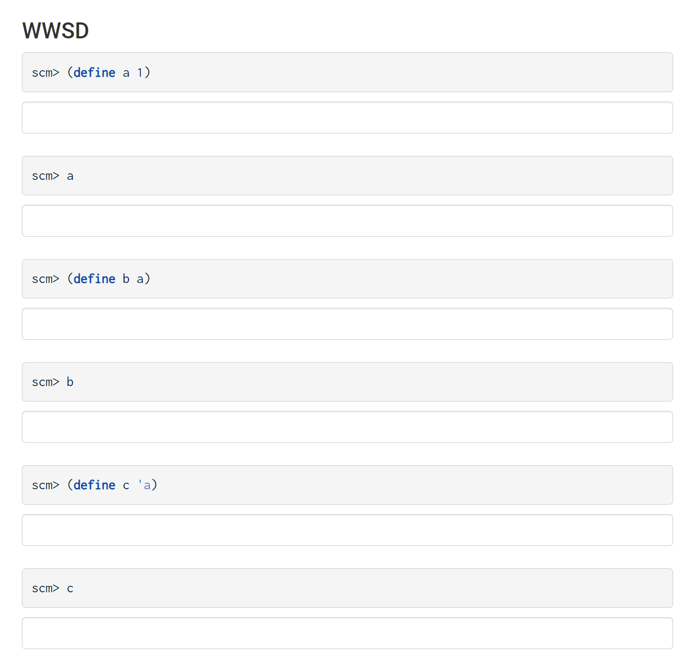

**Solution**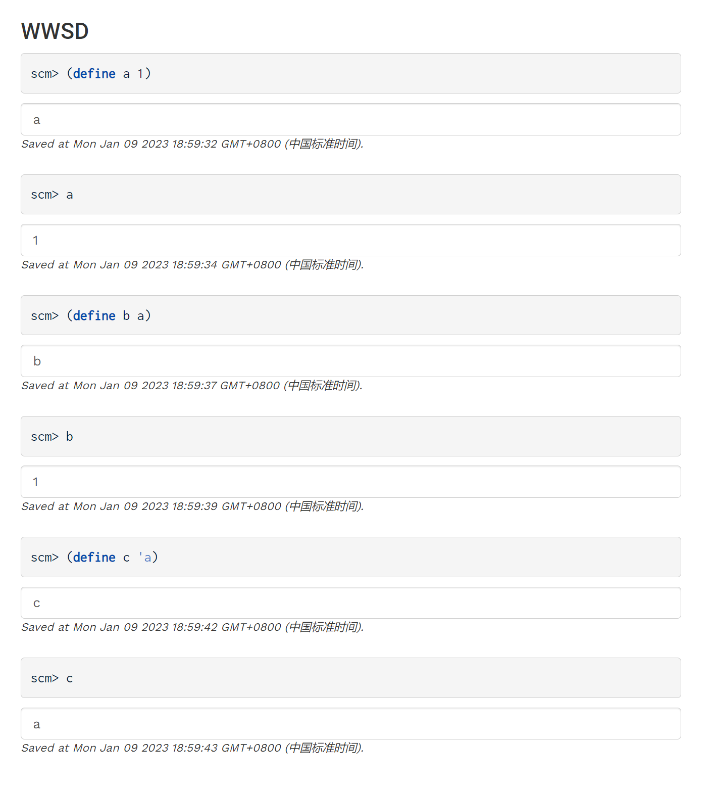


# Call Expression
> 


## WWSD
> 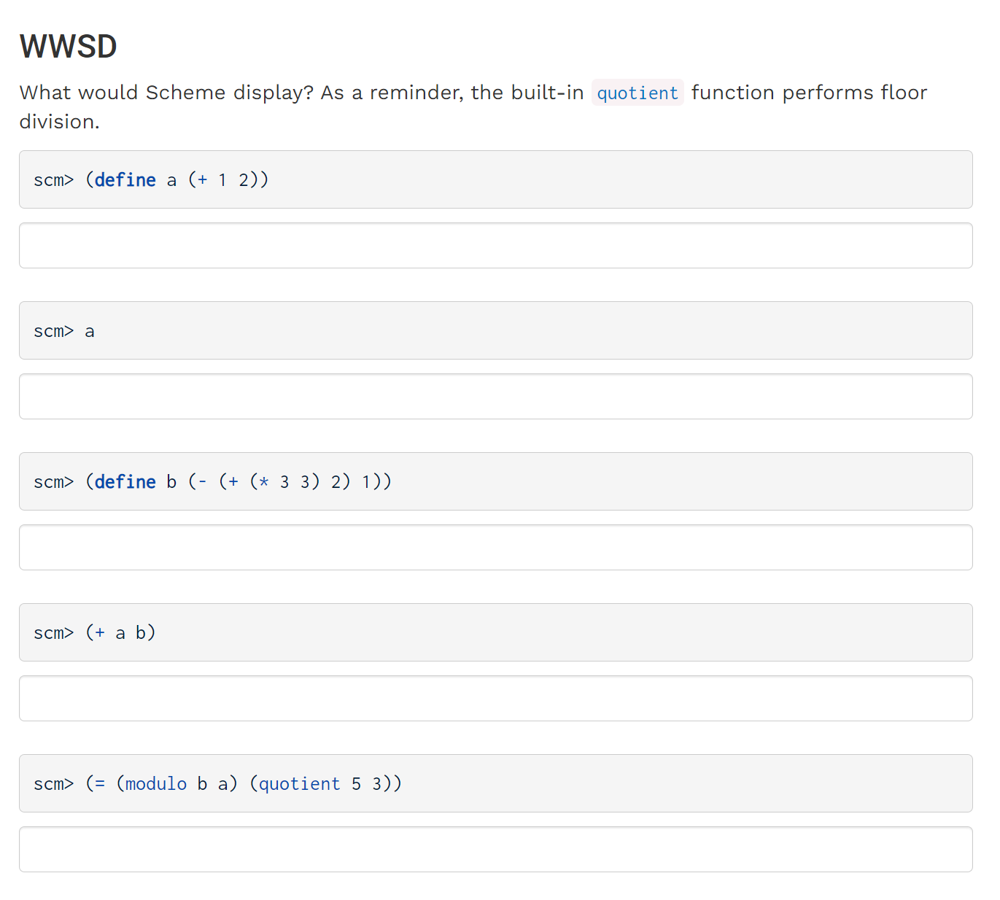

**Solution**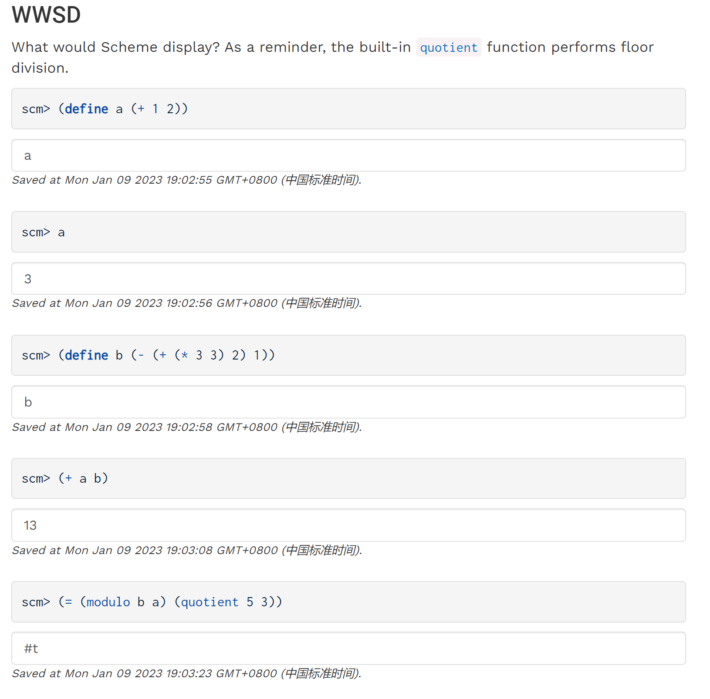


# Special Forms
## Basics
> 


## If Expression
> 


## Cond Expression
> 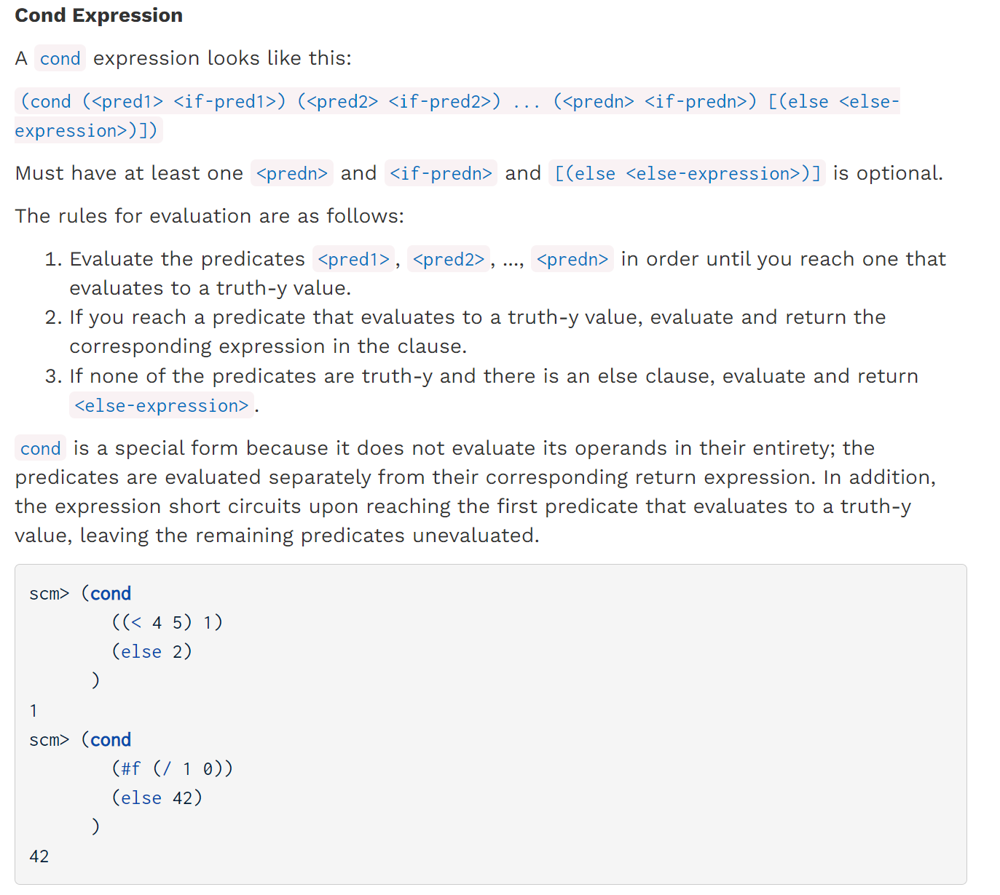


## Boolean Operators
> 


## WWSD⭐⭐⭐
> 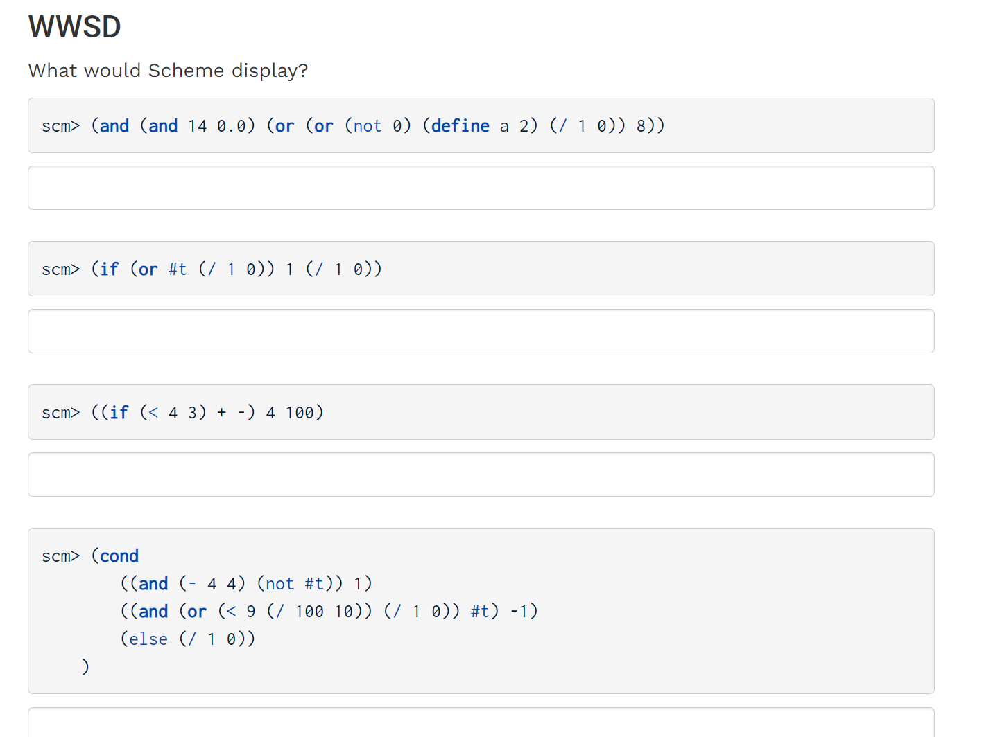
> `(define a 2)`evaluates to the symbol `a`

**Solution**

# Defining Functions
> 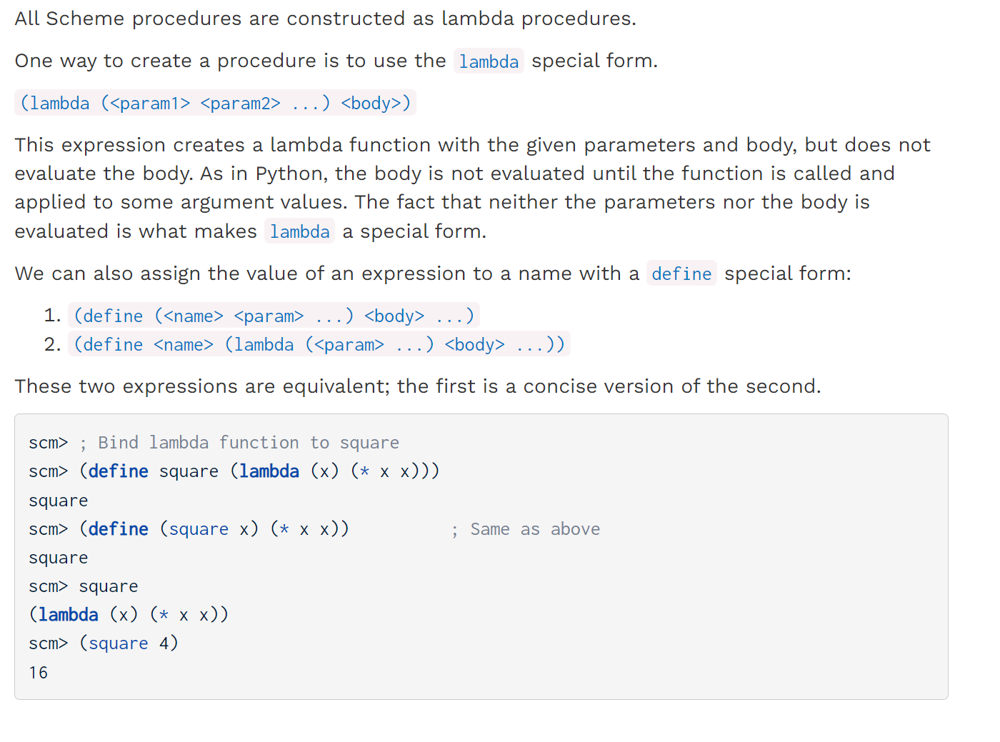


## Q1 Virahanka-Fibonacci
> 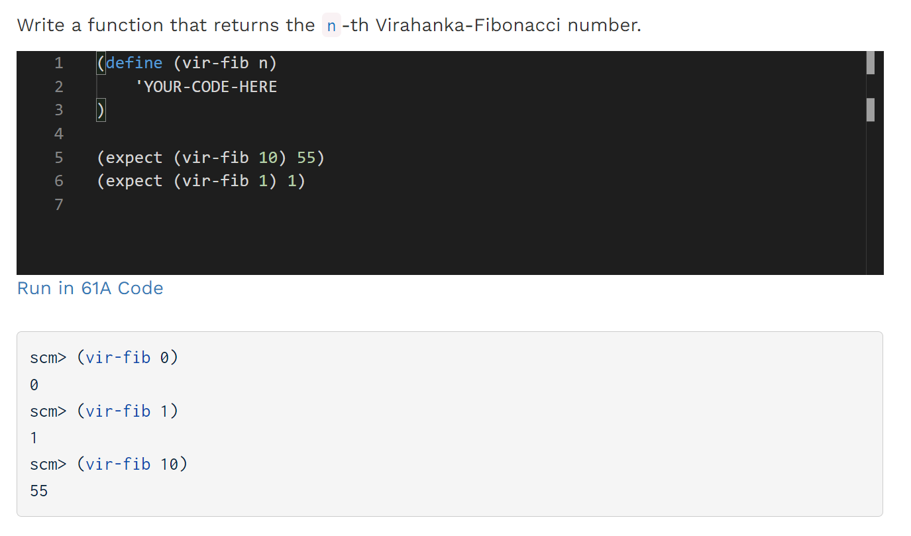

```scheme
(define (vir-fib n)
    'YOUR-CODE-HERE
    (if (or (= n 0) (= n 1))
        n    
        (+ (vir-fib (- n 1)) (vir-fib (- n 2)))
    )
)

(expect (vir-fib 10) 55)
(expect (vir-fib 1) 1)

```
**Solution**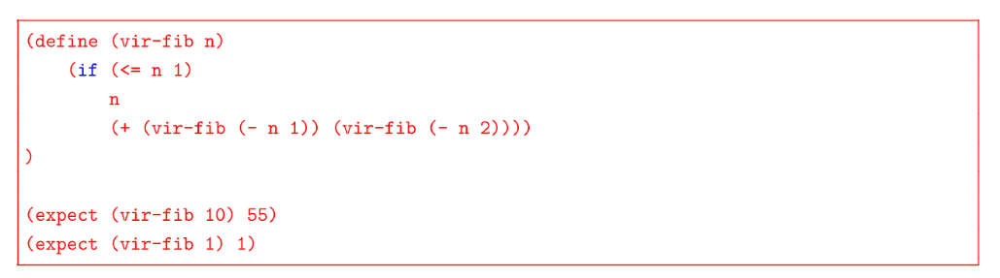


# Pairs and Lists
## Basics
> 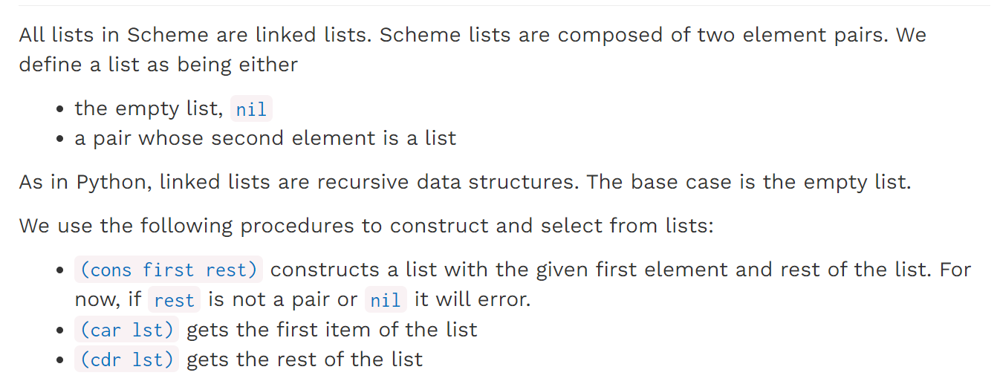


## Visualize Scheme Lists
> 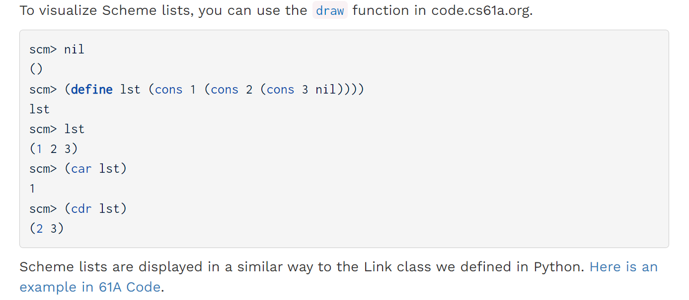
> [https://code.cs61a.org/](https://code.cs61a.org/)

```scheme
(define helpful-list (cons 'a (cons 'b nil)))

(draw helpful-list)

(exit)

(define another-helpful-list
        (cons 'c (cons 'd (cons (cons 'e nil) nil))))

(draw another-helpful-list)

(define with-cons
        (cons helpful-list another-helpful-list))

(draw with-cons)

(define with-list
        (list (list 'a 'b) 'c 'd (list 'e)))

(draw with-list)

(define with-quote '((a b) c d (e)))

(draw with-quote)

(define (list-concat a b)
  (if (null? a)
      b
      (cons (car a) (list-concat (cdr a) b))))

(expect (list-concat '(1 2 3) '(2 3 4))
        (1 2 3 2 3 4))

(expect (list-concat '(3) '(2 1 0)) (3 2 1 0))

(define (map-fn fn lst)
  (if (null? lst)
      nil
      (cons (fn (car lst)) (map-fn fn (cdr lst)))))

(map-fn (lambda (x) (* x x)) '(1 2 3))
; expect (1 4 9)
(define (make-tree label branches)
  (cons label branches))

(define (label tree) (car tree))

(define (branches tree) (cdr tree))

(make-tree 1
           (list (make-tree 2 '()) (make-tree 3 '())))

; expect (1 (2) (3))
(define (tree-sum tree)
  (+ (label tree)
     (sum (map-fn tree-sum (branches tree)))))

(define (sum lst)
  (if (null? lst)
      0
      (+ (car lst) (sum (cdr lst)))))

(define t
        (make-tree 1
                   (list (make-tree 2 '()) (make-tree 3 '()))))

(expect (tree-sum t) 6)

```


## List Keyword
> 


## Difference between list and cons
> 


## Equal 
> 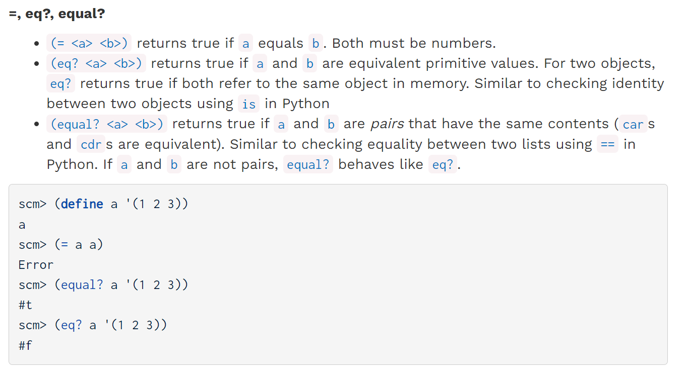
> `=`用于`primitive numbers`之间的大小比较
> `equal?`等同于`Python`的`is`, 看看是否指向同一块内存空间
> `eq?`等同于`Python`的`==`, 看看两个`Objects`的内容是否一致


## Q2 List Making
> 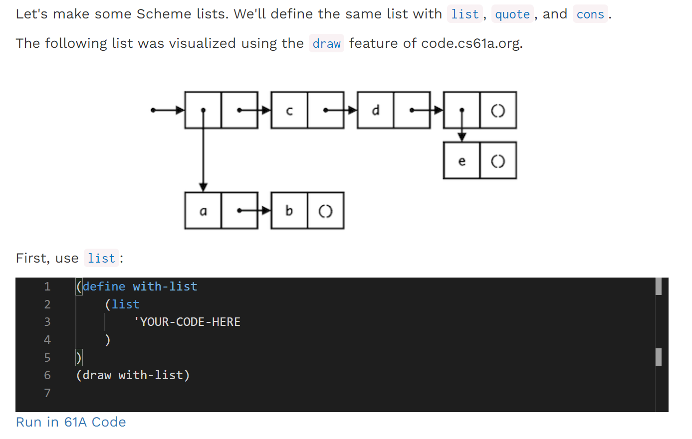

```scheme
(define with-list
    (list
        (list 'a 'b) 'c 'd (list 'e)
    )
)
(draw with-list)


; Alternative Solution
(define with-list
    (list
        '(a b) 'c 'd '(e)
    )
)
(draw with-list)


```
```scheme
(define with-quote
    '(
        (a b) c d (e)
    )

)
(draw with-quote)

```
```scheme
(define helpful-list
   (cons 'a (cons 'b nil)))
(draw helpful-list)

(define another-helpful-list
    (cons 'c (cons 'd (cons (cons 'e nil) nil))))
(draw another-helpful-list)

(define with-cons
    (cons (cons 'a (cons 'b nil)) (cons 'c (cons 'd (cons (cons 'e nil) nil))))
)
(draw with-cons)

```
**Solution**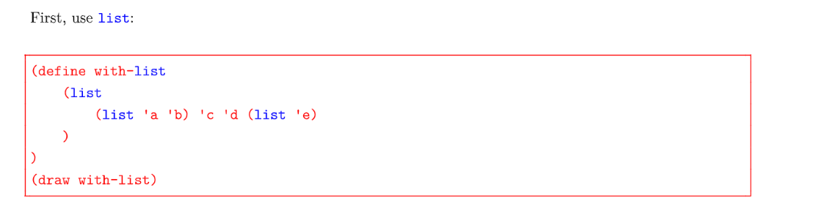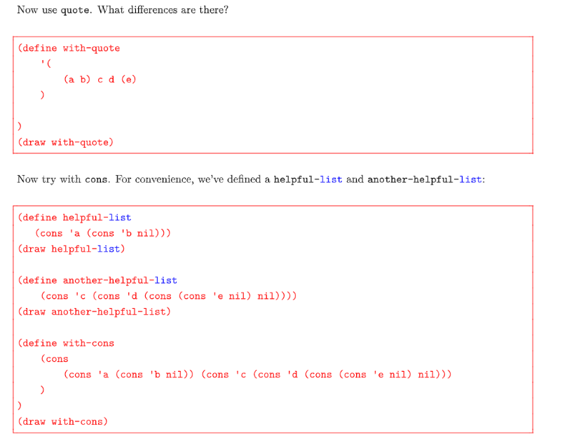


## Q3 List Concatenation
> 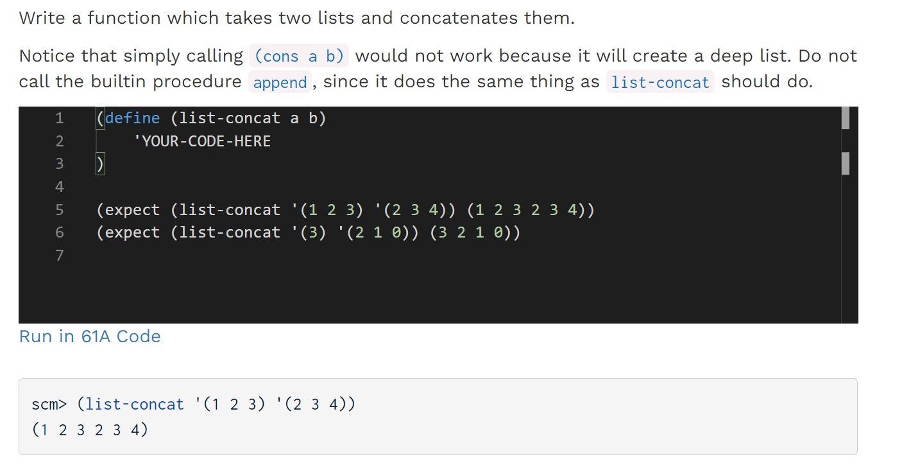

```scheme
(define (list-concat a b)
    (if (null? a)
        b
        (cons (car a) (list-concat (cdr a) b))
    )
)

(expect (list-concat '(1 2 3) '(2 3 4)) (1 2 3 2 3 4))
(expect (list-concat '(3) '(2 1 0)) (3 2 1 0))
```
**Solution**


## Q4 Map
> 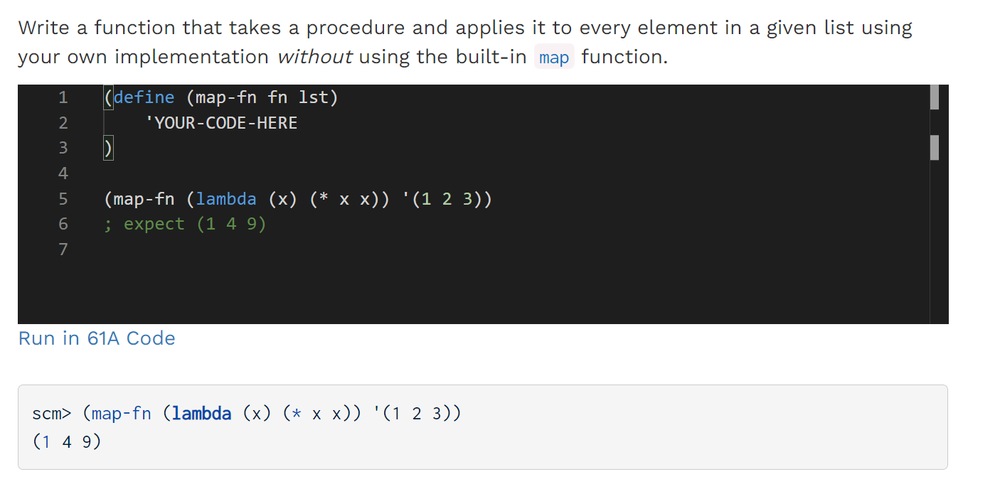

```scheme
(define (map-fn fn lst)
    'YOUR-CODE-HERE
    (if (null? lst)
        lst    
        (cons (fn (car lst)) (map-fn fn (cdr lst)))
    )
)

(map-fn (lambda (x) (* x x)) '(1 2 3))
; expect (1 4 9)

```
**Solution**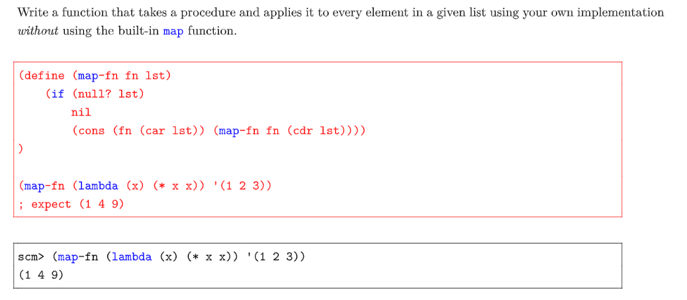


## Q5 Remove
> 

```scheme
(define (remove item lst)
    (filter (lambda (x) (not (= x item))) lst)
)
```
```scheme
(define (remove item lst)
    (cond ((null? lst) lst)
        ((equal? item (car lst)) (remove item (cdr lst)))
        (else (cons (car lst) (remove item (cdr lst)))))
)

(expect (remove 3 nil) ())
(expect (remove 2 '(1 3 2)) (1 3))
(expect (remove 1 '(1 3 2)) (3 2))
(expect (remove 42 '(1 3 2)) (1 3 2))
(expect (remove 3 '(1 3 3 7)) (1 7))
```
**Solution**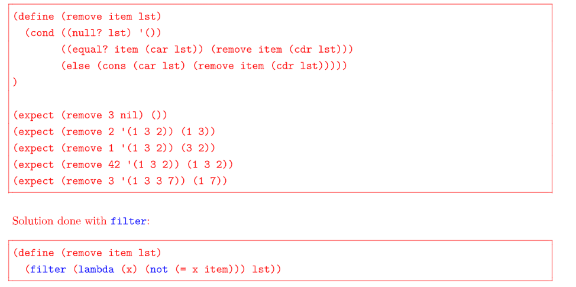
