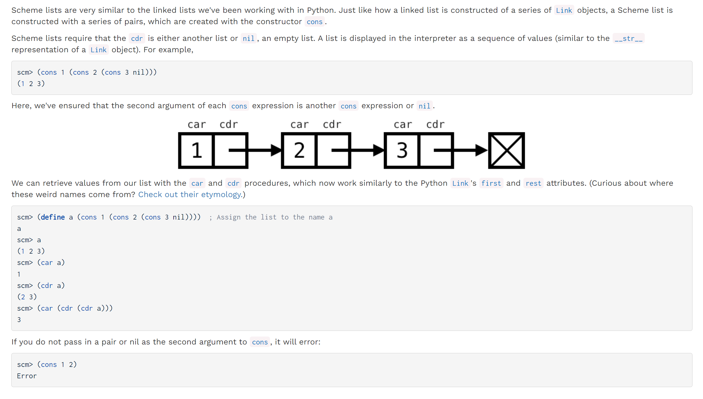
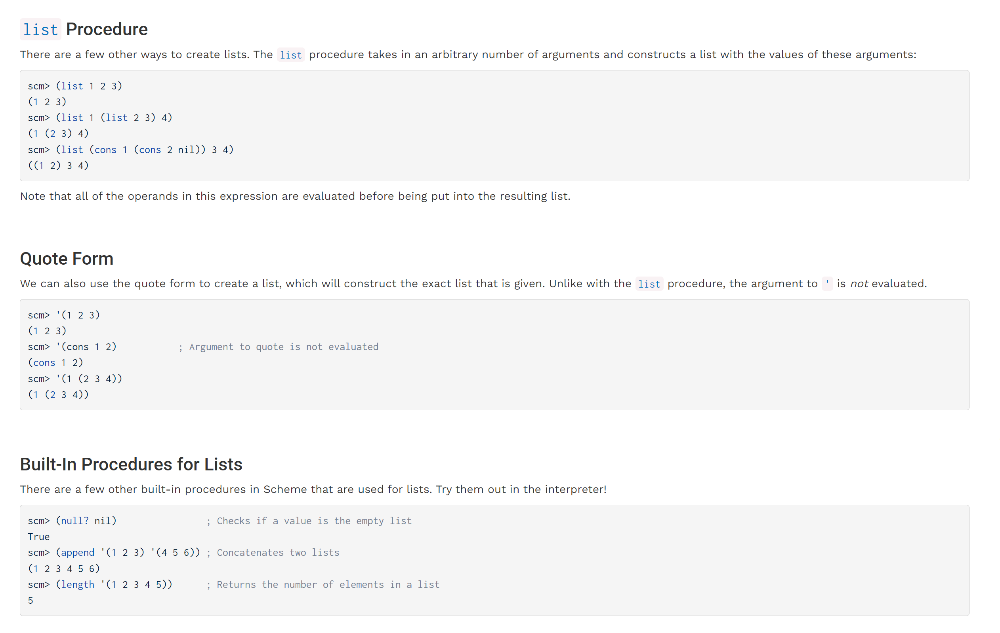
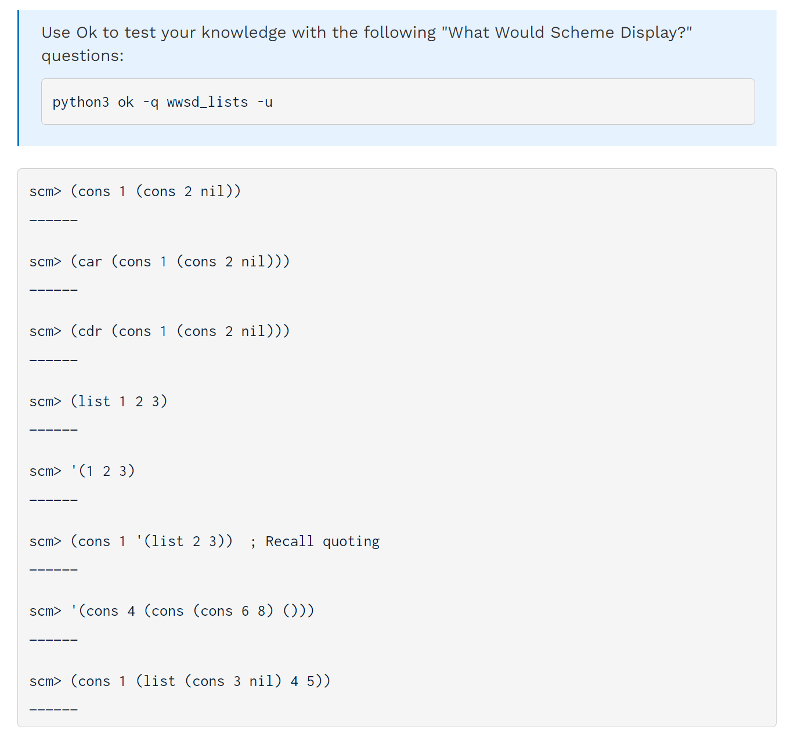
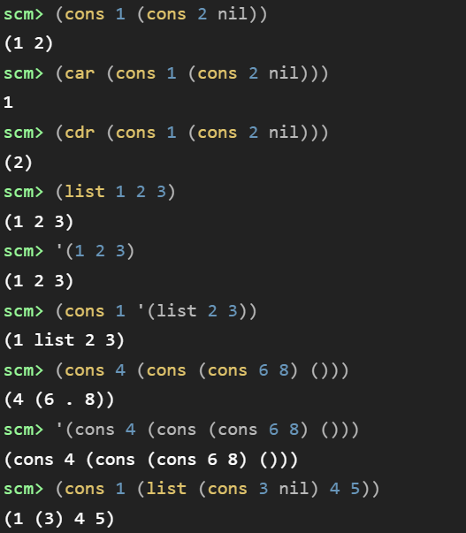
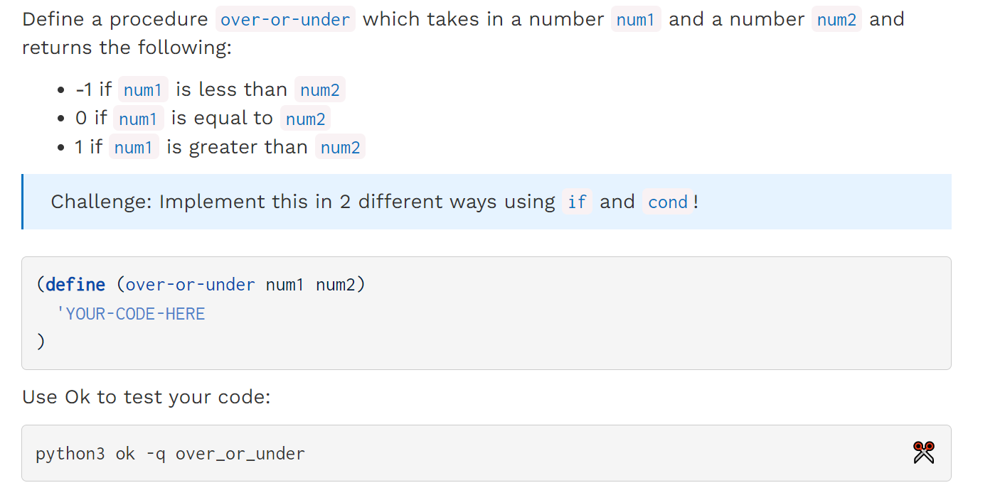
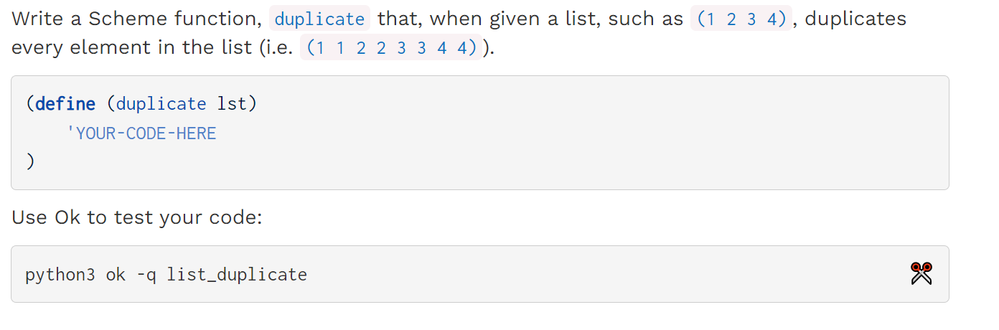

> **Scheme Specification: **[https://cs61a.org/articles/scheme-spec/](https://cs61a.org/articles/scheme-spec/)

[released_lab_lab10_lab10.zip](https://www.yuque.com/attachments/yuque/0/2023/zip/12393765/1672999778878-7249f9b8-0b5b-482a-9be6-363b95ca3d48.zip)
[released_lab_sol-lab10_lab10.zip](https://www.yuque.com/attachments/yuque/0/2023/zip/12393765/1672999778919-90fbdf82-06ad-4dd0-b9a7-2993c1d8d1cd.zip)
[Lab 10_ Scheme _ CS 61A Fall 2022.pdf](https://www.yuque.com/attachments/yuque/0/2023/pdf/12393765/1672999854539-93f568a8-6fdf-4b70-81f9-a5da5b3b7c51.pdf)
[CS 61A Scheme Specification _ CS 61A Fall 2022.pdf](https://www.yuque.com/attachments/yuque/0/2023/pdf/12393765/1673239781693-ee2c484e-1a58-4ee4-acba-203dc8e1e8fc.pdf)
[61A Scheme Cheat Sheet.pdf](https://www.yuque.com/attachments/yuque/0/2023/pdf/12393765/1673242697273-0a2ef3b2-4d3c-490f-8563-1353d3fe07f1.pdf)

# Lists
## cons/car/cdr
> 


## list definition
> 我们有两种常用方法定义`list`: `(define s (list 1 2 3 4))`, 或者`(define s '(1 2 3 4))`, 后续可以使用一些`list procedure`比如`(list? )`, `(append )`和`(length )`等对`s`进行操作
> `cons`和`list`


## list procedure
> 


## list display
> 
> 可见`list`对于诸如`(cons (cons 1 nil)(cons 2 nil))`的链表结构是不会以嵌套的形式打印出来的，而是会将其打印成`((1) (2))`的形式。
> 再比如我们有一个链表`(cons 1 (cons 2 (cons 3 nil)))`, 则`(list ...)`就会输出`(1 2 3)`，而不是`(1 (2 (3)))`


# What would Scheme Display?
## Q1 WWSD: Combinations
> **Expression Evaluation:**
> `(+ 1 2 3 4)`evaluates from left to right to `10`
> `(/ 8 2 2)`evaluates from left to right to `2`
> **Short-circuiting:** 
> `(or 1 #t)`is equivalent in Python to `1 or True`, which is `1`
> `(and #t #f (/ 1 0))`is equivalent in Python to `True and False and (1/0)`, which is `#f`
> **Define Statement:**
> `scm > (define x 3)`: `x`
> `scm > x`: `3`
> `scm > (define y (+ x 4))`: `y`
> `scm > y`: `7`
> `scm > (define x (lambda (y) (* y 2)))`: `x`
> `scm > (x y)`: `14`
> **Lambda:**
> `scm> (if (not (print 1)) (print 2) (print 3))`:
> `(print x)`无论`x`是什么值，都会先打印`x`再返回`#t`, 于是`(not (print x))`永远先打印`x`再返回`#f`。
> `scm> (* (if (> 3 2) 1 2) (+ 4 5))`: `9`
> `scm> (define foo (lambda (x y z) (if x y z)))`: `foo`
> `scm> (foo 1 2 (print 'hi))`: `hi; 2`
> `scm> ((lambda (a) (print 'a)) 100)`: `a`, 注意`symbol a`是不会被`evaluate`。但是`'(1 2 3 4)'`是会被`evaluate`的, 因为`(1 2 3 4)`不是`symbol`而是一个`list`


## Q2 WWSD: Lists
> 

**Solutions**

# Coding Questions
## Q3 Over or Under
> 

```scheme
(define (over-or-under num1 num2)
    'YOUR-CODE-HERE
    (if (< num1 num2)
        -1
        (if (= num1 num2)
            0
            1
        )
    )
)
```
```scheme
(define (over-or-under num1 num2)
    (cond
        ((< num1 num2) -1)
        ((= num1 num2) 0)
        ((> num1 num2) 1)
    )
)
```
```scheme
(define (over-or-under num1 num2)
    (cond
        ((< num1 num2) -1)
        ((= num1 num2) 0)
        (else 1)
    )
)
```


## Q4 Make Adder
> 

```scheme
(define (make-adder num)
    'YOUR-CODE-HERE
    (define (inner_adder inc)
        (+ num inc)
    )
    inner_adder  'Used-to-return-the-function
)
```
```scheme
(define (make-adder num)
    'YOUR-CODE-HERE
    (lambda (inc) (+ num inc))
)
```


## Q5 Compose
> 

```scheme
(define (composed f g)
    'YOUR-CODE-HERE
    (define (new_procedure x)
        (f (g x))
    )
    new_procedure
)
```
```scheme
(define (composed f g)
    'YOUR-CODE-HERE
    (lambda (x) (f (g x)))
)
```

## Q6 Make a List
> 

```scheme
(define lst
        (cons (cons 1 nil)
              (cons 2 (cons (cons 3 (cons 4 nil)) (cons 5 nil)))))
```

# Optional Questions
## Q7 List Duplicator
> 
> **Hint:**
> 

```scheme
(define (duplicate lst)
  (if (null? lst)
      lst
      (cons (car lst)
            (cons (car lst) (duplicate (cdr lst))))))
```
