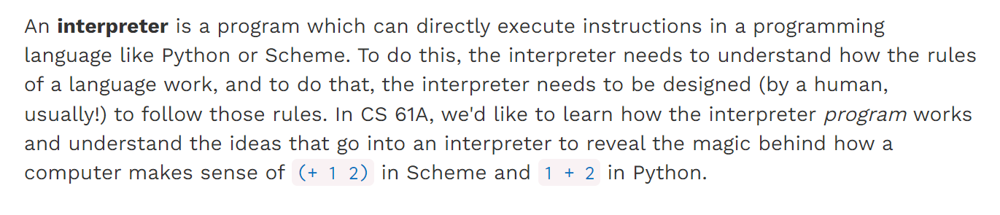
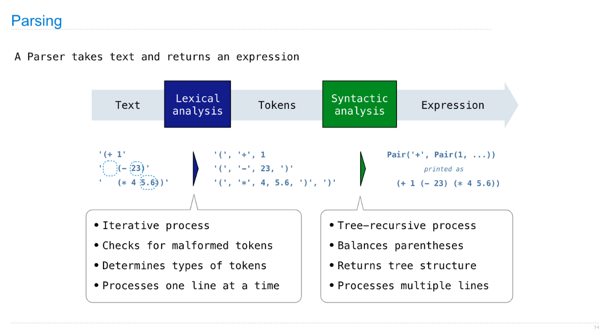
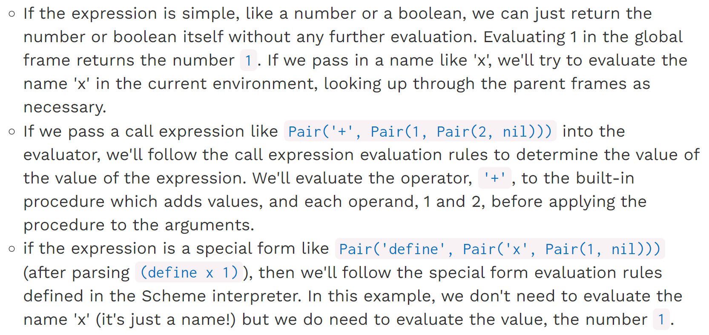
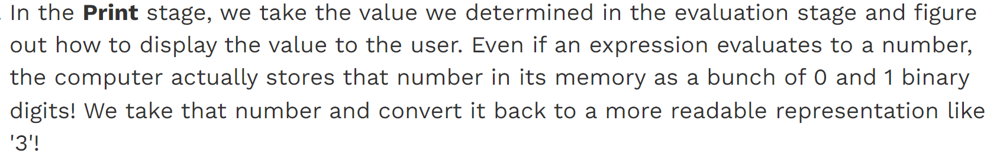
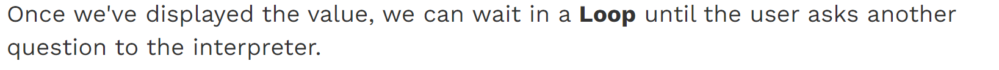
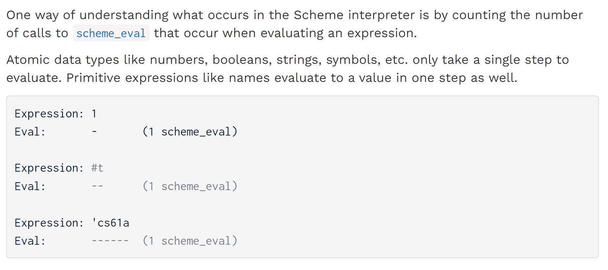
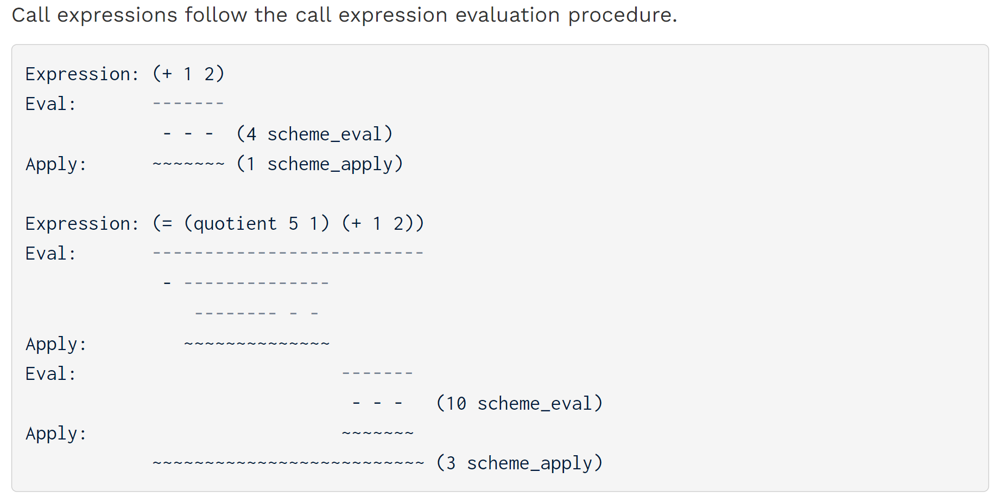
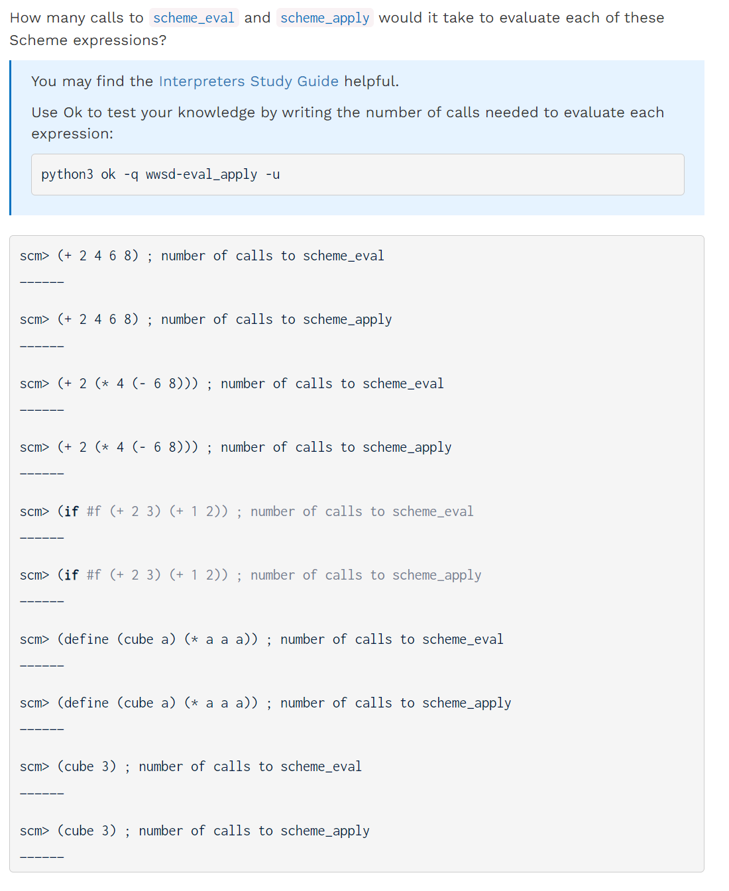

[released_hw_hw09_hw09.zip](https://www.yuque.com/attachments/yuque/0/2023/zip/12393765/1673001063522-5871165d-252d-436d-8bb2-5133405ce025.zip)
[released_hw_sol-hw09_hw09.zip](https://www.yuque.com/attachments/yuque/0/2023/zip/12393765/1673001063538-827b6e35-298a-47ce-a554-2b870084177f.zip)
[Homework 9 _ CS 61A Fall 2022.pdf](https://www.yuque.com/attachments/yuque/0/2023/pdf/12393765/1673001088501-0e3d4f5e-fb86-4745-b0bd-ca72ff30d710.pdf)
[Homework 9 Solutions _ CS 61A Fall 2022.pdf](https://www.yuque.com/attachments/yuque/0/2023/pdf/12393765/1673001133441-596510ea-6309-4db3-a9dc-43c18bdfeedd.pdf)

# Study Guide
:::info
**Be sure to check these before moving on:**

1. **Project Scheme Evaluator Part: **[https://inst.eecs.berkeley.edu/~cs61a/fa22/proj/scheme/#part-1-the-evaluator](https://inst.eecs.berkeley.edu/~cs61a/fa22/proj/scheme/#part-1-the-evaluator)
2. **Study Guide:** [https://cs61a.org/study-guide/interpreters/#counting-calls](https://cs61a.org/study-guide/interpreters/#counting-calls)
:::

## Interpreters
:::info

:::

## REPL - (Read - Eval - Print - Loop)
:::info
我们以`(+ 1 2)`为例探究整个`REPL`的过程。
:::
### Read Stage
:::info

我们知道，在`Scheme`中，所有的`expression`都会被转换为`Scheme List`的形式，而`Scheme List`在`Python`中表示为`Recursive Pair`的结构。
在`Read`阶段，我们接受`"(+ 1 2)"`这个字符串，并将其转换成`Pair('+', Pair(1, Pair(2, nil)))`,而在这个过程中：

1. `Lexer`的工作就是进行`Lexical Analysis`, 将`"(+ 1 2)"`进行有意义的分割，也就是`["(", "1", "2", ")"]`
2. `Parser`的工作就是进行`Syntactic Analysis`, 将·`["(", "1", "2", ")"]`转化成`Pair('+', Pair(1, Pair(2, nil)))`这个`Python`数据结构。
:::

### Eval Stage
:::info
在`Eval Stage`, 我们将刚刚从`Parser`那里得到的嵌套数据结构进行有意义的数值计算得到结果，`eval`需要遵循一定的规则如下:

:::

### Print Stage
:::info

:::

### Loop
:::info

:::

## Counting Calls⭐⭐⭐⭐⭐
### Atomic = 1 call
:::info

:::

### Call Expressions
:::info

:::

# Required Questions
## Q1 WWSD: Eval and Apply
:::info

:::

## Exam Practice
