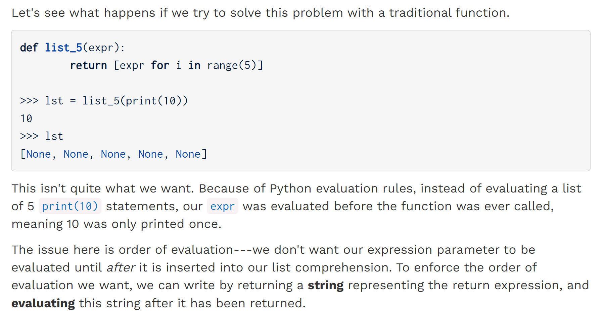
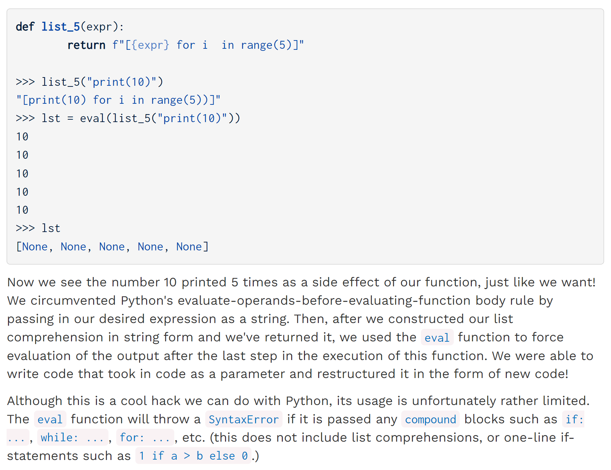
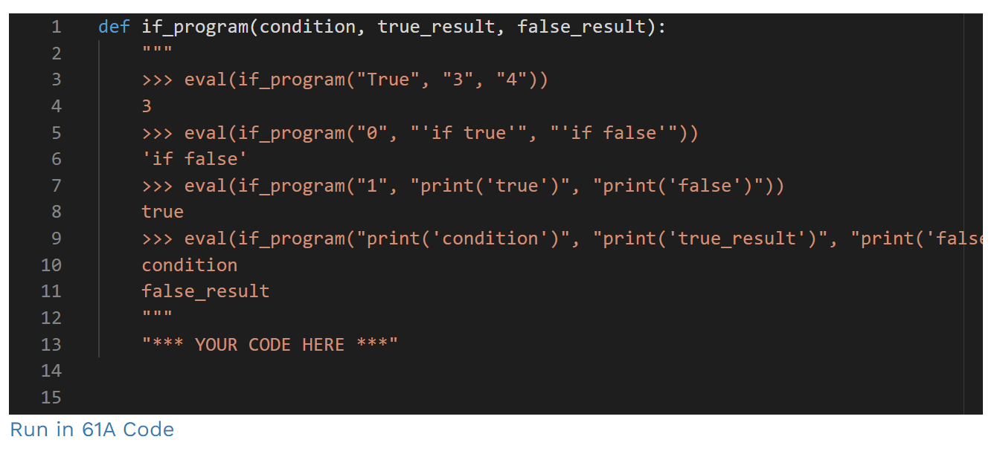
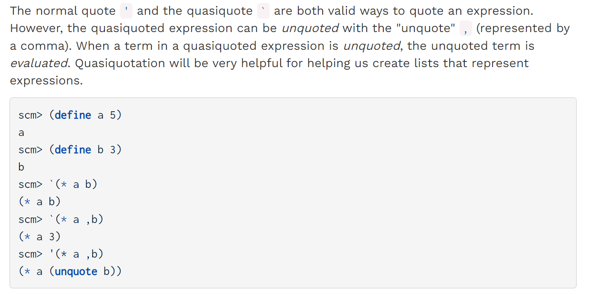
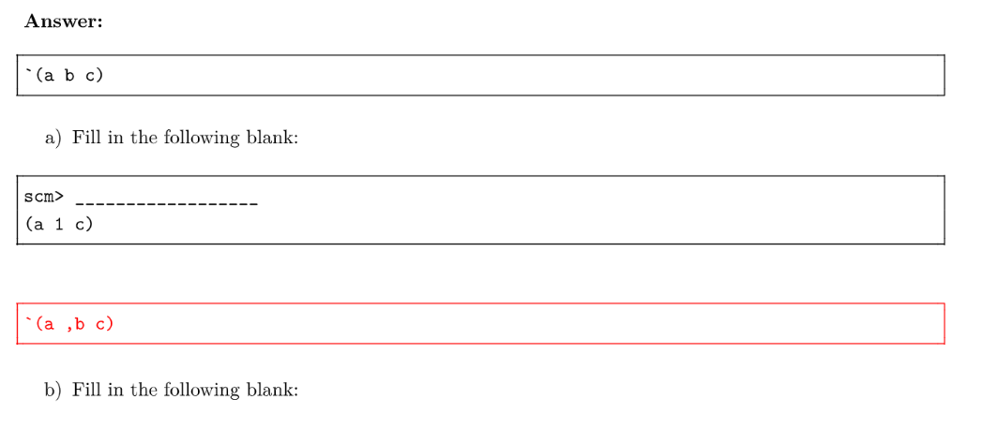
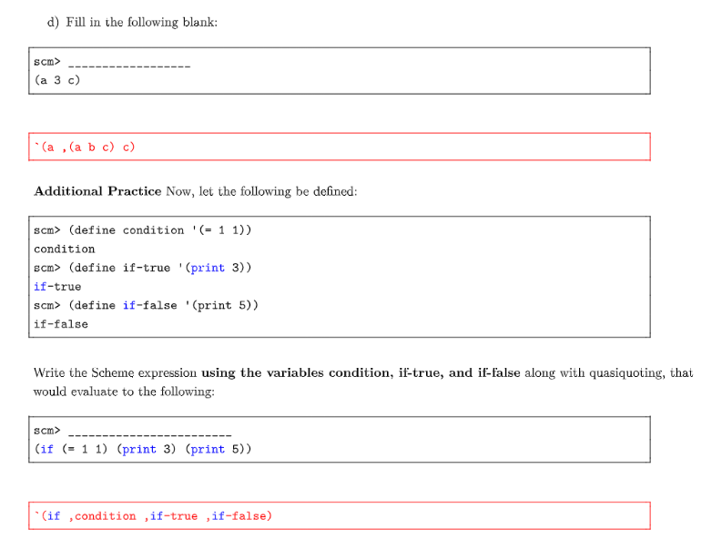
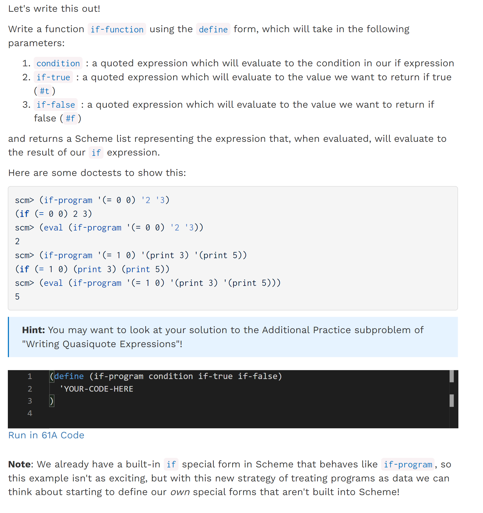
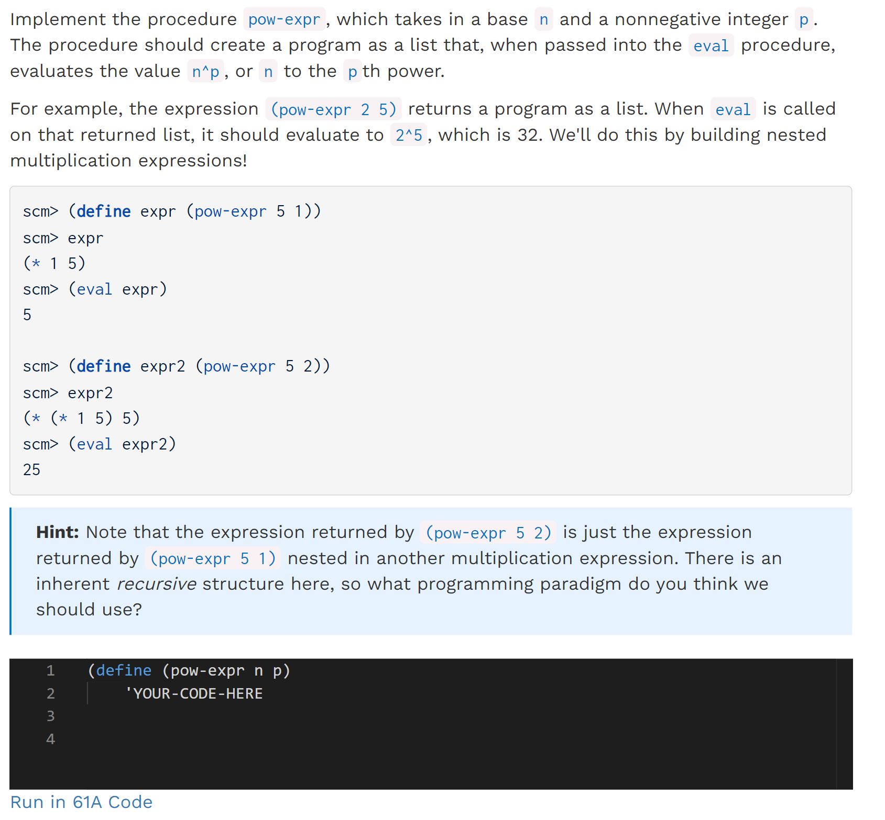
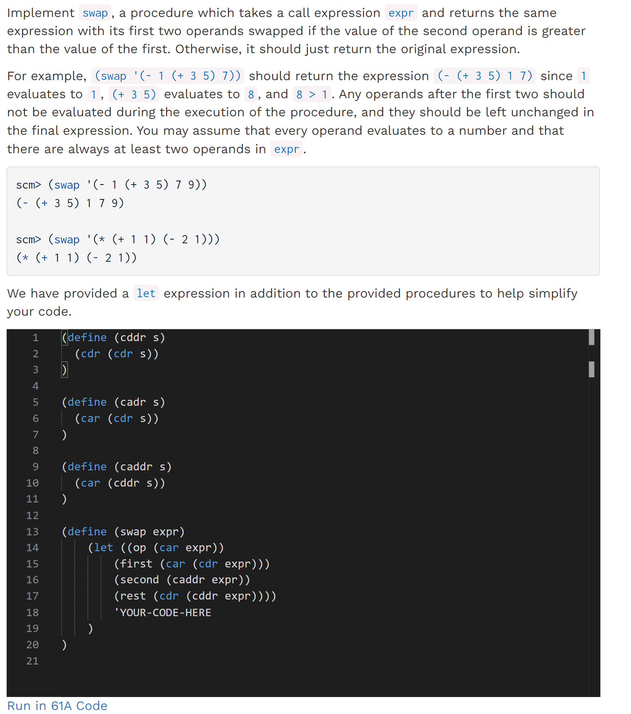
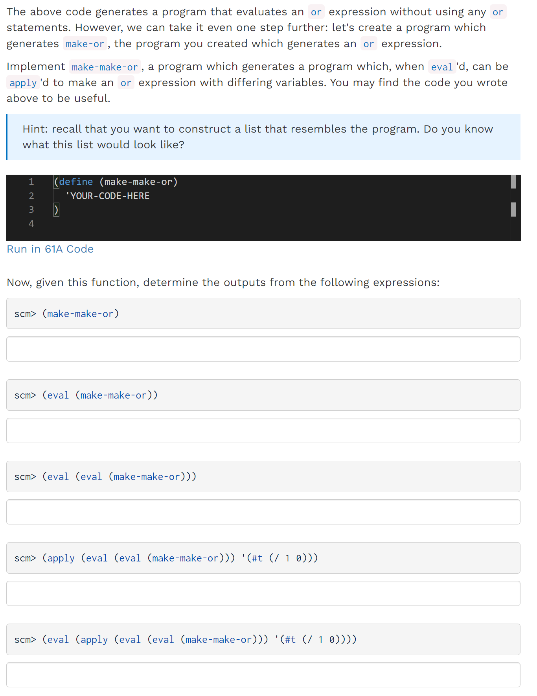

[released_disc_disc11_disc11.pdf](https://www.yuque.com/attachments/yuque/0/2023/pdf/12393765/1673000889203-d917ef44-1355-4115-bf2e-3395a0e0b4f9.pdf)
[released_disc_sol-disc11_disc11.pdf](https://www.yuque.com/attachments/yuque/0/2023/pdf/12393765/1673000889195-c188ec13-322c-4913-a203-db0d14cfc6cd.pdf)

# Programs as Data
## Changing Evaluation Order - f string
> 
> 总的来说，`program as data`可以改变我们`evaluate program`的先后顺序。


## Q1 If Program Python
> 

```python
def if_program(condition, true_result, false_result):
    """
    >>> eval(if_program("True", "3", "4"))
    3
    >>> eval(if_program("0", "'if true'", "'if false'"))
    'if false'
    >>> eval(if_program("1", "print('true')", "print('false')"))
    true
    >>> eval(if_program("print('condition')", "print('true_result')", "print('false_result')"))
    condition
    false_result
    """
    "*** YOUR CODE HERE ***"

```
```python
def if_program(condition, true_result, false_result):
    """
    >>> eval(if_program("True", "3", "4"))
    3
    >>> eval(if_program("0", "'if true'", "'if false'"))
    'if false'
    >>> eval(if_program("1", "print('true')", "print('false')"))
    true
    >>> eval(if_program("print('condition')", "print('true_result')", "print('false_result')"))
    condition
    false_result
    """
    "*** YOUR CODE HERE ***"
    return f"{true_result} if {condition} else {false_result}"
```
**Solution**


# Scheme Programs as Data
## Basics - Using Scheme List
> 


## Quasiquotation
> 


## Q2 Writing Quasiquote Expressions⭐⭐
> 

**Solution**


## Q3 If Program Scheme
### Part 1: WWPD
> 

**Solution**


### Part 2: Code Writing
> 

```python
(define (if-program condition if-true if-false)
  'YOUR-CODE-HERE
)
```
**Solution**


# Program as Data Practice
## Q4 Exponential Powers
> 

**Solutions**

## Q5 Swap⭐⭐⭐⭐⭐
> 
> 注意: `(list ...)`就等同于`'(...)`, 只有`eval(list)`才能获得结果。
> 比如一个`list s`是`'(+ 1 (- 1 3))`, `(car (cdr s))`就是`1`, `(car (cdr (cdr s)))`就是`-1`

**Solutions - let keyword**

## Q6 Make Or ⭐⭐⭐
> 

**Solutions**


## Q7 Make "Make Or"⭐⭐⭐⭐⭐
> 
> 参考: [Generating Codes](https://www.yuque.com/alexman/ac5oth/bzd86lbwg957s3g7#dpkyK)

**Solutions**
