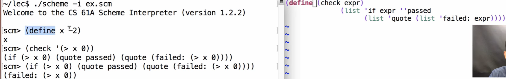

# 1 Scheme Macros⭐⭐⭐
[released_assets_slides_33-Macros_full.pdf](https://www.yuque.com/attachments/yuque/0/2023/pdf/12393765/1673324663113-2627c8d6-02ad-4607-9239-e8612a8b91b6.pdf)
> **Prereq:** [Scheme Expression as scheme list](https://www.yuque.com/alexman/ac5oth/bzd86lbwg957s3g7#hJhCF)

## Code Transformations
> 
> **总的来说，**`**macro**`**和传统的**`**procedure**`**有三大不同的特性:**
> 1. 传入的`expression`(不带`quote`的，比如`(+ 2 3)`)不会在传参阶段就被`evaluated`, 而是被修改为带有`quote`的形式，进入函数的`environment`。
> 2. 会自动`eval`返回的结果。所以我们在`macro`中返回的结果一般是一个带有`quote`或者`list`的一个表达式，而不是`procedure call`本身，后续会自动地被`evaluated`。
> 
非常的实用。

```scheme
(print 2)
;2
(begin (print 2) (print 2))
;2
;2


; Define regular procedure
(define (twice expr) (list 'begin expr expr))
;twice
(twice (print 2))
;2
;(begin None None)
(twice '(print 2))
;(begin (print 2) (print 2))
(eval (twice '(print 2)))
;2
;2

; Define Macro, 不需要传递'(print 2)', 直接传入(print 2)即可
; Macro 保证了传入的语句不会被执行，比如加上quotation
(define-macro (twice expr) (list 'begin expr expr))
;twice

; 这使得twice的行为发生改变，本来在twice执行之前要先evaluate (print 2)的结果
; 现在macro将evaluate的步骤推迟到twice执行之中了。
(twice (print 2))
;2
;2
```


## More Examples
> `(define (check val) (if val 'Passed 'Failed))`: 检查机制。

```scheme
(define x -2)
;x
(define (check val) (if val 'Passed 'Failed))
(check (> x 0));
;failed

; 在传参时不执行(> x 0), 在函数体中执行
(define-macro (check expr) (list 'if expr ''Passed ''Failed))
(define x -2)
;x
(check (> x 0))
;failed
(define-macro (check expr) (list 'if expr ''Passed (list 'quote (list 'Failed:  expr))))
(check (> x 0))
;(failed (> x 0))
```
**Demo Codes****Macro:**

**Regular Procedure:**


## For Macro
> 

**Solution**
```scheme
; For
(define (map fn vals) 
  (if (null? vals) 
      () 
      (cons (fn (car vals)) 
            (map fn (cdr vals)))))

(map (lambda (x) (* x x)) '(2 3 4 5))

(define-macro (for sym vals expr)
  (list 'map (list 'lambda (list sym) expr) vals))

(define-macro (for sym vals exprs)
  `(map (lambda (,sym) ,@exprs) ,vals))

(for x '(2 3 4 5) (* x x))

```


## Trace - Macro⭐⭐⭐⭐⭐
> 
> `scheme`中没有`decorator`这种语法，但是我们可以两种方式来模拟这种行为：
> 1. 使用`Higher-Order Functions`, 详见上面的代码实现。
> 2. 使用`macro`，详见下面的`Demo Codes`。

```scheme
; Trace

(define fact (lambda (n)
  (if (zero? n) 1 (* n (fact (- n 1))))))

(fact 5)

; Trace (fact 5)
(begin
  (define original fact)
  (define fact (lambda (n) 
  	         (print (list 'fact n)) 
  	         (original n)))
  (define result (fact 5))
  (define fact original)
  result)

(fact 5)

;; E.g., (trace (fact 5))
(define-macro (trace expr)
  (define operator (car expr))
  `(begin
     (define original ,operator)
     (define ,operator (lambda (n) 
			  (print (list (quote ,operator) n)) 
			  (original n)))
     (define result ,expr)
     (define ,operator original)
     result))

(fact 5)
(trace (fact 5))
(fact 5)
  
```


# 2 SQL& Declarative Programming
[released_assets_slides_34-SQL_full.pdf](https://www.yuque.com/attachments/yuque/0/2023/pdf/12393765/1673441145800-df2b988c-6f3e-4be3-85af-f683bf9d2b36.pdf)

## Database Management Systems
:::info

:::


## Declarative Programming
:::info

:::


## SQL Overview
:::info

:::


## Select Value Literals
:::info

:::


## Creating Tables
:::info

:::


## Projecting Tables
:::info

:::


## Arithmetic in Select Expressions
:::info

`(A): select word, one+two+four+eight as value from ints`
`(B): select word from ints where one + two / 2 + four / 4 + eight / 8 = 1`
:::


# 3 Tables
[released_assets_slides_35-Tables_full.pdf](https://www.yuque.com/attachments/yuque/0/2023/pdf/12393765/1673442387251-39348cfc-7154-4482-a770-9b8b2d4770fc.pdf)

## Joining Two Tables⭐⭐⭐⭐⭐
:::info

`Cartesian Product`
:::


## Alias & Join Tables with Itself⭐⭐
> 

**Example: Grandparents**


## Joining Multiple Tables⭐⭐⭐⭐⭐
> 


## Numerical Expressions
> 

```sql
create table cities as 
	select 38 as latitute, 122 as longitude, "Berkeley" as name union
	select 42,              71,              "Cambridge"        union
	select 45,              93,              "Minneapolis"      union
	select 33,              117,             "San Diego"        union
  select 26,              80,              "Miami"            union
  select 90,              0,               "North Pole"       ;

create table cold as
	select name from cities where latitude >= 43;

create table distances as 
	select a.name as first, b.name as second,
  	60*(b.latitude - a.latidute) as distance
  	from cities as a, cities as b;


select name from cold;
-- Minneapolis
-- North Pole

select name from cold union select "Chicago";
-- Chicago
-- Minneapolis
-- North Pole


-- Order from south to north in distance from Minneapolis
select second from distances 
	where first = "Minneapolis"
	order by distance;
-- Miami
-- San Diego
-- Berkeley
-- Cambridge
-- Minneapolis
-- North Pole
```


## String Expressions
> 
> `substr(s, start_index, length)`, return the `substr` as required
> `instr(s, substr)`, returns `index` of `substr`

```sql
create table nouns as 
	select "dog" as phrase union
	select "cat"           union
	select "bird";


select subject.phrase || " chased " || object.phrase
	from nouns as subject, nouns as object
	where subject.phrase <> object.phrase
-- bird chased cat
-- bird chased dog
-- cat chased bird
-- cat chased dog
-- dog chased bird
-- dog chased cat


create table ands as
	select first.phrase || " and " || second.phrase as phrase
	from nouns as first, nouns as second
	where first.phrase <> second.phrase


select subject.phrase || " chased " || object.phrase
	from ands as subject, ands as object
	where subject.phrase <> object.phrase
```
**Output**


# 4 Aggregation(Optional)
[released_assets_slides_36-Aggregation_full.pdf](https://www.yuque.com/attachments/yuque/0/2023/pdf/12393765/1673444491551-17c0d264-ee78-4f60-9b81-a09d4f53a13f.pdf)


## Aggregation
:::info

:::
**Demo**


## Mixing Aggregation with Values
> 

**Demo**


## Group Rows
> 

**Demo**


## Selecting Groups
> 

