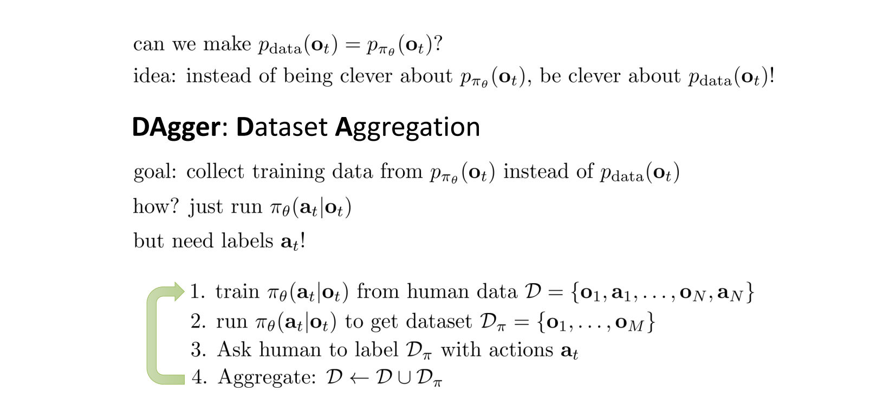
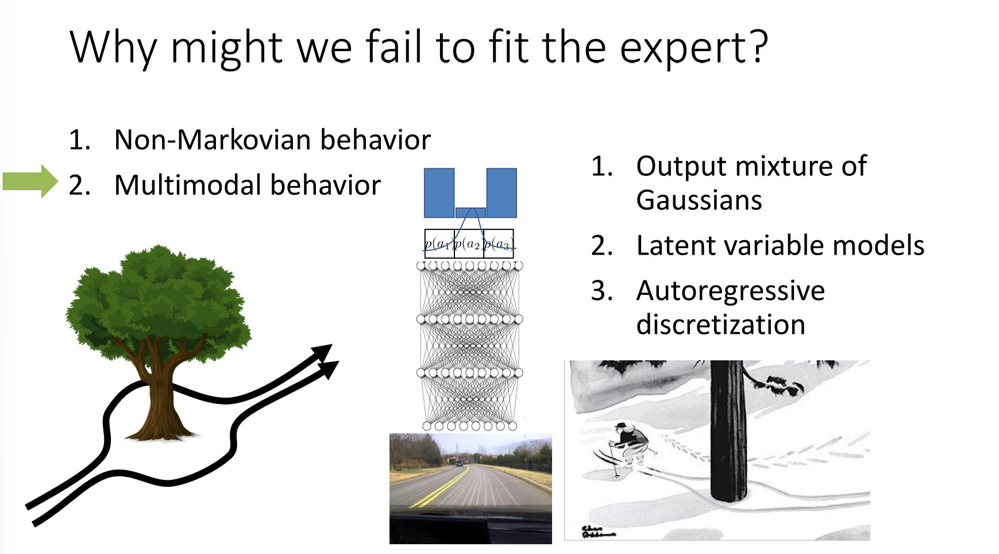
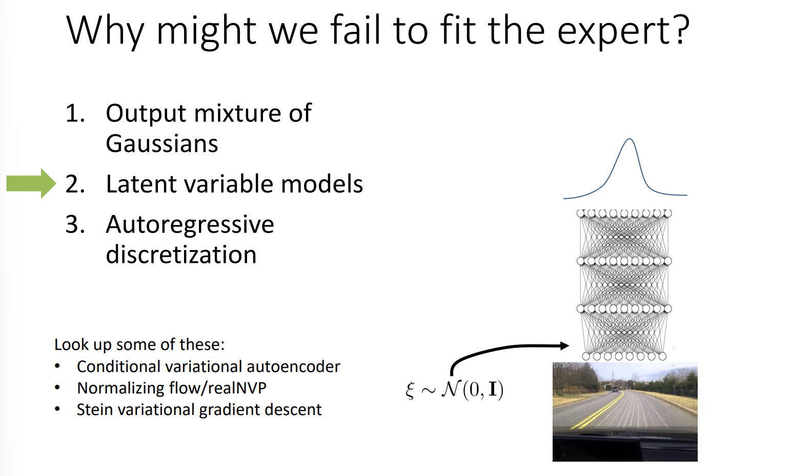

# Terminology
> [!def]
> 
> Here $o_t$ is always the derived properties from $s_t$(think of $s_t$ as hidden states, model configurations unreadable to human while $o_t$ as observed states readable to humans).
> - $o_t$ doesn't have Markov Property, $s_{t}$ does.
> - If you observe a car image, call it $o_5$ , it is static so you cannot deduce where it will be at $o_6$ just from $o_5$. But if you consider the $o_{1,}o_{2},\cdots,o_4$, you will likely to know in which direction the car is moving.
> - The $s_t$ however, could give you something like acceleration, velocity information about the car, which is totally enough to deduce the $s_{t+1}$ without the help of $s_{1,\cdots,}s_{t-1}$

# Imitation Learning
> [!def]
> 

# Dataset Aggregation
## Approach
> [!important]
> 

## Non-Markovian 
> [!bug] Caveats
> 

## Causal Confusion
> [!important]
> 

## Multi-Modal
> [!important]
> 

### Sol1: GMM
> [!def]
> 

### Sol2: Latent Variable Model
> [!def]
> 

### Sol3: Autoregressive Discretiztion
> [!def]

