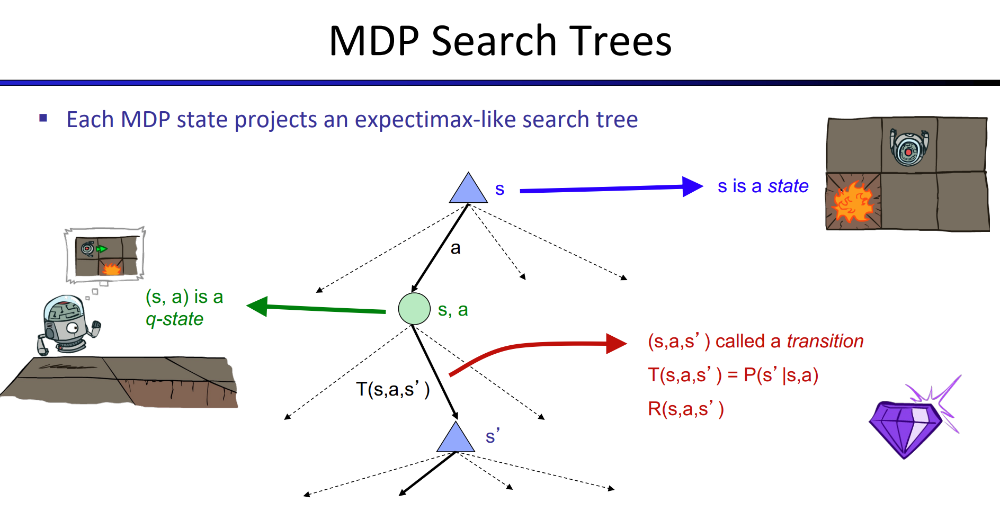
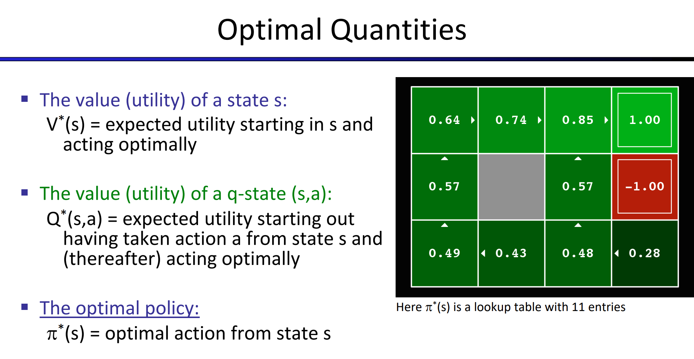
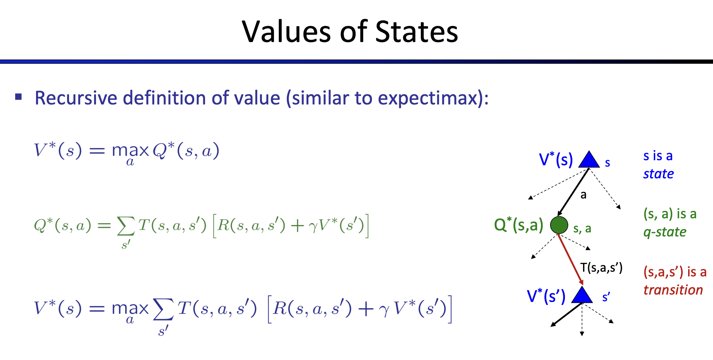
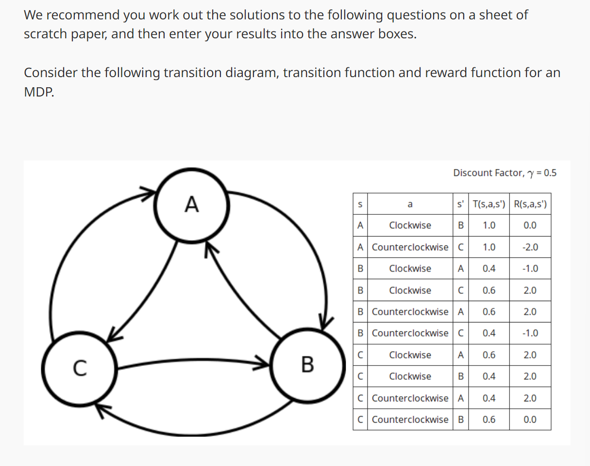
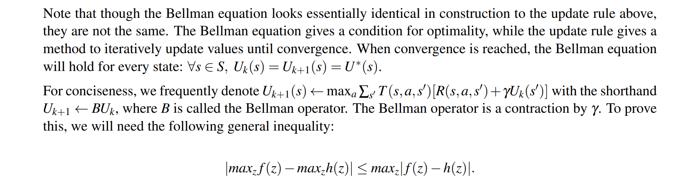
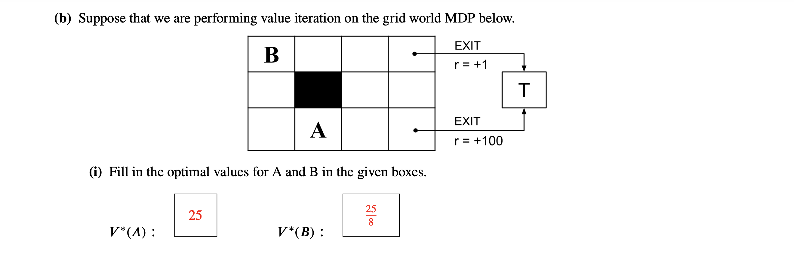
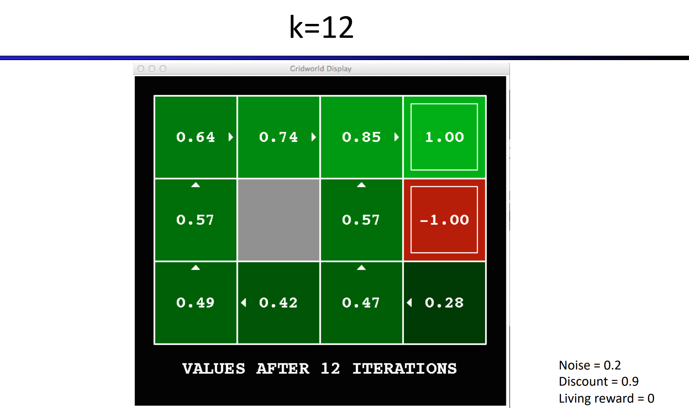
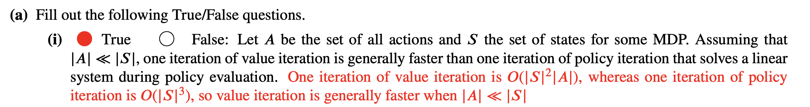
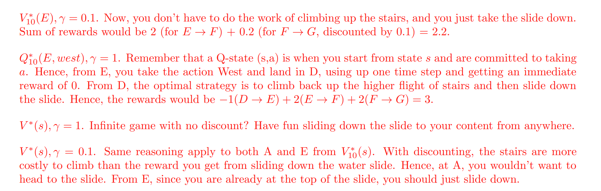

# Non-deterministic Search
> [!def]
> 


# MDP Terminology
## MDP States
> [!def]
> 


## Optimal Quantities
> [!def]
> 


# Bellman Equation
> [!thm]
> 


# Value-Based MDP
## Value of States
> [!def]
> 


## Value Iteration Procedure
> [!algo]
> 

> [!example] 
> 
> For this value iteration, we can quickly determine which action the MDP will pick by observation:
> 1. For A, we notice that choosing clockwise action will generate higher utility since there is no negative portion. So the update for A should be $U_{k+1}(A)=R(A,clockwise,B)+\gamma\times U^{clockwise}_{k}(B)$.
> 2. For B, we notice that choosing clockwise action will put more weight on the positive reward, so the update for $B$ should be $\begin{aligned}U_{k+1}(B)=0.5\times \{R(B,clockwise,A)+\gamma\times U^{clockwise}_{k}(A)\}\\ +0.5\times \{R(B,clockwise,C)+\gamma\times U^{clockwise}_{k}(C)\}\end{aligned}$
> 3. For C, we still choose the clockwise for similar reasons,  so the update for $B$ should be $\begin{aligned}U_{k+1}(B)=0.6\times \{R(C,clockwise,A)+\gamma\times U^{clockwise}_{k}(A)\}\\ +0.4\times \{R(C,clockwise,B)+\gamma\times U^{clockwise}_{k}(B)\}\end{aligned}$

> [!code]
> To write the above in code, we can construct a [linear system](../../Machine_Learning/Control_LA_Circuit/EECS16B/Module2_Robotic_Control/Discretization_System_ID.md#Discrete-Time%20LTI%20Difference%20Equation):
> $\begin{bmatrix}U_{k+1}(A)\\U_{k+1}(B)\\U_{k+1}(C) \end{bmatrix}=\begin{bmatrix}0&0.5&0\\0.2&0&0.3\\0.3&0.2&0 \end{bmatrix}\begin{bmatrix}U_{k}(A)\\U_{k}(B)\\U_{k}(C) \end{bmatrix}+\begin{bmatrix}0\\0.8\\2 \end{bmatrix}$
```python
value_iter_vec = np.array([0,0,0])

def transition_func(A, b):

    def transition(x):
        return A @ x + b
    return transition

markov_A = np.array([[0, 0.5, 0], [0.2, 0, 0.3], [0.3, 0.2, 0]])
markov_b = np.array([0, 0.8, 2])

def update_iteration(value_iter_vec, transition_func):
    new_value_vec = transition_func(value_iter_vec)
    return new_value_vec
    
transition_updater = transition_func(markov_A, markov_b)
new_value = value_iter_vec
for i in range(25):
    print(new_value)
    new_value = update_iteration(new_value, transition_updater)
```
> [!test] Output
> 

> [!example] Compute Q-value
> 


## Convergence Analysis
> [!thm]
> 

> [!quiz] 
> 

> [!example] Vitamin4 P6
> 

> [!code]
> We could also write the above iteration process in code:
```python
value_iter_vec = np.array([0,0,0,0,0,0])
markov_A = np.array([[0, 0.25, 0.25, 0, 0, 0], [0, 0, 0, 0.5, 0, 0], [0, 0.25, 0, 0, 0.25, 0], [0,0,0,0,0,0.5], [0,0,0,0.25,0,0.25],[0,0,0,0,0,0]])
markov_b = np.array([1,1,1,1,1,0])
transition_updater = transition_func(markov_A, markov_b)
new_value = value_iter_vec
for i in range(25):
    print(new_value)
    new_value = update_iteration(new_value, transition_updater)
```
> [!test] Output
> We can see that the value iteration process converges, since we have $0<\gamma<1$.
> 
> Also note that different states converge in different speeds. For example, state E converges in just 2 steps, while state A takes 4 steps since it is farthest from the terminal.
> 


## Quicker Computation of Convergence
> [!example] 
> 
> Since the reward between states other than EXIT is zero, we don't can think of it the following way:
> Suppose the bottom-right corner of the grid is state $M$, then we have:
> 
> $$V_{3}(A)=V_1(D)\times \frac{1}{2^(3-1)}=\frac{100}{4}=25$$
> 
> Now A converges at step 3, we compute for $B$, since we can easily see that $V_6(B)=V_3(A)\times \frac{1}{2^{6-3}}=\frac{25}{8}$, where $B$ converges at step 6.


## Runtime Analysis
> [!important]
> 
> **Problem 1: It's slow – O(S^2A) <font color="#d83931">per iteration</font>**
> 
> Suppose we have $S$ states, and for each state we have $A$ actions, so for each state $s$, we have to consider $A$ possible actions, and in order to determine which action to choose, for each action we have to compute its Q-value, which involves another $S$ states($s'$) to compute the expectimax, so overall it is $O(S\times A\times S)=O(S^{2}\times A)$.
> 
> In short, we have $S$ states, for each state, we have $A$ actions, for each action, we have to consider all $S$ states, so taking product yields $S\times A\times S = S^{2}\times A$
> 
> **Problem 2: The "max" at each state rarely changes**
> 
> Problem 2 refers to the phenomenon where the action that yields the maximum value for a particular state in a value iteration algorithm doesn't change frequently even though the values themselves might still be updating(very slowly yet not convergent).
> 
> **Problem 3: The policy often converges long before the values**
> 
> In many instances, the optimal policy (the best action to take from each state) converges to the correct policy well before the value function converges to the true values. This is because the relative value of different actions can become clear even when the exact values are not accurately known. Hence, continuing to iterate until the value function fully converges can be unnecessary for determining the optimal policy.

> [!example]
> We see in this example that even if the value iteration still doesn't converge, the optimal policy is already stabablized or converged.
> 


# Policy-Based MDP
## Policy Evaluation
> [!def]
> 
> Since we don't have to consider all the action at each V-state, we omit a factor $A$ and reach $O(S^2)$ as our time complexity.
> 
> Very important properties, since we don't have to do maximizing for each Q-state, we can simplify our iteration as a [linear system](../../Machine_Learning/Control_LA_Circuit/EECS16B/Module2_Robotic_Control/Discretization_System_ID.md#Discrete-Time%20LTI%20Difference%20Equation), which only involves matrix multiplication and addition.

> [!example]
> We see that different policy yields different value iteration update results.
> 


## Policy Extraction
> [!ovreview]
> 


### Extract from Values(Bad)
> [!def]
> 
> It’s useful to keep in mind for performance reasons that it’s better for policy extraction to have the optimal Q-values of states, in which case a single argmax operation is all that is required to determine the optimal action from a state. 
> 
> Storing only each $U^*(s)$ means that we must recompute all necessary Q-values with the Bellman equation before applying argmax, equivalent to performing a depth-1 expectimax.


### Extract from Q-Value(RL)
> [!def]
> 


## Policy Iteration Algorithms
> [!overview]
> 

> [!algo]
> 

> [!example] Vitamin4 P9
> 

> [!example] Fa23 Disc05 P1
> 
> Note that here $V^{\pi_i}$ at state 0 is calculated by Bellman's equation instead of value iteration.


## Runtime Analysis
> [!important]
> The policy iteration contains two parts: policy evaluation and policy improvement.
> - Policy evaluation is the same as solving a $S\times S$ linear system, which takes $O(S^3)$.
> - Policy improvement takes roughly the same time as value iteration, which is $O(S^{2}\times A)$.
> - Given that $|A|<<|S|$, we have run time $O(S^3)$ for policy iteration.


# Q-Value Iteration
> [!def]
> 

> [!example]
> See [Value Iteration and Q-Iteration](1_Markov_Decision_Process.md#Integrated%20Examples#Value%20Iteration%20and%20Q-Iteration)


# MDP Properties
## Discount Factor
> [!def]
> 


## Convergence Property
> [!property]
> 


## Optimal Policy and Reward Functions
> [!property]
> 
> For $R_2$, the optimal V values will certainly change but the optimal policy won't change. You could think that the transitional reward is much smaller than the exiting rewards, so instead of looping around and get small rewards, the agent will exit first.
> 
> For $R_4$, if all the rewards are negative, then the optimal policy for the agent at state A and B would be to go to the closest exit as soon as possible($A\to bottom$ and $B\to top$) instead of both going to the bottom exit in the previous settings.


## Runtime Property
> [!property]
> 
> One iteration of value iteration takes $O(S^{2}\times A)$.
> One iteration of policy iteration takes $O(S^3+S^{2} \times A)=O(S^3)$. 


## Expectimax and Value Iteration
> [!property] Expectimax and Value Iteration
> 
> The key realization is that, in order to compute the value of each state with the [Expectimax Algorithm](../../Machine_Learning/AI_ML/Classical_Search_Algorithms/4_Adverserial_Search.md#Expectimax%20Algorithm) in each iteration, even if we have pruning techniques, we still have to traverse through the entire tree(with horizon $H$), looking ahead with $H$ steps.
> 
> But for value iteration, due to its dynamic programming essense, for each iteration we only need to look ahead by one step, which saves lots of time.
> 


# Integrated Examples
## Policy Iteration
> [!important]
> 


## Value Iteration and Q-Iteration
> [!example] Fa23 Disc05 P2
> 
> More information on Q-learning see [[2_Types_of_RL](2_Types_of_RL.md)]


