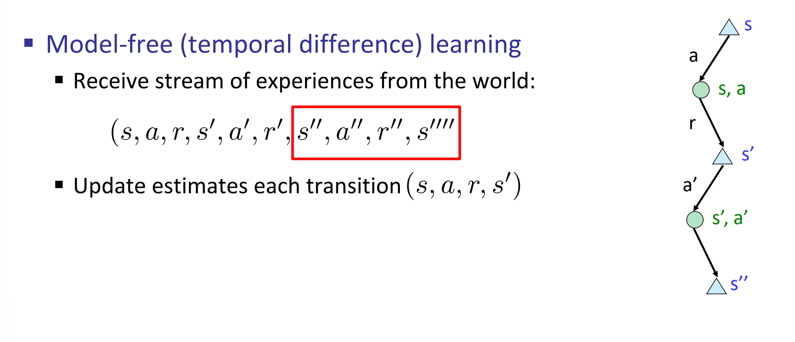
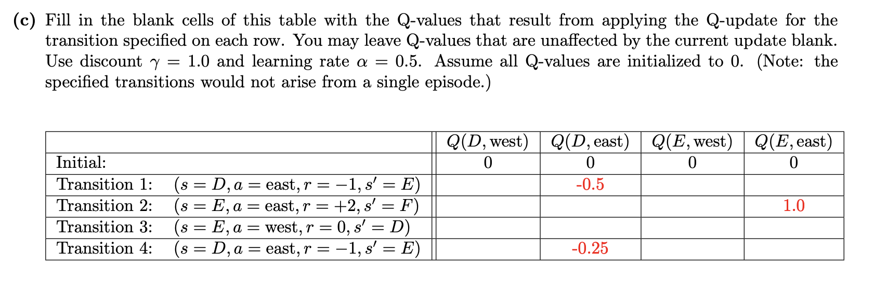

# MDP and RL
> [!def]
> 
> In reinforcement learning, you only know somethong is bad after you have actually experienced that bad scenario.
> 
> 

# Passive Reinforcement Learning
> [!overview]
> 

## Model-Based Learning
> [!def]
> 

> [!example]
> 

## Model Free Learning
> [!motiv] Motivation
> 

### Idea
> [!concept]
> 

### Direct Evaluation
> [!def]
> 

> [!example]
> 

> [!bug] Problems
> 

### Temporal Difference Learning
> [!motiv] Motivation
> 

> [!def]
> 

> [!example]
> 
> In this example, each transition is a sample, and we calculate the value of these samples one by one:
> - Assume $V_k^{\pi}(B)=V_k^{\pi}(C)=0$.
> - For (B, east, C, -2), $$\begin{aligned}V_{k+1}^{\pi}(B)&\leftarrow (1-\alpha)V_k^{\pi}(B)+\alpha(R(B,east, C)+\gamma V_k^{\pi}(C))\\&\leftarrow (1-\alpha)\times 0+\alpha(-2+\gamma \times 0)\\&\leftarrow -2\alpha=-1\end{aligned}$$
> - For (C, east, D, -2), $$\begin{aligned}V_{k+1}^{\pi}(C)&\leftarrow (1-\alpha)V_k^{\pi}(C)+\alpha(R(C,east, D)+\gamma V_k^{\pi}(D))\\&\leftarrow (1-\alpha)\times 0+\alpha(-2+\gamma \times 8)\\&\leftarrow \alpha\times (-2 + 8)=3\end{aligned}$$

> [!bug] Problem
> 

# Active Reinforcement Learning
> [!overview]
> 

## Q-Learning
> [!motiv] Motivation
> 

> [!def]
> 

> [!example] Fa23 Disc05 P2
> 
> Each transition can be regarded as a sample in the above figure:
> - **Transition 1**: We will update $Q(D, east)$ to be $(1-0.5)\times 0+0.5\times (-1+\max_{a'}Q(E,a'))=0.5\times(-1)=-0,5$
> - **Transition 2**: We will update $Q(E, east)$ to be $(1-0.5)\times 0+0.5\times (2+\max_{a'}Q(E,a'))=0.5\times(2+\max\{0\})=1$
> - **Transition 3**: We will update $Q(E, west)$ to be $(1-0.5)\times 0+0.5\times (0+\max_{a'}Q(E,a'))=0.5\times(0+\max\{0\})=0$
> - **Transition 4**: We will update $Q(D, east)$ to be $(1-0.5)\times (-0.5)+0.5\times (-1+\max_{a'}Q(E,a'))=0.5\times(-1+1)=-0.25$

## Q-Learning Properties
> [!property]
> 

# Exploration and Exploitation
> [!motiv] Motivation
> 
> **Some differences:**
> - Exploration means adventuring into new paths.
> - Exploitation means taking actions repeatedly along the same or similar paths.

## Method 1: ε-Greedy Policies
> [!def]
> 
> If we choose $\epsilon$ to be too close to 1, then after many learning iterations, we are not using the learning results(i.e. the Q-values), instead we are still acting randomly. So we want to lower $\epsilon$ alongside our exploration process.
> 
> 
> But manually tuning $\epsilon$ requires some philosophy and it's not easy to find a one-fit-all value, so we opt to **Exploration Function** to avoid manual tuning.

## Method 2: Exploration Functions
> [!def]
> 

# Approximate Q-Learning
## Memory Restriction
> [!motiv] Motivation
> 

## Feature Representation of States
> [!def]
> 

## Linear Value Functions
> [!def]
> 

## Approximation Procedure
> [!def]
> 
> **Remarks:**
> - $f_n(s.a)$ could be 0, meaning that certain feature may not be present at the state $(s,a)$.
> - If the difference < 0, it means that the current estimate of $Q(s,a)$ is bigger than the sample we observe, so we want to update our new $Q(s,a)$ to be lower(i.e. to be closer to the observed sample). This is realized by multiplying difference < 0 in the update step.
> - If the difference > 0, it means that the current estimate of $Q(s,a)$ is smaller than the sample we observe, so we want to update our new $Q(s,a)$ to be higher(i.e. to be closer to the observed sample). This is realized by multiplying difference > 0 in the update step.
> - If the $f_i(s,a)$ is big, then the update is more active.

> [!example] Pacman
> 

# Policy Search

