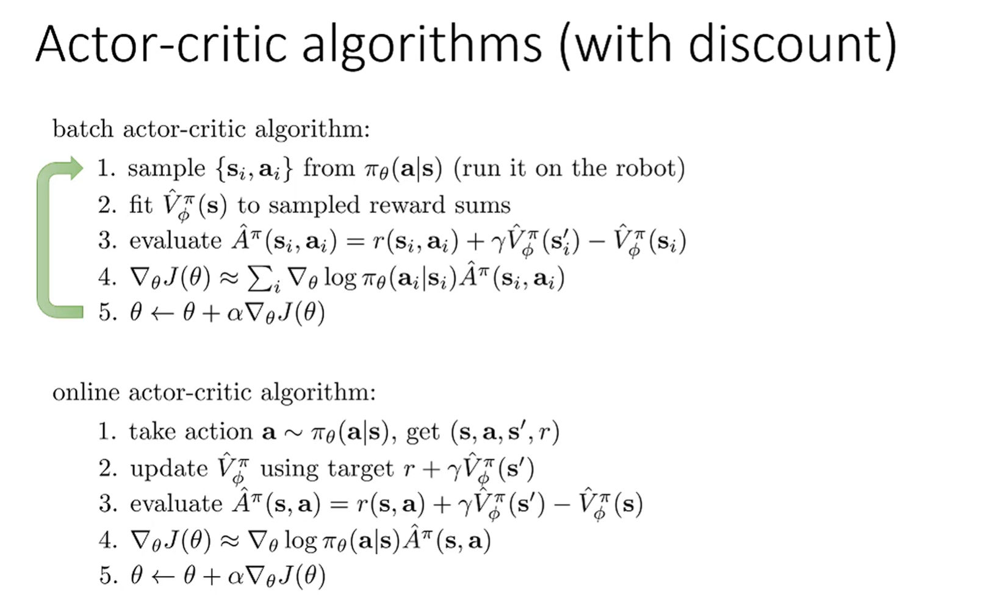
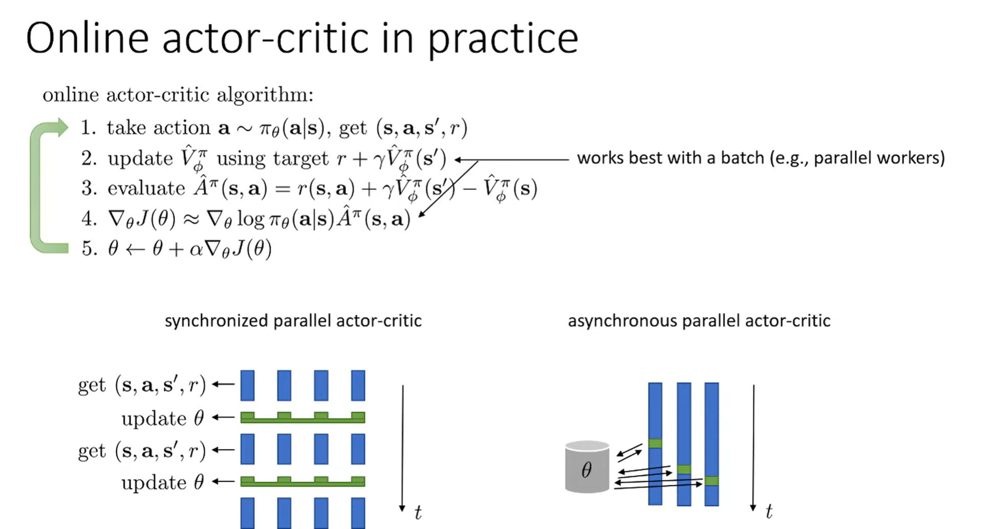

# Review on some Definitions
> [!important]
> 

# Policy Evaluation
## Advantage Term
> [!def]
> 

> [!code] How to estimate Advantage Term
> 

## Valuing Function Fitting
> [!def]
> 

## Monte Carlo Evaluation
> [!important]
> 

## Discount Factors
> [!important]
> 

 

# Actor-Critic Algorithm
## Motivations
> [!motiv]
> 

## Vanilla Version
> [!algo]
> 

## Discount Version
> [!algo]
> 

## Architecture Design
> [!important]
> 

# Trust-Region Methods
## Motivations
> [!motiv]
> 

## Proximal Policy Optimization
> [!algo]
> 

> [!important]
> 

