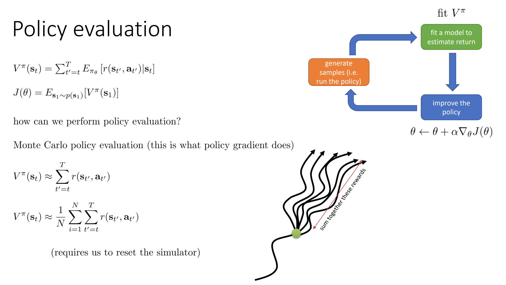
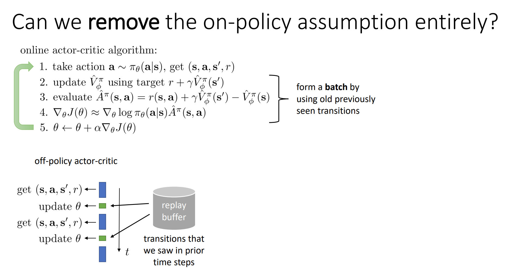
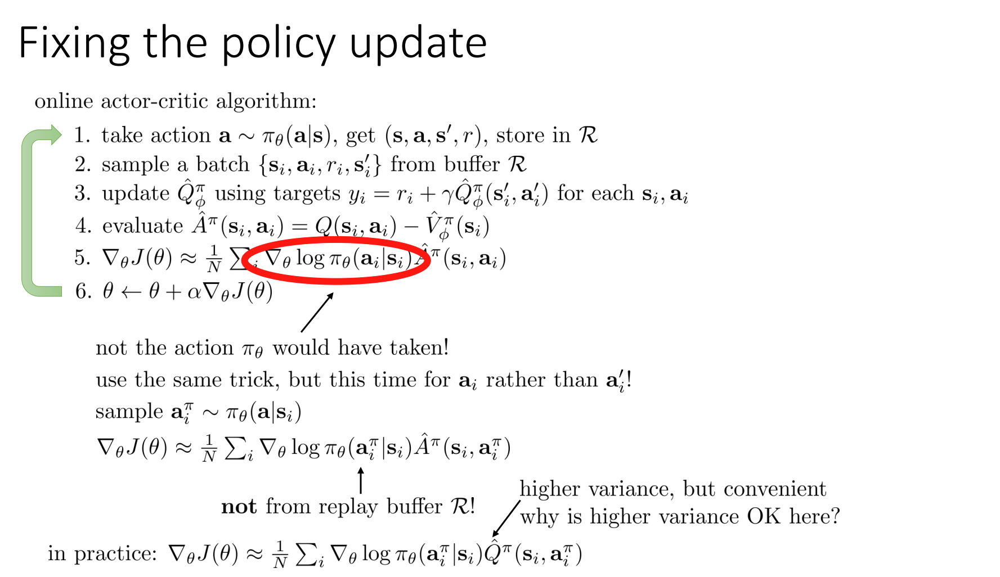

# Review on some Definitions
> [!important]
> 


# Improving PPO -> Actor Critic
## Motivations
> [!important]
> 


## Advantage Term
> [!def]
> 

> [!code] How to estimate Advantage Term
> 


## Valuing Function Fitting
> [!def]
> 


### Policy Evaluation
> [!def]
> 


### Monte Carlo Evaluation
> [!important]
> 


## Discount Factors
> [!important]
> 


 


# Actor-Critic Algorithm
## Motivations
> [!motiv]
> 


## Batch AC Algorithm
> [!algo]
> 


## Online AC Algorithm
> [!algo]
> 

> [!proof]
> 


## Architecture Design
> [!important]
> 


### Actor
> [!important]
> A network $\pi_{\theta}(a|s)$ that takes a state, and return a distribution over actions at this state, i.e. $p(a_{t}|s_{t})$
> - **Purpose:** Represents the policy $\pi_{\theta}(a|s)$, where the actor predicts the probability distribution over actions given a state.
> - **Role:** It is updated to maximize the objective function (surrogate loss) while adhering to a clipped constraint to prevent large policy updates.
> - **Output:** Action probabilities (for discrete action spaces) or parameters of the action distribution (mean and standard deviation for continuous action spaces).
```python
class Actor(nn.Module):  
  
    def __init__(self, state_dim, action_dim, hidden_dim=256):  
        super().__init__()  
        self.fc1 = nn.Linear(state_dim, hidden_dim)  
        self.fc2 = nn.Linear(hidden_dim, hidden_dim)  
        self.fc_mean = nn.Linear(hidden_dim, action_dim)  
        self.fc_std = nn.Linear(hidden_dim, action_dim)  
        self.relu = nn.ReLU()  
        self.tanh = nn.Tanh()  
        self.softplus = nn.Softplus()  
  
    def forward(self, x):  
        x = self.relu(self.fc1(x))  
        x = self.relu(self.fc2(x))  
        mean = self.tanh(self.fc_mean(x)) * 2  
        std = self.softplus(self.fc_std(x)) + 1e-3  
  
        return mean, std  
  
  
    def select_action(self, s):  
        with torch.no_grad():  
            mu, sigma = self.forward(s)  
            normal_dist = Normal(mu, sigma)  # p(a_{t}|s_{t}) is N(mu(s), sigma(s))  
            action = normal_dist.sample()  
            action = action.clamp(-2.0, 2.0)  
        return action
```


### Critic
> [!important]
> - **Purpose:** Represents the value function $V_\phi(s)$, which estimates the expected return from a given state.
> - **Role:** Provides a baseline to reduce variance in the policy gradient and evaluates how good a state is.
```python
class Critic(nn.Module):  
    """  
    Value network, which takes an observation and outputs a value for that observation.    输出的是一个一维数值  
    """    def __init__(self, state_dim, action_dim, hidden_dim=256):  
        super().__init__()  
        self.fc1 = nn.Linear(state_dim, hidden_dim)  
        self.fc2 = nn.Linear(hidden_dim, hidden_dim)  
        self.fc3 = nn.Linear(hidden_dim, 1)  
        self.relu = nn.ReLU  
  
    def forward(self, s):  
        s = self.relu(self.fc1(s))  
        s = self.relu(self.fc2(s))  
        s = self.fc(s)  
        return s
```


### Reward Model
> [!important]


### Reference Model
> [!def]
> 


### ReplayMemory
> [!def]
> - **Purpose:** Stores trajectories of states, actions, rewards, and log probabilities for use during training.
> - **Role:** Collects data from interactions with the environment and processes it for mini-batch updates.
```python


```

 


# Policy Gradient vs Actor Critic
> [!important]
> 


# Trust-Region Methods
## Motivations
> [!motiv]
> 


## Proximal Policy Optimization
> [!algo]
> 

> [!important]
> 


