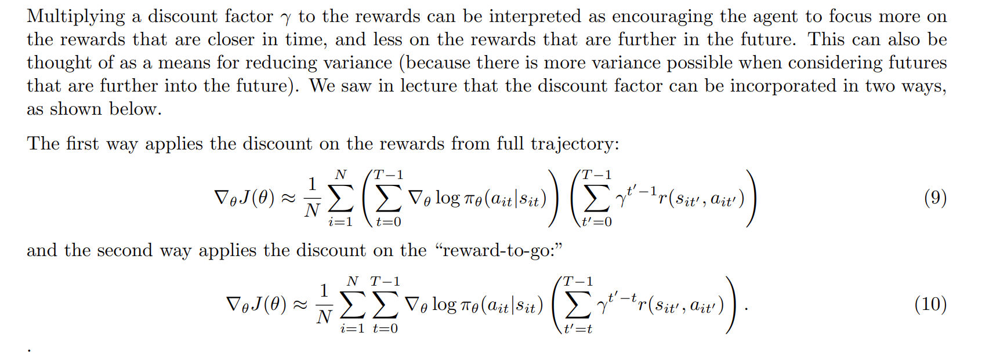
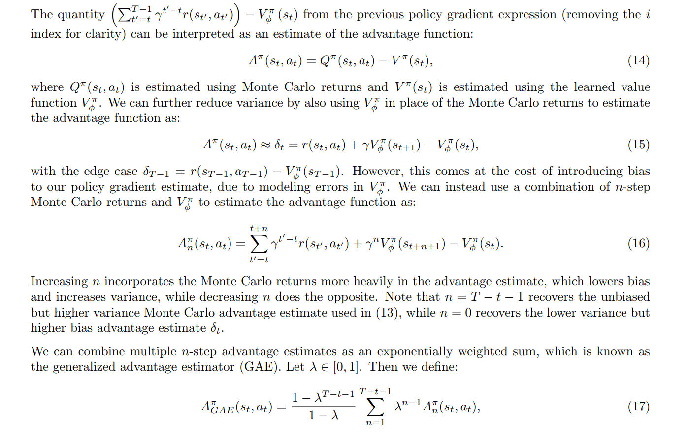
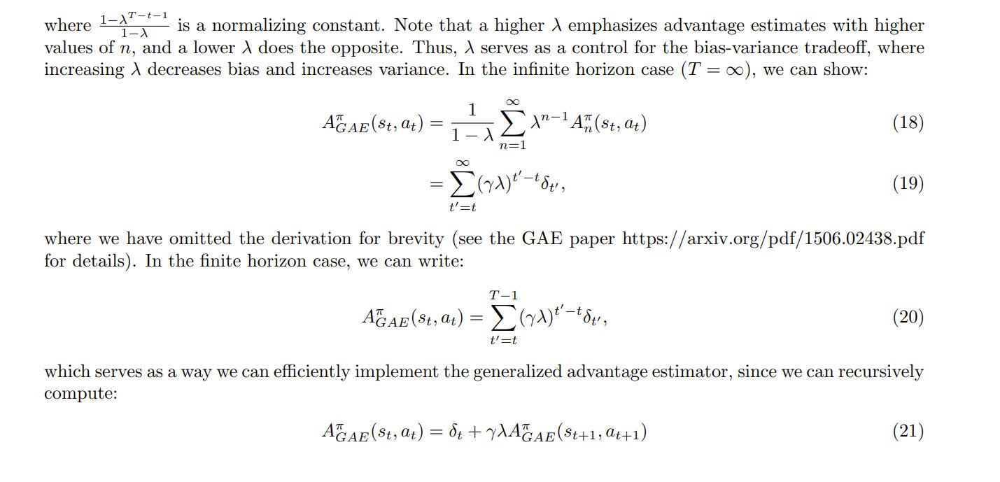
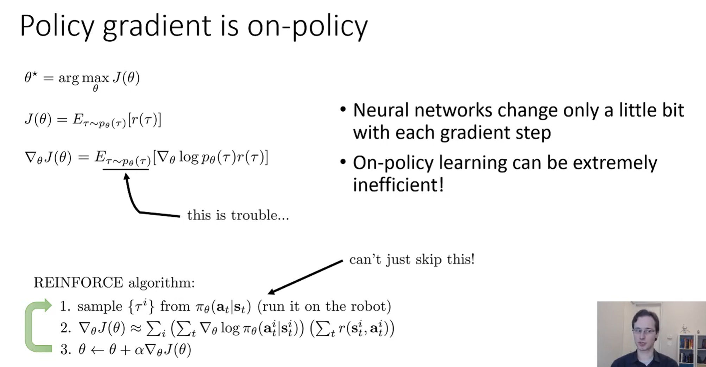
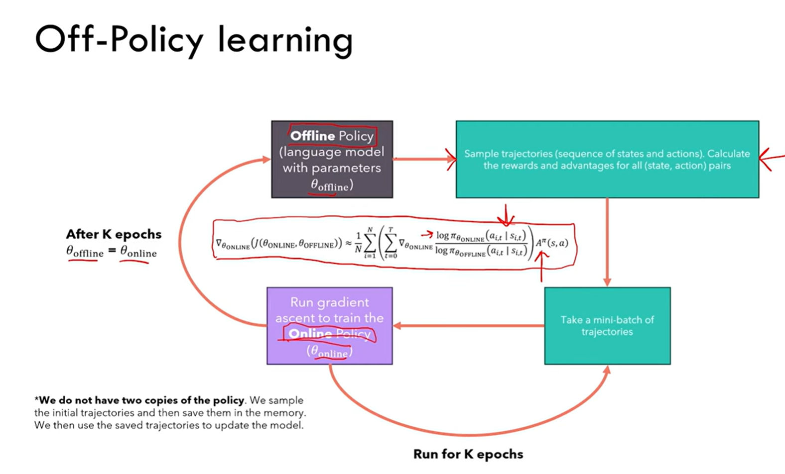
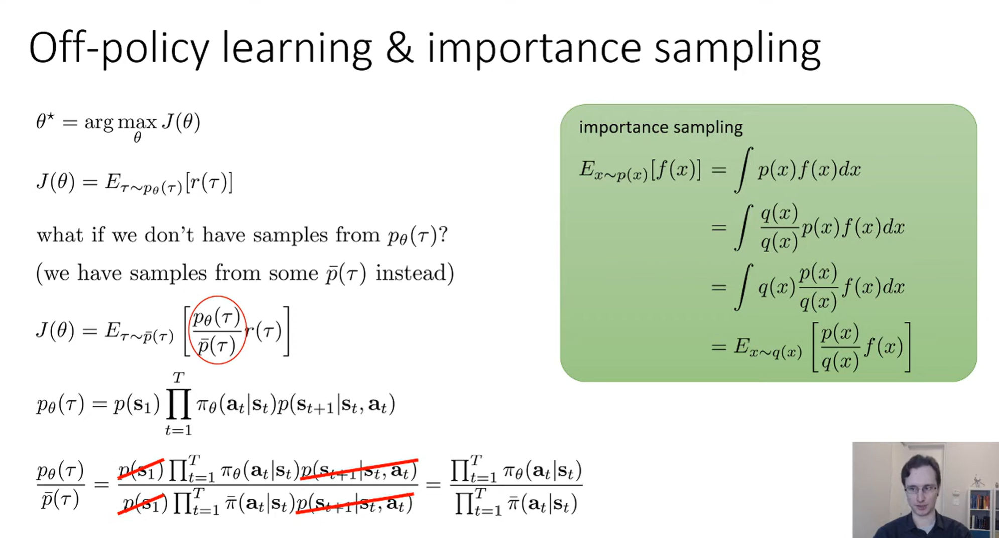
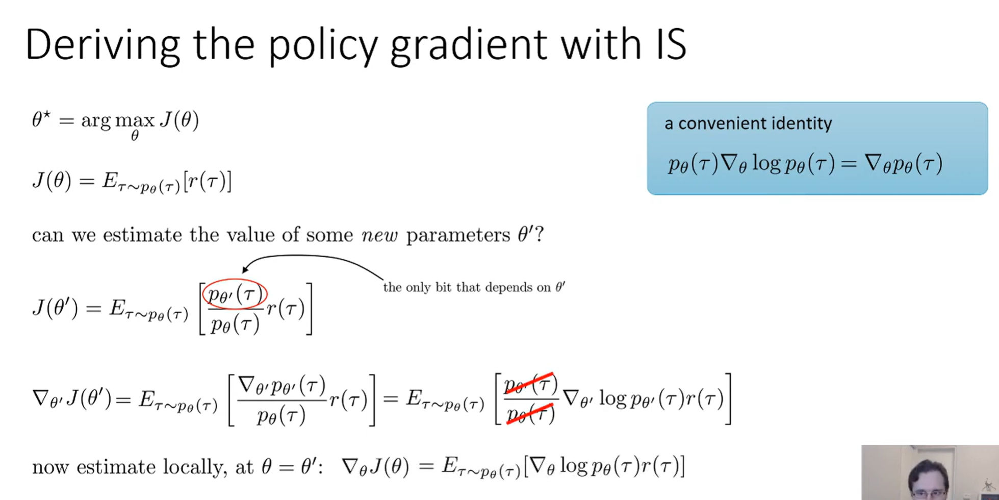
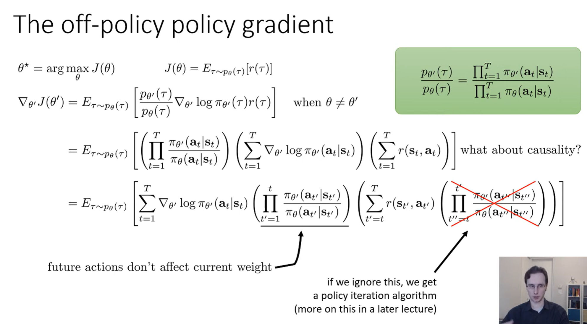
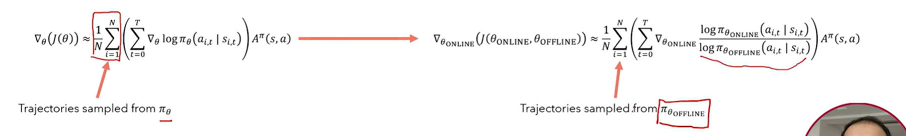
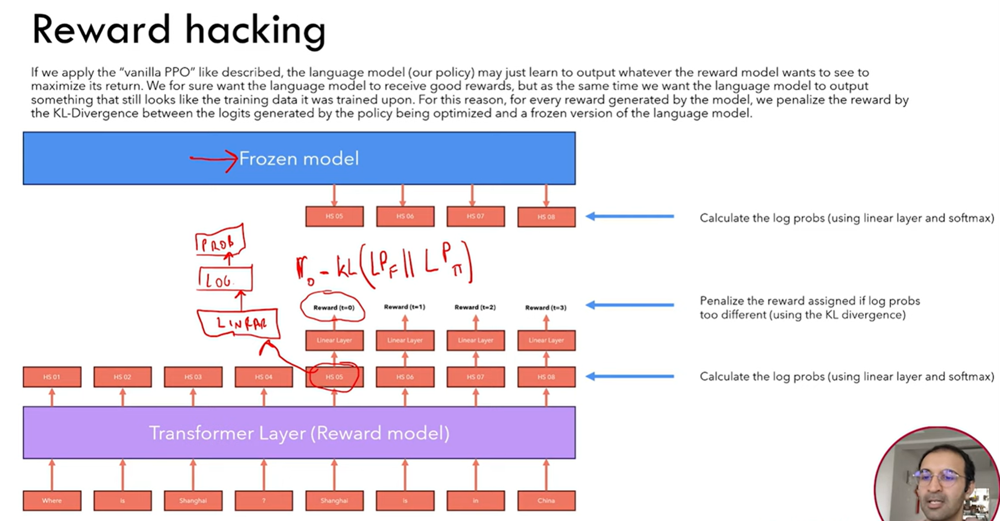

# Gradient Policy Optimization
## Formulations
> [!def]
> 

## Objectives
> [!important]
> 

## Policy Gradient
> [!important]
> 

## Compute the gradient
> [!important]
> 

## Full Algorithms
> [!algo]
> 

## Examples
### Gaussian Policies
> [!def]
> 

# GPO Problems
## Problem List
### Slow Update
> [!important]
> 

### High Variance
> [!important]
> 

## Reducing Variance
### Method 1: Rewards to go
> [!important] Rewards to go
> 

### Method 2: Optimal Baseline
> [!def]
> 
> We don't typically use it, using the expected rewards as baseline is just fine.

### Method 3: Adding Baseline
> [!important] Baseline
> Make PGO algorithm increase the policy trajectories that have rewards above the average.
> 

### Method 4: Discounting
> [!important]
> 

### Method 5: GAE(PPO)
> [!important]
> 

# Off-Policy-Learning
## Motivations
> [!motiv]
> 
> The on-policy means every time we want to calculate the policy gradient with sampling techniques, we have to sample from the current policy $\pi_{\theta}(a_{t}|s_{t]})$ that's parametrized by $\theta$. 
> 
> We can not utilize the policy from previous iteration steps. In other words, we have to generate a fresh bunch of samples every iteration in our algorithm.
> 
> We know using the gradient update may be small at each time step, but in order to get that tiny gradient update, we have to perform a sampling(which requires time). Thus on-policy learning is not necessarily the best choice.
> 
> **So the flip side would be:** If the trajectory sampling procedure is simple and not compuy intensive, then the policy gradient algorithm will be very good at picking the best policy in terms of time and performance.

## Workflow
> [!algo]
> 

## Importance Sampling
> [!important]
> 

## Off Policy Gradient
> [!def]
> 

## Reward Hacking
> [!important]
> 

