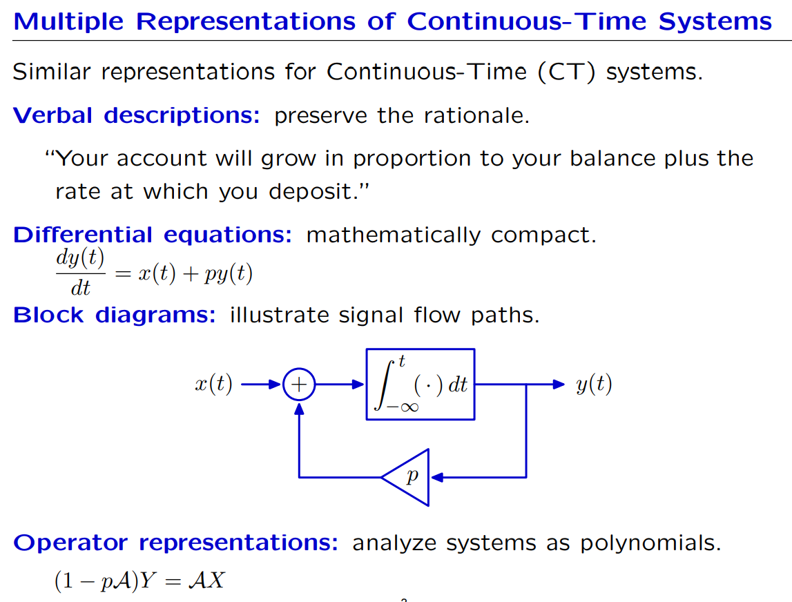
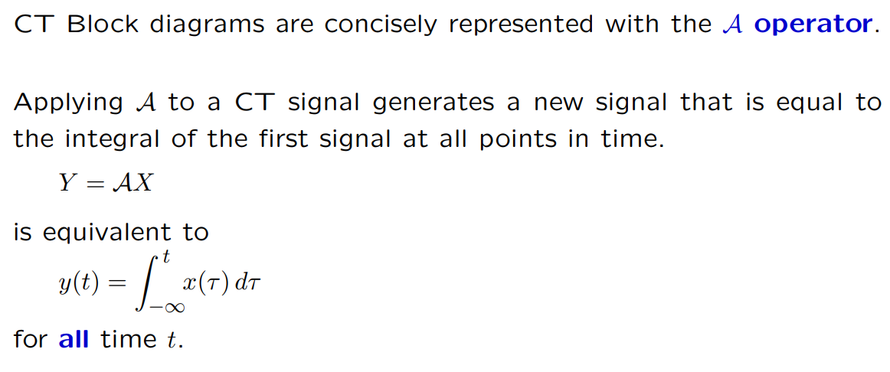
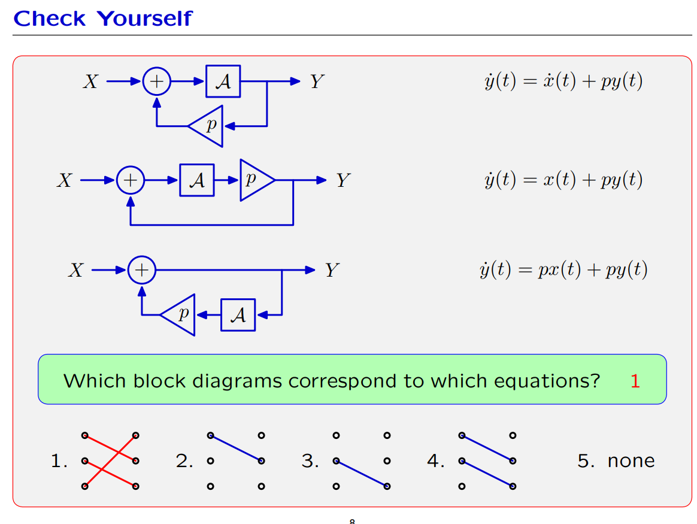
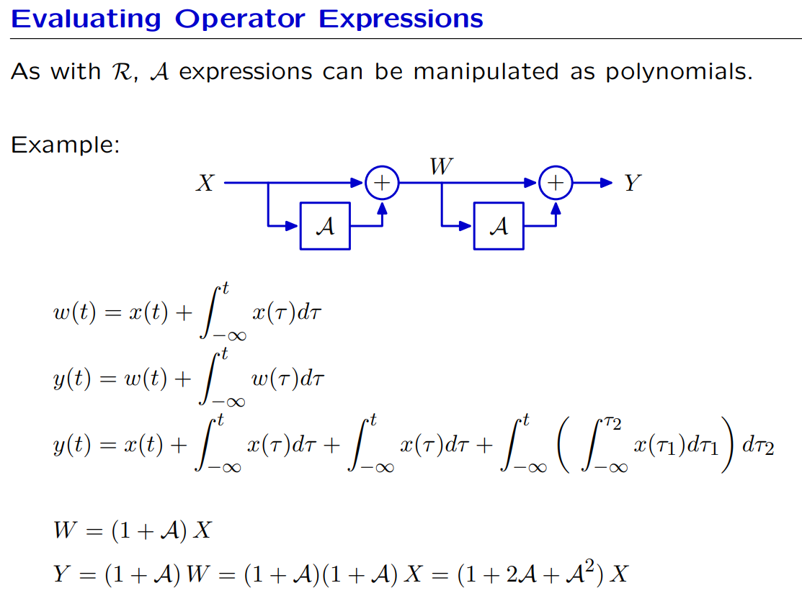
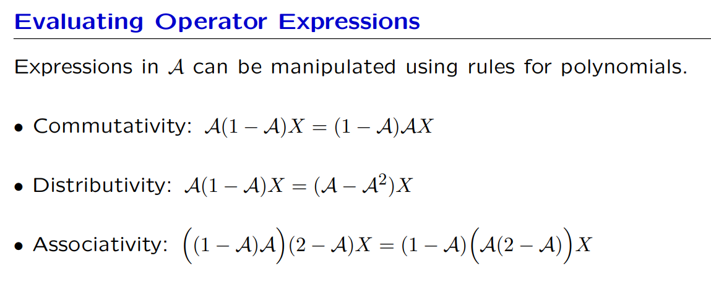
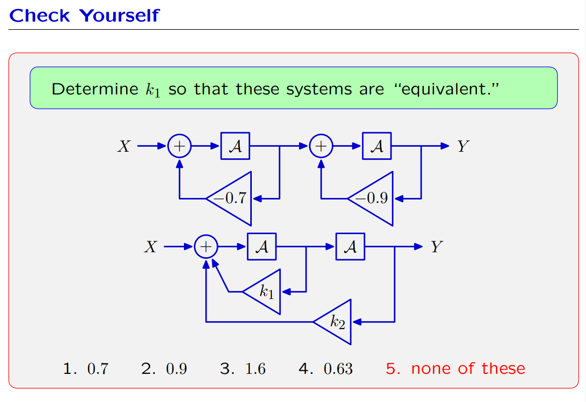
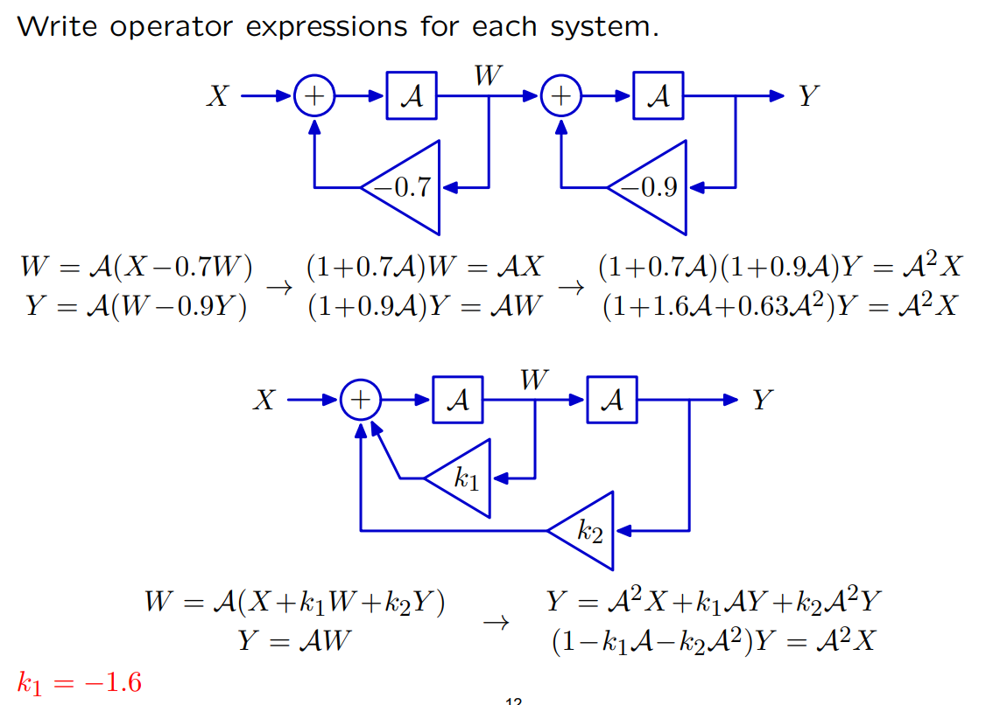

# Modularity
## Block Diagram
> [!important]

## Mathematical Properties
> [!property]
> 

> [!example]
> 

# DT Operator Algebra
## Principles
> [!important]
> 

## Accumulator
> [!def]
> 

## Reciprocal Operator
> [!important]
> 

## Feedback Operator
> [!def]
> 

## Cyclic/Acyclic Path
> [!important]
> 

# CT Operator Algebra
## Basic Definitions
> [!def]
> 
> Here $\mathcal{A}$ is like making accumulation.
> 
> 

## Evaluating Operator Expressions
> [!def]
> 

## Operator Algebra
> [!property]
> 

> [!example]
> 

