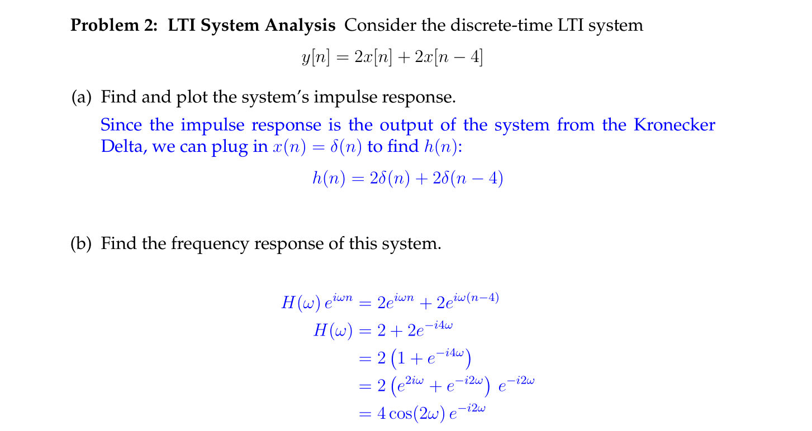
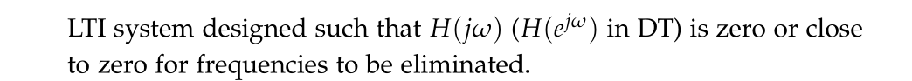

Fa19 Lec3

# Response to Complex Exponential
## Complex Exponentials
> [!def]
> 

## Eigenfunction
> [!def]
>   An eigenfunction is a type of function that, when used as an input for a given operator, produces a result proportional to the original function. 
>   
>   The concept is most often discussed in the contexts of linear algebra, differential equations, and quantum mechanics, among other areas in mathematics and physics.
>   

## Time Response of LTI
> [!important]
>  

> [!example] EECS120 Fa19 Lec3
> 
> where the $(6)$ comes from the fact that $\delta(\tau - 3) = 1$ only when $\tau = 3$ and thus $\delta(\tau-3)e^{-s\tau}=\begin{cases} e^{-3s}&\tau=3\\0&otherwise\end{cases}$. More see [3.4_Step_and_Delta](../../../Mathematics/Differential_Equations/MIT_18.03SC/3.4_Step_and_Delta.md).
> 
> Here $y(t) = x(t-3)$ is given. So the transfer function serves to describe the relationship between the input and output and is typically defined to be the proportional of output to intput, which is:
> 
> 

## Frequency Response of LTI
> [!def]
> Notice here we apply pure oscillation signal to the LTI system, so:
> - $e^{st}\big|_{s=jw}=e^{jwt}$
> - $z^n\big|_{z=e^{jw}}=e^{jwn}$
> 
> in this way, the transfer function is a function of just one variable $w$. 
> 
> You may wonder why we choose $s$ to be purely imaginary and $z$ to be on the unit circle. 
> - It is just a special case of the transfer function. There is no difference between FR and transfer function.
> - Because of its special meaning of the oscillation of sinusoidal waves, we call it frequency response of the LTI system.
> 	- $H(e^{jw}) = H(e^{j(w+2\pi)})$, which implies that $H(\cdot)$ is periodic, which comes in handy when we drow the plot for it. 
> 
> To find the frequency response of LTI system, we have 2 methods:
> 1. Pass $z^n$ or $e^{st}$ as $x[n]$($x(t)$), express the output $y[n](y(t))$ as $H(e^{jw})x[n](H(jw)e^{st})$ and match the pattern to find $H(\cdot)$.
> 2. Find the impulse response of the system $h(\cdot)$, use the formula $H(e^{jw})=\sum\limits_{k} h(k)e^{-jwk}$($H(jw)=\int h(\tau)\cdot e^{-jw\tau}d\tau$) to find the frequency response. Note that here we may use the [Properties](../../../Mathematics/Differential_Equations/MIT_18.03SC/3.4_Step_and_Delta.md#Properties**⭐**) of delta function to obtain the result.

> [!example] EE120 Fa19 Disc02 P2
> Notice here our phase is defined to be between $[-\pi, \pi]$.
> 
> 

# Filtering
## Definition
> [!def]
> 

## Moving Averge Filter
> [!def]
> 

## Causal Filter
> [!def]
> 
> This is a high-pass filter.

# FIR and IIR Systems
## Finite Impulse Response System
> [!def]
> 
> In short, FIR is $y[n]=\sum\limits_{k=0}^{M}b_kx[n-k]$, known as a special form of moving average filter.
> 
> To find the system function $H(z)$, we could utilize the formula above and fit $x[n]=z^n$ in the equation to get:
> $$y[n]=\sum\limits_{k=0}^{M}b_{k}z^{n-k}=\sum\limits_{k=0}^{M}b_{k}z^{-k}\times z^{n}=H(z)\times z^n$$, which means $H(z)=\sum\limits_{k=0}^{M} b_{k}z^{-k}$

## Infinite Impulse Response System
> [!def]
> 
> In short, IIR is $y[n]=\sum\limits_{k=0}^{M}b_kx[n-k]-\sum\limits_{k=1}^Na_ky[n-k]$

## Comparison
> [!important]
> 

# Cascading LTI Systems
## Serial Connection
> [!def]
> 
> We know that the output of this system is $x*h*g$. By associative law we have that the equivalent of this serial LTI system is $h*g$.

## Parallel Connection
> [!def]
> 
> We know that the output of this system is $x*h+x*g$. By distributive law we have that the equivalent of this serial LTI system is $h+g$.

## Computing Example
> [!example]
> 
> Here $g*h[n]=\sum\limits_{k=-\infty}^{\infty}g[k]h[n-k]=\sum\limits_{k=-\infty}^{\infty}\alpha^{k}u[k]\delta[n-k-2]=\alpha^{n-2}u[n-2]$ when $k=n-2$ and $\delta[n-k-2]=1$

