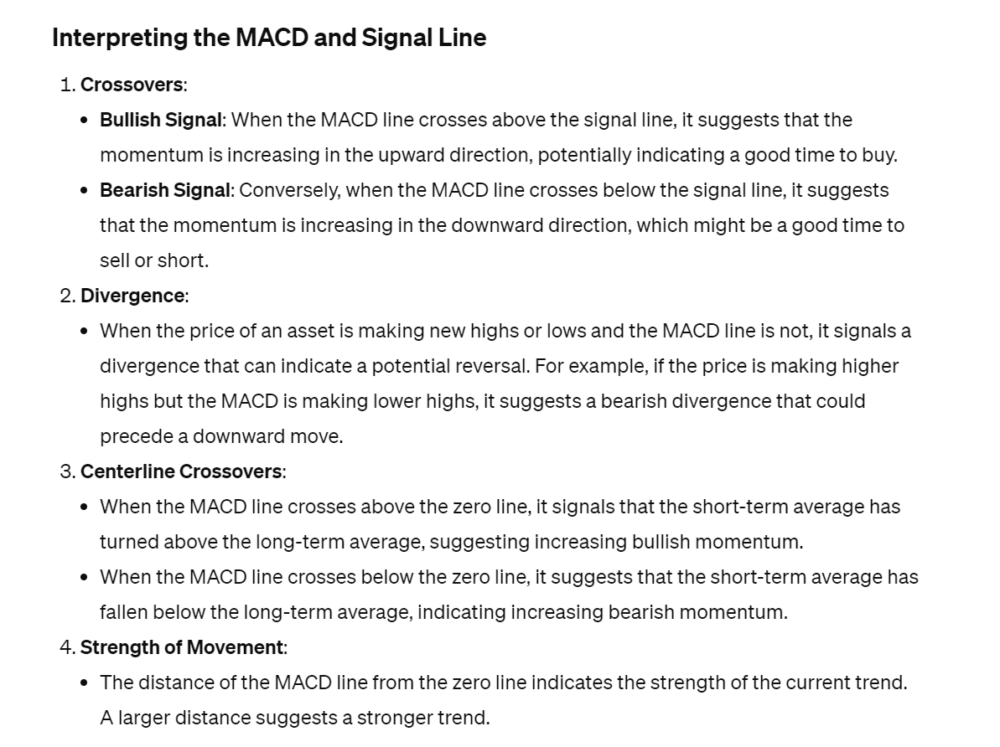

# Edge Detection
## Definition
> [!def]
> The canonical definition of the 1D Edge Detector is: $$y[n]=x[n]-x[n-1]$$ so the inpulse response of this system is $$h[n]=\delta[n]-\delta[n-1]$$. Given this, now if we have an arbitrary input signal $x[n]$, we could derive the output $y[n]$ by convolution $$(x*h)[n]$$
> 
> This filter, applied to the signal, can extract out the sharp increase or decrease in the magnitude of the signal.


## Applications on PCS
### Piecewise Constant Signal
> [!def]
> Suppose we have the following input signal:
> 
> Each $n$ correspond to a unique $k$ such that $\delta[n-k]=1$ where $n=k$.
```python
n = np.arange(0, 21)
h = np.array([1, -1])
x = np.array([0,0,0,0,0,1,1,1,1,1,3,3,3,3,2,2,2,2,2,0,0])
y = np.convolve(x, h, "same") # filtered version of x

# Plot results
plt.figure(figsize=(16, 8))

plt.subplot(2, 1, 1)
plt.stem(n, x)
plt.ylim([0, 3.5])
plt.title("Piecewise Constant Signal $x[n]$")

plt.subplot(2, 1, 2)
plt.stem(n, y)
plt.ylim([-2.5, 2.5])
plt.title("1D Edge Detector Output for $x[n]$")

plt.show()
```
> [!code] Output
> 
> We can see that if we apply the 1D Edge detector filter to the piecewise continuous signal, the output would show the discontinuity point with its direction.
> - We see that the original signal changes 4 times, from 0 -> 1, 1 -> 3, 3-> 2, and finally 2 -> 0. Then the edge detector extracts 4 sharp change in the original signal and output 4 non-zero value.


### Sparse Signals
> [!def]
> One of the hottest areas of signal processing in the past ~15 years has been the study of sparse (mostly zero) signals, including both acquisition and representation, known as *compressed sensing*. 
> - A key part of compressed sensing algorithms is applying some *sparsifying transform* to signals that retain all the signal's information (i.e., the original signal could be completely recovered from the transformed one) but result in a new signal that is **mostly zero**.
> 
> Suppose you're interested in developing compressed sensing algorithms for piecewise constant signals, and are in need of a way to sparsify them. How would you do so by only using the first signal value, $x(0)$, and using an LTI filter of your choice as the sparsifying transform? Explain both what LTI filter you would use, and how to recover the original signal from the filtered one. You can ignore noise that would be present for real world signals — assume the signal truly is piecewise-constant like the ones above. Also, you may assume $x(n) = 0$ for $n < 0$, since this is basically what we're doing in the digital setup.
> -  We could define a difference equation where $x[n]=y[n]+x[n-1]$ where $x[n]$ is the original signal and $y[n]$ is the compressed signal(sparse).
> - $x[0]=y[0]$


### Moving Difference - Derivatives
> [!example] Ramp Signal
> 
```python
# TODO your code here
n = np.arange(51)
h = np.array([1, -1])
x = np.array([(n[i]**2) for i in range(len(n))]) # x = n^2
y = np.convolve(x, h, mode="valid")

# Plot results
plt.figure(figsize=(16, 8))

plt.subplot(2, 1, 1)
plt.stem(x)
plt.title("Piecewise Constant Signal $x[n]$")

plt.subplot(2, 1, 2)
plt.stem(y)
plt.title("1D Edge Detector Output for $x[n]$")

plt.show()
```
> [!code] Output
> 
> **Q:** A ramp signal linearly increases. You should see in your plot that a 1D edge detector, or moving difference, outputs a constant signal when given a ramp as its input. What real function ($f(t) = ?$) does the ramp remind you of? What is that function's derivative (what's $f'(t)$)? How does the derivative for it match up against the edge detector's output?
> **A:** $f(t)=t, f'(t)=1$

> [!example] Quadratic Signal
> 
```python
# TODO your code here
n = np.arange(51)
h = np.array([1, -1])
x = np.array([(n[i]**2) for i in range(len(n))]) # x = n^2
y = np.convolve(x, h, mode="valid")

# Plot results
plt.figure(figsize=(16, 8))

plt.subplot(2, 1, 1)
plt.stem(x)
plt.title("Piecewise Constant Signal $x[n]$")

plt.subplot(2, 1, 2)
plt.stem(y)
plt.title("1D Edge Detector Output for $x[n]$")

plt.show()
```
> [!code] Output
> 
> **Q:** Same question as before. You should see in your plot that a 1D edge detector, or moving difference, outputs a ramp signal when given a quadratic as its input. What real function ($f(t)=?$) does the quadratic remind you of? What is that function's derivative (what's $f'(t)$)? How does the derivative for it match up against the edge detector's output?
> **A:**  $f(t)=t^2$ and $f'(t)=2t$.


## Applications on Noisy Signals
> [!bug] Caveats
> When applied on gaussian noise signals, we notice that the edge detector filter neither amplifies nor supresses the original signal, which doesn't give us much information about the original signal.
> 
> So a good practice before applying edge detector is to denoise the signal first.
> 


# Data Smoothing
## SMA
### Definition
> [!def]
> 
> We know from the lecture that moving average filter is a low pass filter. And our noisy signal is like a high-frequency signal, so that after applying this filter, the output signal will be attenuated(i.e. be less oscillating, and more smooth).


### Signal Denoising
```python
# Generate Noisy Signal
n = np.arange(0, 1500)
x = np.concatenate([np.exp(np.arange(0, 1000) / 300), np.array([0]*500)])

z = np.random.normal(loc = 0, scale = 4, size = x.shape)
y = x + z

filt_sizes = [2, 5, 10, 20, 50, 100, 500]

def denoise_signals(t, true_signal, noisy_signal, filt_sizes, mode):
    plt.figure(figsize = (20, 35))

    fig_row = len(filt_sizes)

    for i, L in enumerate(filt_sizes):
        plt.subplot(fig_row, 1, i + 1)

        filter = np.array([1 / L] * L)

        # Remember to use full here, otherwise non-causal, since y[0] will be equal to the 
        # moving average of something in the future, like in time step 1, 2, 3
        denoised = np.convolve(noisy_signal, filter, mode)

        if len(true_signal) != 0:
            plt.plot(t, true_signal, "g", label="True Signal")


        plt.plot(t, noisy_signal, label="Noisy Signal")

        t_aug = np.concatenate((t, np.arange(t[-1], t[-1] + len(denoised) - len(t))))

        plt.plot(t_aug, denoised, "r", label=f"Noiseless Signal after {L}-point filter")

        plt.legend()

denoise_signals(n, x, y, filt_sizes, "full") 

```
> [!code] Output
> 
> We can see that the SMA can effectively denoise the smooth portion of the input signal but typically fail to keep the sharp turn of the input signal(it will smooth out the sharp turn in the input signal).
> 
> So if we attempt to apply an edge detector on this denoised signal, we will lose the information about the edge.
> 
> - **Advantage:** Signal denoising at the original smooth part.
> - **Disadvantage:** Signal gets more and more distorted at the sharp drop.


### Extract Trend from Data
> [!important]
> 
```python
# CSV hocus pocus
import csv

stock_dates = []
stock_prices  = []
with open('AAPL.csv', mode='r') as raw_data:
    csv_reader = csv.DictReader(raw_data)
    for row in csv_reader:
        data = row['Close']
        if not data == 'null':
            stock_prices.append(float(data))
            stock_dates.append(row['Date'])
stock_prices = np.array(stock_prices)


start = -400
end = -1
x = np.arange(len(stock_prices[start:end]))

# Plot roughly one data point per week (x[::7]) so we can display dates 
# without matplotlib going crazy about the labels overlapping
plt.figure(figsize=(20, 5))
plt.xticks(x[::7], stock_dates[start:end:7], fontsize=10, rotation=75)
plt.plot(x, stock_prices[start:end])
plt.title("AAPL Daily Closing Prices, June 2017 to January 2019")
plt.ylabel("US Dollars")
plt.show()


data = stock_prices[start:end]

## TODO your impulse response definitions here
MA5 = np.array([1 / 5] * 5)
MA25 = np.array([1 / 25] * 25)
MA75 = np.array([1 / 75] * 75)


## TODO your filtering code here
y5 = np.convolve(data, MA5, "same")
y25 = np.convolve(data, MA25, "same")
y75 = np.convolve(data, MA75, "same")


# Overlay stock prices
plt.figure(figsize=(16, 4))
plt.plot(np.arange(len(data)), data)
plt.plot(np.arange(len(data)), y5)
plt.plot(np.arange(len(data)), y25)
plt.plot(np.arange(len(data)), y75)

# Formatting mumbo jumbo to abstract away boundary issues
plt.xlim([40, 360])
plt.ylim([140, 240])
plt.legend(('Original Data', '5-Point Average', '25-Point Average', '75-Point Average'), bbox_to_anchor=(1.1, 1.05))
plt.ylabel("US Dollars")
plt.xlabel("Days Since June 23, 2017")
plt.title("Moving Averaged AAPL Stock Prices")
plt.show()
```
> [!code] Output
> 
> We see that the filtered signal highlights **longer** term trends.
> 
> **Q:** Suppose that you had the closing price of Microsoft stock (MSFT) for every day it's existed, 1986 to present (~8000-10000 data points, one per day), and wanted to see how the company's stock price changed at the level of trends that occur over the course of a year using a moving average filter. How long of a moving average would you use? Why?
> **A:** The most common choice for this type of analysis is a 252-day moving average. This is because the stock market is typically open for about 252 days in a year (taking into account weekends and public holidays when the market is closed).


## EMA
### Definition
> [!def]
> **MACD Indicator**
> To calculate the MACD of a stock, we first have to understand a new kind of moving average, called the *Exponential Moving Average* (EMA). What we did earlier is known as an Simple Moving Average (SMA) - all points are given equal weight. An EMA, on the other hand, places a greater weight, and therefore significance, on the most recent data points. The benefit of the EMA over the SMA is that the EMA reacts faster to recent price changes.
> 
> **Derivation**
> Let's take a look at where the EMA comes from. We can express the EMA using the following recursive LCCDE:
> $$y[n]=\alpha\cdot x[n] + (1-\alpha)\cdot y[n-1]$$
> where $y[n]$ is the EMA at day $n$, and $x[n]$ is the stock price at day $n$. Now, why is this an "exponential" moving average? It might not be obvious when written it in this form. Let's write it out step by step to try to unravel the recursion. Assuming that $y[n]$ is zero $\forall n<0$.
> $$\begin{aligned}y[0] &= \alpha\cdot x[0] + (1-\alpha)\cdot y[-1] = \alpha\cdot x[0] \\y[1] &= \alpha\cdot x[1] + (1-\alpha)\cdot y[0] = \alpha\cdot x[1] + (1-\alpha)\cdot \alpha\cdot x[0] \\y[2] &= \alpha\cdot x[2] + (1-\alpha)\cdot y[1] = \alpha\cdot x[2] + (1-\alpha)\cdot (\alpha\cdot x[1] + (1-\alpha)\cdot \alpha\cdot x[0]) = \alpha\cdot x[2] + (1-\alpha)\cdot \alpha\cdot x[1] + (1-\alpha)^2\cdot \alpha\cdot x[0] \\&\vdots \\y[n] &= \alpha\sum_{k=0}^{n}(1-\alpha)^k\cdot x[n-k]\end{aligned}$$
> 
> Aha! Now that we have rewritten it, it's clear why we call this an EMA - we are weighting each previous data point with an value that decreases exponentially as we go further and further back in time.
> 
> Note that EMA is also a low-pass filter in essence.


### An LTI Perspective: The Impulse Response of an EMA Filter
> [!def]
> We can apply a Kronecker delta to the EMA system by setting $x[n] = \delta[n]$ to find its impulse response:
> $$h[n]=\alpha\sum_{k=0}^{n}(1-\alpha)^k\cdot \delta[n-k]= \alpha (1-\alpha)^n u[n]$$
> which is just what we would expect: [One-Sided Decaying Exponential Signal](Signals_LTI_Systems.md#One-Sided%20Decaying%20Exponential%20Signal)
```python
def ema_filter(length):
    alpha = 2/(length+1)
    # TODO: Create and return an EMA filter with length "length"
    x = np.array([1] * length)
    x = x * np.array([alpha * (1-alpha) ** i for i in range(length)])

    # Don't forget to normalize
    return x / x.sum()

# Run me to plot!
h = ema_filter(5)
plt.figure()
plt.title("Length 5 EMA impulse response")
plt.xlim([-.5, 4.5])
plt.stem(h)
plt.show()
```
> [!important]
> 
> **2 Quick Things to Note:**
> 1. The LCCDE we originally gave describes an IIR filter, but we are using an FIR filter - after all, we can't store infinitely many values on a computer. In order to account for this, we truncate as is typically done, but we also renormalize so that the sum of the impulse response's coefficients, known as the **DC gain**, is 1.
> 2. The value for $\alpha$ that we have picked is motivated by reducing the output noise variance. We have a provided a reference below if you wish to read more about this.


  
### The MACD Line
> [!def]
> 
```python
# Stock data
data = stock_prices[start:end]

# TODO calculate macd line
h26 = ema_filter(26)
h12 = ema_filter(12)

y26 = np.convolve(data, h26, "valid")
y12 = np.convolve(data, h12, "valid")[14:]

MACD = y12 - y26

# Plotting Code
x = np.arange(len(MACD))
fig = plt.figure(figsize=(16, 10))
plt.xticks(x[::15], stock_dates[start+26:end:15], fontsize=10, rotation=75)
plt.plot(MACD)
plt.title("MACD Line for AAPL Stock (8/1/2017 - 1/7/2019)")
plt.legend()
plt.show()
```
> [!code] Output
> 


### The Signal Line
> [!def]
> 
```python
# TODO your signal line calculation here
h9 = ema_filter(9)
signal = np.convolve(MACD, h9, "same")


# Plotting Code
c = ['green', 'red']
colors = [c[bool(i)] for i in np.greater(signal, MACD)]
x = np.arange(len(signal))

plt.figure(figsize=(16,10))

plt.subplot(2,1,1)
plt.title("Stock Price")
plt.plot(data)
plt.ylabel("Price")

plt.subplot(2,1,2)
plt.title("MACD, Signal, and Histogram")
plt.xticks(x[::15], stock_dates[start+26:end:15], fontsize=10, rotation=75)
plt.plot(MACD, label='MACD Line')
plt.plot(signal, label='Signal Line')
plt.bar(range(len(signal)),(MACD-signal), color=colors, label="Difference Histogram")
plt.legend()
plt.show()
```
> [!code] Output
> 
> We could see that the signal line resembles a smoothed, shifted (slightly to the left) version of the MACD line, and the difference histogram is green where the MACD Line is above the signal line, and red where the signal line is above the MACD line.


### Interpretation of MACD and Signal
> [!important]
> 
> In signal processing terms, the MACD is a filtered measure of velocity. The velocity has been passed through two first-order linear low-pass filters (the EMA filters). The signal line is that resulting velocity, filtered again. The difference between those two, the histogram, is a measure of the acceleration, with all three filters applied. A MACD crossover of the signal line indicates that the direction of the acceleration is changing. The MACD line crossing zero suggests that the average velocity is changing direction.(**Think of this as a harmonic oscillator**).
> 
> **Q:** Using this analogy of velocity and acceleration, we can think of a stock's price as a the position of the car. We know its velocity and acceleration from the MACD and histogram, respectively. What do points where the difference histogram is positive tell us about how the stock is behaving, and how can we use this inforamtion to decide whether or not to invest in a stock? How about when the difference histogram is negative?
> 
> **A:** Traders may **buy** the security when the MACD line **crosses above** the signal line and **sell** the security when the MACD line **crosses below** the signal line.
> 
> In summary, we could have four scenarios:
> - MACD line is above zero:
> 	- MACD line is above signal line: The stock price is increasing in increasing velocity. A signal to buy.
> 	- MACD line is below signal line: The stock price is increasing in decreasing speed. A signal to sell.
> - MACD line is below zero:
> 	- MACD line is above signal line: The stock price is decreasing in decresing speed. A signal to buy.
> 	- MACD line is below signal line: The stock price is decreasing in decreasing sped. A signal to sell.


