Fa19 Lec3

# Response to Complex Exponential
## Complex Exponentials
> [!def]
> 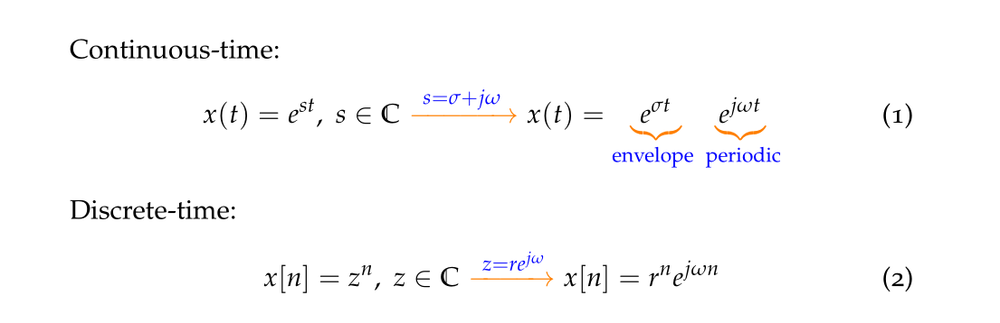

## Eigenfunction
> [!def]
>   An eigenfunction is a type of function that, when used as an input for a given operator, produces a result proportional to the original function. 
>   
>   The concept is most often discussed in the contexts of linear algebra, differential equations, and quantum mechanics, among other areas in mathematics and physics.
>   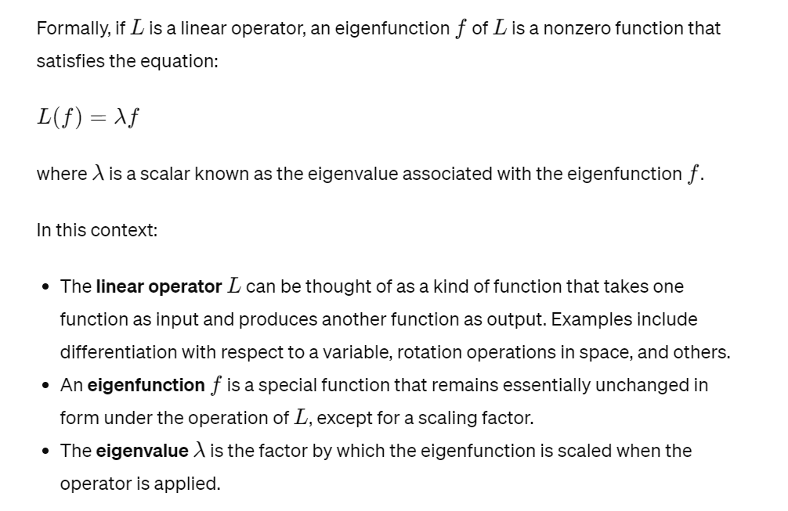

## Response of LTI
> [!important]
> 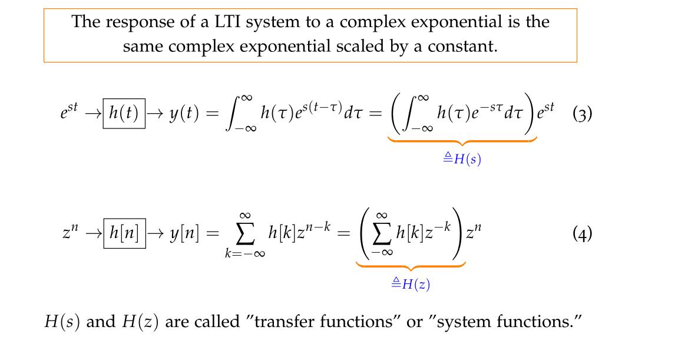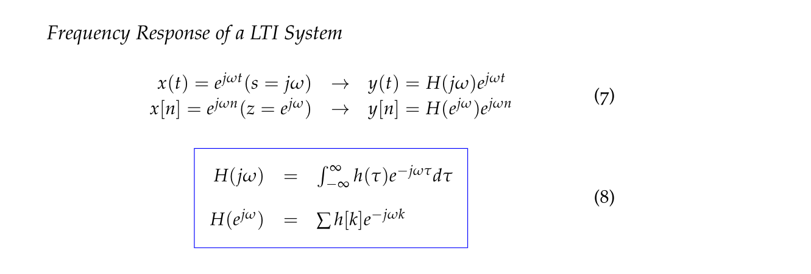

> [!example] EECS120 Fa19 Lec3
> 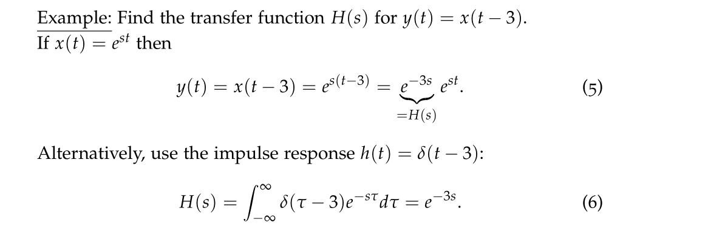
> Here $y(t) = x(t-3)$ is given. So the transfer function serves to describe the relationship between the input and output and is typically defined to be the proportional of output to intput, which is:
> 
> 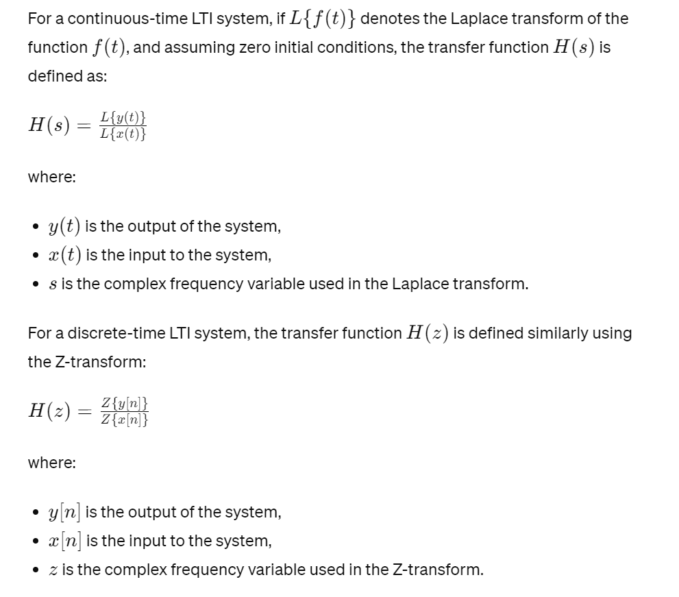

# Filtering
## Definition
> [!def]
> 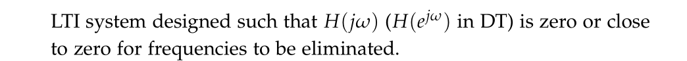

## Moving Averge Filter
> [!def]
> 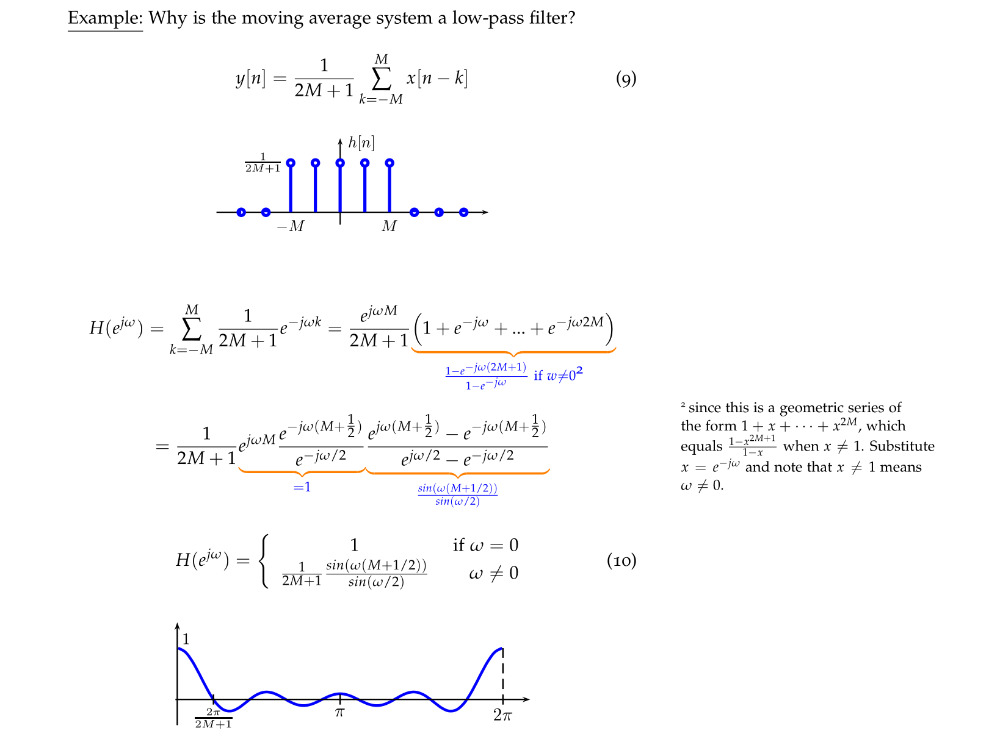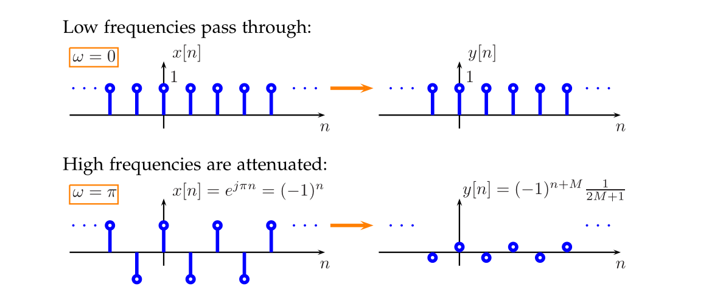

## Causal Filter
> [!def]
> 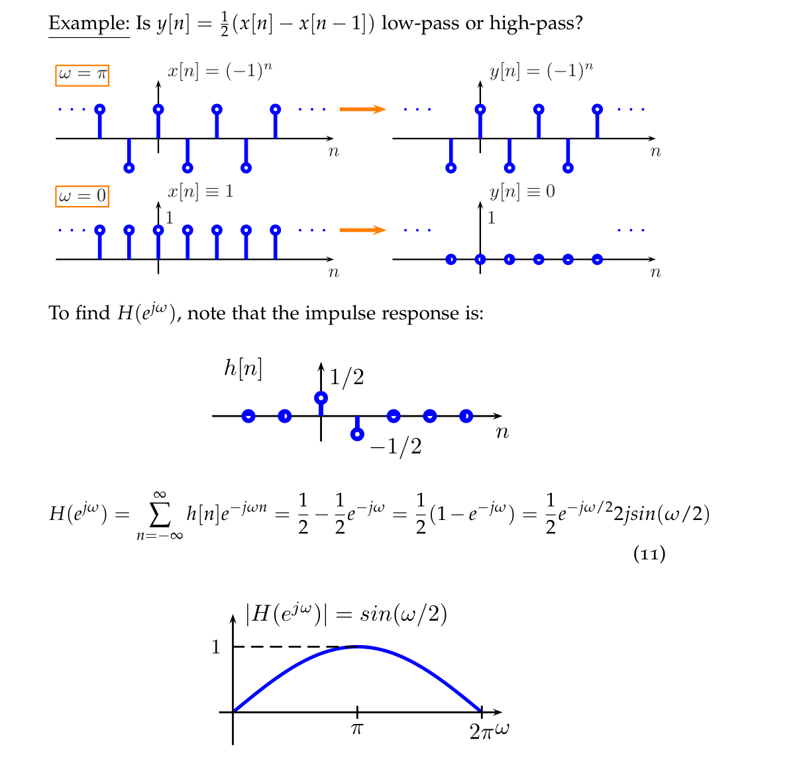
> This is a high-pass filter.

# FIR and IIR Systems
## Finite Impulse Response System
> [!def]
> 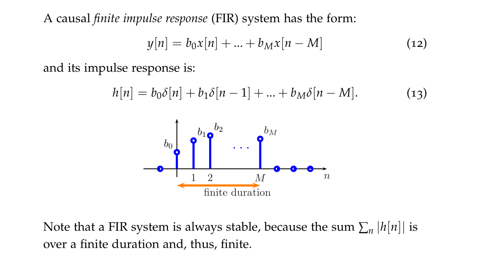

## Infinite Impulse Response System
> [!def]
> 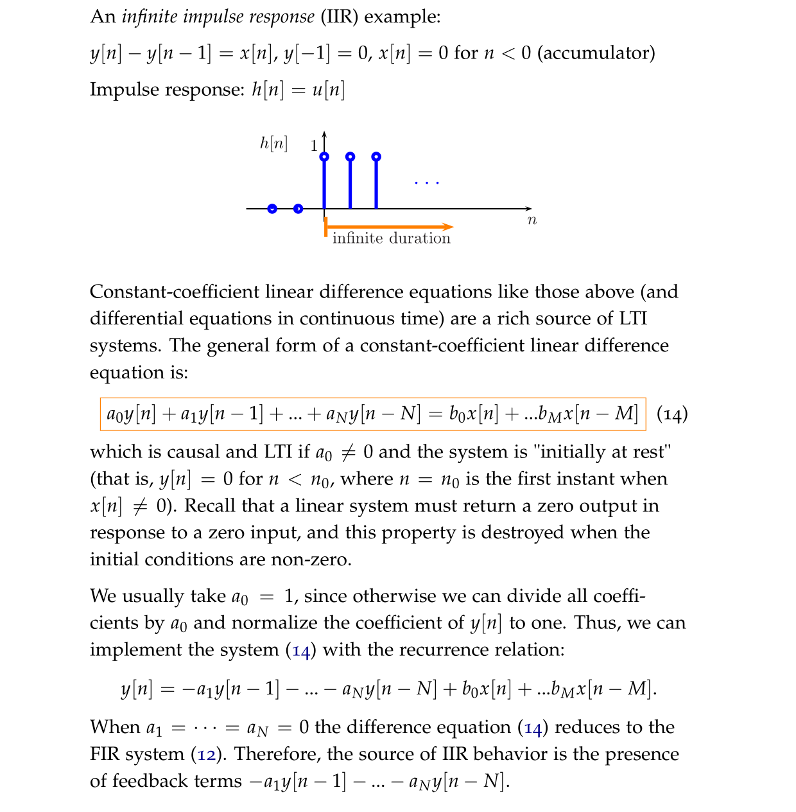

